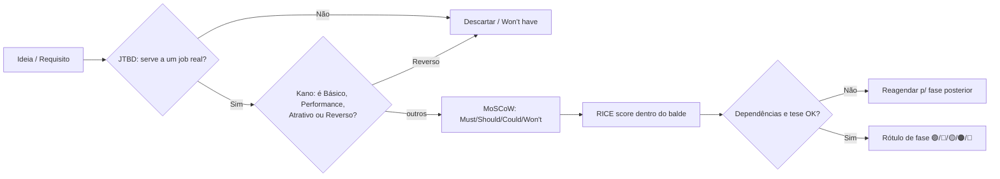

# 04 — Product Requirements (PRD)

> **Fase geral:** Fundacional (evolui por fases) · **Versão:** 0.1 · **Última atualização:** 2026-07-20
> **Status:** Vivo (living document)
> **Leia antes:** [`ATLAS_MASTER_CONTEXT.md`](ATLAS_MASTER_CONTEXT.md) · [`00_Project_Vision.md`](00_Project_Vision.md)
> **Documentos relacionados:** [`05_User_Personas.md`](05_User_Personas.md) · [`06_User_Journey.md`](06_User_Journey.md) · [`11_Event_Model.md`](11_Event_Model.md) · [`12_AI_Architecture.md`](12_AI_Architecture.md) · [`15_Privacy_Architecture.md`](15_Privacy_Architecture.md) · [`19_UI_Screens.md`](19_UI_Screens.md) · [`20_MVP.md`](20_MVP.md) · [`21_Roadmap.md`](21_Roadmap.md) · [`24_ADRs.md`](24_ADRs.md)
> **Sistema de fases:** 🟢 MVP · 🔵 V1 · 🟡 V2 · 🟠 Escala · 🔴 Pesquisa (ver §4 do Master Context)

---

## 0. Como ler este documento

Um **PRD (Product Requirements Document)** é o contrato entre a *intenção* (o que o produto
deve fazer e por quê) e a *execução* (o que será construído, em que ordem e sob quais
restrições). Ele não descreve *como* implementar (isso vive em `07`–`17`), mas *o que* e *por
quê*, de forma testável.

Este PRD é escrito sob duas restrições permanentes, herdadas do Master Context:

1. **Fundador solo.** Cada requisito compete por um recurso escasso e não-renovável: o tempo
   de uma pessoa. Por isso o documento é tão obcecado por *priorização* e por *cortar escopo*
   quanto por descrever funcionalidades.
2. **Disciplina de fases.** Todo requisito recebe **um** rótulo (🟢/🔵/🟡/🟠/🔴). A regra
   dura do Master Context vale aqui: **nunca** promover um item 🟡/🟠 para dentro do 🟢 MVP.

> **Convenção de identificadores.** Requisitos funcionais são `RF-XXX`, não-funcionais são
> `RNF-XXX`. Objetivos mensuráveis são `O-X`. Métricas são `M-X`. Esses IDs são estáveis e
> podem ser referenciados por outros documentos.

---

## 1. Visão de produto (resumo operacional)

A visão completa está em [`00_Project_Vision.md`](00_Project_Vision.md). Aqui a condensamos na
forma operacional que guia requisitos:

> **Atlas transforma os dados dispersos da vida de uma pessoa em conhecimento explicável e
> acionável — de forma privada e local-first — construindo um Modelo Computacional da Vida
> (CMHL) sobre o qual a IA atua apenas como interpretador.**

Traduzindo em implicações diretas para requisitos:

| Princípio da visão | Implicação para os requisitos deste PRD |
|---|---|
| CMHL é o ativo, IA é commodity | O núcleo (Eventos + Grafo + Read Models) é 🟢; features de IA são incrementais e opt-in. |
| Explicabilidade > mágica | Todo Insight **precisa** expor evidência rastreável (é critério de aceite, não enfeite). |
| Local-first / privacidade é arquitetura | Offline, exportação e deleção total são requisitos de MVP, não de roadmap. |
| Cross-domain é o diferencial | O MVP precisa provar ≥1 insight que cruza domínios (ex.: sono × X). |
| Evolução > perfeição | Escopo do MVP é deliberadamente pequeno; features "óbvias" ficam para 🔵/🟡. |

---

## 2. Objetivos mensuráveis (Product Goals & Success Metrics)

Objetivos derivam de `00 §6` e são refinados aqui em metas **mensuráveis** (com métrica e
alvo). A **North Star Metric** herdada da visão é *Insights acionados por semana*.

### 2.1. Objetivos de produto

| ID | Objetivo | Métrica (M-X) | Alvo no MVP (dogfooding) | Alvo pós-early adopters (🔵) |
|---|---|---|---|---|
| **O-1** | Time-to-value curtíssimo | **M-1** — Tempo até o 1º insight relevante na 1ª sessão | ≤ 5 min | ≤ 3 min |
| **O-2** | Provar valor cross-domain | **M-2** — % de usuários com ≥1 insight cross-domain na 1ª semana | 100% (autor) | ≥ 60% |
| **O-3** | Confiança/controle desde o dia 1 | **M-3** — Exportação + deleção total disponíveis e testadas | Sim/Não → Sim | Sim |
| **O-4** | Engajamento com sentido (North Star) | **M-4** — Insights acionados por semana | ≥ 3 (autor) | ≥ 2 por usuário ativo |
| **O-5** | Ritual de revisão semanal | **M-5** — % de semanas com Weekly Review concluída | ≥ 70% (autor) | ≥ 40% |

### 2.2. Objetivos técnicos (ligados a RNFs)

| ID | Objetivo | Métrica | Alvo |
|---|---|---|---|
| **O-6** | Local-first funcional | **M-6** — % de fluxos centrais usáveis 100% offline | 100% de leitura + entrada manual |
| **O-7** | Custo de IA previsível | **M-7** — Custo marginal de IA por usuário ativo/mês | ≤ US$ 0,50 no MVP (autor) |
| **O-8** | Performance percebida | **M-8** — Abertura da Timeline (p95) com 10k eventos | ≤ 400 ms |
| **O-9** | Reversibilidade arquitetural | **M-9** — Nenhuma decisão do MVP bloqueia escala | Verificado em `24_ADRs.md` |

### 2.3. Objetivos pessoais do fundador (contexto, não features)

Herdados de `00 §6.3` — não geram requisitos de produto, mas **influenciam trade-offs**:
domínio total para defesa Big Tech (P1), crescimento técnico (P2), ativo de carreira (P3).
Na dúvida entre duas soluções equivalentes em valor, prefira a que ensina mais **sem** violar
a disciplina de fases.

### 2.4. Anti-objetivos (o que este PRD se recusa a exigir)

Herdados de `00 §6.4`, reafirmados como *guardrails* de escopo:

- ❌ Nenhum requisito que exija microserviços / Kafka / Neo4j / Qdrant no MVP.
- ❌ Nenhum requisito de "dashboard de gráficos bonitos sem inferência".
- ❌ Nenhum requisito que dependa de publicidade ou venda de dados.
- ❌ Nenhum requisito que terceirize a compreensão a um chatbot genérico.

---

## 3. Escopo e não-escopo (visão macro)

| Dentro do escopo do produto (algum dia) | Fora do escopo (permanentemente) |
|---|---|
| Ingestão multi-domínio consentida (saúde, calendário, localização, finanças, notas) | Vender/monetizar dados do usuário |
| Timeline unificada de eventos | Rede social / feed público |
| Grafo de entidades e relações | Substituir o julgamento humano por automação cega |
| Insights explicáveis (heurística → estatística → ML → LLM) | Assistente de voz sempre-ouvindo |
| Busca (léxica + semântica) | Publicidade comportamental |
| Privacidade/controle total (export, delete, opt-in de IA) | Coleta encoberta ("dark patterns") |

O recorte **temporal** (o que entra em cada fase) é a espinha dorsal das seções §5 e §7.

---

## 4. Frameworks de priorização (explicados)

Antes de listar requisitos, fixamos **como** decidimos o que entra e quando. Usamos dois
frameworks combinados: **MoSCoW** (para classificar) e **RICE** (para ordenar dentro de cada
classe). A eles somamos duas lentes qualitativas: **JTBD** e **Kano**.

### 4.1. MoSCoW — classificação de obrigatoriedade

**O que é.** MoSCoW é um método de priorização que separa requisitos em quatro baldes por
*grau de obrigatoriedade* para uma entrega específica (aqui, o MVP):

| Balde | Significado | Regra prática no Atlas |
|---|---|---|
| **Must have** | Sem isto, a entrega falha / não faz sentido. | É candidato a 🟢 MVP. |
| **Should have** | Importante, mas a entrega sobrevive sem. | Tipicamente 🔵 V1. |
| **Could have** | Desejável; incluído só se sobrar espaço. | 🔵/🟡. |
| **Won't have (this time)** | Explicitamente adiado (não é "nunca"). | 🟡/🟠/🔴. |

**Por que existe.** Times (e fundadores solo) tendem a tratar tudo como "importante". MoSCoW
força a admitir que *quase nada* é realmente "Must". O "Won't have **this time**" é o balde
mais valioso: transforma cortes em decisões conscientes e reversíveis, não em esquecimento.

**Trade-off / quando não usar.** MoSCoW classifica, mas **não ordena** dentro de um balde —
por isso o combinamos com RICE. E ele é subjetivo; sem um critério de valor, "Must" incha.

### 4.2. RICE — ordenação por valor esperado

**O que é.** RICE é um *score* numérico para ordenar itens por retorno esperado ajustado ao
esforço. Popularizado pela Intercom. A fórmula:

```
RICE = (Reach × Impact × Confidence) / Effort
```

| Fator | O que mede | Escala usada no Atlas |
|---|---|---|
| **Reach** (Alcance) | Quantos usuários/eventos são afetados por período. | Nº relativo (no MVP dogfooding, "quantos fluxos/dias/domínios" impacta). 1–10. |
| **Impact** (Impacto) | Quanto move a agulha por usuário afetado. | Massivo=3, Alto=2, Médio=1, Baixo=0.5, Mínimo=0.25. |
| **Confidence** (Confiança) | Quão certos estamos de Reach/Impact. | 100%=1.0, 80%=0.8, 50%=0.5. |
| **Effort** (Esforço) | Custo de construir (pessoa·semana p/ fundador solo). | Nº de semanas de trabalho solo. |

**Por que existe.** Dá uma régua *comparável* entre features heterogêneas e explicita as
suposições (Confidence pune "achismo"). Effort no denominador favorece o barato-e-valioso —
exatamente o que um fundador solo precisa.

**Como funciona / matemática.** É essencialmente *valor esperado por unidade de esforço*.
Reach×Impact×Confidence aproxima o "benefício esperado"; dividir por Effort transforma em
"benefício por semana investida". Ordenar por RICE ≈ maximizar retorno sob orçamento de tempo.

**Trade-offs / quando NÃO usar.** RICE ignora **dependências** (às vezes é preciso construir
algo de RICE baixo primeiro) e **estratégia** (um item pode ser o *moat*). Números dão falsa
precisão. Por isso: RICE **ordena**, mas a decisão final respeita dependências (§7) e a tese.

### 4.3. JTBD — Jobs To Be Done (lente de valor)

**O que é.** JTBD é um enquadramento que diz: pessoas não "compram produtos", elas
"contratam" uma solução para realizar um *job* (progresso desejado num contexto). O clássico:
*"ninguém quer uma furadeira de 6mm; querem um furo de 6mm"* — e, mais fundo, "uma prateleira
instalada para a casa parecer arrumada".

**Forma canônica de um job (usada nas personas e critérios):**
> *Quando* [situação], *quero* [motivação/força], *para* [resultado esperado].

**Por que usamos.** JTBD mantém os requisitos ancorados em *progresso do usuário*, não em
features. Cada RF importante cita o(s) job(s) que serve. Detalhe por persona em
[`05_User_Personas.md`](05_User_Personas.md).

**Trade-off.** JTBD é ótimo para *o quê/por quê*, fraco para *quanto/quando* — daí ser lente,
não ordenador.

### 4.4. Kano — tipos de satisfação (lente de expectativa)

**O que é.** O modelo Kano classifica atributos pelo tipo de satisfação que geram:

| Categoria Kano | Comportamento | Exemplo no Atlas |
|---|---|---|
| **Básico (Must-be)** | Ausência frustra; presença não encanta. | Privacidade real, app não travar, dado não se perder. |
| **Performance (linear)** | Mais é melhor, proporcional. | Nº de conectores, precisão dos insights, velocidade da busca. |
| **Atrativo (Delighter)** | Inesperado; presença encanta, ausência não frustra. | Insight cross-domain surpreendente na 1ª semana. |
| **Indiferente** | Ninguém se importa. | Cortar. |
| **Reverso** | Presença irrita alguns. | IA "proativa demais"; notificações em excesso. |

**Por que usamos.** Evita dois erros clássicos: (1) polir *delighters* enquanto *básicos*
estão quebrados; (2) tratar *básico* (privacidade) como diferencial de marketing em vez de
obrigação silenciosa. **Regra:** nunca lançar com um "Básico" ausente.

### 4.5. Como os frameworks se combinam (pipeline de decisão)



---

## 5. Requisitos funcionais por domínio

Formato de cada requisito: **descrição**, **user story** (Como… quero… para…), **critérios de
aceite** (verificáveis, formato *Given/When/Then* condensado), **fase**, e **classificação**
(MoSCoW + Kano + job servido). Os *scores* RICE consolidados estão em §6.

> **Legenda de fase:** 🟢 MVP · 🔵 V1 · 🟡 V2 · 🟠 Escala · 🔴 Pesquisa.

### 5.1. Domínio: Ingestão / Conectores

O CMHL só existe se dados entrarem. A estratégia de ingestão é *"comece pelo que o autor
gera"*: entrada manual + 2–3 sensores de alto sinal. Cada conector normaliza sua fonte em
**Eventos** (ver [`11_Event_Model.md`](11_Event_Model.md)).

| ID | Requisito | Fase | MoSCoW | Kano |
|---|---|---|---|---|
| RF-101 | Entrada manual de eventos/notas | 🟢 | Must | Básico |
| RF-102 | Conector Health Connect (Android) / HealthKit (iOS) | 🟢 | Must | Performance |
| RF-103 | Conector Localização (visitas/lugares) | 🟢 | Should | Performance |
| RF-104 | Conector Google Calendar | 🔵 | Should | Performance |
| RF-105 | Importação de extrato bancário (CSV/OFX) | 🔵 | Could | Performance |
| RF-106 | Open Banking / PIX (finanças automáticas) | 🟡 | Won't (now) | Performance |
| RF-107 | Framework de conectores (SDK interno + agendamento/retry) | 🔵 | Should | Básico |
| RF-108 | De-duplicação e reconciliação de eventos | 🔵 | Should | Básico |

**RF-101 — Entrada manual de eventos e notas** 🟢
- *User story:* Como usuário, quero registrar rapidamente um evento ("dormi mal", "gastei R$40
  no almoço", uma nota), para que o Atlas tenha dados mesmo sem conectores automáticos.
- *Job servido:* *Quando* percebo algo relevante sobre meu dia, *quero* registrá-lo em segundos,
  *para* não depender de integrações para começar a ter valor.
- *Critérios de aceite:*
  - Dado o app offline, quando salvo um evento manual, então ele aparece na Timeline sem rede.
  - Cada evento manual vira um `Event` imutável com `type`, `timestamp`, `source=manual`,
    `payload` (conforme `11`).
  - Registro de um evento simples em ≤ 3 toques + digitação.

**RF-102 — Conector de saúde (Health Connect / HealthKit)** 🟢
- *User story:* Como usuário, quero conectar meus dados de sono/passos/atividade, para que o
  Atlas correlacione saúde com o resto da minha vida sem digitação.
- *Critérios de aceite:*
  - Consentimento **granular** por tipo de dado (sono ≠ passos ≠ frequência cardíaca).
  - Sincronização em background gera Eventos normalizados (ex.: `sleep.recorded`).
  - Revogar a permissão interrompe a ingestão e é refletido na tela de Privacidade (RF-601).

**RF-103 — Conector de localização** 🟢
- *User story:* Como usuário, quero que lugares que visito virem eventos, para descobrir como
  lugares afetam meu humor/rotina.
- *Critérios de aceite:*
  - Opt-in explícito; funciona com precisão "visitas" (não rastreamento contínuo por padrão).
  - Cada visita relevante vira `location.visited` ligado a uma Entidade `Place` (RF-301).
  - Modo "pausar coleta" acessível em 1 toque.

**RF-104 — Google Calendar** 🔵 · **RF-105 — Extrato bancário (CSV/OFX)** 🔵 ·
**RF-107 — Framework de conectores** 🔵 · **RF-108 — De-dup/reconciliação** 🔵
- *Racional de fase:* no MVP, um único conector de saúde + manual já provam a tese
  cross-domain (saúde × entrada manual). Generalizar o *framework* de conectores antes de ter
  2–3 conectores reais é abstração prematura → adiado para 🔵.

**RF-106 — Open Banking / PIX** 🟡 — regulatório + esforço alto; adiado até haver tração.

### 5.2. Domínio: Timeline / Eventos

A Timeline é a manifestação visível do CMHL: a vida do usuário como uma sequência navegável de
Eventos imutáveis.

| ID | Requisito | Fase | MoSCoW | Kano |
|---|---|---|---|---|
| RF-201 | Timeline cronológica unificada (todos os domínios) | 🟢 | Must | Performance |
| RF-202 | Detalhe do evento (payload + origem + evidências ligadas) | 🟢 | Must | Básico |
| RF-203 | Filtro por tipo/domínio/data | 🟢 | Should | Performance |
| RF-204 | Edição/correção e exclusão de evento manual | 🟢 | Must | Básico |
| RF-205 | Agrupamento inteligente (por dia/tema) | 🔵 | Could | Atrativo |
| RF-206 | Read models/projeções (agregações diárias) | 🟢 | Must | Básico |
| RF-207 | Snapshots históricos para queries rápidas | 🟡 | Won't (now) | Performance |

**RF-201 — Timeline unificada** 🟢
- *User story:* Como usuário, quero ver eventos de todos os domínios numa linha do tempo única,
  para enxergar minha vida como um todo e não como silos.
- *Critérios de aceite:*
  - Eventos de ≥2 domínios aparecem intercalados por tempo.
  - Rolagem fluida; abertura p95 ≤ 400 ms com 10k eventos locais (**M-8**).
  - Funciona offline (dados locais).

**RF-202 — Detalhe do evento com evidência** 🟢
- *Critério-chave (explicabilidade):* a partir de um Insight, é possível navegar até os
  Eventos que o originaram, e vice-versa. Isto materializa "Explicabilidade > mágica".

**RF-206 — Read models / projeções** 🟢 — agregações diárias (ex.: sono/dia, gasto/dia) são
pré-requisito de Insights e Timeline performática. É Event Sourcing "lite" (ADR-0002).

### 5.3. Domínio: Grafo / Entidades

| ID | Requisito | Fase | MoSCoW | Kano |
|---|---|---|---|---|
| RF-301 | Entidades básicas (Person, Place, Topic) extraídas de eventos | 🟢 | Should | Performance |
| RF-302 | Relações simples entre entidades e eventos | 🟢 | Should | Performance |
| RF-303 | Perfil de entidade (tudo ligado a uma pessoa/lugar) | 🔵 | Should | Atrativo |
| RF-304 | Grafo navegável (visualização multi-hop) | 🟡 | Could | Atrativo |
| RF-305 | Resolução de entidades (mesma pessoa, nomes diferentes) | 🟡 | Won't (now) | Performance |
| RF-306 | Migração para Neo4j (queries multi-hop pesadas) | 🟡 | Won't (now) | Performance |

**Racional de fase.** No MVP, o grafo vive **dentro do PostgreSQL** (tabelas `entities` +
`relationships`, CTEs recursivas) — ADR-0007. Entidades/relações *simples* (🟢) bastam para
insights básicos; visualização rica e Neo4j são 🟡, disparados por dor real de query.

**RF-301 — Entidades básicas** 🟢
- *User story:* Como usuário, quero que lugares/pessoas/temas recorrentes virem "coisas" que o
  Atlas reconhece, para que ele conecte eventos ("toda vez que vou ao lugar X…").
- *Critérios de aceite:* eventos com lugar/pessoa/tema criam ou referenciam uma Entidade; a
  Entidade lista os eventos ligados a ela.

### 5.4. Domínio: Insights / IA

O coração da tese: transformar Eventos em conhecimento **explicável**, seguindo "heurística
antes de neurônio" (Master Context §5.4). Ordem de sofisticação: **regras → estatística → ML →
LLM**. Detalhe em [`12_AI_Architecture.md`](12_AI_Architecture.md).

| ID | Requisito | Fase | MoSCoW | Kano |
|---|---|---|---|---|
| RF-401 | Insights por regras/heurística (limiares, streaks, médias) | 🟢 | Must | Atrativo |
| RF-402 | Insight cross-domain (≥1 relação entre domínios) | 🟢 | Must | Atrativo |
| RF-403 | Evidência rastreável por insight (link p/ eventos) | 🟢 | Must | Básico |
| RF-404 | Feedback do usuário no insight (útil / não útil / agir) | 🟢 | Must | Performance |
| RF-405 | Insights estatísticos (correlação, tendência, sazonalidade) | 🔵 | Should | Performance |
| RF-406 | Síntese em linguagem natural via LLM (opt-in) | 🔵 | Should | Atrativo |
| RF-407 | RAG sobre o CMHL (perguntar à sua própria vida) | 🟡 | Could | Atrativo |
| RF-408 | Inferência de padrões via ML | 🟡 | Won't (now) | Performance |
| RF-409 | Inferência causal (causa vs. correlação) | 🔴 | Won't (now) | Atrativo |
| RF-410 | Inferência on-device p/ dados sensíveis | 🟡 | Won't (now) | Básico |

**RF-401/402/403/404 — Núcleo de insights do MVP** 🟢
- *User story:* Como usuário, quero receber observações úteis e verificáveis sobre minha vida,
  para tomar decisões melhores — e poder checar de onde vieram.
- *Critérios de aceite:*
  - Pelo menos uma família de insights por **regra** funciona sem qualquer LLM (custo zero de
    IA) — ex.: "média de sono nos últimos 7 dias caiu 12%".
  - Pelo menos **um** insight cruza dois domínios (RF-402) na 1ª semana de uso (**M-2**).
  - Todo insight tem botão "por quê?" que abre os Eventos-evidência (RF-403).
  - Usuário pode marcar *útil/não útil/agir* (RF-404) — alimenta a North Star **M-4**.

**RF-406 — Síntese via LLM (opt-in)** 🔵 — enviar dados a LLM externo é **opt-in explícito**
(privacidade). Abstração `LLMProvider` (ADR-0006). Fica em V1 porque insights por regra já
provam a tese sem custo/risco de IA.

### 5.5. Domínio: Busca

| ID | Requisito | Fase | MoSCoW | Kano |
|---|---|---|---|---|
| RF-501 | Busca léxica (texto) em eventos/notas | 🟢 | Must | Básico |
| RF-502 | Filtros combinados (tipo + período + entidade) | 🟢 | Should | Performance |
| RF-503 | Busca semântica (embeddings + pgvector) | 🔵 | Should | Atrativo |
| RF-504 | Busca em linguagem natural ("quando viajei com X?") | 🟡 | Could | Atrativo |
| RF-505 | Qdrant (vector DB dedicado) | 🟡 | Won't (now) | Performance |

**Racional.** Busca léxica local (🟢) resolve 80% das necessidades no início. Busca semântica
(🔵) usa **pgvector** — sem infra extra (Master Context §5.3). Qdrant só quando pgvector
limitar (>~1–5M vetores) — ADR-0008.

### 5.6. Domínio: Privacidade / Controle

**Categoria Kano: Básico.** Ausência aqui **mata** o produto. Por isso vários itens são 🟢
apesar de não serem "sexy". Detalhe em [`15_Privacy_Architecture.md`](15_Privacy_Architecture.md).

| ID | Requisito | Fase | MoSCoW | Kano |
|---|---|---|---|---|
| RF-601 | Painel de privacidade (o que é coletado, por conector) | 🟢 | Must | Básico |
| RF-602 | Exportação total dos dados (JSON/SQLite) | 🟢 | Must | Básico |
| RF-603 | Deleção real e total (kill switch) | 🟢 | Must | Básico |
| RF-604 | Consentimento granular por conector/tipo | 🟢 | Must | Básico |
| RF-605 | Opt-in explícito para envio a LLM externo | 🟢 | Must | Básico |
| RF-606 | Modo 100% local (nuvem desligada) | 🟢 | Should | Básico |
| RF-607 | Criptografia em repouso no dispositivo | 🔵 | Should | Básico |
| RF-608 | E2EE (servidor não lê conteúdo) | 🟡 | Won't (now) | Básico |
| RF-609 | Passkeys / WebAuthn | 🔵 | Could | Performance |

**RF-602/603 — Exportar e Deletar** 🟢
- *User story:* Como usuário, quero exportar tudo e apagar tudo quando eu quiser, para ter
  certeza de que sou dono dos meus dados.
- *Critérios de aceite:*
  - Exportação produz arquivo legível/portável com **todos** os eventos e entidades.
  - Deleção remove dados locais e (se houver) réplica de nuvem, com confirmação; irreversível
    e comunicada como tal.

### 5.7. Domínio: Onboarding

O onboarding é onde a **confiança** é ganha ou perdida e onde o **time-to-value** (O-1) é
decidido. Fluxo detalhado em [`06_User_Journey.md`](06_User_Journey.md).

| ID | Requisito | Fase | MoSCoW | Kano |
|---|---|---|---|---|
| RF-701 | Onboarding local-first (explica privacidade antes de pedir dados) | 🟢 | Must | Básico |
| RF-702 | Primeiro insight garantido na 1ª sessão (com dados mínimos) | 🟢 | Must | Atrativo |
| RF-703 | Pedido de permissões contextual (just-in-time, não tudo de uma vez) | 🟢 | Must | Básico |
| RF-704 | Estado "vazio" que ensina (empty states didáticos) | 🟢 | Should | Performance |
| RF-705 | Importação inicial acelerada (seed com histórico do conector) | 🔵 | Should | Atrativo |

**RF-702 — Aha na 1ª sessão** 🟢 — mesmo com poucos dados (ex.: só saúde do último mês + 1
evento manual), o Atlas produz ≥1 insight por regra. Sustenta **M-1** (≤5 min).

### 5.8. Domínio: Notificações

**Cuidado Kano-Reverso:** notificações em excesso ou "IA proativa demais" *irritam*. Regra:
notificar só quando há **valor verificável** e respeitando frequência.

| ID | Requisito | Fase | MoSCoW | Kano |
|---|---|---|---|---|
| RF-801 | Notificação da Revisão Semanal (ritual central) | 🟢 | Should | Performance |
| RF-802 | Notificação de novo insight relevante (throttled) | 🔵 | Should | Performance |
| RF-803 | Controles finos de frequência/canais | 🔵 | Must (se 802) | Básico |
| RF-804 | Notificações inteligentes por contexto/horário | 🟡 | Won't (now) | Atrativo |

**Racional.** No MVP, apenas o *nudge* da Revisão Semanal (RF-801), porque é o loop de
engajamento central (ver `06`). Notificações de insight (🔵) só com controles de frequência
(RF-803) para evitar o Kano-Reverso.

### 5.9. Domínio: Widgets

| ID | Requisito | Fase | MoSCoW | Kano |
|---|---|---|---|---|
| RF-901 | Widget "insight do dia" / resumo | 🔵 | Could | Atrativo |
| RF-902 | Widget de entrada rápida (quick capture) | 🔵 | Could | Performance |
| RF-903 | Complicações / lock screen / live activities | 🟡 | Won't (now) | Atrativo |

**Racional.** Widgets aumentam engajamento, mas dependem de módulos nativos (custo alto para
fundador solo). **Nenhum widget no MVP** — todos 🔵/🟡.

---

## 6. Priorização consolidada (tabela de scoring RICE)

*Reach* e *Effort* estão na escala do **contexto atual** (MVP dogfooding: 1 usuário, o autor).
*Reach* aqui significa "quão transversal ao produto/uso diário" (1–10); *Effort* em
pessoa·semana solo. Scores são **relativos** e servem para ordenar, não para prever receita.

| ID | Requisito | Reach | Impact | Conf. | Effort (sem) | RICE | Fase |
|---|---|---:|---:|---:|---:|---:|:--:|
| RF-101 | Entrada manual | 10 | 3 | 1.0 | 1 | **30.0** | 🟢 |
| RF-403 | Evidência por insight | 8 | 3 | 1.0 | 1 | **24.0** | 🟢 |
| RF-201 | Timeline unificada | 10 | 3 | 0.9 | 1.5 | **18.0** | 🟢 |
| RF-401 | Insights por regra | 9 | 3 | 0.9 | 1.5 | **16.2** | 🟢 |
| RF-602 | Exportação total | 7 | 2 | 1.0 | 1 | **14.0** | 🟢 |
| RF-603 | Deleção total | 7 | 2 | 1.0 | 1 | **14.0** | 🟢 |
| RF-206 | Read models diários | 8 | 2 | 0.9 | 1 | **14.4** | 🟢 |
| RF-402 | Insight cross-domain | 8 | 3 | 0.7 | 1.5 | **11.2** | 🟢 |
| RF-702 | Aha na 1ª sessão | 9 | 3 | 0.8 | 2 | **10.8** | 🟢 |
| RF-102 | Conector de saúde | 7 | 3 | 0.8 | 2 | **8.4** | 🟢 |
| RF-501 | Busca léxica | 8 | 2 | 0.9 | 2 | **7.2** | 🟢 |
| RF-604 | Consentimento granular | 6 | 2 | 1.0 | 1.5 | **8.0** | 🟢 |
| RF-701 | Onboarding local-first | 7 | 2 | 0.8 | 1.5 | **7.5** | 🟢 |
| RF-301 | Entidades básicas | 6 | 2 | 0.7 | 2 | **4.2** | 🟢 |
| RF-103 | Conector localização | 6 | 2 | 0.6 | 2 | **3.6** | 🟢 |
| RF-801 | Nudge Revisão Semanal | 6 | 2 | 0.7 | 1 | **8.4** | 🟢 |
| RF-503 | Busca semântica (pgvector) | 6 | 2 | 0.7 | 3 | **2.8** | 🔵 |
| RF-406 | Síntese via LLM | 7 | 2 | 0.6 | 3 | **2.8** | 🔵 |
| RF-405 | Insights estatísticos | 6 | 2 | 0.6 | 4 | **1.8** | 🔵 |
| RF-104 | Google Calendar | 5 | 2 | 0.7 | 3 | **2.3** | 🔵 |
| RF-407 | RAG sobre o CMHL | 6 | 3 | 0.5 | 6 | **1.5** | 🟡 |
| RF-304 | Grafo navegável | 4 | 2 | 0.5 | 6 | **0.7** | 🟡 |

**Leitura.** O topo da lista (RICE alto) coincide com o núcleo da tese: capturar dados
(RF-101/102), transformá-los em insights explicáveis (RF-401/402/403) e devolver controle
(RF-602/603). Isso valida o recorte do MVP em §7. Itens de IA sofisticada e grafo rico caem
naturalmente para 🔵/🟡 por *Effort* alto e *Confidence* menor — coerente com "heurística antes
de neurônio" e ADR-0007.

> **Nota metodológica.** RICE ordenou; a decisão final respeitou **dependências** (ex.: RF-206
> read models precede RF-401 insights) e a **tese** (RF-402 cross-domain entra no MVP mesmo com
> RICE moderado, porque *é a prova da tese*). Ver pipeline §4.5.

---

## 7. Escopo do MVP — o que está DENTRO vs FORA

Esta seção é a mais importante para um fundador solo. Ela deve permanecer **alinhada** a
[`20_MVP.md`](20_MVP.md); em caso de divergência, `20_MVP.md` e o Master Context vencem.

### 7.1. Definição do MVP (uma frase)

> **O MVP do Atlas é um app local-first, para o próprio autor (dogfooding), que ingere saúde +
> entrada manual, mostra uma Timeline unificada, gera insights explicáveis por regra (incluindo
> ≥1 cross-domain), permite busca léxica e garante exportação/deleção total dos dados.**

### 7.2. DENTRO do MVP 🟢 (Must have)

| Domínio | Itens no MVP |
|---|---|
| Ingestão | RF-101 (manual), RF-102 (saúde), RF-103 (localização, se barato) |
| Timeline | RF-201, RF-202, RF-203, RF-204, RF-206 |
| Grafo | RF-301, RF-302 (entidades/relações simples em Postgres) |
| Insights | RF-401, RF-402, RF-403, RF-404 |
| Busca | RF-501, RF-502 |
| Privacidade | RF-601, RF-602, RF-603, RF-604, RF-605, RF-606 |
| Onboarding | RF-701, RF-702, RF-703, RF-704 |
| Notificações | RF-801 (apenas nudge da Revisão Semanal) |

### 7.3. FORA do MVP (adiado, com fase e motivo)

| Item | Fase | Por que ficou de fora do MVP |
|---|---|---|
| Framework/SDK de conectores (RF-107) | 🔵 | Abstração prematura antes de ter 2–3 conectores reais. |
| Google Calendar, extrato (RF-104/105) | 🔵 | Saúde + manual já provam a tese; adicionar depois. |
| Open Banking/PIX (RF-106) | 🟡 | Regulatório + esforço alto. |
| Síntese/RAG/ML/causal (RF-406/407/408/409) | 🔵–🔴 | "Heurística antes de neurônio"; custo/risco de IA. |
| Busca semântica / Qdrant (RF-503/505) | 🔵/🟡 | Léxica resolve o início; pgvector depois; Qdrant só sob limite. |
| Grafo navegável / Neo4j (RF-304/306) | 🟡 | Grafo em Postgres basta; migrar sob dor real (ADR-0007). |
| Notificações de insight (RF-802) | 🔵 | Risco Kano-Reverso sem controles de frequência. |
| Widgets (RF-901/902/903) | 🔵/🟡 | Dependem de nativo; custo alto p/ solo. |
| E2EE, Passkeys (RF-608/609) | 🟡/🔵 | TLS + cripto em repouso bastam no início. |

### 7.4. Guardrails anti-escopo (scope creep protection)

Regras duras para o fundador solo resistir à tentação de inchar o MVP:

1. **Uma frase, um usuário.** Se uma feature não serve o *dogfooding* do autor **agora**, não
   é MVP.
2. **Sem infra "moderna" especulativa.** Nada de Neo4j/Qdrant/Kafka/microserviços no MVP
   (ADRs 0001, 0007, 0008). Toda tecnologia tem *fase de entrada*.
3. **IA só quando a regra falha.** Nenhum LLM no caminho crítico do MVP; heurística primeiro.
4. **Corte, não "backlog infinito".** Todo item fora do MVP recebe fase explícita (§7.3).
5. **Básico Kano nunca ausente.** Privacidade/estabilidade/persistência são inegociáveis.
6. **Se em dúvida, é 🔵.** O default de qualquer ideia nova é *fora* do MVP.

### 7.5. Critérios de "MVP pronto" (Definition of Done)

O MVP está pronto quando, **para o autor**, todos verdadeiros:

- [ ] Ingiro saúde + eventos manuais e vejo tudo numa Timeline unificada (RF-201).
- [ ] Recebo ≥1 insight por regra e ≥1 insight cross-domain, ambos com evidência (RF-401/402/403).
- [ ] Consigo buscar meus eventos (RF-501) e uso o app offline (O-6/M-6).
- [ ] Consigo exportar e deletar tudo (RF-602/603).
- [ ] Faço minha Revisão Semanal e ela me devolve valor (RF-801 + `06`).
- [ ] Uso o Atlas **diariamente** por ≥4 semanas sem abandonar (validação de dogfooding).

---

## 8. Requisitos não-funcionais (RNF)

RNFs definem *como bem* o sistema faz o que faz. Cada um tem **atributo de qualidade**,
**requisito**, **métrica/alvo** e **fase**. Ligados aos objetivos O-6..O-9.

### 8.1. Privacidade e controle (Kano: Básico, inegociável)

| ID | Requisito | Alvo | Fase |
|---|---|---|---|
| RNF-P1 | Local-first: dado nasce e pode viver no dispositivo | Fluxos centrais 100% offline (M-6) | 🟢 |
| RNF-P2 | Minimização: coletar só o que gera valor; opt-in granular | 0 coleta sem consentimento explícito | 🟢 |
| RNF-P3 | Portabilidade: exportação total legível | 1 ação, formato aberto | 🟢 |
| RNF-P4 | Deleção real (local + réplica) | Irreversível e verificável | 🟢 |
| RNF-P5 | Cripto em trânsito (TLS) e em repouso | TLS 1.2+; DB local cifrado | 🟢/🔵 |
| RNF-P6 | E2EE onde servidor não lê conteúdo | Servidor "cego" p/ conteúdo | 🟡 |
| RNF-P7 | Conformidade LGPD/GDPR by design (base legal, DSAR, DPIA) | Ver `15` | 🔵 |

### 8.2. Offline e sincronização

| ID | Requisito | Alvo | Fase |
|---|---|---|---|
| RNF-O1 | Leitura e entrada manual sem rede | 100% dos fluxos centrais | 🟢 |
| RNF-O2 | Sync engine próprio simples (push/pull por `updated_at` + fila) | Reconciliação sem perda | 🔵 |
| RNF-O3 | Resolução de conflitos multi-device | Estratégia definida (não CRDT no MVP) | 🟡 |

### 8.3. Performance e escalabilidade

| ID | Requisito | Alvo | Fase |
|---|---|---|---|
| RNF-D1 | Abertura da Timeline (p95) | ≤ 400 ms @ 10k eventos locais (M-8) | 🟢 |
| RNF-D2 | Registro de evento manual | ≤ 100 ms percebido (otimista/local) | 🟢 |
| RNF-D3 | Busca léxica local (p95) | ≤ 300 ms @ 10k eventos | 🟢 |
| RNF-D4 | Geração de insight por regra | ≤ 1 s por família de regra | 🟢 |
| RNF-D5 | Escala de vetores antes de trocar de store | pgvector até ~1–5M vetores | 🟡 |

### 8.4. Custo de IA (O-7)

| ID | Requisito | Alvo | Fase |
|---|---|---|---|
| RNF-C1 | Nenhum LLM no caminho crítico do MVP | Custo de IA = US$ 0 no MVP core | 🟢 |
| RNF-C2 | Custo marginal de IA por usuário/mês previsível | ≤ US$ 0,50 (M-7) | 🔵 |
| RNF-C3 | Cache de embeddings por hash de conteúdo | Hit rate alto; sem recomputar | 🔵 |
| RNF-C4 | Abstração `LLMProvider` (troca de modelo) | Trocar provedor sem refatorar | 🔵 |
| RNF-C5 | Roteamento modelo-barato/modelo-forte | Barato p/ maioria; forte p/ síntese | 🔵 |

### 8.5. Acessibilidade e usabilidade

| ID | Requisito | Alvo | Fase |
|---|---|---|---|
| RNF-A1 | Suporte a leitor de tela (TalkBack/VoiceOver) | Fluxos centrais navegáveis | 🔵 |
| RNF-A2 | Contraste e tamanho de fonte (WCAG AA) | AA nos textos principais | 🔵 |
| RNF-A3 | Alvos de toque ≥ 44pt; suporte a fonte dinâmica | Conforme HIG/Material | 🔵 |
| RNF-A4 | Mensagens de erro claras e acionáveis | Sem jargão; próximo passo claro | 🟢 |

> **Nota.** Acessibilidade completa é 🔵, mas o **básico** (RNF-A4, contraste mínimo, não
> depender só de cor) deve ser respeitado já no MVP como higiene de design (ver
> [`18_Design_System.md`](18_Design_System.md)).

### 8.6. Confiabilidade, segurança e observabilidade

| ID | Requisito | Alvo | Fase |
|---|---|---|---|
| RNF-R1 | Nenhuma perda de dado local (persistência confiável) | 0 perda; migrações seguras | 🟢 |
| RNF-R2 | Auth JWT (access+refresh) + OAuth p/ conectores | Ver `16` | 🟢/🔵 |
| RNF-R3 | Logs estruturados + Sentry + health checks | Erros rastreáveis | 🟢/🔵 |
| RNF-R4 | Eventos imutáveis e reprocessáveis (auditabilidade) | Reprocessar read models sem perda | 🟢 |

---

## 9. Dependências, premissas e riscos (resumo)

| Tipo | Item | Mitigação / Referência |
|---|---|---|
| Dependência | Read models (RF-206) antes de Insights (RF-401) | Ordem de build em `20_MVP.md` |
| Dependência | Entidades (RF-301) antes de insights cross-domain ricos | Simples no MVP; ricos em 🔵/🟡 |
| Premissa | APIs de saúde acessíveis e estáveis | Entrada manual como fallback (RF-101) |
| Risco | Escopo excessivo (fundador solo) | Guardrails §7.4; disciplina de fases |
| Risco | Custo/risco de IA | RNF-C*; heurística antes de LLM |
| Risco | Confiança (1 vazamento mata) | RNF-P*; local-first; ver `25_Risks.md` |

---

## 10. Rastreabilidade (Objetivo → Requisito → Métrica)

| Objetivo | Requisitos-chave | Métrica |
|---|---|---|
| O-1 Time-to-value | RF-702, RF-701, RF-401 | M-1 (≤5 min) |
| O-2 Cross-domain | RF-402, RF-301/302, RF-206 | M-2 (%) |
| O-3 Confiança | RF-601..606, RNF-P* | M-3 (sim) |
| O-4 North Star | RF-401/402/404 | M-4 (insights acionados/sem) |
| O-5 Ritual semanal | RF-801, `06` | M-5 (%) |
| O-6 Offline | RNF-O1, RNF-D* | M-6 (%) |
| O-7 Custo IA | RNF-C* | M-7 (US$) |
| O-8 Performance | RNF-D1 | M-8 (ms) |
| O-9 Reversibilidade | ADRs em `24` | M-9 (verificado) |

---

### Resumo executivo

Este PRD traduz a tese do Atlas em requisitos **testáveis** e **priorizados por fase**, sob a
restrição permanente de um fundador solo. Os objetivos mensuráveis giram em torno da North
Star *insights acionados por semana* e de um time-to-value de minutos. A priorização combina
**MoSCoW** (obrigatoriedade) + **RICE** (ordem por valor/esforço), com **JTBD** e **Kano** como
lentes de valor e expectativa; a tabela de scoring confirma que o núcleo da tese (capturar →
insight explicável → controle) é também o de maior RICE. O **MVP** é deliberadamente enxuto:
ingestão de saúde + manual, Timeline unificada, insights por regra (incluindo ≥1 cross-domain)
com evidência, busca léxica, e exportação/deleção total — tudo local-first. Features de IA
sofisticada, grafo rico, widgets e infra "moderna" recebem fases explícitas (🔵/🟡/🟠/🔴) e
**guardrails anti-escopo** impedem que sejam antecipadas. Os RNFs fixam privacidade como
arquitetura, offline como padrão, custo de IA ≈ zero no core do MVP e metas concretas de
performance — mantendo cada decisão reversível rumo à escala.
