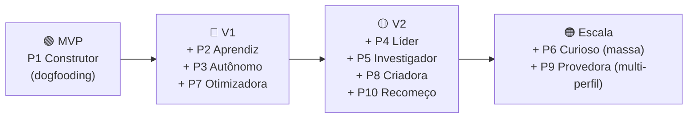

# 05 — User Personas

> **Fase geral:** Fundacional (evolui por fases) · **Versão:** 0.1 · **Última atualização:** 2026-07-20
> **Status:** Vivo (living document)
> **Leia antes:** [`ATLAS_MASTER_CONTEXT.md`](ATLAS_MASTER_CONTEXT.md) · [`00_Project_Vision.md`](00_Project_Vision.md)
> **Documentos relacionados:** [`04_Product_Requirements.md`](04_Product_Requirements.md) · [`06_User_Journey.md`](06_User_Journey.md) · [`01_Problem_Statement.md`](01_Problem_Statement.md) · [`19_UI_Screens.md`](19_UI_Screens.md) · [`20_MVP.md`](20_MVP.md) · [`22_Business_Model.md`](22_Business_Model.md)
> **Sistema de fases:** 🟢 MVP · 🔵 V1 · 🟡 V2 · 🟠 Escala · 🔴 Pesquisa

---

## 0. Como ler este documento

Uma **persona** é um arquétipo semi-ficcional de usuário, construído a partir de padrões reais
de comportamento, objetivos e contexto. Personas **não** são demografia por si só ("homem, 30
anos"); são *ferramentas de decisão*: quando surge uma dúvida de produto, perguntamos "o que a
persona P faria / precisaria aqui?".

### 0.1. Por que personas existem (e seus riscos)

- **Por que existem:** alinham decisões a *pessoas concretas*, evitam projetar para "todo
  mundo" (ou seja, para ninguém) e dão linguagem comum para priorização (ligam-se a
  [`04_Product_Requirements.md`](04_Product_Requirements.md) via JTBD).
- **Risco 1 — persona de fantasia:** inventar usuários que não existem. *Mitigação:* ancorar em
  evidências (`01_Problem_Statement.md`) e no próprio autor (dogfooding).
- **Risco 2 — personas demais:** diluir foco. *Mitigação:* eleger **uma persona primária** para
  o MVP (§2) e tratar as demais como *futuras* com rótulo de fase.

### 0.2. Anatomia de cada persona (campos)

Cada persona abaixo segue este gabarito:

| Campo | O que captura |
|---|---|
| **Contexto** | Quem é, situação de vida, relação com tecnologia e dados. |
| **Um dia na vida** | Narrativa que revela onde o Atlas se encaixa. |
| **Dores** | Problemas reais que sente hoje (sem Atlas). |
| **Dados que gera** | Sinais/domínios que alimentariam o CMHL. |
| **Jobs-To-Be-Done (JTBD)** | Progresso que quer alcançar (forma: *quando… quero… para…*). |
| **Insights que mais valoriza** | Que saídas do Atlas geram valor para ela. |
| **Objeções** | Barreiras à adoção — com destaque para **privacidade**. |
| **Gatilho de adoção** | O momento/evento que a faria começar a usar. |
| **Disposição a pagar (WTP)** | Sensibilidade a preço e modelo provável (detalhe em `22`). |
| **Fase de foco** | Quando esta persona entra no radar do produto (🟢→🟠). |

> **Sobre JTBD.** *Jobs-To-Be-Done* é o enquadramento (explicado a fundo em `04 §4.3`) de que
> pessoas "contratam" um produto para fazer *progresso* num contexto. Usamos a forma canônica
> **"Quando [situação], quero [motivação], para [resultado]"**.

---

## 1. Mapa de personas (visão geral)

| # | Persona | Apelido | Densidade de dados | Sensibilidade à privacidade | WTP | Fase de foco |
|---|---|---|---|---|---|:--:|
| P1 | Desenvolvedor / Fundador solo | *O Construtor* | Alta | Muito alta | Média-Alta | 🟢 |
| P2 | Estudante | *A Aprendiz* | Média | Média | Baixa | 🔵 |
| P3 | Freelancer | *O Autônomo* | Média-Alta | Alta | Média | 🔵 |
| P4 | Executivo | *A Líder Ocupada* | Média | Alta | Alta | 🟡 |
| P5 | Pesquisador / Acadêmico | *O Investigador* | Alta | Muito alta | Média | 🟡 |
| P6 | Pessoa Comum | *O Curioso Casual* | Baixa-Média | Média | Baixa | 🟡 |
| P7 | Atleta / Entusiasta de saúde | *A Otimizadora* | Muito alta | Média | Média-Alta | 🔵 |
| P8 | Criador de Conteúdo | *A Criadora* | Alta | Média | Média | 🟡 |
| P9 | Cuidador / Gestor familiar | *A Provedora* | Média | Alta | Média | 🟠 |
| P10 | Pessoa em transição de vida | *O Recomeço* | Média | Alta | Média | 🟡 |

> P9 e P10 são adições que ampliam cobertura sem diluir o foco: representam, respectivamente,
> quem gerencia a vida de *outros* (privacidade de terceiros → complexidade 🟠) e quem usa o
> Atlas em *momentos de virada* (mudança, luto, recuperação — alto valor de autoconhecimento).

---

## 2. Persona primária do MVP: P1 — Desenvolvedor / Fundador solo (*O Construtor*)

> **Decisão:** A persona primária do MVP é o **próprio fundador-desenvolvedor** (dogfooding).
> Todo o `04_Product_Requirements.md` §7 (escopo do MVP) é otimizado para ela.

### 2.1. Por que o fundador é a persona primária (justificativa)

1. **Ciclo de feedback de custo zero e latência zero.** O autor sente cada fricção
   imediatamente, sem pesquisa de usuário — crítico para um time de uma pessoa.
2. **Densidade e diversidade de dados.** Um dev gera dados ricos e cross-domain (saúde,
   localização, calendário, código/commits, finanças), material ideal para provar a tese
   cross-domain (`04` O-2).
3. **Alinhamento com objetivos pessoais.** Os objetivos P1–P3 do fundador (`00 §6.3`: domínio
   técnico, crescimento, ativo de carreira) só se cumprem se ele **usar** o produto a fundo.
4. **Tolerância a produto cru.** Aguenta o MVP imperfeito e sabe reportar/consertar — evita
   queimar usuários externos cedo.
5. **Reduz risco de "persona de fantasia".** Constrói-se para um usuário real, presente e
   verificável: você mesmo.

> **Regra de dogfooding (Definition of Done do MVP, ver `04 §7.5`):** o MVP só é "pronto" quando
> o autor o usa **diariamente por ≥4 semanas** e obtém valor real (insights acionados).

### 2.2. Persona completa — P1 *O Construtor* 🟢

- **Contexto.** Felipe, ~30, desenvolvedor full-stack e fundador solo. Vive no terminal e no
  celular. Cético com Big Tech quanto a dados; entusiasta de arquitetura limpa, privacidade e
  aprendizado profundo. Tem stack próprio (RN/Expo, NestJS, Postgres) e constrói o Atlas tanto
  como produto quanto como ativo de carreira.
- **Um dia na vida.** Acorda, checa sono no relógio. Trabalha em blocos, alterna código e
  reuniões, procrastina em ciclos que não entende bem. Treina à noite às vezes; dorme mal
  depois. Registra ideias soltas em notas espalhadas (mil apps). No fim do dia, sensação de
  "fiz muito, mas o que realmente importou?".
- **Dores.**
  - Dados espalhados em silos (saúde num app, notas noutro, finanças noutro).
  - Não sabe *o que* aumenta ou destrói sua produtividade.
  - Ferramentas de "quantified self" mostram gráficos, mas **não explicam** nada.
  - Desconfia de mandar a vida inteira para a nuvem de terceiros.
- **Dados que gera.** Sono/atividade/HR (Health Connect), localização, calendário, commits,
  transações, notas manuais, humor auto-reportado.
- **JTBD.**
  - *Quando* termino uma semana de trabalho, *quero* entender o que impulsionou/atrapalhou meu
    foco, *para* ajustar a próxima semana com base em fatos, não em impressões.
  - *Quando* percebo um padrão ruim (procrastinar, dormir mal), *quero* ver o que costuma
    precedê-lo, *para* intervir na causa.
  - *Quando* registro qualquer dado da minha vida, *quero* que ele fique **meu** e privado,
    *para* confiar o suficiente e alimentar o sistema sem medo.
- **Insights que mais valoriza.** Cross-domain explicáveis: "treino após 21h → −40 min de
  sono → dia seguinte com menos foco (evidências: 6 eventos)". Streaks e tendências simples.
- **Objeções.** **Privacidade acima de tudo** — não usa se não for local-first, exportável e
  deletável. Também: medo de mais um app que vira trabalho (fricção de manutenção).
- **Gatilho de adoção.** É o próprio autor: gatilho = existência do MVP + necessidade real de
  entender a própria rotina.
- **WTP.** Como usuário: pagaria por privacidade/valor (média-alta). Como fundador: investe
  tempo, não dinheiro. Modelo provável: freemium com camada paga de IA/nuvem (ver `22`).
- **Fase de foco.** 🟢 MVP (primária).

---

## 3. Personas secundárias

### 3.1. P2 — Estudante (*A Aprendiz*) 🔵

- **Contexto.** Universitária/pós, 19–26, orçamento apertado, vive no celular, alterna estudo,
  trabalho de meio-período e vida social. Nativa digital; privacidade importa mas conveniência
  às vezes vence.
- **Um dia na vida.** Aulas de manhã, estudo fragmentado à tarde (com distrações), vida social
  à noite. Sente que "estuda muito e rende pouco". Sono irregular em época de prova.
- **Dores.** Procrastinação; não sabe quais hábitos de estudo funcionam; ansiedade pré-prova;
  gestão de tempo caótica.
- **Dados que gera.** Calendário acadêmico, sono, localização (biblioteca × casa), notas de
  estudo, humor, sessões de foco (Pomodoro).
- **JTBD.** *Quando* me preparo para provas, *quero* saber quais condições (sono, local, horário)
  me fazem render mais, *para* estudar melhor com menos horas.
- **Insights que valoriza.** "Você rende 30% mais estudando de manhã na biblioteca"; correlação
  sono × desempenho percebido.
- **Objeções.** Preço (baixa WTP); "mais um app para manter"; privacidade média.
- **Gatilho de adoção.** Época de provas / crise de produtividade; indicação de colega.
- **WTP.** Baixa — precisa de camada gratuita generosa; desconto estudante (`22`).
- **Fase de foco.** 🔵.

### 3.2. P3 — Freelancer (*O Autônomo*) 🔵

- **Contexto.** Designer/dev/consultor autônomo, 25–40, múltiplos clientes, renda variável,
  fronteira difusa entre trabalho e vida.
- **Um dia na vida.** Alterna projetos e clientes, controla horas manualmente, esquece de
  faturar, oscila entre excesso e ócio. Ansiedade financeira por renda irregular.
- **Dores.** Rastrear tempo/receita por cliente; entender sazonalidade de renda; equilíbrio
  trabalho-vida; burnout silencioso.
- **Dados que gera.** Horas trabalhadas, transações/receita, calendário, localização, saúde,
  humor.
- **JTBD.** *Quando* fecho o mês, *quero* entender quais clientes/hábitos me dão mais retorno
  por hora e como isso afeta minha saúde, *para* escolher melhor no que trabalhar.
- **Insights que valoriza.** Receita por cliente/hora; correlação carga × sono/humor;
  previsão simples de renda.
- **Objeções.** Privacidade financeira (alta); tempo de setup; confiabilidade dos números.
- **Gatilho de adoção.** Fechamento de mês caótico; susto financeiro; declaração de imposto.
- **WTP.** Média — vê o Atlas como ferramenta de negócio (dedutível mentalmente).
- **Fase de foco.** 🔵.

### 3.3. P4 — Executivo (*A Líder Ocupada*) 🟡

- **Contexto.** Gestora/diretora, 35–55, agenda saturada, alto rendimento, pouco tempo para
  configurar ferramentas. Valoriza síntese, não dados brutos.
- **Um dia na vida.** Reunião atrás de reunião, decisões constantes, viagens, sono
  sacrificado, pouco tempo pessoal. Quer performar sem colapsar.
- **Dores.** Sobrecarga; falta de tempo para reflexão; equilíbrio; delegar memória/contexto.
- **Dados que gera.** Calendário denso, viagens/localização, saúde (wearable premium),
  finanças, contatos/relacionamentos.
- **JTBD.** *Quando* minha semana termina, *quero* um resumo do que consumiu meu tempo e energia
  e o que gerou resultado, *para* proteger meu tempo estratégico.
- **Insights que valoriza.** Resumos executivos automáticos; "onde seu tempo foi"; alertas de
  sobrecarga; relação carga × saúde.
- **Objeções.** Privacidade/segurança corporativa (muito alta); tempo de setup (mínimo); exige
  polimento e confiabilidade (não usa produto cru).
- **Gatilho de adoção.** Recomendação de par confiável; episódio de burnout; coach executivo.
- **WTP.** Alta — paga por tempo/tranquilidade; sensível a qualidade, não a preço.
- **Fase de foco.** 🟡 (exige maturidade de produto que o MVP não terá).

### 3.4. P5 — Pesquisador / Acadêmico (*O Investigador*) 🟡

- **Contexto.** Mestrando/doutorando/pesquisador, 24–45, mentalidade analítica, adora dados e
  rigor, cético com "caixas-pretas".
- **Um dia na vida.** Leitura, escrita, experimentos, ensino; ciclos longos de foco e
  procrastinação; interesse genuíno em *quantified self* com método.
- **Dores.** Produtividade intelectual irregular; quer *método* e *evidência*, não hype;
  reprodutibilidade dos próprios hábitos.
- **Dados que gera.** Sessões de foco/escrita, leitura, sono, humor, localização, notas,
  possivelmente exportações para análise própria.
- **JTBD.** *Quando* investigo minha própria produtividade, *quero* dados estruturados e
  exportáveis com evidência rastreável, *para* analisar rigorosamente (e confiar).
- **Insights que valoriza.** Correlações com intervalos de confiança; exportação para R/Python;
  transparência total do método (o Atlas mostra *como* concluiu).
- **Objeções.** Privacidade **muito alta**; exige rigor estatístico (rejeita insights
  "achistas"); quer controle dos dados (open data/local-first).
- **Gatilho de adoção.** Interesse em self-tracking com método; afinidade com projeto open
  source (`28`); potencial contribuidor.
- **WTP.** Média — valoriza open source/local; pode contribuir em vez de pagar.
- **Fase de foco.** 🟡 (também aliado natural da comunidade/pesquisa, ver `23`/`29`).

### 3.5. P6 — Pessoa Comum (*O Curioso Casual*) 🟡

- **Contexto.** Não-técnico, 25–60, usa apps mainstream, curiosidade moderada sobre si mesmo,
  baixa tolerância a fricção e jargão.
- **Um dia na vida.** Rotina de trabalho/família; usa o celular para tudo; não quer "mais um
  projeto"; quer benefício claro e imediato.
- **Dores.** "Para onde vai meu tempo/dinheiro?"; vontade vaga de hábitos melhores; sem
  paciência para configurar.
- **Dados que gera.** Saúde básica (passos/sono do celular), fotos, gastos, localização —
  poucos domínios ativos.
- **JTBD.** *Quando* fico curioso sobre meus hábitos, *quero* descobertas simples sem esforço,
  *para* me sentir um pouco mais no controle.
- **Insights que valoriza.** Descobertas simples e agradáveis ("seu mês mais ativo foi…");
  nada de estatística.
- **Objeções.** Esforço/fricção (alta); "por que dar meus dados?"; não entende o valor de
  imediato → precisa de aha instantâneo.
- **Gatilho de adoção.** Viralidade / recomendação; feature "divertida"; pré-instalação.
- **WTP.** Baixa — depende de camada gratuita e de mínimo esforço.
- **Fase de foco.** 🟡/🟠 (mercado de massa exige maturidade e onboarding sem atrito).

### 3.6. P7 — Atleta / Entusiasta de saúde (*A Otimizadora*) 🔵

- **Contexto.** Pratica esporte a sério (corrida, força, triatlo), 20–45, já usa vários
  wearables e apps, obcecada por otimização e recuperação.
- **Um dia na vida.** Treino de manhã ou noite, monitora sono/HRV/nutrição, ajusta carga,
  frustra-se por dados fragmentados entre Garmin/Strava/Health/nutrição.
- **Dores.** Dados de saúde em silos; nenhum app cruza treino × sono × humor × nutrição ×
  vida; quer entender recuperação e desempenho holisticamente.
- **Dados que gera.** **Muito** dado: HR/HRV, sono, treinos, passos, nutrição, peso,
  localização — a persona mais densa em dados.
- **JTBD.** *Quando* ajusto meu treino, *quero* ver como carga, sono e humor se influenciam,
  *para* melhorar desempenho sem lesão/overtraining.
- **Insights que valoriza.** Correlações treino × recuperação × humor; alertas de
  overtraining; padrões cross-domain (sono × desempenho).
- **Objeções.** Precisa integrar wearables (conectores); privacidade média; exige precisão.
- **Gatilho de adoção.** Frustração com fragmentação; busca por ganho marginal; lesão/plateau.
- **WTP.** Média-alta — já gasta com apps/wearables premium.
- **Fase de foco.** 🔵 (depende de mais conectores; alta densidade de dados a torna ótima para
  validar insights cross-domain após o MVP).

### 3.7. P8 — Criador de Conteúdo (*A Criadora*) 🟡

- **Contexto.** YouTuber/streamer/escritora, 20–40, vive de output criativo, renda variável,
  fronteira difusa vida-trabalho, luta com consistência e burnout.
- **Um dia na vida.** Ideação, produção, edição, publicação, engajamento; energia criativa
  oscilante; pressão de audiência; sono e rotina caóticos.
- **Dores.** Entender o que alimenta (ou drena) a criatividade; consistência; burnout;
  correlacionar hábitos com produtividade criativa.
- **Dados que gera.** Publicações/output, métricas de plataforma (opcional), sono, humor,
  localização, foco, finanças.
- **JTBD.** *Quando* planejo meu calendário criativo, *quero* saber quais condições precedem
  meus melhores dias criativos, *para* produzir de forma sustentável.
- **Insights que valoriza.** "Seus melhores vídeos vieram após dias de X"; padrões de
  energia/criatividade; alerta de burnout.
- **Objeções.** Privacidade média; tempo escasso; quer valor rápido e "compartilhável".
- **Gatilho de adoção.** Bloqueio criativo; burnout; busca por consistência.
- **WTP.** Média — vê como ferramenta profissional.
- **Fase de foco.** 🟡.

### 3.8. P9 — Cuidador / Gestor familiar (*A Provedora*) 🟠

- **Contexto.** Gerencia a vida de dependentes (filhos, pais idosos), 30–60, sobrecarregada,
  faz malabarismo entre necessidades próprias e de terceiros.
- **Dores.** Sobrecarga mental; rastrear compromissos/saúde de várias pessoas; esquecer de
  cuidar de si.
- **Dados que gera.** Calendário familiar, saúde (própria e, com consentimento, de terceiros),
  finanças domésticas, localização.
- **JTBD.** *Quando* coordeno a vida da minha família, *quero* uma visão unificada e lembretes,
  *para* não deixar cair nenhuma bola — inclusive meu próprio bem-estar.
- **Insights que valoriza.** Visão consolidada; alertas de sobrecarga própria; padrões
  familiares.
- **Objeções.** **Privacidade de terceiros** (consentimento de outras pessoas → complexo);
  multi-perfil; regulatório.
- **Gatilho de adoção.** Crise de coordenação familiar; evento de saúde de um dependente.
- **WTP.** Média.
- **Fase de foco.** 🟠 — dados de terceiros elevam a complexidade de privacidade/consentimento
  para muito além do MVP.

### 3.9. P10 — Pessoa em transição de vida (*O Recomeço*) 🟡

- **Contexto.** Passando por mudança significativa (mudança de cidade, término, luto,
  recuperação, novo emprego, parentalidade), qualquer idade — momento de alta reflexão.
- **Dores.** Sensação de descontrole; querer reconstruir rotina; entender o "antes e depois";
  processar mudança.
- **Dados que gera.** Humor, sono, localização, rotina, notas/diário, saúde.
- **JTBD.** *Quando* passo por uma grande mudança, *quero* acompanhar como estou me adaptando,
  *para* recuperar equilíbrio e enxergar meu progresso.
- **Insights que valoriza.** Narrativa de progresso ("comparado a 3 meses atrás…"); tendências
  de humor/rotina; marcos de recuperação.
- **Objeções.** Privacidade (dados emocionais sensíveis, alta); vulnerabilidade → exige tom
  cuidadoso e não-julgador.
- **Gatilho de adoção.** O próprio evento de virada; recomendação de terapeuta/amigo.
- **WTP.** Média.
- **Fase de foco.** 🟡.

---

## 4. Anti-personas (para quem o Atlas NÃO é)

Anti-personas explicitam quem **não** devemos tentar servir — tão importante quanto saber quem
servir, porque protege o foco e a tese.

| Anti-persona | Por que NÃO é o Atlas | Risco de tentar atendê-la |
|---|---|---|
| **O Vendedor de Dados** | Quer monetizar/exportar dados de terceiros ou fazer growth-hacking com dados alheios. | Viola a tese de confiança e a postura de privacidade (`00 §4.4`, `15`). |
| **O Buscador de Dopamina** | Quer gamificação vazia, streaks viciantes, comparação social — "vaidade". | Empurra para métricas de vaidade e Kano-Reverso (`04 §4.4`); trai "compreensão > registro". |
| **O Terapeuta-Substituto** | Espera diagnóstico clínico/tratamento de saúde mental. | Risco ético/legal; Atlas *aumenta* o julgamento, não substitui profissional. |
| **O Micro-gerente de Terceiros** | Quer vigiar cônjuge/filhos/funcionários sem consentimento. | Vigilância viola privacidade e consentimento — inaceitável por design. |
| **O Caçador de Dashboards** | Quer só gráficos bonitos de "quantified self", sem inferência/explicação. | É exatamente o anti-objetivo de `00 §6.4`. |
| **O Usuário Zero-Esforço/Zero-Dados** | Não quer conectar nada nem registrar nada, mas espera mágica. | Sem dados, não há CMHL; expectativa impossível de atender. |
| **A Empresa (B2B puro no início)** | Quer analytics de funcionários/organização. | Fora da tese "inteligência *pessoal*"; B2B2C é 🟠 (`21`), não agora. |

---

## 5. Personas × Requisitos (rastreabilidade)

Liga personas aos requisitos que mais as servem (IDs de `04_Product_Requirements.md`), útil
para priorização e para os fluxos de `06_User_Journey.md`.

| Persona | Requisitos-chave que a atendem | Domínios de dados prioritários |
|---|---|---|
| P1 Construtor (🟢) | RF-101, RF-102, RF-201, RF-401/402/403, RF-602/603, RF-801 | Saúde, manual, localização, calendário |
| P2 Aprendiz (🔵) | RF-104 (calendário), RF-401/405, RF-502 | Calendário, foco, sono |
| P3 Autônomo (🔵) | RF-105 (finanças), RF-405, RF-303 | Finanças, tempo, saúde |
| P4 Líder (🟡) | RF-104, RF-406 (síntese), RF-801/802 | Calendário, viagens, saúde |
| P5 Investigador (🟡) | RF-602 (export), RF-403, RF-405 | Foco, sono, notas |
| P6 Curioso (🟡) | RF-702 (aha), RF-901 (widget) | Saúde básica, gastos |
| P7 Otimizadora (🔵) | RF-102, RF-402, RF-405 | Saúde densa, treino, nutrição |
| P8 Criadora (🟡) | RF-405, RF-406, RF-901 | Output, humor, foco |
| P9 Provedora (🟠) | (multi-perfil, consentimento de terceiros — futuro) | Calendário familiar, saúde |
| P10 Recomeço (🟡) | RF-401 (tendências), RF-101 (diário) | Humor, rotina, localização |

---

## 6. Como as personas evoluem por fase

**Racional da sequência.** Começamos com quem gera dados densos e tolera produto cru (P1),
expandimos para quem tem dor aguda e densidade alta (P3, P7) ou grande volume potencial (P2),
depois para quem exige polimento (P4, P5, P8, P10), e só na escala abordamos massa (P6) e casos
multi-pessoa (P9), que exigem maturidade de privacidade/consentimento.

---

### Resumo executivo

Este documento define **dez personas** para o Atlas, cada uma com contexto, dores, dados,
**JTBD**, insights valorizados, objeções (com ênfase em privacidade), gatilho de adoção e
disposição a pagar, além de um **rótulo de fase** que ordena quando cada uma entra no radar. A
**persona primária do MVP é o próprio fundador-desenvolvedor** (*O Construtor*, P1), escolhido
por dogfooding: feedback instantâneo, dados densos e cross-domain, tolerância a produto cru e
alinhamento com os objetivos pessoais do autor — com a regra de que o MVP só está "pronto"
quando usado diariamente por ≥4 semanas com valor real. As personas secundárias (Estudante,
Freelancer, Executivo, Pesquisador, Pessoa Comum, Atleta, Criador, Cuidador, Pessoa em
transição) expandem o alcance por fases (🔵→🟠), priorizando densidade de dados e tolerância a
imperfeição. As **anti-personas** protegem a tese, excluindo vigilância, monetização de dados,
gamificação vazia e substituição de profissionais. A rastreabilidade persona×requisito conecta
este documento a `04` e alimenta os fluxos de `06`.
