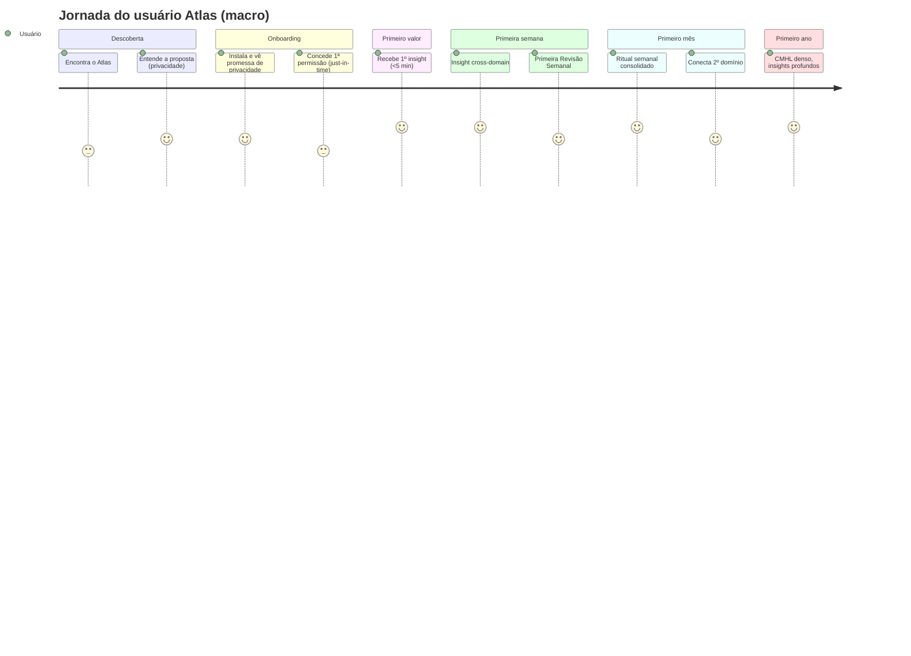
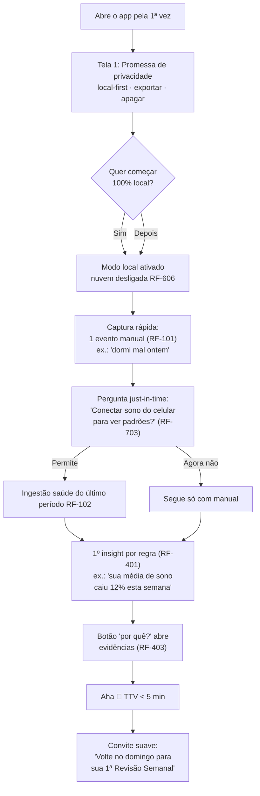
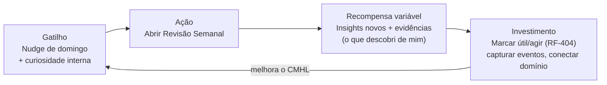
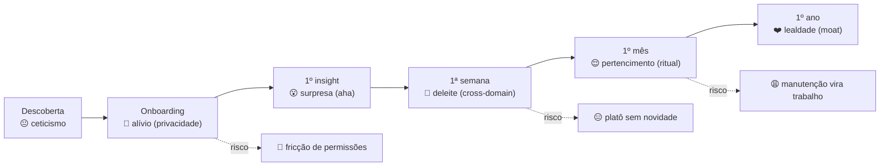

# 06 — User Journey

> **Fase geral:** Fundacional (evolui por fases) · **Versão:** 0.1 · **Última atualização:** 2026-07-20
> **Status:** Vivo (living document)
> **Leia antes:** [`ATLAS_MASTER_CONTEXT.md`](ATLAS_MASTER_CONTEXT.md) · [`00_Project_Vision.md`](00_Project_Vision.md)
> **Documentos relacionados:** [`04_Product_Requirements.md`](04_Product_Requirements.md) · [`05_User_Personas.md`](05_User_Personas.md) · [`15_Privacy_Architecture.md`](15_Privacy_Architecture.md) · [`18_Design_System.md`](18_Design_System.md) · [`19_UI_Screens.md`](19_UI_Screens.md) · [`20_MVP.md`](20_MVP.md)
> **Sistema de fases:** 🟢 MVP · 🔵 V1 · 🟡 V2 · 🟠 Escala · 🔴 Pesquisa

---

## 0. Como ler este documento

Uma **jornada do usuário (user journey)** mapeia a experiência completa de uma pessoa com o
produto ao longo do tempo — de "nunca ouviu falar" a "não vive mais sem" (ou "abandonou"). Para
cada etapa registramos: **objetivo do usuário**, **ações**, **o que o Atlas faz**, **emoção**,
**momentos 'aha'**, **pontos de fricção/risco de churn** e **mitigação**.

> **Persona de referência.** Salvo indicação, a jornada segue a **persona primária do MVP**,
> *O Construtor* (P1, o fundador — dogfooding), definida em
> [`05_User_Personas.md`](05_User_Personas.md). Variações relevantes de outras personas são
> anotadas quando importam.

### 0.1. Conceitos usados nesta jornada (explicados)

- **Time-to-value (TTV).** Tempo entre o primeiro contato e o primeiro valor percebido. No
  Atlas, o objetivo **O-1** (`04 §2`) é TTV ≤ 5 min (primeiro insight na 1ª sessão). TTV curto
  é o maior preditor de retenção inicial.
- **Momento 'aha'.** O instante em que o usuário *entende* o valor do produto na própria pele
  ("nossa, o Atlas percebeu que treino tarde estraga meu sono"). Nosso aha-alvo é um **insight
  explicável**, idealmente cross-domain.
- **Churn.** Abandono. Mapeamos *onde* e *por que* ele acontece em cada etapa para mitigar.
- **Hook Model (Nir Eyal).** Ciclo de formação de hábito: **Gatilho → Ação → Recompensa
  (variável) → Investimento**. Detalhado em §7.
- **Local-first onboarding.** Onboarding que **ganha confiança antes de pedir dados**,
  coerente com a postura de privacidade inegociável (`00 §4`, `15`).

### 0.2. Mapa macro da jornada

---

## 1. Fase Descoberta (Awareness)

**Objetivo do usuário:** entender rapidamente *o que é* o Atlas e *por que confiaria* nele.

| Aspecto | Detalhe |
|---|---|
| **Canais (por fase)** | 🟢 nenhum (só o autor); 🔵 comunidades dev/privacidade, open source (`28`), boca a boca; 🟡 conteúdo, PLG; 🟠 mídia/mercado de massa. |
| **Ações** | Lê a proposta, avalia a promessa de privacidade, decide instalar. |
| **O que o Atlas comunica** | "Seu modelo de vida, privado e local-first. A IA interpreta; os dados são seus." |
| **Emoção** | Curiosidade + ceticismo saudável ("mais um app de dados?"). |
| **Aha de descoberta** | "Espera — é *local-first* e eu posso apagar tudo? Isso é diferente." |
| **Fricção / churn** | Proposta abstrata demais; medo de dar dados; "quantified self" fadiga. |
| **Mitigação** | Mensagem central em privacidade/propriedade; exemplos concretos de insight; prova de que funciona com **poucos** dados. |

> **Nota de fase.** No MVP a "descoberta" é trivial (o autor já está convencido). Esta seção
> importa a partir de 🔵, mas o **produto** deve nascer já comunicando confiança, porque a
> primeira tela do onboarding *é* a descoberta para quem chega depois.

---

## 2. Fase Onboarding (Primeiro acesso) 🟢

Esta é a fase mais crítica do MVP: define **TTV** (O-1) e é onde a **confiança** é ganha ou
perdida. Requisitos: RF-701..704 (`04 §5.7`). Princípio: **confiança antes de dados; valor
antes de mais dados**.

### 2.1. Princípios do onboarding local-first

1. **Explique privacidade *antes* de pedir qualquer coisa.** A primeira tela não pede
   permissão; ela promete controle (local-first, export, delete). (RF-701)
2. **Permissões just-in-time, não "tudo de uma vez".** Peça acesso a um dado **no momento** em
   que ele gera valor visível, explicando o porquê. (RF-703)
3. **Garanta um aha na 1ª sessão, mesmo com dados mínimos.** Um insight por regra a partir de
   um único domínio + 1 evento manual. (RF-702)
4. **Empty states que ensinam.** Nada de tela vazia; cada vazio explica o próximo passo e o
   valor que virá. (RF-704)

### 2.2. Fluxo passo a passo (MVP)

### 2.3. Onboarding de permissões e conectores (foco em confiança)

Cada pedido de permissão segue o mesmo padrão de 3 partes — **Por quê → O quê → Controle**:

| Elemento | Conteúdo | Requisito |
|---|---|---|
| **Por quê** | Benefício concreto: "para descobrir como seu sono afeta seu foco". | RF-703 |
| **O quê (granular)** | Só o tipo necessário agora (sono ≠ passos ≠ HR). | RF-604 |
| **Controle** | "Você pode revogar e apagar a qualquer momento." + link p/ Painel de Privacidade. | RF-601/603 |

> **Regra de ouro anti-fricção:** **nunca** empilhar 5 pedidos de permissão na primeira tela.
> Cada permissão só aparece quando o valor dela está prestes a ser demonstrado.

### 2.4. Mapa de emoções do onboarding

| Passo | Emoção-alvo | Risco emocional | Mitigação |
|---|---|---|---|
| Promessa de privacidade | Alívio/confiança | Ceticismo ("prove") | Modo 100% local imediato (RF-606) |
| Captura rápida | Competência ("já fiz algo") | "Trabalho chato" | 1 evento em ≤3 toques (RF-101) |
| Pedido de permissão | Compreensão | Desconfiança | Padrão Por quê→O quê→Controle |
| 1º insight | Surpresa/deleite (aha) | Anticlímax ("só isso?") | Insight relevante + evidência (RF-403) |
| Convite ao ritual | Antecipação | Indiferença | Promessa de valor recorrente |

### 2.5. Pontos de fricção e churn no onboarding

| Fricção | Por que causa churn | Mitigação (requisito) |
|---|---|---|
| Muitos pedidos de permissão de uma vez | Sobrecarga + desconfiança | Just-in-time (RF-703) |
| Tela vazia sem dados | "Não serve para nada ainda" | Empty states didáticos (RF-704) + insight garantido (RF-702) |
| Exigir nuvem/login para começar | Barreira + medo de privacidade | Modo local primeiro (RF-606); login opcional |
| Aha fraco/ausente | Sem valor percebido → abandona | Regra garante ≥1 insight (RF-401/702) |
| Jargão técnico | Confusão (personas não-técnicas) | Linguagem clara (RNF-A4) |

---

## 3. Fase Primeiro insight (Time-to-Value) 🟢

**Objetivo:** entregar o primeiro *aha* explicável em ≤ 5 min (O-1 / M-1).

- **O que acontece.** Com um domínio (saúde) + 1 evento manual, o motor de regras (RF-401)
  dispara um insight simples e verdadeiro (média, streak, variação). O usuário toca em "por
  quê?" e vê os Eventos-evidência (RF-403).
- **Por que funciona com poucos dados.** Insights por **regra/heurística** não precisam de
  histórico longo nem de LLM (RNF-C1, custo zero) — "heurística antes de neurônio".
- **Emoção-alvo:** deleite + confiança ("ele me mostrou de onde tirou isso").
- **Aha primário:** *"O Atlas percebeu algo verdadeiro sobre mim e me provou como."*
- **Risco:** insight genérico/óbvio → parece truque. **Mitigação:** priorizar insights
  específicos e acionáveis; nunca inventar (sem evidência, não mostra).

---

## 4. Fase Primeira semana 🟢

**Objetivo:** provar a tese cross-domain (O-2/M-2) e plantar o **ritual da Revisão Semanal**.

### 4.1. O que acontece na semana 1

| Dia | Evento típico | O que o Atlas faz |
|---|---|---|
| D1 | Onboarding + 1º insight | Aha inicial (RF-702) |
| D2–D3 | Uso passivo (saúde sincroniza) + captura ocasional | Acumula eventos; read models diários (RF-206) |
| D4–D5 | Mais dados de 2 domínios | Primeiro candidato a insight **cross-domain** (RF-402) |
| D6 | Nudge de véspera | Notificação: "amanhã, sua 1ª Revisão Semanal" (RF-801) |
| D7 | **Primeira Revisão Semanal** | Resumo da semana + insights + evidências |

### 4.2. O aha cross-domain (o momento decisivo da tese)

O aha mais poderoso é o **cross-domain explicável**, ex.:

> *"Nas noites após treinar depois das 21h, você dormiu 40 min a menos — e nesses dias
> registrou humor mais baixo. (6 eventos de evidência)"*

Isso concretiza o diferencial que nenhum concorrente entrega (`00 §4`) e valida O-2. É o aha
que transforma "app interessante" em "isso é *meu* e me entende".

### 4.3. Fricção e churn na primeira semana

| Fricção | Mitigação |
|---|---|
| "Já vi o insight inicial, e agora?" (platô) | Prometer e entregar a Revisão Semanal como recompensa recorrente |
| Poucos dados → sem cross-domain ainda | Insights por regra continuam entregando valor no intervalo |
| Esquecer do app | Único nudge útil (RF-801), sem spam (evita Kano-Reverso) |

---

## 5. Fase Primeiro mês 🟢/🔵

**Objetivo:** consolidar o hábito (o ritual semanal vira rotina) e aprofundar o CMHL.

- **Ritual consolidado.** 3–4 Revisões Semanais completas viram hábito (meta M-5 ≥ 70% para o
  autor). Cada revisão fecha o loop Investimento→Gatilho (§7).
- **Densidade crescente.** Mais eventos → read models mais ricos → insights mais confiáveis;
  entidades básicas (RF-301) começam a conectar lugares/pessoas/temas.
- **Expansão de conectores (🔵).** O usuário, já confiando, adiciona um 2º/3º domínio
  (calendário, finanças) — cada adição é um novo pedido just-in-time (RF-703).
- **Emoção-alvo:** pertencimento ("este é o meu Atlas") + curiosidade crescente.
- **Aha do mês:** ver **progresso/tendência** ("comparado à semana 1…") — narrativa temporal.
- **Risco de churn:** manutenção percebida como trabalho. **Mitigação:** maximizar ingestão
  automática (menos digitação), manter a revisão curta e valiosa.

---

## 6. Fase Primeiro ano 🔵/🟡

**Objetivo:** transformar o Atlas num ativo composto — o **moat** de dados (`00 §1.3`).

| Marco | O que muda | Fase |
|---|---|---|
| CMHL denso | Insights sazonais, anuais, padrões profundos | 🔵/🟡 |
| Insights estatísticos | Correlações com confiança, tendências (RF-405) | 🔵 |
| Síntese via LLM (opt-in) | "Pergunte à sua vida" / resumos narrativos (RF-406/407) | 🔵/🟡 |
| Grafo navegável | Explorar relações entre pessoas/lugares/temas (RF-304) | 🟡 |
| Efeito de composição | Quanto mais tempo, mais valioso e mais difícil de largar | — |

- **Emoção-alvo:** dependência saudável / lealdade ("anos da minha vida estão aqui, com
  evidência").
- **Aha do ano:** retrospectiva anual explicável — "o que mudou minha vida este ano, segundo
  meus próprios dados".
- **Risco:** estagnação de valor se insights repetirem. **Mitigação:** novos domínios + camadas
  de IA (roadmap `21`) mantêm a curva de valor subindo.

---

## 7. Loops de engajamento (Hook Model)

O engajamento sustentável do Atlas é desenhado como um **Hook Model** (Nir Eyal): ciclos que,
repetidos, formam hábito. O ciclo central é a **Revisão Semanal**.

### 7.1. O Hook Model explicado

| Etapa | Definição | No Atlas |
|---|---|---|
| **Gatilho (Trigger)** | O que inicia a ação. *Externo* (notificação) evolui para *interno* (emoção/rotina). | Externo: nudge de domingo (RF-801). Interno: curiosidade "como foi minha semana?". |
| **Ação (Action)** | Comportamento mais simples feito em antecipação à recompensa. | Abrir a Revisão Semanal (1 toque). |
| **Recompensa variável (Variable Reward)** | Benefício com um elemento de imprevisibilidade → dopamina. | Insights *diferentes* a cada semana (o que o Atlas "descobriu" muda). |
| **Investimento (Investment)** | Trabalho do usuário que melhora o produto para o próximo ciclo. | Feedback nos insights (RF-404), captura de eventos, conectar novo domínio → CMHL melhor → gatilho melhor. |

### 7.2. O loop central: a Revisão Semanal como ritual

**Por que a Revisão Semanal (e não diária)?**
- **Cadência humana:** uma semana é o horizonte natural de reflexão/planejamento — sem a
  pressão diária que gera fadiga e Kano-Reverso.
- **Dados suficientes:** 7 dias acumulam sinal bastante para insights não-triviais.
- **Baixo risco de spam:** um nudge por semana respeita a atenção (alinha com política de
  notificações, `04 §5.8`).

### 7.3. O investimento cria o moat

Cada volta do loop **aprofunda o CMHL** (mais eventos, mais feedback, mais domínios). Como o
valor cresce com o histórico acumulado (`00 §1.3`), o custo de troca aumenta com o tempo: o
usuário não abandona "anos da própria vida modelada e explicável". Este é o *data network
effect de um usuário só*.

### 7.4. Ética do hook (guardrail)

O Hook Model pode ser usado para o mal (vício, métricas de vaidade). No Atlas ele é limitado
por princípio (coerente com anti-personas em `05 §4`):

- **Recompensa = compreensão, não dopamina vazia.** Sem streaks manipulativos nem
  comparação social.
- **Frequência respeitosa.** Semanal, não diário; controles de notificação (RF-803).
- **North Star honesta.** *Insights acionados* (valor real), não "minutos no app".

---

## 8. Mapa de emoções da jornada completa

**Curva emocional-alvo:** ceticismo → alívio → surpresa → deleite → pertencimento → lealdade.
Cada vale de risco (fricção/platô/manutenção) tem mitigação nas seções §2.5, §4.3 e §5.

---

## 9. Pontos de fricção e churn (consolidado) + mitigações

| Etapa | Fricção / gatilho de churn | Mitigação | Requisito/Ref. |
|---|---|---|---|
| Descoberta | Proposta abstrata; medo de dados | Mensagem centrada em privacidade/propriedade | `00 §4`, `15` |
| Onboarding | Permissões em massa; tela vazia; login obrigatório | Just-in-time; empty states; modo local | RF-701/703/704/606 |
| 1º insight | Aha fraco/genérico | Insight específico + evidência | RF-401/403/702 |
| 1ª semana | Platô entre insights | Revisão Semanal como recompensa | RF-801, §7 |
| 1º mês | Manutenção = trabalho | Maximizar ingestão automática; revisão curta | RF-102, `08` |
| 1º ano | Insights repetitivos | Novos domínios + camadas de IA | `21` roadmap |
| Qualquer | Quebra de confiança/privacidade | Local-first, export, delete, opt-in IA | RF-602/603/605, `15` |

---

## 10. Métricas da jornada (ligadas a `04`)

| Etapa | Métrica | Alvo (MVP/dogfooding) |
|---|---|---|
| 1º insight | M-1 (TTV) | ≤ 5 min |
| 1ª semana | M-2 (% com cross-domain) | 100% (autor) |
| Ritual | M-5 (% semanas c/ Revisão) | ≥ 70% |
| Engajamento | M-4 (insights acionados/sem — North Star) | ≥ 3 |
| Confiança | M-3 (export+delete testados) | Sim |
| Offline | M-6 (fluxos offline) | 100% centrais |

---

### Resumo executivo

Este documento mapeia a **jornada completa** do usuário do Atlas — descoberta, onboarding,
primeiro insight, primeira semana, primeiro mês e primeiro ano — pela ótica da persona primária
(*O Construtor*, dogfooding). O **onboarding local-first** é o pilar: ganha **confiança antes de
pedir dados**, usa **permissões just-in-time** com o padrão *Por quê→O quê→Controle*, e garante
um **aha em ≤5 min** (TTV) por meio de insights por regra explicáveis — culminando no **aha
cross-domain** na primeira semana, que prova a tese. O engajamento sustentável é modelado como
um **Hook Model** cujo loop central é a **Revisão Semanal** (gatilho→ação→recompensa
variável→investimento), desenhado eticamente para gerar *compreensão*, não dopamina vazia; cada
volta aprofunda o CMHL e constrói o **moat** de dados. Mapas de emoção e tabelas de
fricção/churn identificam os vales de risco (permissões, platô, manutenção) com mitigações
concretas ligadas aos requisitos de `04` e à postura de privacidade de `15`, e as métricas da
jornada rastreiam TTV, cross-domain, ritual e a North Star de *insights acionados*.
