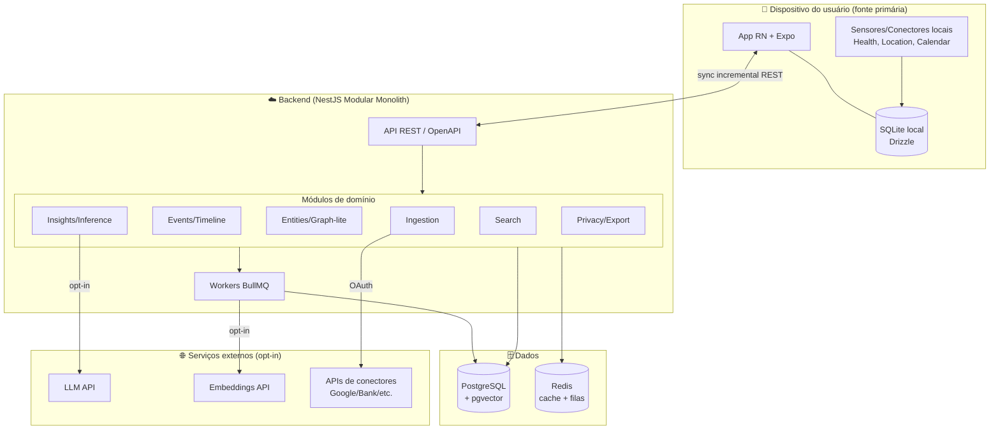
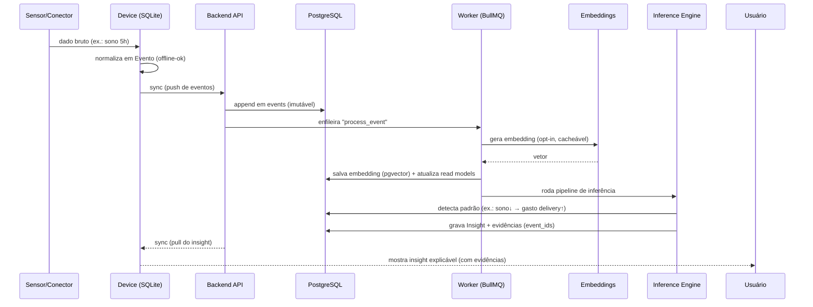
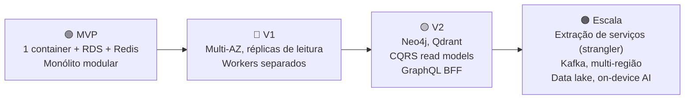

# 07 — System Architecture

> **Leia antes:** [`ATLAS_MASTER_CONTEXT.md`](ATLAS_MASTER_CONTEXT.md) · **Relacionados:** `08_Mobile`, `09_Backend`, `10_Database`, `11_Event_Model`, `12_AI_Architecture`, `24_ADRs`, `30_Final_Architecture`
> **Escopo:** visão macro do sistema inteiro — como as peças se encaixam e evoluem por fase.

---

## 1. O que é este documento e por que existe

Este documento é o **mapa de alto nível** do Atlas. Ele responde: *quais são os grandes
blocos do sistema, como conversam, onde vive cada dado, e como a arquitetura muda do MVP até a
escala global.* Os documentos `08`–`17` aprofundam cada bloco; aqui damos a visão que conecta
tudo.

Princípio que governa este documento (do Master Context §7): **arquitetura evolutiva**. Não
desenhamos a arquitetura de 10 milhões de usuários e a construímos hoje. Desenhamos a
arquitetura **mínima correta** para hoje, com **costuras** (seams) nos lugares certos para que
a evolução seja incremental e reversível.

## 2. Visão em uma imagem (MVP 🟢)



**Leitura da imagem:** o dispositivo é a fonte primária (local-first). O backend é um único
processo NestJS bem modularizado, com workers no mesmo deploy. Os dados vivem em PostgreSQL
(+pgvector) e Redis. Serviços externos (LLM, embeddings, conectores) são **opt-in** e ficam
atrás de abstrações para serem trocáveis.

## 3. Estilo arquitetural: por que **Modular Monolith** (não microserviços)

### 3.1. O que é
Um **monólito modular** é uma única aplicação deployável, internamente dividida em **módulos
com fronteiras explícitas** (cada um com sua camada de domínio, casos de uso e infraestrutura),
que se comunicam por interfaces bem definidas — não por HTTP entre processos.

### 3.2. Por que para o Atlas (fundador solo)

| Critério | Monólito Modular 🟢 | Microserviços |
|---|---|---|
| Complexidade operacional | 1 deploy, 1 log, 1 banco | N deploys, service mesh, tracing distribuído |
| Velocidade de dev (solo) | Alta (refactor local, sem versionamento de contratos) | Baixa (overhead de rede/contratos) |
| Transações | ACID trivial (mesmo banco) | Sagas/consistência eventual |
| Custo | 1 container barato | N containers + orquestração |
| Debug | Stack trace local | Correlação distribuída |
| Escala independente | ❌ (escala junto) | ✅ (por serviço) |
| Isolamento de falha | Menor | Maior |

Para um único desenvolvedor sem usuários, microserviços são **custo puro sem benefício**. O
gargalo não é escala de tráfego — é velocidade de construção. (ADR-0001)

### 3.3. Como evitar o "big ball of mud"
O risco do monólito é virar espaguete. Mitigação:
- **Fronteiras de módulo explícitas** (DDD bounded contexts — ver `09`).
- **Regra de dependência**: módulos só se comunicam por *ports* (interfaces), nunca importando
  entidades internas de outro módulo.
- **Comunicação assíncrona via eventos de domínio internos** (event bus in-process) onde faz
  sentido — o que já prepara o terreno para extração futura.

### 3.4. Evolução → 🟠 Escala
Quando (e SE) um módulo virar gargalo real, aplicamos o **Strangler Fig Pattern**: extraímos
esse módulo para um serviço separado, mantendo a interface. Como as fronteiras já são limpas, a
extração é cirúrgica. **Não extraímos por estética — só por dor medida.**

## 4. Os grandes blocos (bounded contexts)

| Bloco | Responsabilidade | Fase | Doc |
|---|---|---|---|
| **Ingestion (Conectores)** | Ler fontes (manual, Health, Location, Calendar, banco) e normalizar em Eventos | 🟢 (subset) | `08`, `11` |
| **Events / Timeline** | Persistir eventos imutáveis; servir a timeline | 🟢 | `11` |
| **Entities / Graph** | Pessoas, lugares, docs, hábitos, objetivos + relações | 🟢 (graph-lite em PG) → 🟡 (Neo4j) | `13` |
| **Search** | Busca semântica (embeddings/pgvector) + textual | 🟢 | `14` |
| **Insights / Inference** | Regras → estatística → ML → LLM; gera insights explicáveis | 🟢 (heurística) → 🟡 (ML/LLM) | `12` |
| **Privacy / Data Control** | Export, delete, consentimento, criptografia | 🟢 | `15` |
| **Identity / Auth** | JWT, OAuth de conectores, passkeys | 🟢 | `16` |
| **Sync** | Reconciliação device↔cloud | 🟢 | `08` |
| **Notifications** | Insights contextuais, lembretes | 🔵 | `08`, `19` |

## 5. Fluxo de dados end-to-end (o "hero flow")

O fluxo canônico do Atlas — **do dado bruto ao insight explicável**:



**Pontos-chave:**
1. O evento é **append-only** e imutável (base do Event Model — `11`).
2. Tudo pesado é **assíncrono** (workers), para a API responder rápido.
3. O insight sempre carrega **evidências** (os `event_ids` que o originaram) → explicabilidade.
4. LLM/embeddings são **opt-in** e cacheados → custo controlado (`12`).

## 6. Camadas lógicas (aplicadas em cada bloco)

Seguindo Clean Architecture (detalhe em `09`):

```
┌───────────────────────────────────────────┐
│  Interface (Controllers REST, DTOs)         │  ← detalhes trocáveis
├───────────────────────────────────────────┤
│  Application (Use Cases, orquestração)      │
├───────────────────────────────────────────┤
│  Domain (Entidades, regras, eventos)        │  ← coração, sem deps externas
├───────────────────────────────────────────┤
│  Infrastructure (Postgres, Redis, LLM...)   │  ← detalhes trocáveis
└───────────────────────────────────────────┘
```

**Regra de dependência:** setas apontam para dentro. O domínio não conhece Postgres nem HTTP.
Isso é o que torna a arquitetura **reversível** (trocar Postgres→outro, REST→GraphQL, sem
tocar no domínio).

## 7. Comunicação entre componentes

| Par | Mecanismo (MVP) | Evolução |
|---|---|---|
| Device ↔ Backend | REST + sync incremental | GraphQL BFF (🟡), WebSocket p/ push (🔵) |
| Módulo ↔ Módulo (interno) | Chamada direta via port + event bus in-process | Mensageria (🟠) |
| API ↔ Workers | BullMQ (Redis) | Filas dedicadas / Kafka (🟠) |
| Backend ↔ LLM/Embeddings | HTTPS atrás de `LLMProvider`/`EmbeddingProvider` | On-device (🟡) |
| Backend ↔ Conectores | OAuth2 + polling/webhooks | Streaming (🟠) |

## 8. Onde vive cada dado (data placement)

| Dado | Device | Backend (Postgres) | Externo |
|---|---|---|---|
| Eventos | ✅ (cache/local-first) | ✅ (verdade no servidor) | — |
| Embeddings | ⛔ (🟡: on-device) | ✅ (pgvector) | gerados por API |
| Insights | ✅ (cache) | ✅ | — |
| Conteúdo sensível (notas, saúde) | ✅ | ✅ (criptografado; E2EE 🟡) | só se opt-in IA |
| Segredos/tokens OAuth | Keychain/SecureStore | Vault/cifrado | — |

## 9. Atributos de qualidade (como a arquitetura os garante)

| Atributo | Como é garantido |
|---|---|
| **Privacidade** | Local-first; minimização; opt-in de IA; criptografia; export/delete (`15`) |
| **Disponibilidade** | App funciona offline; backend stateless atrás de LB (🔵) |
| **Performance** | Trabalho pesado assíncrono; read models; cache Redis; índices/pgvector |
| **Custo** | Heurística antes de LLM; cache de embeddings; boring tech (`12`, `22`) |
| **Evolutibilidade** | Fronteiras de módulo + Clean Arch + ADRs |
| **Testabilidade** | Domínio puro; ports mockáveis (`26`) |
| **Observabilidade** | Logs estruturados, Sentry, health checks; OTel (🟡) (`27`) |

## 10. Escalabilidade — o caminho por fase



- **🟢 Vertical primeiro:** um servidor maior resolve muito antes de precisar distribuir.
- **🔵 Horizontal do backend:** backend stateless → N réplicas atrás de load balancer; réplica
  de leitura no Postgres.
- **🟡 Especialização de stores:** extrair grafo (Neo4j) e vetores (Qdrant) quando o Postgres
  reclamar; introduzir CQRS (separar modelos de escrita/leitura).
- **🟠 Distribuição:** extrair serviços por gargalo; streaming; multi-região; data lake p/ ML.

## 11. Riscos arquiteturais (resumo — ver `25`)
- **Escopo grande demais cedo demais** → disciplina de fases (mitigação central).
- **Acoplamento de módulos** → regra de dependência + revisão periódica de fronteiras.
- **Lock-in em LLM/cloud** → abstrações (`LLMProvider`) + boring tech portável.
- **Sync bugs** (device↔cloud) → idempotência, tombstones, testes de sync (`08`, `26`).

## 12. Como testar a arquitetura
- Testes de fronteira: garantir que módulos não importam internals uns dos outros (lint de
  dependências / `dependency-cruiser`).
- Testes de contrato device↔API (`26`).
- "Fitness functions": métricas automatizadas de acoplamento, tempo de build, latência p95.

---

### Resumo executivo
O Atlas é, no MVP, um **monólito modular NestJS local-first** com PostgreSQL+pgvector e
Redis/BullMQ, onde o **dispositivo é a fonte primária** e a nuvem é um serviço opcional. O
fluxo herói vai **do evento imutável ao insight explicável**, com IA opt-in e cacheada. As
fronteiras de domínio limpas + Clean Architecture tornam a arquitetura **reversível e
evolutiva**: cresce por *strangler* (serviços), especialização de stores (Neo4j/Qdrant) e
distribuição (Kafka/multi-região) **somente quando a dor for medida** — nunca por estética.
