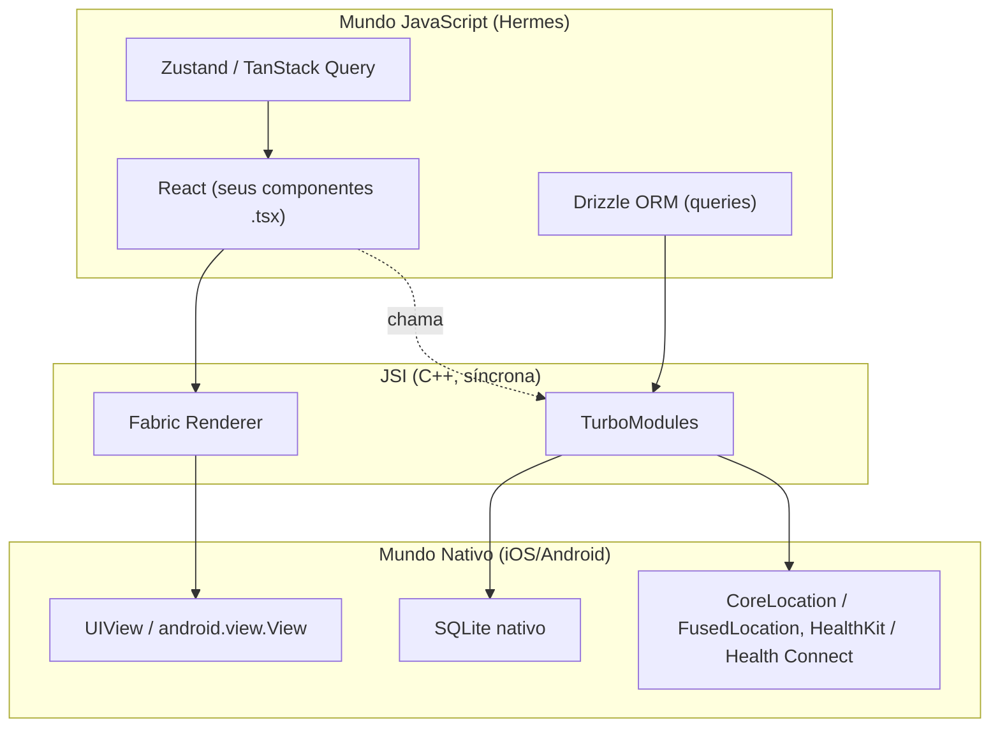
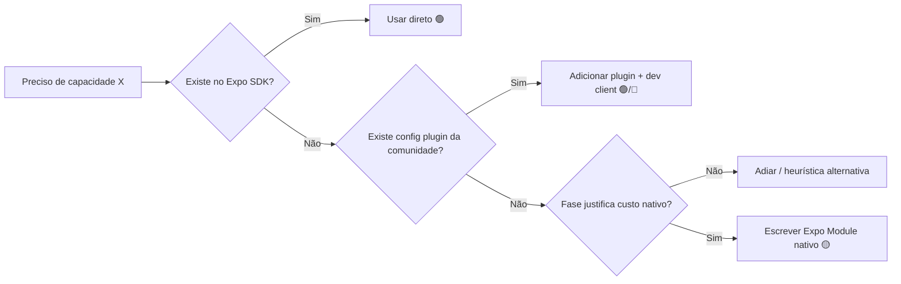
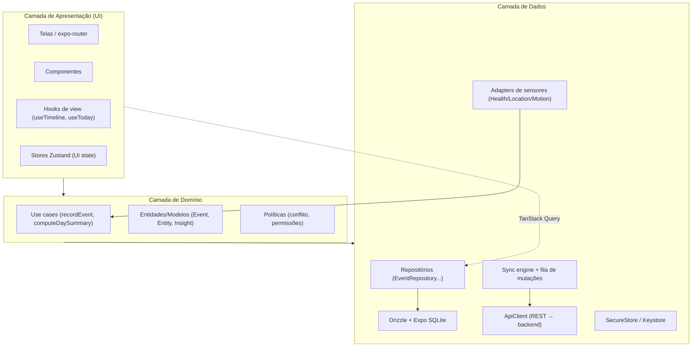
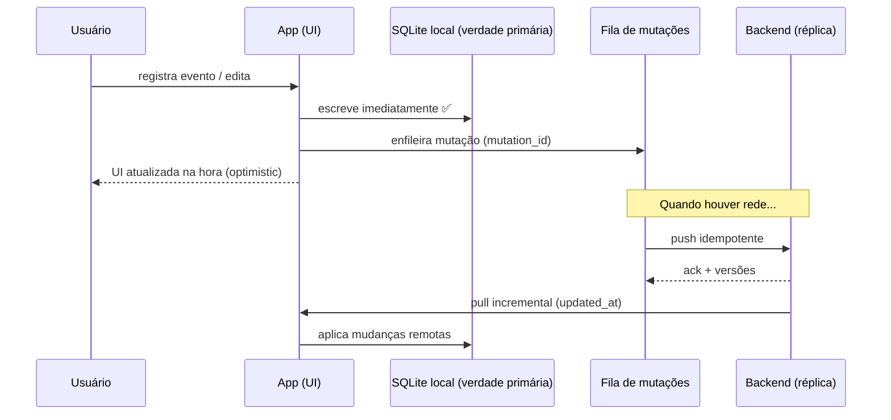
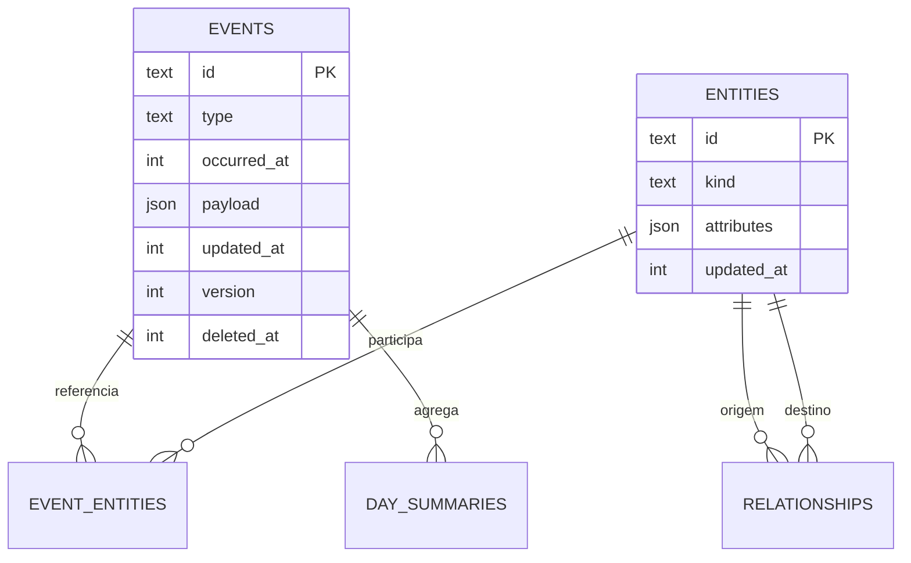
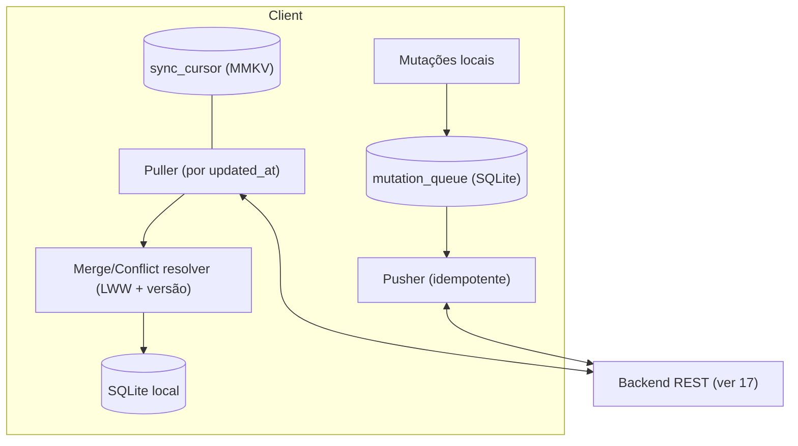
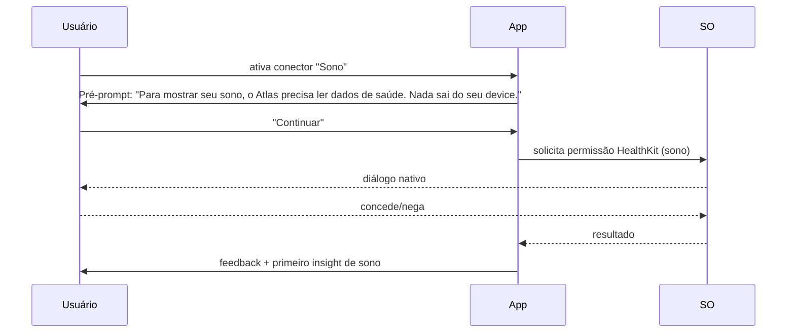
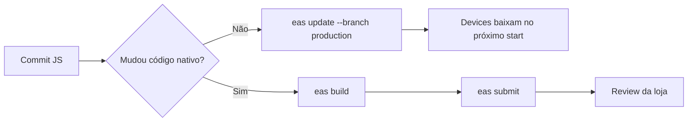

# 08 — Mobile Architecture (Arquitetura do Cliente Móvel)

> **Fase geral:** 🟢 MVP com trilhas explícitas para 🔵 V1 / 🟡 V2 / 🟠 Escala / 🔴 Pesquisa
> **Leia antes:** [`ATLAS_MASTER_CONTEXT.md`](ATLAS_MASTER_CONTEXT.md) · [`00_Project_Vision.md`](00_Project_Vision.md) · [`07_System_Architecture.md`](07_System_Architecture.md)
> **Documentos relacionados:** [`09_Backend_Architecture.md`](09_Backend_Architecture.md) · [`10_Database_Design.md`](10_Database_Design.md) · [`11_Event_Model.md`](11_Event_Model.md) · [`15_Privacy_Architecture.md`](15_Privacy_Architecture.md) · [`16_Security.md`](16_Security.md) · [`26_Testing.md`](26_Testing.md)
> **Status:** Vivo · **Versão:** 0.1 · **Última atualização:** 2026-07-20

---

## Metadados do documento

| Campo | Valor |
|---|---|
| Escopo | Cliente móvel do Atlas (iOS + Android) construído com React Native + Expo |
| Público-alvo | Fundador-desenvolvedor; banca de mestrado; entrevista Big Tech; futuros contribuidores |
| Stack fixado (ver §5.1 do Master) | React Native + Expo · TypeScript · Expo SQLite + Drizzle · Zustand + TanStack Query · Sync engine próprio · Health Connect/HealthKit · offline-first |
| Decisões-âncora impactadas | ADR-0003 (local-first + sync próprio), ADR-0009 (RN+Expo cliente único), ADR-0010 (privacidade local-first) |
| Não-objetivos deste doc | Design visual (ver `18`/`19`), regras de negócio de Insights (ver `12`), esquema do servidor (ver `10`) |

---

## Resumo executivo

O cliente móvel é **onde o Atlas ganha ou perde**. Diferente de um app CRUD, o Atlas precisa
ser um **coletor de sinais de vida** (localização, saúde, movimento), um **banco de dados
local completo** (o dispositivo é fonte primária de verdade) e uma **UI de timeline** capaz de
renderizar anos de eventos com fluidez. Este documento fixa e justifica a arquitetura mobile:

1. **React Native + Expo** é a escolha ótima para um fundador solo cujo domínio já é RN/TS,
   sem sacrificar acesso a sensores (via config plugins / dev client) — evitamos Flutter (nova
   linguagem/ecossistema), nativo puro (2× o trabalho) e KMP (imaturo no domínio do autor).
2. **Arquitetura em 3 camadas** (UI → Domínio → Dados) com `expo-router` para navegação,
   **Zustand** para estado de UI/cliente e **TanStack Query** para estado de servidor/cache
   assíncrono, sobre um **repositório** que fala com **Expo SQLite + Drizzle**.
3. **Offline-first radical:** todo dado nasce local; o app é 100% usável sem rede (objetivo T1
   da Visão). O banco local **espelha o modelo de eventos** (ver `11`).
4. **Sync engine próprio simples:** push/pull incremental por `updated_at`, **fila de mutações
   offline**, **last-write-wins com vetor de versão simples**, **tombstones** para deleção,
   **idempotência** por `mutation_id`, **backoff** exponencial. CRDT é 🔴 pesquisa, adiado
   conscientemente (ADR-0003).
5. **Background, permissões, sensores, widgets, notificações, segurança no device,
   performance, OTA e testes** recebem cada um uma seção profunda, com limites de plataforma,
   trade-offs e a fase de entrada de cada capacidade.

> **Princípio-mestre aplicado:** *"Projete como um arquiteto sênior; pense como um fundador
> solo."* Cada capacidade avançada (background nativo, widgets ricos, E2EE) tem uma **fase de
> entrada** — nada de complexidade prematura no 🟢 MVP.

---

## Índice

1. [Por que React Native + Expo](#1-por-que-react-native--expo)
2. [Arquitetura do app em camadas](#2-arquitetura-do-app-em-camadas)
3. [Navegação (expo-router)](#3-navegação-expo-router)
4. [Estado (Zustand + TanStack Query)](#4-estado-zustand--tanstack-query)
5. [Estrutura de pastas](#5-estrutura-de-pastas)
6. [Offline-first e o banco local](#6-offline-first-e-o-banco-local)
7. [Sync engine incremental](#7-sync-engine-incremental)
8. [Background e coleta periódica](#8-background-e-coleta-periódica)
9. [Modelo de permissões](#9-modelo-de-permissões)
10. [Sensores e dados de vida](#10-sensores-e-dados-de-vida)
11. [Widgets (WidgetKit / Glance)](#11-widgets-widgetkit--glance)
12. [Notificações](#12-notificações)
13. [Segurança no device](#13-segurança-no-device)
14. [Performance](#14-performance)
15. [OTA updates, build e release](#15-ota-updates-build-e-release)
16. [Testes mobile](#16-testes-mobile)
17. [Roadmap mobile por fase](#17-roadmap-mobile-por-fase)
18. [Riscos mobile e mitigações](#18-riscos-mobile-e-mitigações)

---

## 1. Por que React Native + Expo

### 1.1. O que é (definição precisa)

**React Native (RN)** é um framework que permite escrever UIs móveis em JavaScript/TypeScript
usando o modelo mental do React (componentes, hooks, estado declarativo). Diferente de um
webview, RN renderiza **componentes nativos reais** (um `<View>` vira um `UIView` no iOS e um
`android.view.View` no Android). A "cola" entre o mundo JS e o mundo nativo é feita, na
arquitetura moderna, pela **JSI (JavaScript Interface)** — uma ponte síncrona baseada em C++
que substituiu a antiga *bridge* assíncrona serializada em JSON — junto de **TurboModules**
(módulos nativos sob demanda) e **Fabric** (o novo renderer).

**Expo** é uma **plataforma e um conjunto de ferramentas** em cima do RN. Não é "RN para
iniciantes"; é infraestrutura de produção. Entrega:

- **Expo SDK:** bibliotecas nativas prontas e versionadas juntas (câmera, localização,
  notificações, SQLite, SecureStore, sensores...).
- **Config plugins + Prebuild:** geram as pastas nativas `ios/` e `android/` a partir de
  configuração declarativa (`app.config.ts`), permitindo adicionar código nativo **sem** o
  ciclo de dor do "eject" antigo.
- **EAS (Expo Application Services):** build na nuvem (**EAS Build**), atualização OTA de JS
  (**EAS Update**), submissão às lojas (**EAS Submit**).
- **Dev Client:** um app de desenvolvimento customizado que inclui seus módulos nativos —
  substitui o "Expo Go" genérico quando você precisa de nativo próprio.

### 1.2. Por que existe / que problema resolve para o Atlas

O Atlas precisa de **duas plataformas** (iOS + Android) com **paridade de features** e um
**fundador solo**. As restrições do time (Master §3) tornam a escolha quase determinística:

- Cada hora escrevendo Swift **e** Kotlin é uma hora não gasta no CMHL — o verdadeiro moat.
- O autor já domina **React Native e TypeScript** (Master §3). Domínio reduz risco de execução
  mais do que qualquer benchmark de performance.
- OTA (EAS Update) permite corrigir bugs de lógica **sem esperar review da App Store** — vital
  para um solo iterando rápido.

### 1.3. Como funciona (mecânica relevante)



- **Hermes** é o motor JS otimizado para RN (bytecode pré-compilado → *cold start* menor, menos
  memória). O Atlas usa Hermes por padrão.
- **JSI** permite chamadas quase síncronas JS↔C++, essencial para SQLite performático e para a
  nova arquitetura (Fabric + TurboModules), que o Atlas adota desde o início.

### 1.4. Alternativas e trade-offs

| Critério | **RN + Expo (escolhido)** | Flutter | Nativo puro (Swift+Kotlin) | KMP (Kotlin Multiplatform) |
|---|---|---|---|---|
| Linguagem | TypeScript (domínio do autor ✅) | Dart (nova) | Swift + Kotlin (2 linguagens) | Kotlin + Swift p/ UI |
| Reuso de código | ~95% cross-platform | ~95% | ~0% (UI duplicada) | Lógica compartilhada, UI nativa |
| Domínio do autor | **Alto** | Nenhum | Parcial | Baixo |
| Acesso a sensores | Bom (Expo + config plugins) | Bom (plugins) | **Total/imediato** | Total (é nativo) |
| OTA de lógica | **Sim (EAS Update)** | Sim (limitado) | Não (review sempre) | Não |
| Performance UI | Ótima (Fabric/Hermes) | **Ótima (Skia próprio)** | **Máxima** | Máxima |
| Ecossistema JS/npm | **Enorme** | Médio | N/A | N/A |
| Custo de contratação futura | **Alto pool RN** | Médio | Alto (2 perfis) | Baixo pool |
| Risco p/ fundador solo | **Baixo** | Médio | Alto | Alto |

**Leitura da tabela:** Flutter tem renderer próprio (Skia) e ótima performance, mas exige
aprender Dart e um ecossistema paralelo — custo de oportunidade alto sem ganho decisivo para o
Atlas. Nativo puro dá controle máximo de sensores/widgets, porém **dobra** o trabalho de UI —
inviável para solo. KMP compartilha lógica mas exige UI nativa dupla e maturidade que o autor
não tem. **RN + Expo maximiza velocidade × domínio × cobertura de features.**

### 1.5. Quando "ejetar" (prebuild / dev client) — e por que isso mudou

O antigo `expo eject` era irreversível e temido. Hoje o modelo é o **Continuous Native
Generation (CNG)**: as pastas `ios/`/`android/` são **geradas** por `expo prebuild` a partir de
`app.config.ts` + config plugins, e podem ser regeneradas. Você **não** perde o Expo ao
precisar de nativo.

- **Fique no fluxo gerenciado + dev client** enquanto os módulos nativos que você precisa
  existem no Expo SDK ou em config plugins da comunidade (é o caso do MVP: SQLite, Location,
  Notifications, SecureStore, Health).
- **Escreva um config plugin / módulo nativo (Expo Modules API)** quando precisar de algo
  ausente: WidgetKit rico (🟡), WorkManager customizado (🟡), SQLCipher com pragma específico,
  integrações de screen time.
- **Regra de decisão:** *"Só escreva Swift/Kotlin quando o valor for impossível em JS/config
  plugin e a fase justificar."* Cada módulo nativo aumenta a superfície de manutenção do solo.



> **Fase:** RN + Expo é 🟢 MVP (ADR-0009). Dev client entra assim que o primeiro módulo fora do
> Expo Go for necessário (praticamente no início, por causa de Health). Módulos nativos
> próprios são 🟡.

---

## 2. Arquitetura do app em camadas

O Atlas mobile segue **Clean Architecture pragmática** (coerente com o backend — Master §5.2),
adaptada ao tamanho de um cliente móvel. Três camadas, com a **regra de dependência apontando
para dentro**: UI depende de Domínio; Domínio não conhece UI nem detalhes de persistência.



### 2.1. Camada de UI (apresentação)

- **Responsabilidade:** renderizar estado e capturar intenção do usuário. **Zero regra de
  negócio.** Uma tela não sabe como resolver conflito de sync — ela chama um use case.
- **Ferramentas:** componentes funcionais + hooks; `expo-router` para rotas; `Zustand` para
  estado efêmero de UI (tema, filtros, seleção); `TanStack Query` para dados assíncronos.
- **Hooks de view:** encapsulam a ligação UI↔domínio (ex.: `useTimeline()` chama o repositório
  via TanStack Query e devolve dados prontos para a `FlashList`).

### 2.2. Camada de Domínio

- **Responsabilidade:** as regras que **não mudam** se trocássemos SQLite por outro banco ou
  RN por outro framework. Ex.: "um evento é imutável", "deleção gera tombstone", "conflito
  resolve por last-write-wins comparando vetor de versão".
- **Use cases:** funções puras/orquestradoras (ex.: `recordEvent(input): Event`). Recebem
  **portas** (interfaces de repositório) por injeção — nunca instanciam Drizzle diretamente.
- **Entidades:** o `Event` no cliente **espelha** o `Event` canônico do servidor (ver `11`),
  garantindo que a mesma semântica valha nos dois lados.

### 2.3. Camada de Dados

- **Responsabilidade:** persistência local, sincronização, acesso a sensores e ao backend.
- **Repositórios:** implementam as portas do domínio usando Drizzle. Escondem SQL do resto do
  app.
- **Sync engine:** ver §7. **Adapters de sensores:** ver §10. **SecureStore:** ver §13.

### 2.4. Por que essa divisão importa para o Atlas

1. **Testabilidade** (liga com `26`): o domínio é testável sem simulador — casos como resolução
   de conflito viram testes unitários rápidos.
2. **Reversibilidade** (Master §7): se um dia trocarmos Expo SQLite por WatermelonDB (🟡),
   apenas a camada de dados muda.
3. **Paridade com o backend:** o mesmo vocabulário (Event/Entity/Relationship) atravessa
   cliente e servidor, reduzindo bugs de tradução.

---

## 3. Navegação (expo-router)

### 3.1. O que é

`expo-router` é um roteador **baseado em arquivos** (file-based routing) sobre o React
Navigation. A estrutura de arquivos em `app/` **é** a árvore de rotas — inspirado no App Router
do Next.js. Suporta **deep linking** e **universal links** automaticamente (essencial para
notificações que abrem uma tela específica) e **typed routes** (rotas tipadas em TS).

### 3.2. Como funciona no Atlas

```
app/
  _layout.tsx            # Root: providers (QueryClient, tema, gate de auth/biometria)
  (auth)/
    sign-in.tsx
    unlock.tsx           # Desbloqueio biométrico (ver §13)
  (tabs)/
    _layout.tsx          # Tab bar
    index.tsx            # "Hoje" (resumo do dia)
    timeline.tsx         # Timeline de eventos (FlashList — ver §14)
    insights.tsx         # Insights explicáveis (ver 12)
    settings.tsx         # Privacidade, conectores, exportação
  event/
    [id].tsx             # Detalhe de um evento (deep link atlas://event/123)
  connectors/
    [source].tsx         # Configuração de um conector
```

- **Grupos `(auth)`/`(tabs)`** organizam sem afetar a URL.
- **Rotas dinâmicas `[id]`** casam com deep links de notificações (ex.: um insight abre
  `atlas://insight/abc`).
- **`_layout.tsx` raiz** é onde montamos os *providers* globais e o **gate de segurança** (se o
  DB está criptografado e bloqueado, redireciona para `unlock`).

### 3.3. Trade-offs

| Aspecto | expo-router | React Navigation puro |
|---|---|---|
| Deep linking | Automático por convenção | Configuração manual |
| Type-safety de rotas | Nativo (typed routes) | Manual |
| Curva | Baixa se conhece Next | Baixa (imperativo) |
| Controle fino | Bom | **Máximo** |

**Decisão:** `expo-router` (🟢) — deep linking automático e rotas tipadas reduzem bugs em
notificações contextuais (§12), que são centrais no Atlas.

---

## 4. Estado (Zustand + TanStack Query)

Uma confusão comum destrói apps: tratar **estado de servidor** como **estado de cliente**. O
Atlas separa explicitamente:

| Tipo de estado | Exemplos no Atlas | Ferramenta |
|---|---|---|
| **Estado de servidor/assíncrono** (dados que vivem no DB local/backend, precisam cache, revalidação, loading/erro) | timeline de eventos, resumo do dia, insights | **TanStack Query** |
| **Estado de cliente/UI** (efêmero, síncrono, só do app) | tema, filtros ativos, seleção múltipla, passos de onboarding | **Zustand** |

### 4.1. TanStack Query — o que é e por que

**TanStack Query** gerencia dados assíncronos: cache, deduplicação de requisições,
revalidação, estados de `loading`/`error`, invalidação e **mutations** com *optimistic
updates*. Embora seja famoso com APIs remotas, no Atlas ele também envolve o **repositório
local** — porque queries ao SQLite também são assíncronas e se beneficiam de cache e
invalidação.

```typescript
// features/timeline/useTimeline.ts
import { useInfiniteQuery } from '@tanstack/react-query';
import { eventRepository } from '@/data/repositories/eventRepository';

export function useTimeline() {
  return useInfiniteQuery({
    queryKey: ['timeline'],
    queryFn: ({ pageParam }) =>
      eventRepository.listPaged({ before: pageParam, limit: 50 }),
    initialPageParam: undefined as string | undefined,
    getNextPageParam: (lastPage) => lastPage.nextCursor,
    staleTime: 30_000,
  });
}
```

**Por que aqui:** a timeline é paginada e revalidada após cada sync — `invalidateQueries(['timeline'])`
depois de um pull remoto atualiza a UI sem código manual de reconciliação.

### 4.2. Zustand — o que é e por que

**Zustand** é um store minimalista baseado em hooks, sem boilerplate de Redux, sem providers
obrigatórios. Ideal para estado de UI global.

```typescript
// stores/uiStore.ts
import { create } from 'zustand';

type TimelineFilter = 'all' | 'health' | 'location' | 'finance';

interface UiState {
  theme: 'system' | 'light' | 'dark';
  timelineFilter: TimelineFilter;
  setTheme: (t: UiState['theme']) => void;
  setFilter: (f: TimelineFilter) => void;
}

export const useUiStore = create<UiState>((set) => ({
  theme: 'system',
  timelineFilter: 'all',
  setTheme: (theme) => set({ theme }),
  setFilter: (timelineFilter) => set({ timelineFilter }),
}));
```

### 4.3. Alternativas e trade-offs

| Ferramenta | Papel | Por que não como principal |
|---|---|---|
| Redux Toolkit | Estado global | Boilerplate alto; overkill para solo |
| Jotai/Recoil | Estado atômico | Bom, mas Zustand é mais simples e suficiente |
| Context API puro | Estado global | Re-renders difíceis de controlar em escala |
| SWR | Data fetching | TanStack Query tem mutations/infinite mais ricos |

**Decisão:** Zustand + TanStack Query (🟢, fixado no Master §5.1). Divisão limpa de
responsabilidades, mínimo boilerplate, máxima testabilidade.

---

## 5. Estrutura de pastas

Organização **por feature** (não por tipo de arquivo), o que escala melhor e mantém coesão.

```
atlas-mobile/
  app/                      # Rotas (expo-router) — camada de UI
  src/
    features/               # Verticais por domínio de UI
      timeline/
        components/
        useTimeline.ts
      today/
      insights/
      connectors/
      settings/
    domain/                 # Camada de domínio (independente de framework)
      models/               # Event, Entity, Relationship, Insight
      usecases/             # recordEvent, computeDaySummary, resolveConflict
      policies/             # lastWriteWins, permissionPolicy
      ports/                # Interfaces: EventRepositoryPort, SyncPort
    data/                   # Camada de dados
      db/
        schema.ts           # Drizzle schema (espelha eventos — ver 11)
        client.ts           # Abertura do SQLite (SQLCipher em 🔵)
        migrations/
      repositories/         # Implementações das ports
      sync/                 # Sync engine + fila de mutações (ver §7)
      sensors/              # Adapters Health/Location/Motion (ver §10)
      remote/               # ApiClient REST (ver 17)
      secure/               # SecureStore wrapper (ver §13)
    ui/                     # Design system compartilhado (ver 18)
      components/
      theme/
    lib/                    # utils, logger, datas, ids
    config/                 # env, feature flags, fases
  app.config.ts             # Config Expo + config plugins
  eas.json                  # Perfis de build/update (ver §15)
  drizzle.config.ts
  __tests__/                # ou co-localizados (ver 26)
```

**Regras:**
- `domain/` **nunca** importa de `data/` ou `app/` (só de `domain/ports`).
- `features/` compõem UI e chamam use cases; não falam SQL direto.
- `data/` é o único lugar que conhece Drizzle, sensores nativos e a rede.

---

## 6. Offline-first e o banco local

### 6.1. O que é offline-first (definição)

**Offline-first** significa que o app é projetado assumindo que **a rede é a exceção, não a
regra**. Toda leitura e escrita acontece **primeiro no banco local**; a sincronização com o
servidor é um processo de fundo, eventual e reconciliável. O oposto (online-first) trata o
servidor como fonte de verdade e o local como cache descartável.

### 6.2. Por que offline-first é inegociável no Atlas

1. **É a arquitetura de privacidade** (Master §6, `15`): se o dado nasce e pode viver no
   device, o servidor deixa de ser um ponto único de vazamento. Local-first **é** o moat de
   confiança da Visão (Tese 4).
2. **Objetivo técnico T1** (`00` §6.2): "app usável 100% offline; nuvem opcional".
3. **UX de coletor de vida:** sensores geram eventos o tempo todo (inclusive no metrô sem
   sinal). Perder eventos por falta de rede seria fatal para a completude do CMHL.
4. **Latência:** ler a timeline do SQLite local é instantâneo; depender do servidor tornaria o
   app lento e frágil.



### 6.3. Escolha do banco local: Expo SQLite + Drizzle vs alternativas

#### 6.3.1. Expo SQLite + Drizzle (escolhido 🟢)

- **Expo SQLite:** binding do SQLite (o banco embarcado mais usado do mundo, ACID, robusto)
  com API moderna, suporte a WAL, e execução via JSI (rápido).
- **Drizzle ORM:** ORM TypeScript-first, **SQL-like**, com schema tipado e migrações. Gera
  tipos a partir do schema — o autor escreve SQL que "parece SQL" com segurança de tipos.

```typescript
// data/db/schema.ts (espelha o Event canônico — ver 11)
import { sqliteTable, text, integer } from 'drizzle-orm/sqlite-core';

export const events = sqliteTable('events', {
  id: text('id').primaryKey(),               // UUID/ULID gerado no cliente
  userId: text('user_id').notNull(),
  type: text('type').notNull(),              // 'sleep.recorded', 'location.visited'...
  source: text('source').notNull(),          // 'health_connect', 'manual', 'gps'
  occurredAt: integer('occurred_at').notNull(),  // epoch ms (instante do fato)
  payload: text('payload', { mode: 'json' }).notNull(),
  // Campos de sync (ver §7):
  updatedAt: integer('updated_at').notNull(),    // epoch ms da última modificação
  version: integer('version').notNull().default(1),
  deletedAt: integer('deleted_at'),              // tombstone (soft delete)
  syncState: text('sync_state', { enum: ['synced', 'pending', 'conflict'] })
    .notNull().default('pending'),
});
```

#### 6.3.2. Tabela comparativa

| Critério | **Expo SQLite + Drizzle** | WatermelonDB | MMKV | AsyncStorage |
|---|---|---|---|---|
| Tipo | SQL relacional | ORM reativo sobre SQLite | Key-value (mmap, C++) | Key-value assíncrono |
| Consultas complexas (joins, agregações da timeline) | **Excelentes (SQL puro)** | Boas (query API própria) | Não | Não |
| Reatividade automática | Manual (via TanStack Query) | **Sim (observables)** | Não | Não |
| Sync embutido | Não (fazemos o nosso) | **Sim (protocolo próprio)** | Não | Não |
| Performance p/ milhares de eventos | **Ótima** | Ótima (lazy) | Ótima (só KV) | Ruim (JSON grande) |
| Criptografia (SQLCipher) | **Sim** (🔵) | Parcial | Sim (chave) | Não |
| Curva/controle | SQL explícito, controle total | Abstração maior | Trivial | Trivial |
| Adequação ao Atlas | **Timeline relacional + sync próprio** | Se sync ficar pesado (🟡) | Config/flags/cache pequeno | Legado — evitar |

#### 6.3.3. Decisão e uso de cada um

- **Expo SQLite + Drizzle (🟢):** store principal do CMHL local (eventos, entidades, relações,
  read models). Escolhido porque a timeline é **inerentemente relacional e analítica** (joins
  entre eventos e entidades, agregações por dia), e porque queremos **controlar o sync**
  (ADR-0003) em vez de herdar o protocolo opinativo de outra lib.
- **MMKV (🟢, complementar):** usado para **estado leve e não sensível** que precisa ser
  síncrono e rapidíssimo — feature flags, preferências de UI, cursores de sync. **Não** guarda
  dados de vida.
- **WatermelonDB (🟡):** reconsiderar **apenas se** o volume/reatividade do sync exigir; sua
  sync API própria colidiria com nosso engine, então só migraríamos com dor real (Master §5.1).
- **AsyncStorage:** **evitar** para qualquer coisa não-trivial (serializa JSON, lento e sem
  queries). MMKV o substitui.

> **Chaves e segredos** (tokens, chave do SQLCipher) **nunca** vão para SQLite/MMKV/AsyncStorage
> — vão para **SecureStore/Keychain/Keystore** (ver §13).

### 6.4. Modelagem local espelhando eventos

O banco local **espelha o modelo de eventos canônico** (`11_Event_Model.md`), com o mínimo de
campos extras necessários para sync. Princípios:

- **Eventos são imutáveis** semanticamente; edição gera nova versão/tombstone, nunca reescreve
  o passado silenciosamente.
- **Read models locais** (ex.: `day_summaries`) são **derivados** e reconstruíveis a partir de
  eventos — nunca fonte de verdade. Isso mantém coerência com o Event Sourcing "lite" do
  backend (Master §5.2; `11`).
- **Índices** essenciais: `(user_id, occurred_at)` para a timeline, `(updated_at)` para pull
  incremental, `(sync_state)` para varrer pendências, `(type, occurred_at)` para filtros.



---

## 7. Sync engine incremental

Esta é a peça técnica mais delicada do cliente e onde o Atlas escolheu **simplicidade
deliberada** (ADR-0003): um sync engine **próprio, simples**, não CRDT no MVP.

### 7.1. Requisitos e princípios

1. **Incremental:** transferir só o que mudou desde a última sincronização (por `updated_at`).
2. **Resiliente offline:** mutações feitas offline entram numa **fila durável** e são enviadas
   quando houver rede.
3. **Idempotente:** reenvios (por falha de rede) **não** duplicam dados.
4. **Conflitos resolvidos deterministicamente:** last-write-wins (LWW) com **vetor de versão
   simples** para desempate coerente.
5. **Deleção propagável:** via **tombstones** (soft delete), nunca "sumir" registros.
6. **Educado com a rede/bateria:** **backoff** exponencial + respeito a conectividade.

### 7.2. Arquitetura do engine



### 7.3. Fila de mutações offline

Toda escrita que precisa chegar ao servidor vira uma **mutação** persistida:

```typescript
// data/sync/mutationQueue.ts
export interface Mutation {
  mutationId: string;   // ULID gerado no cliente → chave de idempotência
  entity: 'event' | 'entity' | 'relationship';
  op: 'upsert' | 'delete';
  entityId: string;
  payload: unknown;     // estado desejado (para upsert)
  baseVersion: number;  // versão que o cliente tinha ao editar (p/ detectar conflito)
  createdAt: number;
  attempts: number;
  nextAttemptAt: number; // p/ backoff
}
```

- A mutação é gravada na **mesma transação SQLite** que altera o dado local → nunca há
  divergência "mudei o dado mas perdi a intenção de sync".
- Um **worker** drena a fila em ordem, respeitando `nextAttemptAt`.

### 7.4. Push idempotente

```typescript
// data/sync/pusher.ts
async function pushOne(m: Mutation, api: ApiClient): Promise<void> {
  // O servidor deduplica por mutationId (idempotência) — reenvio é seguro.
  const res = await api.post('/sync/push', {
    mutationId: m.mutationId,
    entity: m.entity,
    op: m.op,
    entityId: m.entityId,
    baseVersion: m.baseVersion,
    payload: m.payload,
  });

  if (res.status === 'applied' || res.status === 'duplicate') {
    await markSynced(m, res.newVersion, res.serverUpdatedAt);
  } else if (res.status === 'conflict') {
    await resolveConflict(m, res.serverState); // ver §7.6
  }
}
```

**Idempotência (o que é / por quê):** operação que, repetida, produz o mesmo efeito de executá-la
uma vez. Sem isso, um `POST` reenviado após timeout criaria eventos duplicados. Garantimos com
`mutationId` único; o servidor mantém um registro de IDs aplicados e responde `duplicate` a
reenvios (detalhes do lado servidor em `09`/`17`).

### 7.5. Pull incremental por `updated_at`

```typescript
// data/sync/puller.ts
async function pull(api: ApiClient): Promise<void> {
  const since = getCursor(); // último updated_at aplicado (MMKV)
  let cursor = since;
  let done = false;

  while (!done) {
    const page = await api.get('/sync/pull', { since: cursor, limit: 200 });
    await db.transaction(async (tx) => {
      for (const remote of page.changes) {
        await mergeRemote(tx, remote); // aplica com resolução de conflito
      }
    });
    cursor = page.maxUpdatedAt ?? cursor;
    done = !page.hasMore;
  }
  setCursor(cursor);
}
```

- **Cursor = `updated_at`** (não offset), evitando pular/duplicar registros quando há inserções
  concorrentes.
- **Paginação** por lotes (`limit`) evita segurar memória e permite retomar.
- **Tombstones** vêm no pull como `deletedAt` preenchido → o cliente marca o registro como
  deletado localmente (não apaga fisicamente de imediato; ver §7.7).

### 7.6. Resolução de conflitos: LWW com vetor de versão simples

**O problema:** o mesmo registro pode ser editado offline no device e, em paralelo, em outro
device ou no servidor. Ao sincronizar, quem vence?

**Estratégia escolhida (🟢):** **Last-Write-Wins** desempatado por um **vetor de versão
simples** — um contador monotônico por registro + `updated_at` como tie-breaker. Não é CRDT;
é uma heurística determinística e barata.

```typescript
// domain/policies/lastWriteWins.ts
interface Versioned { version: number; updatedAt: number; }

export function winner<T extends Versioned>(local: T, remote: T): T {
  if (remote.version !== local.version) {
    return remote.version > local.version ? remote : local;
  }
  // Mesma versão (edições concorrentes): desempata por timestamp, depois por id estável.
  return remote.updatedAt >= local.updatedAt ? remote : local;
}
```

**Por que LWW e por que "vetor simples":**
- Eventos são, por natureza, **fatos imutáveis** (Master §2): conflitos reais de conteúdo são
  raros — a maioria das "colisões" é sobre **entidades/metadados editáveis** (nome de um lugar,
  rótulo de um hábito).
- LWW é **O(1)**, sem estrutura de dados complexa, fácil de auditar e explicar (Explicabilidade
  > Mágica).
- O **vetor de versão simples** (contador por registro) evita a armadilha do "só timestamp":
  relógios de devices divergem; a versão monotônica dá ordem causal aproximada, com
  `updated_at` só como desempate final.

**Salvaguarda anti-perda:** quando a resolução **descarta** uma edição local (o remoto vence),
o engine grava o estado perdido numa tabela `conflict_log` e, se relevante ao usuário, gera um
aviso não-destrutivo. Nunca perdemos silenciosamente dados que o usuário digitou.

### 7.7. Tombstones (deleção propagável)

- **O que é:** marcador de "isto foi deletado" (`deletedAt` preenchido) que **persiste** e
  sincroniza, em vez de simplesmente remover a linha.
- **Por que:** se apagássemos a linha, um pull de outro device (que ainda tem o registro)
  poderia "ressuscitá-lo". O tombstone garante que a deleção **propague**.
- **Coleta de lixo (GC):** tombstones antigos (ex.: > 90 dias, após todos os devices terem
  sincronizado) podem ser fisicamente removidos. GC agressivo é 🟡.

### 7.8. Backoff e conectividade

```typescript
// data/sync/backoff.ts
export function nextDelay(attempts: number): number {
  const base = 2 ** attempts * 1000;          // 1s, 2s, 4s, 8s...
  const capped = Math.min(base, 5 * 60_000);  // teto 5 min
  const jitter = Math.random() * 0.3 * capped; // evita "thundering herd"
  return capped + jitter;
}
```

- Dispara sync ao **ganhar conectividade** (`@react-native-community/netinfo`), ao **abrir o
  app** (foreground) e periodicamente em background (§8).
- **Backoff exponencial com jitter** evita martelar o servidor em falhas e economiza bateria.

### 7.9. Por que NÃO CRDT no MVP — e quando reconsiderar (🔴)

**CRDT (Conflict-free Replicated Data Types)** são estruturas de dados que **mesclam edições
concorrentes sem conflito**, matematicamente convergentes (ex.: Automerge, Yjs). São a solução
"correta" para colaboração multi-device intensa e edição offline simultânea rica.

| Critério | LWW + versão simples (🟢) | CRDT (🔴 pesquisa) |
|---|---|---|
| Complexidade de implementação | Baixa | **Alta** (mesclagem, GC de histórico) |
| Overhead de storage/rede | Mínimo | **Metadados grandes** (histórico causal) |
| Perda de dados possível? | Sim (edição perdedora, mas logada) | **Não** (converge sem perda) |
| Adequação a "fatos imutáveis" | **Ótima** | Exagero |
| Custo de manutenção p/ solo | Baixo | Alto |

**Decisão (ADR-0003):** LWW no MVP. O Atlas é, primariamente, **single-user, poucos devices**;
os dados centrais são **eventos imutáveis**. CRDT resolveria um problema que **ainda não
temos**. Reconsiderar (🔴/🟡) **se e quando**: (a) colaboração real entre múltiplos usuários
num mesmo modelo, (b) edição concorrente rica de documentos/notas onde perder qualquer caractere
é inaceitável. Até lá, seria complexidade prematura (anti-objetivo do Master §3).

---

## 8. Background e coleta periódica

Coletar sinais de vida exige rodar **quando o app não está aberto**. Aqui as plataformas impõem
limites duros por bateria e privacidade — respeitá-los é obrigatório.

### 8.1. Limites de plataforma (o que é possível de verdade)

| Capacidade | iOS | Android |
|---|---|---|
| Fetch periódico oportunista | `BGAppRefreshTask` (o SO decide *quando*, ~minutos a horas, sem garantia de horário) | `WorkManager` (garantido eventualmente; mín. ~15 min p/ periódico) |
| Processamento longo | `BGProcessingTask` (à noite, no carregador) | `WorkManager` (com constraints) |
| Localização em background | `CoreLocation` (significant-change, region monitoring) — exige permissão "Always" | Foreground service / passive location |
| Execução arbitrária contínua | **Não** (o SO mata) | Restrito (Doze, App Standby) |

**Realidade:** você **não controla** o horário exato em iOS; o SO aprende os hábitos do usuário
e agenda oportunisticamente. O design precisa ser **tolerante a execuções esparsas e não
determinísticas**.

### 8.2. Ferramentas Expo

- **`expo-task-manager`:** registra "tarefas" nativas nomeadas que o SO pode invocar.
- **`expo-background-task`** (sucessor de `expo-background-fetch`): agenda fetch periódico
  oportunista.
- **`expo-location`** com `startLocationUpdatesAsync` + TaskManager: entrega de localização em
  background.

```typescript
// data/sensors/backgroundSync.ts
import * as TaskManager from 'expo-task-manager';
import * as BackgroundTask from 'expo-background-task';

const SYNC_TASK = 'atlas.background.sync';

TaskManager.defineTask(SYNC_TASK, async () => {
  try {
    await ingestPendingSensorData(); // pull leve de Health/Motion desde o último cursor
    await runSyncOnce();             // push da fila + pull incremental (§7)
    return BackgroundTask.BackgroundTaskResult.Success;
  } catch {
    return BackgroundTask.BackgroundTaskResult.Failed;
  }
});

export async function registerBackgroundSync() {
  await BackgroundTask.registerTaskAsync(SYNC_TASK, {
    minimumInterval: 15 * 60, // segundos; o SO pode espaçar mais
  });
}
```

### 8.3. Estratégia de coleta do Atlas

1. **Preferir "puxar histórico" a "escutar contínuo".** Health Connect/HealthKit **armazenam**
   os dados; quando o app acorda (foreground ou background task), ele lê **incrementalmente
   desde o último cursor**. Isso é muito mais econômico do que manter listeners ativos.
2. **Foreground boost:** ao abrir o app, faz uma coleta imediata — cobre lacunas que o
   background esparso deixou.
3. **Localização:** usar **significant-change / geofencing** (eventos discretos) em vez de GPS
   contínuo, salvo quando o usuário explicitamente ativa um modo de alta precisão.

### 8.4. Bateria (custo real e mitigação)

- GPS contínuo e wakelocks são os maiores vilões de bateria. **Mitigações:** amostragem
  adaptativa, `significant-change`, batching de escritas no SQLite, evitar acordar por
  push desnecessário.
- **Transparência:** a UI mostra o impacto estimado de cada conector/sensor (confiança >
  economia de palavras) — coerente com `15`.

### 8.5. Quando precisar de nativo (WorkManager customizado) — 🟡

Se o fetch oportunista do Expo não bastar para um caso específico (ex.: janela de coleta
garantida com constraints de rede/carga), escrevemos um **config plugin + módulo nativo** que
usa **WorkManager** (Android) diretamente. iOS continua limitado pelo SO — não há como burlar
`BGTaskScheduler`. **Fase:** 🟡, só com dor comprovada.

---

## 9. Modelo de permissões

Permissões são o **contrato de confiança** entre o usuário e o Atlas. Como o produto pede
acesso a dados profundamente íntimos, a estratégia de permissões é parte da arquitetura de
privacidade (`15`), não um detalhe de UI.

### 9.1. Modelos de iOS e Android

| Aspecto | iOS | Android |
|---|---|---|
| Concessão | Em runtime, por *purpose string* (`Info.plist`), diálogo do sistema | Em runtime (desde API 23), por permissão |
| Localização | "When In Use" → "Always" (upgrade separado, o SO pode rebaixar) | `FINE`/`COARSE` + `BACKGROUND_LOCATION` (fluxo separado) |
| Saúde | HealthKit: autorização granular por tipo; app **não sabe** se leitura foi negada (privacidade) | Health Connect: permissões por tipo de dado, revogáveis |
| Precisão aproximada | "Precise Location" toggle (usuário pode dar só aproximada) | `COARSE` vs `FINE` |
| Revogação | Usuário revoga nas Settings a qualquer momento | Idem; Android auto-revoga permissões de apps sem uso |

**Detalhe crítico do HealthKit:** por design de privacidade da Apple, o app **não consegue
distinguir** "usuário negou leitura" de "não há dados". O Atlas trata ausência de dados como
ausência — nunca insiste nem infere negação.

### 9.2. Boas práticas: just-in-time (JIT)

**Nunca** pedir todas as permissões no onboarding. Pedimos **no momento em que o valor fica
óbvio** (just-in-time), com um **pré-prompt (priming)** explicando o porquê **antes** de
disparar o diálogo do sistema (que só pode ser mostrado uma vez de forma útil em iOS).



**Regras de ouro:**
1. **Contexto antes do prompt:** explicar valor + garantia de privacidade.
2. **Granularidade:** pedir só o tipo de dado necessário para a feature ativada.
3. **Degradação graciosa:** negar uma permissão **não** quebra o app; a feature específica fica
   indisponível com CTA claro para reativar.
4. **Respeitar o "não":** não re-perguntar de forma insistente; oferecer reativação nas
   Settings.
5. **Precisão mínima suficiente:** se aproximada resolve, não pedir precisa.

### 9.3. Purpose strings (config)

```ts
// app.config.ts (trecho)
ios: {
  infoPlist: {
    NSHealthShareUsageDescription:
      'O Atlas lê seus dados de saúde para construir insights privados sobre sono, atividade e bem-estar. Tudo fica no seu dispositivo.',
    NSLocationWhenInUseUsageDescription:
      'O Atlas usa sua localização para registrar lugares que você visita e gerar insights de rotina.',
    NSLocationAlwaysAndWhenInUseUsageDescription:
      'Com localização em segundo plano, o Atlas registra visitas automaticamente, mesmo com o app fechado.',
  },
},
```

> **Fase:** modelo de permissões JIT é 🟢 MVP. É barato e define a percepção de confiança desde
> o primeiro uso.

---

## 10. Sensores e dados de vida

Os conectores de sensor transformam sinais do mundo em **Eventos** (Master §2). Cada adapter
vive em `data/sensors/` e **normaliza** para o modelo canônico (`11`).

### 10.1. Localização / GPS

**O que dá para ler:** posição (lat/long/precisão), foreground e background, monitoramento de
região (**geofencing**) e mudanças significativas.

| Modo | Precisão | Bateria | Uso no Atlas |
|---|---|---|---|
| Foreground (`watchPositionAsync`) | Alta | Alta | Sessões ativas (ex.: "gravar trajeto") |
| Significant-change / background | Média | **Baixa** | Detecção passiva de visitas (padrão 🟢) |
| Geofencing (region monitoring) | Discreta (entrar/sair) | Baixa | "casa/trabalho/academia" → eventos `location.visited` |

- **Estratégia:** por padrão, **passiva e barata** (significant-change + geofencing). Alta
  precisão só sob ação explícita.
- **Detecção de visita:** clusterizar pontos em *stay points* (parou N minutos num raio R) →
  gera `location.visited` com place inferido. Isso reduz ruído e privacidade (guardamos o
  "lugar visitado", não o rastro contínuo bruto — minimização, `15`).

```typescript
// data/sensors/locationAdapter.ts
import * as Location from 'expo-location';

export async function startPassiveVisits() {
  const { status } = await Location.requestBackgroundPermissionsAsync();
  if (status !== 'granted') return;
  await Location.startGeofencingAsync('atlas.geofences', savedRegions);
  // handler (TaskManager) transforma enter/exit em eventos location.visited
}
```

### 10.2. Motion / pedômetro

- **O que dá para ler:** passos, distância, contagem de andares, atividade inferida
  (andando/correndo/de carro) via `expo-sensors` (`Pedometer`) e Core Motion / Activity
  Recognition.
- **Uso:** eventos `activity.recorded` (passos por intervalo); insumo para correlações
  cross-domain (ex.: passos × humor).
- **Custo:** o pedômetro é **coprocessador de movimento** dedicado (baixíssimo consumo) — barato
  ler histórico.

### 10.3. Health Connect (Android) e HealthKit (iOS)

Estes são os **conectores de saúde de maior valor** do MVP (Master §5.1).

| Aspecto | HealthKit (iOS) | Health Connect (Android) |
|---|---|---|
| O que lê | Sono, passos, FC, HRV, treinos, peso, energia, nutrição... | Sono, passos, FC, treinos, etc. (schema padronizado) |
| Modelo de permissão | Granular por tipo; app não sabe se leitura foi negada | Granular por tipo; revogável |
| Leitura incremental | *Anchored queries* (âncora = cursor) | Consulta por intervalo + token de mudança |
| Escrita | Possível (não prioritário no MVP) | Possível |
| Background delivery | `enableBackgroundDelivery` (sono/treino) | Via WorkManager + leitura por intervalo |
| Disponibilidade | iOS nativo | App/SDK separado (Android 14+ nativo; antes via app) |

- **Integração via config plugin:** usar bibliotecas maduras (ex.: `react-native-health` /
  `expo-health-connect` / config plugins) — requer **dev client** (não roda no Expo Go).
- **Padrão de leitura:** **incremental por âncora/cursor** (não reler tudo). Cada amostra vira
  um Evento normalizado (`sleep.recorded`, `heartrate.recorded`), com `source` = `healthkit`/
  `health_connect` para rastreabilidade (Explicabilidade > Mágica).
- **Sincronização:** os eventos de saúde entram no mesmo pipeline offline-first + sync (§6–§7).

```typescript
// data/sensors/healthAdapter.ts (pseudo-ilustrativo)
export async function ingestSleepSince(anchor?: string): Promise<{ nextAnchor: string }> {
  const { samples, nextAnchor } = await Health.queryAnchored({
    type: 'sleepAnalysis',
    anchor,
  });
  await db.transaction(async (tx) => {
    for (const s of samples) {
      await eventRepository.upsert(tx, toSleepEvent(s)); // normaliza → Event canônico (ver 11)
    }
  });
  return { nextAnchor };
}
```

### 10.4. Screen time — limitações de API

- **iOS:** o framework **Screen Time / DeviceActivity (Family Controls)** é **fortemente
  restrito** — pensado para controle parental, exige entitlement especial da Apple, e **não**
  expõe dados de uso de forma livre para apps de terceiros lerem e sincronizarem. Uso genérico
  para o CMHL é, na prática, **inviável** no MVP.
- **Android:** `UsageStatsManager` permite ler tempo de uso por app, mas requer a permissão
  especial `PACKAGE_USAGE_STATS` (o usuário concede numa tela de sistema separada), o que gera
  atrito.
- **Decisão:** screen time é **fora do MVP** (🟡/🔴 dependendo de viabilidade e apetite de
  atrito). No MVP, se necessário, aceitamos **entrada manual/estimativa** em vez de depender de
  APIs restritas. Documentado como limitação conhecida.

### 10.5. Tabela-síntese de sensores por fase

| Sensor/Fonte | Valor | Fase | Notas |
|---|---|---|---|
| Localização (passiva/geofence) | Alto | 🟢 | Visitas, rotina |
| Pedômetro/Motion | Médio-alto | 🟢 | Barato, correlações |
| HealthKit/Health Connect (sono, passos, FC) | **Alto** | 🟢 | Requer dev client |
| Localização de alta precisão (trajetos) | Médio | 🔵 | Sob ação explícita |
| Nutrição/peso/HRV avançado | Médio | 🔵 | Mais tipos de saúde |
| Screen time | Médio | 🟡/🔴 | APIs restritas |
| Áudio/ambiente | — | 🔴 | Privacidade/pesquisa |

---

## 11. Widgets (WidgetKit / Glance)

### 11.1. O que é e por que importa

Widgets são superfícies fora do app (home screen, lock screen) que mostram informação
glanceável. Para o Atlas, um widget "Seu dia num olhar" (sono da noite, passos, próxima
sugestão) aumenta engajamento sem abrir o app — reforça o hábito diário (North Star: insights
por semana).

### 11.2. Realidade técnica com RN/Expo

**Widgets são código nativo, não RN.** WidgetKit (iOS, SwiftUI) e Glance (Android, Jetpack
Compose) rodam em **processos próprios**, com orçamento de execução restrito. **Não** dá para
renderizar componentes React dentro deles.

O padrão viável:
1. O app RN **escreve os dados do widget** num armazenamento compartilhado:
   - iOS: **App Group** + `UserDefaults`/arquivo compartilhado.
   - Android: `SharedPreferences`/DataStore lidos pelo Glance.
2. O widget nativo **lê** esse armazenamento e renderiza (SwiftUI/Compose).
3. Um **config plugin** injeta a extension/target nativa no prebuild.

| Abordagem | Esforço | Riqueza | Fase |
|---|---|---|---|
| Widget estático simples (dados escritos pelo app) via config plugin (ex.: `@bacons/apple-targets` / plugins de widget) | Médio | Boa | 🔵 |
| Widget interativo/rico com deep links e timelines dinâmicas | Alto (Swift/Kotlin) | Alta | 🟡 |
| Live Activities (iOS) / notificações contínuas | Alto | Alta | 🟡 |

### 11.3. Decisão

- **MVP (🟢):** **sem widgets** — foco em coleta + timeline + insights dentro do app.
- **V1 (🔵):** widget **read-only** simples ("hoje"), alimentado por App Group/DataStore.
- **V2 (🟡):** widgets ricos/interativos e Live Activities, com módulos nativos dedicados.

> **Justificativa de fase:** widget exige código nativo por plataforma e manutenção contínua —
> valor real, mas não prova a tese. Entra quando há hábito de uso para reforçar (🔵).

---

## 12. Notificações

### 12.1. Locais vs push

| Tipo | Origem | Rede necessária | Uso no Atlas |
|---|---|---|---|
| **Locais** | Agendadas no device (`expo-notifications`) | **Não** | Lembretes, insights gerados on-device, resumos diários |
| **Push (remotas)** | Servidor → APNs/FCM (via Expo Push) | Sim | Insights que dependem de processamento no servidor; multi-device |

### 12.2. Estratégia do Atlas (privacidade primeiro)

Como o Atlas é **local-first** e muitos insights simples são calculados no device (heurística
antes de LLM — Master §5.4), **preferimos notificações locais** no MVP:

- **Nada de conteúdo sensível no payload de push.** Se um dia usarmos push, o payload é um
  **gatilho vazio/opaco** ("Novo insight disponível"), e o **conteúdo real é buscado localmente**
  ou renderizado a partir do DB local. O servidor/APNs/FCM **nunca** veem "você dormiu 4h" no
  texto.
- **Notificações contextuais/insights** são agendadas localmente com base em regras (ex.:
  "resumo do dia às 21h", "detectamos um padrão de sono"), respeitando janelas de silêncio.

```typescript
// features/insights/notify.ts
import * as Notifications from 'expo-notifications';

export async function scheduleDailySummary(hour = 21) {
  await Notifications.scheduleNotificationAsync({
    content: {
      title: 'Seu resumo do dia',
      body: 'Toque para ver seus insights de hoje.', // sem dado sensível no texto
      data: { route: 'insights' },                    // deep link (§3)
    },
    trigger: { hour, minute: 0, repeats: true },
  });
}
```

### 12.3. Boas práticas

- **Permissão JIT:** pedir permissão de notificação após o usuário optar por um lembrete/resumo,
  não no primeiro segundo.
- **Frequência com respeito:** poucas, valiosas. Notificação de baixa qualidade destrói
  confiança e retenção.
- **Deep link:** cada notificação abre a tela exata (via `data.route`) — casa com `expo-router`.
- **Conteúdo privado:** no iOS, marcar conteúdo como sensível para respeitar preview na lock
  screen.

> **Fase:** notificações locais + resumos = 🟢/🔵. Push remoto opaco = 🔵/🟡 (só quando
> processamento no servidor gerar insights que valem uma notificação e multi-device exigir).

---

## 13. Segurança no device

O device guarda o CMHL — o ativo mais sensível do produto. Segurança no cliente é parte da
arquitetura de privacidade (`15`) e de segurança (`16`).

### 13.1. SecureStore / Keychain / Keystore

- **O que é:** armazenamento protegido por hardware para **segredos pequenos** (tokens JWT,
  chave de criptografia do DB, chaves de conector). `expo-secure-store` usa **Keychain** (iOS)
  e **Keystore/EncryptedSharedPreferences** (Android), com respaldo do **Secure Enclave/TEE**.
- **Regra:** segredos **nunca** em SQLite, MMKV ou AsyncStorage.

```typescript
// data/secure/secrets.ts
import * as SecureStore from 'expo-secure-store';

export const secrets = {
  set: (k: string, v: string) =>
    SecureStore.setItemAsync(k, v, {
      keychainAccessible: SecureStore.WHEN_UNLOCKED_THIS_DEVICE_ONLY,
      requireAuthentication: false, // true para chaves que exigem biometria a cada uso
    }),
  get: (k: string) => SecureStore.getItemAsync(k),
  del: (k: string) => SecureStore.deleteItemAsync(k),
};
```

### 13.2. Criptografia do DB local (SQLCipher)

- **O que é:** **SQLCipher** é uma extensão do SQLite que criptografa **todo o arquivo do
  banco** (AES-256) de forma transparente. Sem a chave, o arquivo `.db` é ruído — protege
  contra extração física do device / backup indevido.
- **Como no Atlas:** a **chave** é gerada no primeiro uso, guardada no **SecureStore** (protegida
  por hardware/biometria), e passada ao abrir o SQLite. Isso liga criptografia (arquivo) +
  segredo (chave em enclave) + biometria (desbloqueio).

```typescript
// data/db/client.ts (ilustrativo)
import * as SQLite from 'expo-sqlite';
import { secrets } from '@/data/secure/secrets';

export async function openEncryptedDb() {
  const key = (await secrets.get('atlas.db.key')) ?? (await provisionDbKey());
  const db = await SQLite.openDatabaseAsync('atlas.db');
  await db.execAsync(`PRAGMA key = '${key}';`);  // SQLCipher
  await db.execAsync('PRAGMA journal_mode = WAL;');
  return db;
}
```

> **Nota de implementação:** SQLCipher no Expo pode exigir config plugin/build específico
> (dev client). **Fase:** DB criptografado é **🔵** (o MVP pode começar sem cifrar o arquivo,
> mas com segredos já no SecureStore); dado o valor de privacidade, **priorizar cedo** no 🔵.

### 13.3. Biometria (gate de acesso)

- **`expo-local-authentication`:** Face ID / Touch ID / biometria Android para **desbloquear o
  app** e/ou liberar a chave do DB.
- **Fluxo:** ao abrir (cold start ou após timeout em background), a rota `unlock` (§3) exige
  biometria antes de liberar acesso ao CMHL.

```typescript
import * as LocalAuthentication from 'expo-local-authentication';

export async function unlockAtlas(): Promise<boolean> {
  const has = await LocalAuthentication.hasHardwareAsync();
  if (!has) return true; // fallback: PIN do app (🔵)
  const res = await LocalAuthentication.authenticateAsync({
    promptMessage: 'Desbloqueie o Atlas',
  });
  return res.success;
}
```

### 13.4. Boas práticas adicionais

- **Certificate pinning** (🟡) para o ApiClient (defesa contra MITM).
- **Ofuscar/limpar dados sensíveis** em snapshots de background (iOS: blur overlay ao ir para
  background) para não vazar na *app switcher*.
- **Sem logs de PII;** logger redige dados sensíveis (liga com `15`/`16`).
- **Detecção de root/jailbreak** (🟡): avisar/limitar em devices comprometidos.

---

## 14. Performance

A timeline pode conter **anos de eventos** (dezenas/centenas de milhares). Performance de lista
e *cold start* definem a percepção de qualidade.

### 14.1. Listas grandes: FlashList + virtualização

- **O problema:** `FlatList` cria/descarta views e pode engasgar com listas enormes e itens
  heterogêneos (a timeline mistura tipos de evento).
- **A solução:** **FlashList** (Shopify) — renderiza só o visível (**virtualização**) e
  **recicla** views por tipo, reduzindo drasticamente memória e *jank*.

```typescript
// features/timeline/TimelineList.tsx
import { FlashList } from '@shopify/flash-list';

export function TimelineList({ items }: { items: TimelineItem[] }) {
  return (
    <FlashList
      data={items}
      renderItem={({ item }) => <TimelineRow item={item} />}
      estimatedItemSize={88}
      getItemType={(item) => item.type} // reciclagem por tipo → menos re-layout
      keyExtractor={(item) => item.id}
    />
  );
}
```

**Boas práticas de lista:**
- `getItemType` por tipo de evento (recicla views semelhantes).
- Itens **memoizados** (`React.memo`) e handlers estáveis (`useCallback`).
- **Paginação por cursor** (§4.1) — nunca carregar tudo na memória.
- Imagens: cache/downsampling (`expo-image`).

### 14.2. Consultas eficientes

- **Índices** cobrindo os padrões de acesso (§6.4): `(user_id, occurred_at)` para paginação.
- **Read models locais** (agregações por dia) evitam recomputar em cada render (coerente com
  `11`).
- **Batch** de escritas em transações (importante durante ingestão de sensores).

### 14.3. Memória

- Evitar segurar listas grandes em estado; deixar o SQLite paginar.
- Cuidar de *retained closures* e listeners de sensor (sempre desregistrar).
- Usar Hermes (menor footprint) — padrão.

### 14.4. Cold start

- **Hermes + bytecode** reduz o tempo de inicialização do JS.
- **Adiar trabalho pesado:** abrir DB e rodar sync **após** o primeiro frame; mostrar UI
  esquelética.
- **Lazy loading** de rotas pesadas (`expo-router` faz code splitting por rota).
- **Não** rodar migrações longas no boot da UI; fazê-las em background com feedback.

### 14.5. Ferramentas de medição

- **React DevTools Profiler**, **Flipper/Hermes profiler**, **Sentry Performance** (liga com
  observabilidade do Master §5.5). Medir antes de otimizar.

> **Fase:** FlashList + virtualização + índices = 🟢 (a timeline é feature central do MVP).
> Otimizações finas de cold start e memória = contínuas (🔵+).

---

## 15. OTA updates, build e release

### 15.1. EAS Update (OTA) — o que é e por quê

**EAS Update** entrega **atualizações do bundle JS/assets** direto ao app **sem passar pela
review da loja**. Como RN executa JS sobre binário nativo, mudanças que **não** tocam código
nativo podem ser publicadas OTA.

- **Ganho para o solo:** corrigir bug de lógica/UI em minutos, não dias.
- **Limite duro:** mudanças **nativas** (novo módulo, nova permissão, upgrade de SDK) **exigem
  novo build** e submissão à loja. OTA **não** substitui review para código nativo (e violar
  isso quebra políticas das lojas).



### 15.2. Runtime version e compatibilidade

- **`runtimeVersion`** amarra um update OTA ao binário nativo compatível. Um bundle JS que
  espera um módulo nativo ausente **não** deve chegar a um binário antigo — o runtime version
  previne isso.
- **Canais/branches** (`eas.json`): `development`, `preview`, `production` — updates são
  direcionados por canal.

### 15.3. EAS Build

- Builds na nuvem para iOS/Android sem manter toolchain local (útil no Windows do autor, que não
  compila iOS localmente).
- **Perfis** (`eas.json`): dev client, preview (internal), production.

```json
// eas.json (esqueleto)
{
  "build": {
    "development": { "developmentClient": true, "distribution": "internal" },
    "preview": { "distribution": "internal", "channel": "preview" },
    "production": { "channel": "production", "autoIncrement": true }
  },
  "submit": { "production": {} }
}
```

### 15.4. Versionamento

- **SemVer** para a versão do app (`version` no `app.config.ts`).
- **`autoIncrement`** para build number.
- **Migrações de DB versionadas** (Drizzle): cada release que muda schema traz migração
  idempotente e testada (ligado a §16/`26`) — cuidado redobrado, pois OTA pode entregar JS que
  espera um schema novo; a migração roda no cliente no boot.

> **Regra de segurança de OTA:** nunca publicar OTA que exija schema/migração incompatível com o
> binário instalado sem casar `runtimeVersion`. Testar update em canal `preview` antes de
> `production`.

**Fase:** EAS Build/Update/Submit = 🟢 (parte do fluxo desde o dia 1).

---

## 16. Testes mobile

> Estratégia completa em [`26_Testing.md`](26_Testing.md); aqui, o recorte mobile.

### 16.1. Pirâmide de testes do cliente

| Camada | O que testa | Ferramenta | Fase |
|---|---|---|---|
| **Unitário** | Domínio puro: LWW/conflito, políticas, normalização de eventos, backoff | Jest / Vitest | 🟢 |
| **Integração** | Repositórios + Drizzle contra SQLite (em memória), fila de mutações, migrações | Jest + expo-sqlite | 🟢 |
| **Componente** | Componentes/telas isolados | React Native Testing Library | 🟢/🔵 |
| **E2E** | Fluxos reais no simulador/emulador (onboarding, registrar evento, sync) | Maestro / Detox | 🔵 |

### 16.2. Focos críticos (onde bugs doem mais)

1. **Sync engine (§7):** testes determinísticos de conflito (LWW), idempotência (reenvio da
   mesma mutação não duplica), tombstones (deleção propaga), retomada de pull por cursor. Isto
   é **o coração** — merece a maior densidade de testes.
2. **Migrações de DB:** aplicar migração sobre um banco populado de versão anterior sem perda.
3. **Offline↔online:** simular perda/retorno de rede e verificar convergência.
4. **Permissões negadas:** app degrada sem crash.

```typescript
// __tests__/sync/lww.test.ts
import { winner } from '@/domain/policies/lastWriteWins';

test('remoto com versão maior vence', () => {
  const local  = { id: 'a', version: 2, updatedAt: 100 };
  const remote = { id: 'a', version: 3, updatedAt: 50 };
  expect(winner(local, remote)).toBe(remote);
});

test('mesma versão desempata por updatedAt', () => {
  const local  = { id: 'a', version: 2, updatedAt: 200 };
  const remote = { id: 'a', version: 2, updatedAt: 150 };
  expect(winner(local, remote)).toBe(local);
});
```

### 16.3. Determinismo

- **Injetar relógio e gerador de IDs** (não usar `Date.now()`/random direto no domínio) → testes
  reprodutíveis de sync/backoff.
- **SQLite em memória** para integração rápida em CI (GitHub Actions — Master §5.5).

---

## 17. Roadmap mobile por fase

| Capacidade | 🟢 MVP | 🔵 V1 | 🟡 V2 | 🟠 Escala | 🔴 Pesquisa |
|---|---|---|---|---|---|
| RN + Expo + TS, dev client | ✅ | | | | |
| Camadas (UI/Domínio/Dados), expo-router | ✅ | | | | |
| Zustand + TanStack Query | ✅ | | | | |
| Expo SQLite + Drizzle (offline-first) | ✅ | | (WatermelonDB se doer) | | |
| Sync próprio (LWW + fila + tombstones + backoff) | ✅ | endurecer | | | CRDT |
| Health Connect / HealthKit, Location, Motion | ✅ | +tipos | | | |
| Permissões JIT + priming | ✅ | | | | |
| Background fetch (Expo Task Manager) | ✅ | | WorkManager nativo | | |
| Notificações locais + resumos | ✅ | push opaco | Live Activities | | |
| SecureStore + biometria | ✅ | +SQLCipher, PIN | cert pinning, anti-root | | |
| FlashList + virtualização + índices | ✅ | | | dados massivos | |
| EAS Build/Update/Submit | ✅ | canais maduros | | | |
| Testes unit/integração de sync | ✅ | +componente | +E2E (Detox/Maestro) | | |
| Widgets | | read-only | ricos/interativos | | |
| Screen time | | | (se viável) | | on-device usage AI |
| On-device AI (inferência local) | | | | | ✅ |

**Sequência recomendada (fundador solo):**
1. Esqueleto RN+Expo + camadas + SQLite/Drizzle + timeline local (offline puro).
2. Conectores 🟢 (Health, Location, Motion) → eventos reais.
3. Sync engine (§7) ligando ao backend (`09`) — com testes densos.
4. Permissões JIT, notificações locais, biometria/SecureStore.
5. Endurecimento (SQLCipher 🔵), performance, OTA maduro, widget read-only.

---

## 18. Riscos mobile e mitigações

| Risco | Impacto | Prob. | Mitigação | Fase |
|---|---|---|---|---|
| Background esparso perde coletas (iOS não garante horário) | Lacunas no CMHL | Alta | Ler histórico incremental de Health (dados persistem no SO) + foreground boost | 🟢 |
| Bateria excessiva por GPS | Desinstalação | Média | Significant-change/geofencing; amostragem adaptativa; transparência | 🟢 |
| Bug no sync duplica/corrompe dados | Perda de confiança | Média | Idempotência por `mutationId`; testes determinísticos; `conflict_log` | 🟢 |
| Vazamento por device roubado | Catastrófico | Baixa | SQLCipher + SecureStore + biometria | 🔵 |
| OTA incompatível com binário | App quebrado no campo | Média | `runtimeVersion`; testar em canal preview; migrações versionadas | 🟢 |
| Loja rejeita por permissões amplas | Bloqueio de release | Média | Purpose strings claros; JIT; pedir só o necessário | 🟢 |
| Health/Location APIs mudarem | Conector quebra | Média | Adapters isolados; entrada manual como fallback | 🔵 |
| Complexidade prematura (CRDT/widgets ricos cedo) | Atraso do MVP | Média | Disciplina de fases; LWW + adiar nativo | 🟢 |

---

## Cross-links

- **Modelo de eventos que o cliente espelha:** [`11_Event_Model.md`](11_Event_Model.md)
- **Contraparte servidor do sync (push/pull, idempotência, read models):** [`09_Backend_Architecture.md`](09_Backend_Architecture.md)
- **Esquema de dados e read models (Postgres):** [`10_Database_Design.md`](10_Database_Design.md)
- **Privacidade (minimização, E2EE, LGPD/GDPR, threat model):** [`15_Privacy_Architecture.md`](15_Privacy_Architecture.md)
- **Segurança (auth, ataques, proteções):** [`16_Security.md`](16_Security.md)
- **Estratégia de testes completa:** [`26_Testing.md`](26_Testing.md)
- **Decisões formais:** ADR-0003 (sync próprio), ADR-0009 (RN+Expo), ADR-0010 (local-first) em `24_ADRs.md`.

---

### Resumo executivo (fecho)

O cliente móvel do Atlas é um **coletor de sinais de vida + banco local completo + UI de
timeline**, construído em **React Native + Expo/TypeScript** por ser a escolha que maximiza
velocidade e domínio do fundador sem sacrificar acesso a sensores (via config plugins/dev
client). A arquitetura é **offline-first radical** sobre **Expo SQLite + Drizzle**, com estado
dividido entre **Zustand** (UI) e **TanStack Query** (assíncrono), navegação por **expo-router**
e um **sync engine próprio simples** (push/pull incremental por `updated_at`, fila de mutações
idempotente, LWW com vetor de versão, tombstones, backoff) — **CRDT fica como 🔴 pesquisa**,
adiado por disciplina (ADR-0003). Sensores (Health Connect/HealthKit, Location, Motion),
permissões **just-in-time**, background oportunista, notificações **locais e privadas**,
segurança no device (**SecureStore + SQLCipher + biometria**) e performance de lista
(**FlashList + virtualização**) recebem tratamento profundo, cada capacidade com sua **fase de
entrada**. OTA/build via **EAS** e uma **pirâmide de testes** centrada no sync fecham o ciclo,
garantindo um app privado, evolutivo e defensável — coerente com a Visão e o Master Context.

_Fim do documento 08._
