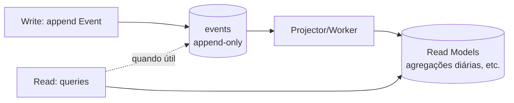

# 09 — Backend Architecture

> **Leia antes:** [`ATLAS_MASTER_CONTEXT.md`](ATLAS_MASTER_CONTEXT.md) · **Relacionados:** `07_System`, `10_Database`, `11_Event_Model`, `12_AI`, `17_API`, `24_ADRs`
> **Stack fixado:** NestJS (Modular Monolith) · TypeScript · Clean Architecture + DDD · Event Sourcing "lite" · Redis + BullMQ · PostgreSQL.

---

## 1. Objetivo do documento

Detalhar **como o backend é organizado por dentro**: framework, camadas, módulos, padrões de
escrita/leitura de dados, filas, workers e a evolução até CQRS/Event Sourcing completos. Cada
decisão vem com o *porquê*, alternativas e a fase em que a complexidade entra.

## 2. Por que NestJS

### 2.1. O que é
NestJS é um framework Node.js opinativo (inspirado no Angular) com **injeção de dependência**,
módulos, decorators e forte suporte a TypeScript. Ele impõe estrutura — o que é bom para manter
Clean Architecture sem reinventar a roda.

### 2.2. Por que (vs Express puro, Fastify, ou outras linguagens)

| Critério | NestJS | Express puro | Go/Rust |
|---|---|---|---|
| Estrutura/DI | ✅ nativa | ❌ (você monta tudo) | varia |
| Curva p/ o autor | ✅ (já domina) | ✅ | ❌ (nova linguagem) |
| Ecossistema TS | ✅ | ✅ | menor p/ este caso |
| Performance | Boa (usa Express/Fastify) | Boa | Excelente |
| Produtividade solo | ✅ Alta | Média | Baixa (curva) |

**Decisão:** NestJS. O autor já domina, a DI facilita Clean Architecture/testes, e performance
não é gargalo no MVP. Trocar de linguagem por performance é otimização prematura clássica.
(ADR-0001)

> **Nota sobre performance:** NestJS pode rodar sobre **Fastify** em vez de Express com uma
> linha de config, ganhando throughput quando necessário — sem reescrever nada. Boa "costura".

## 3. Clean Architecture + DDD no NestJS

### 3.1. Por que Clean Architecture
Isola o **domínio** (regras de negócio) de **detalhes** (banco, HTTP, LLM). Benefícios:
- Testar regras sem subir banco.
- Trocar Postgres→Neo4j, REST→GraphQL, OpenAI→outro LLM **sem tocar no domínio**.
- Código que comunica intenção de negócio, não detalhe técnico.

Custo: mais arquivos/indireção. Mitigação: aplicar com **pragmatismo** — não criar interface
para tudo, só para as fronteiras que realmente mudam (banco, serviços externos).

### 3.2. As camadas (por módulo)

```
modules/events/
├── domain/                 # PURO. Sem imports de infra.
│   ├── event.entity.ts     # Entidade/agregado + invariantes
│   ├── event-type.vo.ts    # Value Objects
│   └── event.repository.ts # PORT (interface) — não a implementação
├── application/            # Casos de uso (orquestração)
│   ├── ingest-event.usecase.ts
│   └── get-timeline.usecase.ts
├── infrastructure/         # ADAPTERS (implementações)
│   ├── prisma-event.repository.ts   # implementa a interface do domínio
│   └── event.mapper.ts
└── interface/              # Entrada
    ├── events.controller.ts         # REST
    └── dto/
```

**Regra de dependência (a mais importante):** `interface → application → domain ← infrastructure`.
O domínio não importa nada de fora. A infraestrutura **implementa** interfaces definidas no
domínio (inversão de dependência).

### 3.3. DDD — conceitos aplicados

| Conceito DDD | O que é | No Atlas |
|---|---|---|
| **Bounded Context** | Fronteira de um modelo/linguagem | Cada módulo (Events, Entities, Insights...) |
| **Aggregate** | Cluster de objetos com invariantes, 1 raiz | `Event`, `Entity`, `Insight` |
| **Value Object** | Objeto imutável sem identidade | `EventType`, `GeoPoint`, `TimeRange` |
| **Domain Event** | Algo relevante que ocorreu | `EventIngested`, `InsightGenerated` |
| **Repository** | Abstração de persistência | `EventRepository` (port) |
| **Domain Service** | Regra que não pertence a 1 entidade | `EntityResolutionService` |
| **Anti-Corruption Layer** | Traduz modelos externos | Conectores traduzem APIs externas → Eventos |

> **Nível de DDD no MVP:** *tactical DDD pragmático*. Não fazemos event storming formal nem
> sagas. Usamos agregados, VOs, repositórios e eventos de domínio internos — o suficiente para
> clareza, sem cerimônia.

## 4. Estrutura de módulos (bounded contexts)

```
src/
├── modules/
│   ├── identity/        # auth, usuários, tokens
│   ├── ingestion/       # conectores → eventos (Anti-Corruption Layer)
│   ├── events/          # timeline, eventos imutáveis
│   ├── entities/        # pessoas, lugares, docs (graph-lite)
│   ├── search/          # embeddings + busca (pgvector)
│   ├── insights/        # pipeline de inferência
│   └── privacy/         # export, delete, consentimento
├── shared/              # kernel: tipos, erros, event-bus, utils
│   ├── domain/          # Result, DomainEvent, base classes
│   └── infrastructure/  # prisma, redis, logger, config
└── main.ts
```

**Comunicação entre módulos:** via **event bus in-process** (ex.: NestJS `EventEmitter` ou um
`DomainEventDispatcher` próprio) e/ou chamadas por ports. Nunca importar entidades internas de
outro módulo. Isso mantém baixo acoplamento e prepara extração futura (🟠).

## 5. Persistência: ORM

### 5.1. Prisma vs Drizzle vs TypeORM

| Critério | Prisma | Drizzle | TypeORM |
|---|---|---|---|
| DX / type-safety | ✅ excelente | ✅ excelente (SQL-like) | média |
| Domínio do autor | ✅ | parcial | parcial |
| Migrations | ✅ maduro | ✅ | ok |
| Controle de SQL/raw (p/ pgvector, CTEs) | médio (`$queryRaw`) | ✅ ótimo | ok |
| Edge/bundle | pesado | leve | pesado |

**Decisão backend:** **Prisma** (autor domina, DX ótima), usando `$queryRaw` para queries
especiais (pgvector, CTEs recursivas de grafo). **No mobile**, usamos **Drizzle** (leve, roda
bem em Expo SQLite — ver `08`). Aceitar dois ORMs é ok: contextos diferentes, cada um o melhor
para o seu.

> **Alternativa considerada:** Drizzle no backend também (unificaria com o mobile). Trade-off:
> Prisma é mais produtivo para o autor hoje. Reversível — ADR-registrável se mudarmos.

## 6. O padrão de escrita: **Event Sourcing "lite"** (ADR-0002)

Este é o coração do backend. Vale entender a fundo.

### 6.1. O que é Event Sourcing (ES)
Em ES, você **não guarda só o estado atual** — você guarda a **sequência imutável de eventos**
que levaram a esse estado. O estado é uma *projeção* (fold/reduce) dos eventos.

Analogia: um extrato bancário (lista de transações = eventos) vs só o saldo (estado). Com o
extrato você recalcula qualquer saldo passado e audita tudo; só com o saldo, você perdeu a
história.

### 6.2. Por que faz sentido no Atlas
O Atlas **é literalmente** um sistema de eventos da vida. O Event Model (`11`) já é uma timeline
imutável. Então ES não é forçado — é o modelo natural:
- **Auditável / explicável:** todo insight aponta para os eventos-fonte.
- **Reprocessável:** melhorou o algoritmo de inferência? Reprocessa os eventos e gera insights
  melhores, sem perder nada.
- **Time-travel:** "como estava meu CMHL em março?" é uma projeção até aquela data.

### 6.3. Por que "lite" (e não ES completo)
ES completo (com event store dedicado, versionamento de eventos, sagas, snapshots formais,
CQRS obrigatório) é **complexo** e cheio de armadilhas (versionamento de schema de eventos,
eventual consistency em toda leitura). Para um fundador solo, é overkill no MVP.

**Nossa versão "lite":**
- Tabela `events` **append-only** no PostgreSQL (a fonte da verdade dos fatos).
- **Read models** (projeções) materializados em outras tabelas Postgres, atualizados por
  workers ao ingerir eventos.
- **Sem** framework de ES, **sem** CQRS estrito, **sem** sagas. Leituras podem ir direto às
  tabelas de estado quando conveniente.



### 6.4. Evolução → 🟡 ES + CQRS formais
Introduzimos CQRS estrito (modelos de escrita e leitura separados, com barramento de eventos e
projeções versionadas) **quando**: (a) as leituras ficarem complexas/lentas a ponto de exigir
modelos dedicados, ou (b) precisarmos escalar leitura e escrita independentemente. Ver `11`.

### 6.5. CQRS — o que é (para ter o vocabulário)
**Command Query Responsibility Segregation**: separar o modelo que **muda** estado (commands)
do modelo que **lê** estado (queries), possivelmente com bancos/otimizações diferentes.
Vantagem: cada lado escala e otimiza sozinho. Custo: consistência eventual + mais código. Por
isso é 🟡, não 🟢.

## 7. Processamento assíncrono: Redis + BullMQ

### 7.1. Por que filas
Trabalho pesado (gerar embeddings, rodar inferência, chamar LLM, sincronizar conectores)
**não pode** bloquear a request HTTP. Filas permitem:
- Responder rápido ao cliente; processar depois.
- **Retry** com backoff em falhas (APIs externas caem).
- Controle de **taxa** (respeitar rate limits de LLM/embeddings → controla custo).
- Suavizar picos.

### 7.2. O que é BullMQ
Biblioteca de filas para Node baseada em Redis. Oferece jobs, prioridades, repeatable jobs
(cron), rate limiting, retries, DLQ (dead-letter). O autor já domina.

### 7.3. Filas do Atlas (MVP)

| Fila | Job | Gatilho | Notas |
|---|---|---|---|
| `ingestion` | puxar dados de conector | cron/OAuth webhook | rate-limit por provider |
| `embedding` | gerar/atualizar embedding | novo evento/conteúdo | idempotente por hash; cache |
| `inference` | rodar pipeline de insights | após projeção/lote | heurística→ML→LLM |
| `projection` | atualizar read models | novo evento | idempotente |
| `notification` | enviar notificação | insight relevante | 🔵 |

### 7.4. Workers: mesmo processo vs separados
- **🟢 MVP:** workers rodam no **mesmo deploy** (processo/container) da API — mais simples.
- **🔵/🟠:** separar workers em processos/containers dedicados quando CPU/memória de background
  competir com a API. A costura já existe (BullMQ é agnóstico a onde o worker roda).

### 7.5. Idempotência (crucial)
Jobs podem rodar mais de uma vez (retries, at-least-once). Todo handler deve ser **idempotente**:
- Embeddings: chave = hash do conteúdo → se já existe, pula.
- Projeções: usar `event_id` processados / `upsert` determinístico.
- Ingestão: dedupe por `(source, external_id)`.

## 8. Tratamento de erros e resultado

- Domínio usa um tipo **`Result<T, E>`** (ou exceptions de domínio tipadas) — erros de negócio
  não são exceptions genéricas.
- Interface (controllers) traduz erros para **RFC 7807 (problem+json)** — ver `17`.
- Falhas de infra (LLM, banco) → retries/circuit breaker nas camadas de infraestrutura.

## 9. Configuração, segredos e multi-tenant

- **Config** via `@nestjs/config` + validação de env (Zod/Joi) no boot (falha rápido).
- **Segredos** nunca no código; env/secret manager (ver `27`). Tokens OAuth de conectores
  cifrados em repouso (ver `15`).
- **Multi-tenant:** cada usuário é um tenant lógico. Todo dado tem `user_id`; **toda query é
  escopada por `user_id`** (guard/interceptor central + Row-Level Security no Postgres na 🟡).
  O autor já conhece SaaS multi-tenant. Ver `10` e `16` (isolamento e IDOR).

## 10. Observabilidade (resumo — ver `27`)
- Logs estruturados (pino) com `requestId`/`userId` correlacionados.
- Sentry para exceptions. Health checks (`/health`) para liveness/readiness.
- Métricas de fila (jobs processados, falhos, latência) — BullMQ expõe.
- OpenTelemetry (tracing) entra na 🟡.

## 11. Testes (resumo — ver `26`)
- Domínio: unitário puro (rápido, sem I/O).
- Casos de uso: unitário com ports mockados.
- Infra/integração: Postgres real via Testcontainers.
- API: e2e com supertest.
- Filas: testar idempotência e retries.

## 12. Roadmap do backend por fase

| Fase | O que entra |
|---|---|
| 🟢 MVP | Monólito modular, Clean Arch, ES-lite, BullMQ no mesmo deploy, Prisma, REST |
| 🔵 V1 | Workers separados, passkeys, notificações, réplica de leitura |
| 🟡 V2 | CQRS/ES formais onde doer, GraphQL BFF, Neo4j/Qdrant como stores especializados |
| 🟠 Escala | Extração de serviços (strangler), Kafka, multi-região, RLS/isolamento reforçado |

---

### Resumo executivo
O backend é um **monólito modular NestJS** com **Clean Architecture + DDD pragmático**,
persistindo fatos como **eventos append-only (Event Sourcing "lite")** no PostgreSQL e derivando
**read models** via workers **BullMQ**. As fronteiras de módulo e a regra de dependência tornam
tudo **testável e reversível**. Complexidades caras (CQRS/ES formais, GraphQL, extração de
serviços, stores especializados) têm **gatilhos de entrada explícitos** nas fases 🟡/🟠 — nunca
no MVP. É a maior potência de engenharia que um fundador solo consegue manter e evoluir.
