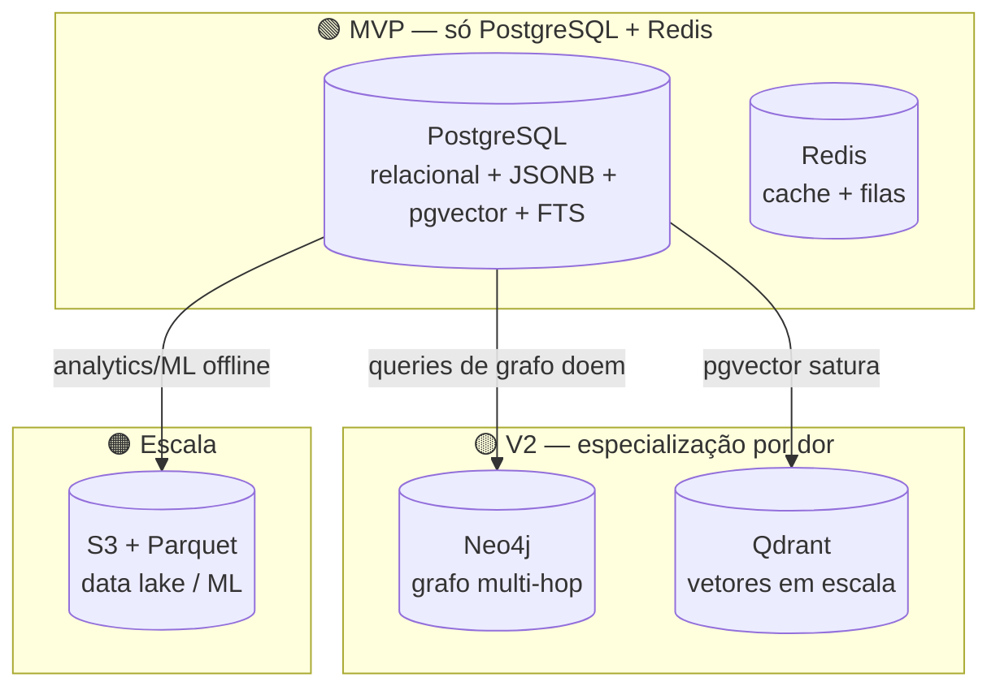

# 10 — Database Design

> **Leia antes:** [`ATLAS_MASTER_CONTEXT.md`](ATLAS_MASTER_CONTEXT.md) · **Relacionados:** `09_Backend`, `11_Event_Model`, `13_Knowledge_Graph`, `14_Vector_Search`, `15_Privacy`
> **Decisões fixadas:** PostgreSQL como store primário no MVP; pgvector para busca semântica; Neo4j (🟡) e Qdrant (🟡) adiados; Redis para cache/filas.

---

## 1. Objetivo

Definir **como os dados do Atlas são modelados e armazenados**, por que PostgreSQL é o centro
de gravidade, como o grafo e os vetores começam dentro dele, e quando (e por quê) adicionar
Neo4j, Qdrant e um data lake. Modelagem completa com schema, índices, trade-offs e evolução.

## 2. Filosofia de dados: "um banco até doer"

Princípio (Master Context §5.3): **começar com PostgreSQL para quase tudo** e só introduzir
bancos especializados quando houver **dor medida**. Cada banco adicional é: mais infra, mais
backup, mais um ponto de falha, mais uma coisa para um fundador solo operar. Postgres moderno é
absurdamente capaz — faz relacional, JSON (JSONB), full-text, vetores (pgvector), grafo-lite
(CTEs recursivas), filas, geo (PostGIS). (ADR-0004, ADR-0007, ADR-0008)



## 3. Por que PostgreSQL (vs MySQL, Mongo, etc.)

| Critério | PostgreSQL | MySQL | MongoDB |
|---|---|---|---|
| JSONB (flexível) | ✅ excelente | ok | ✅ (é o modelo) |
| Extensões (pgvector, PostGIS, ltree) | ✅ | ❌ | limitado |
| Integridade relacional / ACID | ✅ forte | ✅ | fraca (multi-doc) |
| CTEs recursivas (grafo-lite) | ✅ | limitado | ❌ |
| Full-text search | ✅ | ok | ✅ |
| Domínio do autor | ✅ | ✅ | parcial |

**Decisão:** PostgreSQL. A combinação **JSONB + pgvector + CTE recursiva + FTS** dá, num único
banco, tudo que o MVP precisa (documentos flexíveis, vetores, grafo-lite, busca). É o melhor
custo-benefício para um fundador solo. Mongo perderia integridade cross-domain; MySQL perderia
extensões-chave.

## 4. Modelagem central (MVP)

O núcleo é **event-centric** (ver `11`). Entidades principais: `users`, `events`, `entities`,
`relationships`, `embeddings`, `insights`, `connectors`, mais read models.

### 4.1. Diagrama (ER simplificado)

```mermaid
erDiagram
    USERS ||--o{ EVENTS : owns
    USERS ||--o{ ENTITIES : owns
    USERS ||--o{ INSIGHTS : owns
    USERS ||--o{ CONNECTORS : configures
    EVENTS ||--o{ EVENT_ENTITIES : references
    ENTITIES ||--o{ EVENT_ENTITIES : referenced_by
    ENTITIES ||--o{ RELATIONSHIPS : from
    ENTITIES ||--o{ RELATIONSHIPS : to
    EVENTS ||--o{ EMBEDDINGS : has
    ENTITIES ||--o{ EMBEDDINGS : has
    INSIGHTS ||--o{ INSIGHT_EVIDENCE : cites
    EVENTS ||--o{ INSIGHT_EVIDENCE : evidences
```

### 4.2. Schema (SQL essencial)

> Simplificado para clareza; tipos/constraints reais no código de migração (Prisma).

```sql
-- Extensões
CREATE EXTENSION IF NOT EXISTS pgcrypto;   -- gen_random_uuid()
CREATE EXTENSION IF NOT EXISTS vector;     -- pgvector

-- Usuários (tenant lógico)
CREATE TABLE users (
  id            uuid PRIMARY KEY DEFAULT gen_random_uuid(),
  email         text UNIQUE NOT NULL,
  created_at    timestamptz NOT NULL DEFAULT now()
);

-- EVENTOS: fonte da verdade, APPEND-ONLY (ver doc 11)
CREATE TABLE events (
  id            uuid PRIMARY KEY DEFAULT gen_random_uuid(),
  user_id       uuid NOT NULL REFERENCES users(id),
  type          text NOT NULL,              -- ex.: 'sleep.recorded'
  source        text NOT NULL,              -- ex.: 'health_connect' | 'manual'
  external_id   text,                       -- id na fonte (dedupe)
  occurred_at   timestamptz NOT NULL,       -- quando o fato aconteceu
  ingested_at   timestamptz NOT NULL DEFAULT now(),
  payload       jsonb NOT NULL,             -- dados específicos do tipo
  UNIQUE (user_id, source, external_id)     -- idempotência de ingestão
);

-- ENTIDADES: nós do grafo (pessoas, lugares, docs, hábitos, objetivos...)
CREATE TABLE entities (
  id            uuid PRIMARY KEY DEFAULT gen_random_uuid(),
  user_id       uuid NOT NULL REFERENCES users(id),
  kind          text NOT NULL,             -- 'person'|'place'|'document'|'habit'|'goal'|'topic'
  name          text NOT NULL,
  attributes    jsonb NOT NULL DEFAULT '{}',
  created_at    timestamptz NOT NULL DEFAULT now(),
  updated_at    timestamptz NOT NULL DEFAULT now()
);

-- RELAÇÕES: arestas do grafo (grafo-lite dentro do Postgres)
CREATE TABLE relationships (
  id            uuid PRIMARY KEY DEFAULT gen_random_uuid(),
  user_id       uuid NOT NULL REFERENCES users(id),
  from_id       uuid NOT NULL REFERENCES entities(id),
  to_id         uuid NOT NULL REFERENCES entities(id),
  type          text NOT NULL,             -- 'works_at'|'lives_in'|'friend_of'...
  properties    jsonb NOT NULL DEFAULT '{}',
  created_at    timestamptz NOT NULL DEFAULT now()
);

-- Ligação evento <-> entidade (quais entidades um evento menciona)
CREATE TABLE event_entities (
  event_id      uuid NOT NULL REFERENCES events(id),
  entity_id     uuid NOT NULL REFERENCES entities(id),
  role          text,                       -- 'actor'|'location'|'topic'...
  PRIMARY KEY (event_id, entity_id, role)
);

-- EMBEDDINGS: busca semântica (pgvector) — dimensão depende do modelo
CREATE TABLE embeddings (
  id            uuid PRIMARY KEY DEFAULT gen_random_uuid(),
  user_id       uuid NOT NULL REFERENCES users(id),
  owner_type    text NOT NULL,             -- 'event'|'entity'|'insight'
  owner_id      uuid NOT NULL,
  content_hash  text NOT NULL,             -- cache: mesmo conteúdo, mesmo vetor
  model         text NOT NULL,             -- versão do modelo de embedding
  embedding     vector(1536) NOT NULL,     -- dimensão do modelo escolhido
  created_at    timestamptz NOT NULL DEFAULT now(),
  UNIQUE (owner_type, owner_id, model)
);

-- INSIGHTS: conhecimento derivado, explicável
CREATE TABLE insights (
  id            uuid PRIMARY KEY DEFAULT gen_random_uuid(),
  user_id       uuid NOT NULL REFERENCES users(id),
  kind          text NOT NULL,             -- 'correlation'|'pattern'|'summary'
  title         text NOT NULL,
  body          text NOT NULL,
  confidence    real,                       -- 0..1
  method        text NOT NULL,             -- 'rule'|'stats'|'ml'|'llm'
  status        text NOT NULL DEFAULT 'active',
  created_at    timestamptz NOT NULL DEFAULT now()
);

-- EVIDÊNCIAS: rastreabilidade insight -> eventos (explicabilidade)
CREATE TABLE insight_evidence (
  insight_id    uuid NOT NULL REFERENCES insights(id),
  event_id      uuid NOT NULL REFERENCES events(id),
  weight        real,
  PRIMARY KEY (insight_id, event_id)
);

-- CONECTORES: config e tokens (cifrados) por usuário
CREATE TABLE connectors (
  id            uuid PRIMARY KEY DEFAULT gen_random_uuid(),
  user_id       uuid NOT NULL REFERENCES users(id),
  provider      text NOT NULL,             -- 'google_calendar'|'health_connect'...
  status        text NOT NULL,
  credentials   bytea,                      -- cifrado (ver doc 15/16)
  cursor        jsonb,                      -- estado de sync incremental
  created_at    timestamptz NOT NULL DEFAULT now()
);
```

### 4.3. Por que `payload jsonb` nos eventos (schema-on-read)
Cada tipo de evento (`sleep.recorded`, `transaction.made`, `location.visited`) tem campos
diferentes. Modelar cada tipo em sua própria tabela seria dezenas de tabelas e migrações a cada
novo conector.

- **JSONB** dá flexibilidade (adicionar tipos sem migração) + indexação (GIN) + queries
  (`payload->>'duration'`).
- **Trade-off:** menos validação no banco. Mitigação: validar payload por tipo na **camada de
  aplicação** (schemas Zod por tipo de evento) — schema-on-write no app, schema-on-read no DB.
- **Quando extrair para colunas/tabela própria:** se um campo do payload vira alvo constante de
  query/índice pesado (ex.: valor de transação para agregações), promovê-lo a coluna gerada
  (`GENERATED ALWAYS AS (payload->>'amount')::numeric`) ou tabela de read model.

## 5. Índices (o que, por quê)

| Índice | Coluna(s) | Motivo |
|---|---|---|
| B-tree | `events(user_id, occurred_at)` | timeline por usuário ordenada por tempo (query mais comum) |
| B-tree | `events(user_id, type, occurred_at)` | filtrar por tipo (ex.: só sono) |
| GIN | `events USING gin(payload)` | queries dentro do JSONB |
| Único | `events(user_id, source, external_id)` | idempotência/dedupe |
| HNSW | `embeddings USING hnsw(embedding vector_cosine_ops)` | busca vetorial rápida (ANN) — ver `14` |
| B-tree | `relationships(user_id, from_id)` / `(user_id, to_id)` | travessia do grafo |
| GIN | full-text em conteúdo textual | busca lexical (híbrida com vetorial) |

> **Regra:** criar índice para query real medida, não por antecipação. Índices custam escrita e
> espaço. Mas os acima são previsíveis o suficiente para o MVP.

## 6. Grafo dentro do PostgreSQL (grafo-lite) — ver `13`

Relações vivem em `entities` + `relationships`. Consultas multi-hop usam **CTE recursiva**:

```sql
-- "Pessoas conectadas a mim até 2 saltos"
WITH RECURSIVE reachable AS (
  SELECT to_id AS entity_id, 1 AS depth
  FROM relationships
  WHERE user_id = $1 AND from_id = $2
  UNION ALL
  SELECT r.to_id, rc.depth + 1
  FROM relationships r
  JOIN reachable rc ON r.from_id = rc.entity_id
  WHERE rc.depth < 2 AND r.user_id = $1
)
SELECT DISTINCT e.* FROM reachable rc JOIN entities e ON e.id = rc.entity_id;
```

**Limite:** CTEs recursivas ficam lentas/complicadas em travessias profundas (3+ hops, pathfinding,
"amigos em comum" em larga escala). É o **gatilho** para Neo4j (🟡, ADR-0007). Ver `13`.

## 7. Vetores dentro do PostgreSQL (pgvector) — ver `14`

`embeddings.embedding vector(1536)` + índice **HNSW** dá busca por similaridade sem infra extra:

```sql
SELECT owner_id, 1 - (embedding <=> $query_vec) AS similarity
FROM embeddings
WHERE user_id = $1 AND owner_type = 'event'
ORDER BY embedding <=> $query_vec   -- <=> = distância de cosseno
LIMIT 10;
```

**Limite/gatilho para Qdrant (🟡, ADR-0008):** quando (a) volume de vetores por usuário/total
crescer a ponto de a latência/uso de memória do HNSW no Postgres degradar, ou (b) precisarmos
de filtragem por payload sofisticada + escala. Detalhes e números em `14`.

## 8. Read models / projeções (ES-lite) — ver `11`

Para leituras rápidas, mantemos tabelas derivadas (atualizadas por workers):

```sql
-- Ex.: agregação diária de sono (projeção)
CREATE TABLE rm_daily_sleep (
  user_id   uuid NOT NULL,
  day       date NOT NULL,
  total_min integer NOT NULL,
  quality   real,
  PRIMARY KEY (user_id, day)
);
```

Projeções são **descartáveis e recomputáveis** a partir de `events` (fonte da verdade). Se a
lógica mudar, `TRUNCATE` + reprocessa.

## 9. Redis — papel

| Uso | Detalhe |
|---|---|
| **Filas (BullMQ)** | Jobs de ingestão, embedding, inferência, projeção (ver `09`) |
| **Cache** | Read models quentes, resultados de LLM/insight, rate-limit counters |
| **Locks** | Locks distribuídos leves (ex.: evitar duas syncs simultâneas do mesmo conector) |

Redis é **efêmero por design** — nunca é fonte de verdade. Pode ser recriado.

## 10. Multi-tenant e isolamento

- Toda tabela de dados tem `user_id`. Toda query é escopada por `user_id` (na aplicação).
- **🟡 Row-Level Security (RLS)** no Postgres como defesa em profundidade: políticas que impedem
  ler linhas de outro `user_id` mesmo com bug na aplicação. Custo: complexidade de setup; por
  isso é 🟡. Ver `16` (IDOR) e `15`.

## 11. Migrações, backup, retenção

- **Migrações:** Prisma Migrate, versionadas no git, rodadas no deploy (ver `27`). Nunca editar
  migração aplicada; sempre nova migração.
- **Backup:** snapshots automáticos do RDS + PITR (point-in-time recovery). Testar restore.
- **Retenção/deleção:** deleção real por usuário (LGPD/GDPR) — cascata a partir de `users` +
  remoção de embeddings/derivados. Ver `15`.
- **Criptografia em repouso:** habilitada no RDS; conteúdo sensível cifrado em nível de app;
  E2EE é 🟡. Ver `15`/`16`.

## 12. Performance e escala do Postgres

| Fase | Ação |
|---|---|
| 🟢 | Índices certos; connection pooling (PgBouncer); `EXPLAIN ANALYZE` nas queries quentes |
| 🔵 | Réplica de leitura; particionar `events` por tempo (range partitioning) quando crescer |
| 🟡 | Extrair grafo→Neo4j e vetores→Qdrant; CQRS read models dedicados |
| 🟠 | Sharding por `user_id` (Citus/particionamento); data lake p/ analytics; arquivamento |

> **Particionamento de `events` por tempo** é a alavanca natural: eventos antigos são
> quentes para leitura raramente; particionar por mês/ano mantém índices pequenos e permite
> arquivar/descartar partições frias.

## 13. Riscos (ver `25`)
- **JSONB sem disciplina** → dados inconsistentes. Mitigação: validação Zod por tipo.
- **Adicionar Neo4j/Qdrant cedo demais** → complexidade operacional para solo dev. Mitigação:
  gatilhos explícitos.
- **Vazamento cross-tenant** → bug de escopo. Mitigação: guard central + RLS (🟡) + testes.
- **Custo/latência de pgvector** em crescimento → monitorar; migrar a Qdrant no gatilho.

## 14. Como testar (ver `26`)
- Testes de integração com Postgres real (Testcontainers), incluindo CTEs recursivas e queries
  pgvector.
- Testes de idempotência de projeções (reprocessar não duplica).
- Testes de isolamento multi-tenant (usuário A nunca vê dados de B).

---

### Resumo executivo
O Atlas usa **PostgreSQL como store primário único no MVP**, explorando **JSONB** (eventos
flexíveis), **pgvector** (busca semântica), **CTEs recursivas** (grafo-lite) e **FTS** — evitando
a complexidade operacional de múltiplos bancos para um fundador solo. **Redis** cuida de filas e
cache. O modelo é **event-centric e append-only**, com **read models recomputáveis**. Bancos
especializados (**Neo4j** para grafo profundo, **Qdrant** para vetores em escala, **data lake**
para ML) têm **gatilhos de dor explícitos** nas fases 🟡/🟠 — nunca antes.
