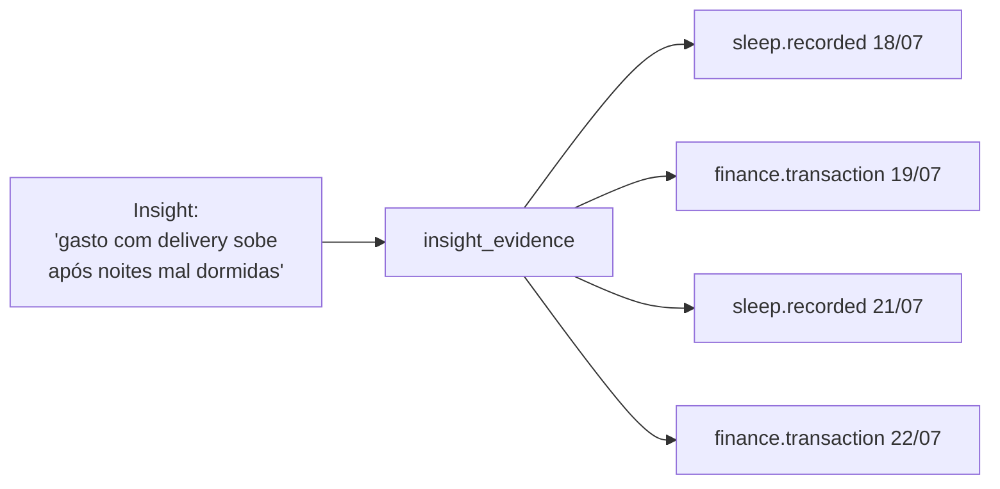

# 11 — Event Model

> **Leia antes:** [`ATLAS_MASTER_CONTEXT.md`](ATLAS_MASTER_CONTEXT.md) · **Relacionados:** `07_System`, `09_Backend`, `10_Database`, `12_AI`, `13_Knowledge_Graph`
> **Conceito central do produto.** Se você só puder ler um doc técnico, leia este + `12`.

---

## 1. Por que o Evento é a unidade atômica do Atlas

Toda a tese do Atlas (Master Context §1) depende de uma escolha de modelagem: **representar a
vida como uma sequência de eventos imutáveis**. Um Evento é um *fato que aconteceu*. A vida,
computacionalmente, é um fluxo de fatos: você dormiu, se moveu, gastou, encontrou alguém,
escreveu uma nota, treinou.

Se conseguirmos capturar esses fatos de forma **uniforme, imutável e cross-domain**, então
tudo mais (timeline, grafo, insights, busca, IA) são **derivações** desse fluxo. Essa é a razão
de o Atlas ser *event-centric* e usar **Event Sourcing "lite"** (ver `09` §6).

> **A grande sacada:** produtos como Google Timeline (só localização) ou apps de sono (só sono)
> modelam eventos de **um** domínio. O Atlas modela eventos de **todos** os domínios no **mesmo
> formato**, tornando possível correlacioná-los. O formato único é o que gera o valor
> cross-domain.

## 2. Anatomia de um Evento

Um Evento no Atlas tem uma **envelope** (metadados uniformes) + um **payload** (dados
específicos do tipo). Ver schema em `10` §4.2.

```jsonc
{
  "id": "uuid",
  "user_id": "uuid",
  "type": "sleep.recorded",        // taxonomia hierárquica (domínio.fato)
  "source": "health_connect",      // de onde veio
  "external_id": "hc_20260719_01", // id na fonte → dedupe/idempotência
  "occurred_at": "2026-07-19T23:40:00-03:00", // quando o FATO aconteceu
  "ingested_at": "2026-07-20T07:12:00-03:00", // quando o Atlas soube
  "payload": {                     // específico do tipo (schema-on-read)
    "duration_min": 312,
    "efficiency": 0.86,
    "stages": { "deep_min": 61, "rem_min": 74 }
  }
}
```

### 2.1. Por que separar `occurred_at` de `ingested_at`
- `occurred_at` = tempo do **mundo real** (para a timeline e correlações temporais).
- `ingested_at` = tempo em que o Atlas **registrou** (para sync, auditoria, "o que é novo").

Confundir os dois quebra correlações (ex.: um evento de saúde sincronizado com 8h de atraso não
pode ser tratado como se tivesse acontecido de manhã). Esse é um erro clássico em sistemas de
eventos — chamado de **bitemporalidade** (tempo do fato × tempo do sistema).

### 2.2. Imutabilidade
Eventos **nunca são atualizados nem deletados** (exceto por deleção de dados do usuário —
LGPD/GDPR). "Corrigir" um evento = emitir um **evento de correção/estorno** que o referencia.
Isso preserva a auditoria e permite reprocessamento. (É o mesmo princípio de um livro-razão
contábil.)

## 3. Taxonomia de tipos de evento

Tipos seguem `dominio.fato` (namespacing hierárquico), o que facilita filtro (`sleep.*`) e
evolução.

| Domínio | Exemplos de tipo | Fonte típica | Fase conector |
|---|---|---|---|
| **sleep** | `sleep.recorded` | Health Connect/HealthKit | 🟢 |
| **activity** | `activity.workout`, `activity.steps` | Health, Motion | 🟢 |
| **location** | `location.visited`, `location.commute` | GPS/geofencing | 🟢 |
| **calendar** | `calendar.event` | Google/Apple Calendar | 🟢 |
| **finance** | `finance.transaction` | Open Banking/manual | 🔵 |
| **note** | `note.created` | Entrada manual | 🟢 |
| **media** | `media.played` | Spotify | 🔵 |
| **screen** | `screen.app_usage` | Screen Time (limitado) | 🟡 |
| **communication** | `comm.message` (metadados) | (com forte cuidado de privacidade) | 🟡 |
| **health** | `health.metric` (hr, weight...) | Health Connect | 🟢 |
| **system** | `event.corrected`, `goal.progress` | Interno | 🟢 |

> **Versionamento de tipos:** cada tipo tem um schema (Zod) versionado. Ao evoluir um payload,
> preferimos **campos aditivos** (retrocompatíveis). Mudanças quebradoras criam um novo
> `type` ou um `payload.version`. Isso evita a "dor de versionamento de eventos" do ES clássico.

## 4. Ciclo de vida: do sinal bruto ao evento

```mermaid
flowchart LR
    RAW[Sinal bruto\nda fonte] --> ACL[Anti-Corruption Layer\ndo conector]
    ACL --> NORM[Normalização\n→ Evento canônico]
    NORM --> VAL[Validação\nZod por tipo]
    VAL --> DEDUP{Já existe?\n(source, external_id)}
    DEDUP -- sim --> SKIP[Ignora idempotente]
    DEDUP -- não --> APPEND[(append em events)]
    APPEND --> BUS[Domain event:\nEventIngested]
    BUS --> PROJ[Projeções]
    BUS --> EMB[Embedding opt-in]
    BUS --> INF[Inferência]
```

Cada **conector** é uma **Anti-Corruption Layer** (DDD): traduz o modelo externo (formato do
Google, do banco, do Health) para o **Evento canônico** do Atlas. Isso isola o núcleo de
mudanças de APIs externas. Ver `09` §3.3 e `08`.

## 5. Camadas de derivação (a pirâmide dados→sabedoria)

O modelo de eventos alimenta uma pirâmide de abstrações crescentes:

```
        ┌─────────────────────┐
        │   Insights (12)     │  ← "por que" / "e daí"  (conhecimento)
        ├─────────────────────┤
        │   Grafo (13)        │  ← relações entre entidades
        ├─────────────────────┤
        │ Read models/Aggs    │  ← agregações (sono/dia, gasto/semana)
        ├─────────────────────┤
        │   Eventos (fonte)   │  ← fatos imutáveis
        └─────────────────────┘
```

### 5.1. Read Models / Agregações (projeções)
Projeções são **folds** dos eventos otimizados para leitura (ex.: `rm_daily_sleep`). Propriedades:
- **Derivadas e descartáveis:** recomputáveis a partir de `events`.
- **Atualizadas por workers** ao ingerir eventos (ver `09` §7).
- **Idempotentes:** reprocessar não duplica.

### 5.2. Snapshots
Um **snapshot** é o estado consolidado de uma projeção (ou do CMHL) num ponto no tempo, para
não precisar refazer o fold do zero.

- **O que é / por quê:** em ES, reconstruir o estado a partir de milhões de eventos é caro.
  Snapshot = "checkpoint". Lê-se o snapshot mais recente + eventos posteriores.
- **No Atlas (MVP 🟢):** snapshots leves — as próprias tabelas de read model **são** o snapshot
  contínuo do estado atual. Não precisamos de snapshots formais versionados no MVP.
- **Quando formalizar (🟡):** se implementarmos time-travel real ("meu CMHL em março") ou
  reprocessamento pesado, criamos snapshots datados por projeção.

### 5.3. Inferências / Insights
O topo da pirâmide. Geradas pelo Inference Pipeline (`12`), sempre com **evidências**
(`insight_evidence` → `event_ids`). Ver §7.

## 6. Correlações cross-domain: o exemplo canônico

O exemplo da tese (Master Context §1):

```
sleep.recorded (duração ↓)
   → activity.* (passos/treino ↓)
   → [inferido] produtividade ↓
   → finance.transaction (delivery ↑)
   → screen.app_usage (redes sociais ↑)
```

Como o modelo torna isso computável:
1. Todos são eventos com `occurred_at` → alinháveis no tempo.
2. Agregações diárias por domínio (read models) → séries temporais comparáveis.
3. O pipeline de inferência busca **co-ocorrência/lag** entre séries (ex.: sono baixo hoje →
   delivery amanhã) e emite um insight **com as evidências**.

> **Aviso honesto (correlação ≠ causa):** o Atlas detecta **associações**; apresentá-las como
> **causa** é perigoso e desonesto. O produto comunica insights como hipóteses/padrões
> ("nas noites após treino tarde, você dorme ~40min menos") e reserva causalidade real para
> pesquisa futura (🔴 — ver `23`, `29`). Isso é ética de produto **e** rigor científico.

## 7. Explicabilidade por design

Regra inviolável: **todo insight aponta para os eventos que o originaram.**



No app, o usuário toca no insight e vê os eventos-evidência. Isso: (a) gera confiança, (b)
permite corrigir dados errados, (c) diferencia o Atlas de "IA mágica" que afirma sem provar.

## 8. Ingestão, ordenação e tempo

- **Ordenação:** eventos podem chegar fora de ordem (sync atrasado). A verdade temporal é
  `occurred_at`; projeções devem lidar com **eventos tardios** reprocessando o dia afetado.
- **Fuso horário:** guardar `timestamptz` (UTC) + o offset/local do usuário no payload quando
  relevante (o "sono da noite" depende do dia local, não UTC).
- **Idempotência:** dedupe por `(user_id, source, external_id)`. Ingestão é **at-least-once**;
  o dedupe garante efeito **exactly-once**.

## 9. Privacidade no modelo de eventos (ver `15`)
- Eventos podem conter dados sensíveis (saúde, localização, notas). Classificamos tipos por
  **sensibilidade** e aplicamos regras (ex.: nunca enviar payloads sensíveis a LLM externo sem
  opt-in; candidatos primeiros a E2EE 🟡).
- Deleção: remover eventos de um usuário cascateia para projeções, embeddings e insights
  derivados.

## 10. Evolução do Event Model por fase

| Fase | O que entra |
|---|---|
| 🟢 MVP | Eventos append-only, poucos tipos/conectores, read models simples, evidências, dedupe |
| 🔵 V1 | Mais tipos/conectores, correção/estorno de eventos, notificações a partir de eventos |
| 🟡 V2 | Snapshots formais/time-travel, CQRS, event bus persistente, reprocessamento em lote |
| 🟠 Escala | Streaming de eventos (Kafka), particionamento temporal, arquivamento de frios |
| 🔴 Pesquisa | Inferência causal, grafos temporais, previsão a partir da série de eventos |

## 11. Riscos (ver `25`)
- **Explosão de tipos** sem governança → taxonomia + versionamento de schemas.
- **Eventos tardios** quebrando agregações → reprocessamento idempotente do período.
- **Bitemporalidade mal tratada** → sempre distinguir `occurred_at`/`ingested_at`.
- **Insight sem evidência** → proibido por design (constraint de produto).

## 12. Como testar (ver `26`)
- Idempotência de ingestão (mesmo evento 2x → 1 registro).
- Reprocessamento de projeções (recompute == estado atual).
- Eventos fora de ordem/tardios (agregação correta após chegada tardia).
- Rastreabilidade: todo insight tem ≥1 evidência válida.

---

### Resumo executivo
O Atlas modela a vida como uma **sequência de eventos imutáveis, cross-domain e no mesmo
formato** — a escolha que torna o valor cross-domain computável. Cada evento separa **tempo do
fato** de **tempo de ingestão** (bitemporalidade), é **idempotente** por `(source, external_id)`
e alimenta uma **pirâmide de derivações** (read models → grafo → insights). A regra inviolável é
a **explicabilidade**: todo insight aponta para seus eventos-evidência. Complexidades (snapshots
formais, streaming, causalidade) entram por fase, com o MVP focado no essencial: capturar fatos
e derivar valor deles honestamente (correlação ≠ causa).
