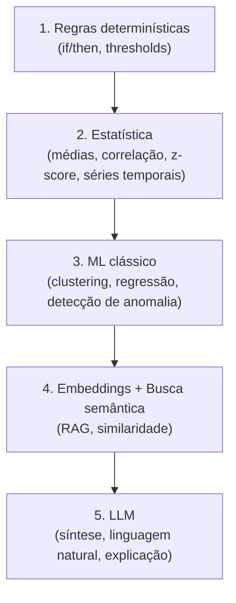
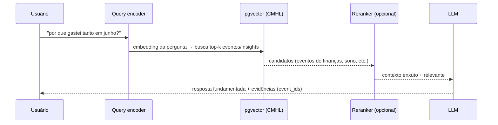

# 12 — AI Architecture

> **Leia antes:** [`ATLAS_MASTER_CONTEXT.md`](ATLAS_MASTER_CONTEXT.md) · **Relacionados:** `11_Event_Model`, `13_Knowledge_Graph`, `14_Vector_Search`, `15_Privacy`, `23_Research`
> **Princípio-mestre:** *A IA é componente, não produto. Heurística antes de neurônio.*

---

## 1. A tese de IA do Atlas (leia isto primeiro)

A maioria dos produtos "de IA" comete o erro de fazer a IA ser **o produto** — o que os torna
frágeis (qualquer um troca de LLM), caros (tokens ∝ dados) e opacos (caixa-preta). O Atlas
inverte isso:

> **A IA é uma camada fina de interpretação sobre um ativo estruturado e durável (o CMHL). O
> valor está no modelo de dados; a IA apenas o lê, explica e infere.**

Três consequências arquiteturais:
1. **Trocabilidade:** LLMs/embeddings ficam atrás de abstrações (`LLMProvider`) → o modelo é
   commodity substituível.
2. **Custo controlado:** RAG recupera só o relevante (não "joga tudo no contexto"); heurísticas
   resolvem a maioria dos casos sem LLM; embeddings são cacheados.
3. **Explicabilidade:** a IA opera sobre eventos rastreáveis → todo output aponta evidências.

## 2. A "escada de inteligência" (heurística → neurônio)

Nem todo problema precisa de LLM. Subimos a escada só quando o degrau abaixo não resolve. Cada
degrau é mais caro e menos transparente que o anterior.



| Degrau | Custo | Explicável? | Exemplos no Atlas | Fase |
|---|---|---|---|---|
| 1. Regras | ~0 | ✅ total | "dormiu <6h 3 dias seguidos" → alerta | 🟢 |
| 2. Estatística | ~0 | ✅ alta | correlação sono×gasto, tendência de passos | 🟢 |
| 3. ML clássico | baixo | média | clusters de rotina, anomalias | 🔵/🟡 |
| 4. Embeddings/RAG | baixo (cacheável) | média-alta | busca semântica, agrupar notas | 🟢 |
| 5. LLM | alto | baixa (mitigar) | resumo semanal em linguagem natural | 🟢 (limitado) |

**Regra de ouro:** se uma regra ou estatística resolve, **não use LLM**. LLM só onde ele é
insubstituível: **linguagem natural** (explicar, resumir, conversar) e **raciocínio flexível**
sobre contexto recuperado.

## 3. Por que usar IA / quando NÃO usar

**Use IA quando:**
- O output precisa ser **linguagem natural** (explicações, resumos, respostas a perguntas).
- O padrão é **fuzzy/semântico** (buscar "quando me senti ansioso" ≠ match exato de palavra).
- Há **ambiguidade** que regras não capturam bem (extrair entidades de uma nota livre).

**NÃO use IA quando:**
- Uma regra/estatística dá a resposta (mais barato, mais confiável, explicável).
- O custo/latência não se justifica (não gerar embedding de cada tique de sensor).
- O dado é sensível e o usuário não deu opt-in para IA externa (ver `15`).
- Você precisa de **garantia determinística** (cálculo financeiro, não pergunte ao LLM).

## 4. Componentes de IA (visão)

```mermaid
flowchart LR
    subgraph Ingest["Ao ingerir eventos"]
        EX[Extração/Enriquecimento\n(NER: pessoas/lugares/tópicos)]
        EMB[Embedding do conteúdo\n(cacheado por hash)]
    end
    subgraph Store["CMHL"]
        PG[(Postgres + pgvector)]
        G[(Grafo)]
    end
    subgraph Infer["Inference Pipeline"]
        RULE[Regras]
        STAT[Estatística]
        MLC[ML clássico]
    end
    subgraph Interact["Interação"]
        RAG[RAG: recupera contexto]
        LLM[LLM: sintetiza/explica]
    end
    EX --> G
    EX --> PG
    EMB --> PG
    PG --> Infer
    Infer --> PG
    RAG --> PG
    RAG --> LLM
    LLM --> User[Usuário]
```

## 5. Embeddings — conceito profundo

### 5.1. O que são
Um **embedding** é a representação de um pedaço de conteúdo (texto, e no futuro imagem/áudio)
como um **vetor denso** em `R^n` (ex.: n=1536). A ideia central: **conteúdos com significado
parecido ficam próximos no espaço vetorial**.

### 5.2. Por que funcionam (intuição + matemática)
Modelos de embedding são treinados (tipicamente com **aprendizado contrastivo**) para que
pares semanticamente similares tenham vetores próximos e dissimilares, distantes. A
"proximidade" é medida por **similaridade de cosseno**:

$$\text{sim}(\vec{a}, \vec{b}) = \frac{\vec{a} \cdot \vec{b}}{\lVert \vec{a}\rVert\, \lVert \vec{b}\rVert} = \frac{\sum_i a_i b_i}{\sqrt{\sum_i a_i^2}\,\sqrt{\sum_i b_i^2}}$$

Resultado em [-1, 1]: 1 = mesma direção (muito similar), 0 = ortogonal (não relacionado). Se os
vetores são normalizados (norma 1), cosseno vira simplesmente o **produto interno** `a·b`, o que
é mais barato de computar em escala. Detalhes matemáticos e algoritmos de busca (HNSW etc.) em
`14_Vector_Search.md`.

### 5.3. Como usamos no Atlas
- Geramos embeddings de conteúdo **textual/semântico**: notas, títulos de eventos, resumos,
  nomes de entidades — **não** de números crus (para isso, estatística é melhor).
- Guardamos em `embeddings` (pgvector) com **cache por `content_hash`**: mesmo conteúdo nunca é
  re-embeddado → economia direta.
- Servem para: **busca semântica**, **agrupar conteúdos similares** (dedupe de notas, entity
  resolution), e **recuperação para RAG**.

### 5.4. Custo, alternativas, limitações

| Aspecto | Nota |
|---|---|
| Custo | API de embedding cobra por token; cache por hash + só embeddar o que importa reduz muito |
| Alternativa (🟡) | Embeddings **on-device** (modelos pequenos) → custo zero + privacidade |
| Limitação | Embeddings ficam "presos" ao modelo/versão; trocar de modelo = re-embeddar (guardamos `model` na linha) |
| Limitação | Não entendem número/tempo bem → não usar para lógica quantitativa |
| Quando NÃO usar | Dados puramente numéricos; matching exato (use índice/regex) |

## 6. RAG — Retrieval-Augmented Generation

### 6.1. O que é e por que é o coração da IA do Atlas
**RAG** = em vez de o LLM responder "de cabeça" (arriscando alucinar), primeiro **recuperamos**
os dados relevantes do CMHL e os injetamos no contexto do LLM. O LLM então responde **fundamentado
nos dados do usuário**.



### 6.2. Por que RAG (vs "jogar tudo no contexto" vs fine-tuning)

| Abordagem | Custo | Atualidade | Explicável | Adequação |
|---|---|---|---|---|
| Tudo no contexto | 💸💸💸 (tokens ∝ dados) | ✅ | médio | ❌ inviável p/ anos de dados |
| Fine-tuning por usuário | 💸💸💸 (treino) | ❌ (congela) | ❌ | ❌ (1 modelo/usuário não escala) |
| **RAG** | 💸 (só recupera o relevante) | ✅ (dados vivos) | ✅ (cita fontes) | ✅ **escolhido** |

RAG é a única abordagem que combina custo baixo + dados sempre atuais + explicabilidade — exatamente
os três pilares da tese de IA.

### 6.3. Melhorias de RAG (por fase)
- **🟢** RAG básico: embedding da query → top-k por cosseno → contexto → LLM.
- **🔵** Busca **híbrida** (BM25 lexical + vetorial) + filtros por tempo/tipo → mais preciso.
- **🟡** **Reranking** (cross-encoder) dos candidatos; recuperação sobre o **grafo** (buscar
  não só textos similares, mas entidades relacionadas — GraphRAG). Ver `13`.

## 7. Geração de Insights — o Inference Pipeline

O produto principal não é "chat", é **insight proativo**. O pipeline roda em background (workers)
e sobe a escada de inteligência:

```mermaid
flowchart TB
    NEW[Novos eventos / lote diário] --> RULES[1. Regras\n(alertas simples)]
    RULES --> STATS[2. Estatística\n(correlação, tendência, anomalia)]
    STATS --> CAND[Candidatos a insight\n(com força/significância)]
    CAND --> FILTER{Relevante\n& significativo?}
    FILTER -- não --> DROP[Descarta]
    FILTER -- sim --> LLMEXP[5. LLM: redige explicação\nem linguagem natural]
    LLMEXP --> STORE[(insights + evidências)]
```

### 7.1. Detecção estatística honesta
Para dizer "sono baixo associa-se a mais gasto", usamos correlação (ex.: Pearson/Spearman) com
**teste de significância** e **tamanho de amostra mínimo** — nada de afirmar padrão com 3 pontos.
Reportamos **confiança** e evitamos linguagem causal (ver `11` §6). Isto é ciência de dados
responsável, não "IA advinhando".

### 7.2. Papel do LLM aqui
O LLM **não descobre** o padrão (isso é estatística) — ele **redige** o insight de forma clara e
humana ("Notei que nas semanas em que você dormiu menos, seu gasto com delivery foi ~30% maior.
Quer ver os dias?"). Ou seja: **estatística acha, LLM comunica.** Isso mantém custo baixo e
correção alta.

## 8. Escolha de LLM

### 8.1. Estratégia multi-modelo (roteamento por custo/capacidade)
Não existe "o LLM". Roteamos:
- **Modelo pequeno/barato** para a maioria (classificação, extração, redação curta).
- **Modelo forte** só para síntese complexa (resumo semanal, respostas difíceis).
- Tudo atrás de `LLMProvider` (interface) → trocar provedor/modelo é config, não refactor.

```typescript
interface LLMProvider {
  complete(input: { system: string; prompt: string; maxTokens: number; model: ModelTier }): Promise<LLMResult>;
}
// Implementações: OpenAIProvider, AnthropicProvider, LocalProvider(🟡)...
```

### 8.2. Critérios de escolha (e por que não fixar um)

| Critério | Peso |
|---|---|
| Custo por token | alto (define margem — ver `22`) |
| Qualidade em PT-BR | alto |
| Latência | médio |
| Privacidade / opção on-device | alto (roadmap) |
| Estabilidade de API | médio |

Como o mercado muda rápido, **não casamos com um provedor**. A abstração é a decisão; o
provedor concreto é reversível. (ADR-0006)

### 8.3. On-device AI (🟡/🟠)
Rodar SLMs (small language models) e embeddings **no dispositivo**:
- **Prós:** privacidade máxima (dado sensível nunca sai), custo marginal zero, funciona offline.
- **Contras:** qualidade menor que modelos de fronteira; consumo de bateria/memória; complexidade
  de distribuição de modelos.
- **Estratégia:** híbrido — tarefas sensíveis/simples no device; síntese complexa opt-in na
  nuvem. Entra quando NPUs/SLMs amadurecerem e/ou custo/privacidade justificarem.

## 9. Controle de custo de IA (crítico para fundador solo)

Cada chamada custa. Táticas, em ordem de impacto:

1. **Heurística antes de LLM** (§2) — a maioria dos insights não chama LLM.
2. **Cache de embeddings** por `content_hash` — nunca re-embeddar o mesmo texto.
3. **Cache de respostas** de LLM para prompts equivalentes (ex.: resumo do mesmo período).
4. **RAG enxuto** — recuperar top-k pequeno e bem filtrado, não despejar contexto.
5. **Batching** de embeddings; **rate limiting** via BullMQ (respeita limites e suaviza custo).
6. **Roteamento de modelo** — barato por padrão, caro só quando necessário.
7. **Orçamento por usuário** — teto de gasto de IA/mês por tier (ver `22`); degradar
   graciosamente (cair para heurística) ao atingir teto.
8. **On-device (🟡)** — move custo para zero marginal.

> **Meta:** custo de IA por usuário ativo **previsível e < preço do tier**. Medir `custo_IA/MAU`
> como métrica de primeira classe (ver `27` observabilidade).

## 10. Qualidade, avaliação e anti-alucinação

- **Groundedness:** respostas devem citar evidências do CMHL; se não há evidência, o sistema diz
  "não tenho dados suficientes" em vez de inventar.
- **Evals:** conjunto de perguntas/casos com respostas esperadas; rodar em CI ao mudar prompts
  (regressão de prompt). Ver `26`.
- **Guardrails:** validar formato de saída (JSON schema), rejeitar/repetir quando inválido.
- **Feedback loop:** usuário marca insight como útil/errado → sinal para calibrar (e futura
  personalização 🟡).

## 11. Privacidade e IA (ver `15`)
- Enviar dados a LLM/embedding **externo** é **opt-in explícito**, por categoria de dado.
- Payloads sensíveis (saúde, comunicação) são candidatos primários a **on-device** e a **E2EE**.
- **Minimização de prompt:** enviar ao LLM só o contexto recuperado necessário, pseudonimizado
  quando possível (ex.: substituir nomes por placeholders).

## 12. Roadmap de IA por fase

| Fase | O que entra |
|---|---|
| 🟢 MVP | Regras + estatística; embeddings (API) + pgvector; RAG básico; LLM só p/ redigir insights/resumo; cache; opt-in |
| 🔵 V1 | Busca híbrida; extração de entidades (NER) melhor; feedback loop; roteamento de modelo |
| 🟡 V2 | Reranking; GraphRAG (grafo); ML clássico (clusters/anomalias); on-device p/ sensível; orçamento por tier |
| 🟠 Escala | Pipelines de ML offline (data lake); personalização; fine-tuning leve |
| 🔴 Pesquisa | Inferência causal; previsão de comportamento; agentes pessoais; federated learning |

## 13. Riscos de IA (ver `25`)
- **Alucinação** apresentada como fato → RAG + groundedness + "não sei".
- **Correlação vendida como causa** → linguagem de hipótese + rigor estatístico (`11` §6).
- **Custo descontrolado** → táticas §9 + orçamento + métrica `custo/MAU`.
- **Lock-in de provedor** → abstração `LLMProvider`.
- **Vazamento via prompt** → minimização, pseudonimização, opt-in, on-device.

---

### Resumo executivo
No Atlas, **a IA é uma camada fina de interpretação sobre o CMHL**, não o produto. Subimos uma
**escada de inteligência** (regras → estatística → ML → embeddings → LLM), usando o degrau mais
barato que resolve. O padrão central é **RAG** (recuperar do CMHL → LLM fundamenta e cita
evidências), escolhido por unir **custo baixo + dados atuais + explicabilidade**. **Estatística
descobre padrões; o LLM apenas os comunica** em linguagem natural. LLMs/embeddings ficam atrás de
abstrações (**commodity trocável**), com **controle agressivo de custo** e **privacidade opt-in**
com caminho para **on-device**. Assim, um fundador solo entrega inteligência real, honesta
(correlação ≠ causa) e economicamente sustentável.
