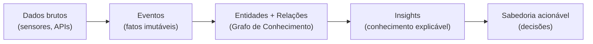
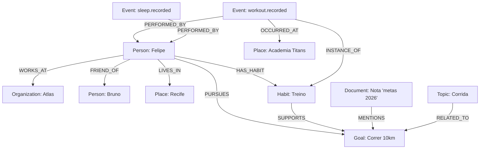
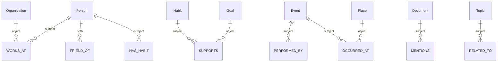
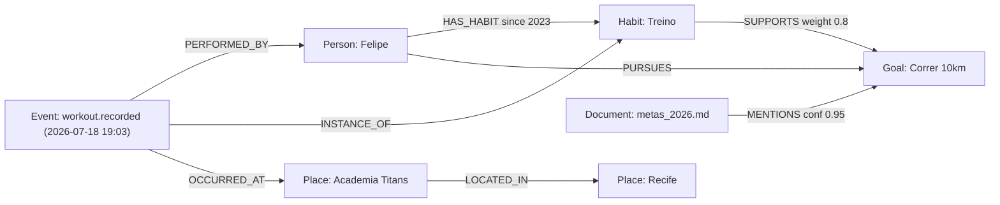
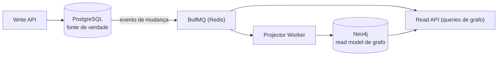
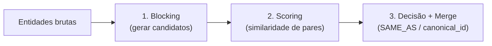
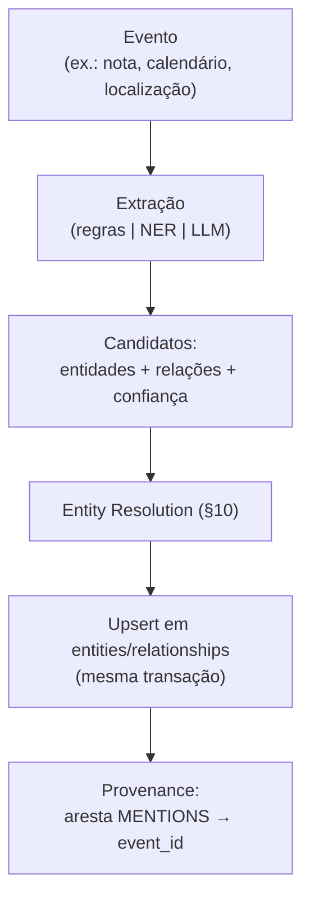

# 13 — Knowledge Graph (Grafo de Conhecimento)

> **Fase geral do documento:** transversal — o grafo nasce no MVP (🟢, dentro do PostgreSQL) e evolui até um banco de grafos nativo (🟡/🟠).
> **Status:** Vivo · **Versão:** 0.1 · **Última atualização:** 2026-07-20
> **Leia antes:** [`ATLAS_MASTER_CONTEXT.md`](ATLAS_MASTER_CONTEXT.md) · [`00_Project_Vision.md`](00_Project_Vision.md)
> **Documentos relacionados:** [`10_Database_Design.md`](10_Database_Design.md) · [`11_Event_Model.md`](11_Event_Model.md) · [`12_AI_Architecture.md`](12_AI_Architecture.md) · [`14_Vector_Search.md`](14_Vector_Search.md) · [`15_Privacy_Architecture.md`](15_Privacy_Architecture.md) · [`24_ADRs.md`](24_ADRs.md)
> **ADRs-âncora:** ADR-0004 (Postgres primário), **ADR-0007 (grafo em PostgreSQL primeiro; Neo4j só na V2)**.

---

## Resumo executivo

O **Grafo de Conhecimento** é a espinha dorsal relacional do **CMHL** (*Computational Model of Human Life*). Enquanto a **Timeline de Eventos** (ver [`11_Event_Model.md`](11_Event_Model.md)) responde *"o que aconteceu e quando"*, o grafo responde *"como as coisas da minha vida se conectam"*: quais pessoas, lugares, hábitos, objetivos, organizações, tópicos e documentos existem, e **como se relacionam entre si e com os eventos**.

Decisão fixada (ADR-0007): **o grafo começa DENTRO do PostgreSQL** — duas tabelas (`entities` e `relationships`) + **CTEs recursivas** (`WITH RECURSIVE`) para consultas multi-hop. Isso evita operar um segundo banco cedo demais (fundador solo). **Neo4j entra apenas na V2 (🟡)**, quando a dor de fazer grafo em SQL for real e mensurável (multi-hop profundo, *pathfinding*, latência).

Este documento cobre, com a anatomia canônica (o que é / por que existe / matemática/mecânica / implementação no stack / alternativas / trade-offs / quando usar / custo / escala / riscos / uso no Atlas): teoria de grafos de conhecimento (property graph vs RDF/triplas), a **ontologia do Atlas**, a **modelagem em PostgreSQL** com queries reais, os **sinais de dor** que justificam migrar para Neo4j, **entity resolution/deduplicação**, **construção do grafo a partir de eventos** (NER — ligação com [`12`](12_AI_Architecture.md)), **consultas que geram Insights**, **escala/particionamento**, e **privacidade/riscos**.

---

## Índice

1. [O que é um grafo de conhecimento](#1-o-que-é-um-grafo-de-conhecimento)
2. [Property Graph vs RDF/Triplas](#2-property-graph-vs-rdftriplas)
3. [Por que grafo para modelar a vida](#3-por-que-grafo-para-modelar-a-vida)
4. [Ontologia / esquema do Atlas](#4-ontologia--esquema-do-atlas)
5. [Modelagem no PostgreSQL (MVP 🟢)](#5-modelagem-no-postgresql-mvp-)
6. [Consultas multi-hop com CTE recursiva](#6-consultas-multi-hop-com-cte-recursiva)
7. [Índices e performance no Postgres](#7-índices-e-performance-no-postgres)
8. [Quando migrar para Neo4j (🟡)](#8-quando-migrar-para-neo4j-)
9. [Comparação: Postgres-como-grafo vs Neo4j vs outros](#9-comparação-postgres-como-grafo-vs-neo4j-vs-outros)
10. [Entity Resolution / Deduplicação](#10-entity-resolution--deduplicação)
11. [Construção do grafo a partir de eventos (NER)](#11-construção-do-grafo-a-partir-de-eventos-ner)
12. [Consultas que geram Insights](#12-consultas-que-geram-insights)
13. [Escala e particionamento](#13-escala-e-particionamento)
14. [Riscos e privacidade](#14-riscos-e-privacidade)
15. [Resumo de fases](#15-resumo-de-fases)

---

## 1. O que é um grafo de conhecimento

### 1.1. O que é

Um **grafo** é uma estrutura matemática \( G = (V, E) \), onde \( V \) é o conjunto de **vértices** (nós) e \( E \subseteq V \times V \) é o conjunto de **arestas** (ligações). Um **grafo de conhecimento** (*Knowledge Graph*, KG) é um grafo em que:

- os **nós representam entidades do mundo real** (uma pessoa, um lugar, um documento);
- as **arestas representam relações semânticas** entre essas entidades (`TRABALHA_EM`, `MORA_EM`, `ACONTECEU_EM`);
- tanto nós quanto arestas podem carregar **propriedades** (atributos com valor);
- o conjunto é regido por uma **ontologia/esquema** (quais tipos de nó e aresta existem e quais conexões fazem sentido).

Formalmente, um KG costuma ser descrito como um **multigrafo dirigido rotulado e atribuído**:

\[
G = (V, E, L_V, L_E, P), \quad E \subseteq V \times R \times V
\]

onde \( R \) é o conjunto de **tipos de relação**, \( L_V, L_E \) são funções de rotulagem (tipo de cada nó/aresta) e \( P \) mapeia nós e arestas para conjuntos de pares chave→valor (propriedades). "Multigrafo" porque pode haver mais de uma aresta entre os mesmos dois nós (`Ana —LIGOU_PARA→ Bruno` várias vezes); "dirigido" porque a direção importa (`Ana —É_MÃE_DE→ Bruno` ≠ `Bruno —É_MÃE_DE→ Ana`).

### 1.2. Por que existe / que problema resolve

O modelo **relacional clássico** (tabelas) é excelente para dados tabulares homogêneos, mas modela relações de forma **implícita** (via chaves estrangeiras e `JOIN`s). Quando a pergunta de negócio é sobre **caminhos e conexões de profundidade variável** ("de quem eu sou amigo que também conhece meu chefe e frequenta a academia X?"), o modelo relacional exige `JOIN`s aninhados cujo número **cresce com a profundidade** da pergunta — e cuja profundidade muitas vezes **nem é conhecida de antemão**.

O grafo resolve isso tornando a relação um **cidadão de primeira classe**: percorrer uma aresta é a operação primitiva, e "profundidade" vira um parâmetro, não uma reescrita de query. Isso é o que permite ao Atlas responder perguntas **cross-domain** — a tese central do produto (ver [`00_Project_Vision.md`](00_Project_Vision.md) §4): *o valor está nas relações entre domínios*.

### 1.3. Dados → Informação → Conhecimento

O KG é o degrau "conhecimento" da escada do CMHL:



- **Dado:** "lat/long 40.7,-74.0 às 19:03".
- **Evento:** `location.visited` naquele ponto.
- **Conhecimento (grafo):** esse ponto **é** a entidade `Place: Academia Titans`, que a `Person: Felipe` **frequenta** e que fica perto do `Place: Trabalho`.
- **Insight:** "você treina 3x/semana, sempre após o trabalho, e dorme melhor nessas noites".

---

## 2. Property Graph vs RDF/Triplas

Existem **dois grandes paradigmas** para materializar um grafo de conhecimento. Entender a diferença é essencial para justificar por que o Atlas escolhe o **Labeled Property Graph (LPG)**.

### 2.1. RDF / Triplas (o modelo da Web Semântica)

No modelo **RDF** (*Resource Description Framework*), tudo é uma **tripla**: `(sujeito, predicado, objeto)`, também chamada de *statement*.

```
:Felipe   :worksAt   :Atlas .
:Felipe   :livesIn   :Recife .
:Atlas    :locatedIn :Recife .
```

- **Átomo:** a tripla. Um grafo é apenas um **conjunto de triplas**.
- **Identidade:** tudo é identificado por **URIs** (globais, desenhados para interoperar entre organizações).
- **Consulta:** linguagem **SPARQL**.
- **Esquema/semântica:** **RDFS / OWL** permitem *reasoning* (inferência lógica: se `A subClassOf B` e `x type A`, então `x type B`).
- **Ponto forte:** interoperabilidade global, padrões W3C, inferência formal, dados abertos ligados (*Linked Data*, Wikidata, DBpedia).
- **Ponto fraco:** **propriedades em arestas são verbosas** (uma aresta com atributos vira várias triplas via *reification*), verbosidade geral, curva de aprendizado, ecossistema mais acadêmico.

### 2.2. Labeled Property Graph (LPG)

No modelo **LPG** (usado por Neo4j, Memgraph, e o que emularemos no Postgres):

- **Nó:** tem um ou mais **rótulos** (`:Person`, `:Place`) e um **mapa de propriedades** (`{name: "Felipe", born: 1996}`).
- **Aresta:** tem **um tipo** (`WORKS_AT`), **direção**, e também **um mapa de propriedades** (`{since: 2024, role: "founder"}`).
- **Consulta:** linguagem **Cypher** (ou Gremlin, GQL).

```cypher
(felipe:Person {name:"Felipe"})-[:WORKS_AT {since:2024}]->(atlas:Organization {name:"Atlas"})
```

### 2.3. Comparação

| Aspecto | RDF / Triplas | Labeled Property Graph (LPG) |
|---|---|---|
| Unidade atômica | Tripla `(s, p, o)` | Nó e aresta com propriedades |
| Propriedades na aresta | Indireto (reification) → verboso | **Nativo e barato** |
| Identidade | URIs globais | IDs locais (UUID) |
| Consulta | SPARQL | Cypher / Gremlin / GQL |
| Inferência formal (OWL) | ✅ forte | ⚠️ limitada |
| Interoperabilidade global | ✅ forte | ⚠️ menor |
| Ergonomia p/ app | ⚠️ verboso | ✅ intuitivo |
| Bancos | Blazegraph, GraphDB, Neptune (RDF) | **Neo4j**, Memgraph, Neptune (LPG), Postgres emulado |

### 2.4. Decisão do Atlas: **LPG**

O Atlas adota o **modelo Property Graph (LPG)**, porque:

1. **Relações carregam contexto rico** ("frequenta desde X, com frequência Y") — propriedades em arestas são de primeira classe e usadas o tempo todo.
2. **Não precisamos de interoperabilidade global** — os dados são **privados e locais** de um único usuário (ver [`15_Privacy_Architecture.md`](15_Privacy_Architecture.md)); URIs globais do RDF resolvem um problema que **não temos**.
3. **Ergonomia** para um fundador solo: modelar `entities` + `relationships` em Postgres (MVP) e depois migrar para Neo4j (LPG nativo) é um caminho **contínuo e reversível**, sem trocar de paradigma.
4. **Inferência** no Atlas será feita pelo **Inference Pipeline** (regras → estatística → ML → LLM, ver [`12`](12_AI_Architecture.md)), não por *reasoner* OWL. Não pagamos o custo do RDF por um benefício que não usamos.

> ⚠️ Nota de fronteira (🔴): se um dia o Atlas expuser um **padrão aberto de portabilidade** do modelo de vida (visão de 10 anos, [`00`](00_Project_Vision.md) §9), um *export* em RDF/JSON-LD poderá ser oferecido como **formato de interoperabilidade** — mas o *core* interno permanece LPG.

---

## 3. Por que grafo para modelar a vida

A vida humana é, estruturalmente, uma **rede densa e heterogênea de entidades interconectadas ao longo do tempo**. Nenhuma tabela plana captura isso bem.

### 3.1. As entidades da vida e suas conexões



Perceba: um único evento (`workout.recorded`) conecta **pessoa + hábito + lugar**, e o hábito conecta a um **objetivo**, que é mencionado num **documento** e classificado por um **tópico**. É exatamente esse tecido cross-domain que o grafo torna consultável.

### 3.2. Por que não só tabelas / só a timeline?

| Pergunta | Timeline (eventos) | Tabelas relacionais | **Grafo** |
|---|---|---|---|
| "O que fiz ontem?" | ✅ ótima | ⚠️ ok | ⚠️ ok |
| "Com quem eu mais saio?" | ⚠️ agregação manual | ⚠️ JOINs | ✅ natural |
| "Que amigos meus conhecem meu chefe?" | ❌ | ❌ JOINs profundos | ✅ multi-hop |
| "Que lugares melhoram meu humor?" | ⚠️ correlação | ⚠️ | ✅ (grafo + eventos) |
| "Menor caminho social até a pessoa X?" | ❌ | ❌ | ✅ *pathfinding* |

A timeline e o grafo são **complementares** (ambos compõem o CMHL): a timeline guarda **fatos com tempo**; o grafo guarda a **estrutura persistente** que dá sentido a esses fatos. Ver [`11_Event_Model.md`](11_Event_Model.md).

---

## 4. Ontologia / esquema do Atlas

**Ontologia** = o conjunto de **tipos de nós**, **tipos de arestas** e **regras** de como podem se conectar. É o "esquema" do grafo. Manter uma ontologia enxuta e explícita é o que impede o grafo de virar um emaranhado ininteligível.

### 4.1. Tipos de entidade (nós)

Consistente com o glossário do [`ATLAS_MASTER_CONTEXT.md`](ATLAS_MASTER_CONTEXT.md) §2:

| Tipo (`entity_type`) | Significado | Propriedades típicas |
|---|---|---|
| `Person` | Uma pessoa (o usuário ou terceiros) | `name`, `aliases[]`, `relationship_kind`, `birthday` |
| `Place` | Lugar físico ou lógico | `name`, `lat`, `lng`, `category`, `radius_m` |
| `Organization` | Empresa, escola, academia | `name`, `category`, `domain` |
| `Habit` | Comportamento recorrente | `name`, `cadence`, `target` |
| `Goal` | Objetivo do usuário | `name`, `status`, `deadline`, `metric` |
| `Document` | Nota, arquivo, e-mail | `title`, `mime`, `content_hash` |
| `Topic` | Assunto/conceito | `name`, `embedding_ref` |
| `Event` | Fato com tempo (ponte p/ timeline) | referência ao `event_id` da timeline |

> **Nota de fronteira entidade × evento:** no Atlas, `Event` é a unidade atômica (imutável) e vive na tabela `events` (ver [`11`](11_Event_Model.md)). No grafo, representamos eventos como **nós leves** (ou arestas materializadas) que **apontam** para o `event_id` canônico — evitando duplicar o payload. O grafo referencia; a timeline é a fonte de verdade do evento.

### 4.2. Tipos de relação (arestas)

Direção é **do sujeito para o objeto**. Toda aresta pode ter propriedades (ex.: `weight`, `since`, `confidence`).

| Tipo (`rel_type`) | De → Para | Propriedades | Exemplo |
|---|---|---|---|
| `WORKS_AT` | Person → Organization | `since`, `role` | Felipe trabalha na Atlas |
| `FRIEND_OF` | Person → Person | `since`, `closeness` | Felipe é amigo de Bruno |
| `FAMILY_OF` | Person → Person | `kind` | mãe, irmão... |
| `LIVES_IN` | Person → Place | `since` | mora em Recife |
| `LOCATED_IN` | Place → Place | — | Academia fica em Recife |
| `OCCURRED_AT` | Event → Place | — | treino aconteceu na academia |
| `PERFORMED_BY` | Event → Person | — | treino foi feito por Felipe |
| `INVOLVES` | Event → Person | `role` | reunião envolve Bruno |
| `INSTANCE_OF` | Event → Habit | — | esse treino é do hábito Treino |
| `HAS_HABIT` | Person → Habit | `since` | Felipe tem o hábito Treino |
| `PURSUES` | Person → Goal | `since` | Felipe persegue "correr 10km" |
| `SUPPORTS` | Habit → Goal | `weight` | treino apoia a meta |
| `MENTIONS` | Document → (any) | `confidence` | nota menciona a meta |
| `RELATED_TO` | Topic → (any) | `weight` | tópico ligado a algo |
| `SAME_AS` | Entity → Entity | `confidence`, `method` | resolução de duplicatas (§10) |

### 4.3. Diagrama da ontologia (meta-modelo)



### 4.4. Exemplo concreto do CMHL (instância)

> "Felipe (fundador) treina na Academia Titans, em Recife, 3x/semana; o treino apoia a meta de correr 10km; a meta é mencionada numa nota."



---

## 5. Modelagem no PostgreSQL (MVP 🟢)

> **Fase:** 🟢 MVP. **Decisão:** ADR-0007 — grafo dentro do Postgres. Detalhes de schema completo em [`10_Database_Design.md`](10_Database_Design.md).

### 5.1. Por que Postgres primeiro (e não Neo4j)

1. **Anti-complexidade prematura** ([`ATLAS_MASTER_CONTEXT.md`](ATLAS_MASTER_CONTEXT.md) §3): um fundador solo não deve operar dois bancos sem dor real que justifique.
2. **Um único store transacional:** eventos, entidades, relações, read models e embeddings (pgvector) na **mesma transação ACID**. Consistência trivial.
3. **Postgres é grafo "bom o suficiente"** para milhares–milhões de arestas de UM usuário, com `WITH RECURSIVE`, índices B-tree/GIN e `ltree` para hierarquias.
4. **Reversibilidade** ([`ATLAS_MASTER_CONTEXT.md`](ATLAS_MASTER_CONTEXT.md) §7): o modelo `entities`/`relationships` mapeia 1:1 para nós/arestas do Neo4j — a migração é uma **projeção**, não uma reescrita.

### 5.2. DDL das tabelas do grafo

```sql
-- Extensões úteis
CREATE EXTENSION IF NOT EXISTS "uuid-ossp";
CREATE EXTENSION IF NOT EXISTS pg_trgm;   -- fuzzy match p/ entity resolution
-- (pgvector é tratado em 14_Vector_Search.md)

-- NÓS: entidades do grafo
CREATE TABLE entities (
    id            UUID PRIMARY KEY DEFAULT uuid_generate_v4(),
    user_id       UUID NOT NULL,                  -- multi-tenant / isolamento por usuário
    entity_type   TEXT NOT NULL,                  -- 'Person','Place','Habit',...
    name          TEXT NOT NULL,
    properties    JSONB NOT NULL DEFAULT '{}',    -- atributos flexíveis do nó
    aliases       TEXT[] NOT NULL DEFAULT '{}',   -- nomes alternativos (entity resolution)
    canonical_id  UUID REFERENCES entities(id),   -- se for duplicata, aponta p/ o canônico
    created_at    TIMESTAMPTZ NOT NULL DEFAULT now(),
    updated_at    TIMESTAMPTZ NOT NULL DEFAULT now(),
    CONSTRAINT chk_entity_type CHECK (entity_type IN
        ('Person','Place','Organization','Habit','Goal','Document','Topic','Event'))
);

-- ARESTAS: relações dirigidas entre entidades
CREATE TABLE relationships (
    id            UUID PRIMARY KEY DEFAULT uuid_generate_v4(),
    user_id       UUID NOT NULL,
    source_id     UUID NOT NULL REFERENCES entities(id) ON DELETE CASCADE,
    target_id     UUID NOT NULL REFERENCES entities(id) ON DELETE CASCADE,
    rel_type      TEXT NOT NULL,                  -- 'WORKS_AT','FRIEND_OF',...
    properties    JSONB NOT NULL DEFAULT '{}',    -- since, weight, confidence...
    weight        REAL NOT NULL DEFAULT 1.0,      -- coluna "quente" p/ ranking/pathfinding
    valid_from    TIMESTAMPTZ,                    -- relações têm tempo (temporais!)
    valid_to      TIMESTAMPTZ,                    -- NULL = ainda válida
    created_at    TIMESTAMPTZ NOT NULL DEFAULT now(),
    -- evita duplicar a mesma aresta lógica
    CONSTRAINT uq_edge UNIQUE (user_id, source_id, target_id, rel_type)
);
```

**Decisões de modelagem explicadas:**

- **`properties JSONB`**: flexibilidade sem migração de schema a cada novo atributo. O que é consultado com frequência (`weight`) vira **coluna dedicada** (mais rápido de indexar que campo JSONB).
- **`canonical_id` + `SAME_AS`**: base da **entity resolution** (§10). Duplicatas apontam para o nó canônico.
- **`valid_from`/`valid_to`**: relações são **temporais** ("morou em Recife de 2018 a 2023"). Sem isso, o grafo não representaria mudança — e a vida é mudança.
- **`user_id` em tudo**: isolamento por usuário; base de particionamento futuro (§13) e de privacidade (§14).

### 5.3. Como isso vira "nós e arestas"

Conceitualmente:

```
entities      →  nós  (V)
relationships →  arestas (E), com rel_type = rótulo e direção source→target
properties    →  o mapa de propriedades do LPG
```

Ou seja: reproduzimos um **Labeled Property Graph** em duas tabelas. Percorrer uma aresta = um `JOIN` de `relationships` com `entities`. Percorrer *n* arestas = *n* JOINs → é aí que entra a **recursão** (§6).

---

## 6. Consultas multi-hop com CTE recursiva

O coração de "Postgres como grafo" é a **Common Table Expression recursiva** (`WITH RECURSIVE`). Ela é o mecanismo padrão SQL para **travessia de profundidade arbitrária**.

### 6.1. Como funciona a matemática/mecânica da recursão

Uma CTE recursiva calcula o **fecho transitivo** de uma relação por **iteração de ponto-fixo**:

1. **Termo âncora** (*base case*): a consulta inicial → produz o "nível 0" (os nós de partida).
2. **Termo recursivo**: junta o resultado corrente com `relationships` para descobrir os **vizinhos** → produz o próximo nível.
3. **Iteração**: repete o passo 2, acumulando resultados, **até que uma iteração não produza novas linhas** (ponto-fixo). Com `UNION` (não `UNION ALL`), duplicatas são eliminadas a cada passo.

Formalmente, se \( N_0 \) é o conjunto âncora e \( \text{adj}(S) \) são os vizinhos de \( S \), então:

\[
N_{k+1} = N_k \cup \text{adj}(N_k), \qquad \text{resultado} = N_{k^\*} \text{ onde } N_{k^\*+1} = N_{k^\*}
\]

Isso é exatamente uma **busca em largura** (BFS) expressa declarativamente.

### 6.2. Exemplo 1 — vizinhos até profundidade N

> "Todas as entidades conectadas a Felipe em até 3 saltos, com o caminho e a distância."

```sql
WITH RECURSIVE traversal AS (
    -- Âncora (nível 0): o nó de partida
    SELECT
        e.id,
        e.name,
        e.entity_type,
        0                        AS depth,
        ARRAY[e.id]              AS path,     -- caminho percorrido (p/ detectar ciclos)
        ARRAY[]::text[]          AS rels
    FROM entities e
    WHERE e.id = :felipe_id AND e.user_id = :uid

    UNION ALL

    -- Termo recursivo: dá um salto a partir do nível corrente
    SELECT
        e2.id,
        e2.name,
        e2.entity_type,
        t.depth + 1,
        t.path || e2.id,
        t.rels || r.rel_type
    FROM traversal t
    JOIN relationships r
      ON r.source_id = t.id            -- segue a aresta para frente
     AND r.user_id = :uid
     AND (r.valid_to IS NULL OR r.valid_to > now())   -- só relações válidas
    JOIN entities e2
      ON e2.id = r.target_id
    WHERE t.depth < 3                  -- limite de profundidade (obrigatório!)
      AND NOT e2.id = ANY(t.path)      -- evita ciclos (crucial!)
)
SELECT DISTINCT id, name, entity_type, depth, rels
FROM traversal
WHERE depth > 0
ORDER BY depth, name;
```

**Pontos críticos (aprenda isto):**

- **`t.depth < 3`**: *sem* limite de profundidade, um grafo cíclico faz a recursão explodir. **Sempre limite.**
- **`NOT e2.id = ANY(t.path)`**: **detecção de ciclo**. Sem isso, `Ana→Bruno→Ana→...` roda para sempre. Guardar o `path` é o preço de fazer grafo em SQL.
- **Direção:** aqui seguimos só `source→target`. Para relações **não-dirigidas** (amizade), precisamos considerar os dois sentidos (`source_id = t.id OR target_id = t.id`) — o que **dobra o custo** e complica o SQL. (Esse atrito é um dos sinais de dor do §8.)

### 6.3. Exemplo 2 — grafo não-dirigido (amizade bidirecional)

```sql
WITH RECURSIVE social AS (
    SELECT :felipe_id AS person_id, 0 AS depth, ARRAY[:felipe_id] AS path
    UNION ALL
    SELECT
        CASE WHEN r.source_id = s.person_id THEN r.target_id
             ELSE r.source_id END,
        s.depth + 1,
        s.path || CASE WHEN r.source_id = s.person_id THEN r.target_id
                       ELSE r.source_id END
    FROM social s
    JOIN relationships r
      ON (r.source_id = s.person_id OR r.target_id = s.person_id)
     AND r.rel_type = 'FRIEND_OF'
     AND r.user_id = :uid
    WHERE s.depth < 2
      AND NOT (CASE WHEN r.source_id = s.person_id THEN r.target_id
                    ELSE r.source_id END) = ANY(s.path)
)
SELECT DISTINCT e.name, s.depth
FROM social s JOIN entities e ON e.id = s.person_id
WHERE s.depth > 0
ORDER BY s.depth, e.name;
```

### 6.4. Exemplo 3 — "amigos em comum" (a pergunta cross-domain)

> "Quais amigos meus também conhecem meu chefe?" — o tipo de pergunta que justifica o grafo.

```sql
SELECT DISTINCT f.name AS amigo_em_comum
FROM relationships r1
JOIN relationships r2
  ON r1.target_id = r2.source_id       -- amigo do amigo
JOIN entities f ON f.id = r1.target_id
WHERE r1.source_id = :felipe_id
  AND r1.rel_type = 'FRIEND_OF'
  AND r2.target_id = :chefe_id
  AND r2.rel_type = 'FRIEND_OF'
  AND r1.user_id = :uid;
```

Para **2 saltos fixos**, JOINs explícitos batem a recursão em clareza e performance. A recursão brilha quando a **profundidade é variável ou desconhecida**.

### 6.5. Limitações da abordagem em SQL

| Limitação | Detalhe |
|---|---|
| **Verbosidade** | Detecção de ciclo, direção e caminho são manuais em cada query. |
| **Sem *pathfinding* nativo** | Não há `shortestPath()`/Dijkstra prontos; teria que implementar peso/prioridade na mão. |
| **Plano do otimizador** | O planejador do Postgres **não é *graph-aware***: ele materializa cada nível como um conjunto e refaz JOINs; não sabe "podar" caminhos ruins cedo. |
| **Explosão combinatória** | Em grafos densos, o nº de caminhos cresce exponencialmente com a profundidade → memória e latência disparam. |
| **Não-dirigido é caro** | `OR` nas duas pontas frequentemente impede uso eficiente de índice. |

Essas limitações **não** são um problema no MVP (poucos milhares de arestas por usuário) — mas são exatamente os **gatilhos de migração** do §8.

---

## 7. Índices e performance no Postgres

### 7.1. Índices essenciais

```sql
-- Travessia para frente (source → target): o caminho quente
CREATE INDEX idx_rel_source ON relationships (user_id, source_id, rel_type);
-- Travessia reversa (target → source): necessária p/ grafos não-dirigidos
CREATE INDEX idx_rel_target ON relationships (user_id, target_id, rel_type);
-- Filtro por tipo de nó
CREATE INDEX idx_entity_type ON entities (user_id, entity_type);
-- Busca por propriedades no JSONB (ex.: properties->>'category')
CREATE INDEX idx_entity_props ON entities USING GIN (properties jsonb_path_ops);
-- Fuzzy match de nomes (entity resolution, §10)
CREATE INDEX idx_entity_name_trgm ON entities USING GIN (name gin_trgm_ops);
-- Aliases (array)
CREATE INDEX idx_entity_aliases ON entities USING GIN (aliases);
```

### 7.2. Por que estes índices

- **Índice composto `(user_id, source_id, rel_type)`**: cada passo da recursão faz `WHERE r.source_id = t.id AND r.user_id = ...`. Sem esse índice, cada nível vira um *seq scan* na tabela inteira de arestas → O(nível × |E|). Com ele, cada expansão de nó é um *index range scan* barato.
- **Dois índices (source e target)**: grafos não-dirigidos precisam navegar nos dois sentidos.
- **GIN em JSONB**: para filtrar nós por atributo (`properties @> '{"category":"gym"}'`).
- **GIN trigram**: viabiliza `name % 'felip'` (similaridade fuzzy) usado na deduplicação.

### 7.3. Estratégias complementares

| Técnica | Quando | Efeito |
|---|---|---|
| **`ltree`** | Hierarquias puras (categorias de tópicos, org tree) | Consulta de subárvore com operador `<@` sem recursão |
| **Read Model / tabela de *closure*** | Consultas de vizinhança repetidas | Pré-computar pares alcançáveis (materialização) — troca escrita por leitura |
| **Materialized View** | Métricas de grafo caras (centralidade) | Recalcula em batch (BullMQ), lê instantâneo |
| **`EXPLAIN (ANALYZE, BUFFERS)`** | Sempre | Diagnosticar se a recursão usa índice ou faz *seq scan* |

> **Regra prática (🟢):** meça com `EXPLAIN ANALYZE` antes de otimizar. No volume de UM usuário, o Postgres resolve travessias de 2–4 saltos em poucos ms se os índices existirem.

---

## 8. Quando migrar para Neo4j (🟡)

> **Fase:** 🟡 V2. **Regra dura ([`ATLAS_MASTER_CONTEXT.md`](ATLAS_MASTER_CONTEXT.md) §4):** nunca colocar Neo4j no MVP "porque é moderno". A migração precisa de **dor mensurável**.

### 8.1. Sinais de dor (gatilhos objetivos)

Migre quando **≥2** destes forem verdadeiros e persistentes:

| Sinal de dor | Métrica-gatilho | Por que dói em Postgres |
|---|---|---|
| **Multi-hop profundo** | Queries com profundidade ≥ 4–5 são rotina | Recursão explode; sem poda graph-aware |
| **Latência de travessia** | p95 de travessia > 200–500 ms | Otimizador não é graph-aware |
| **Pathfinding real** | Precisa de menor caminho / caminhos ponderados | Sem Dijkstra/A* nativo em SQL |
| **Algoritmos de grafo** | PageRank, centralidade, comunidades (Louvain) | Inviável/lento em SQL puro |
| **Densidade** | Grau médio alto + muitas relações não-dirigidas | `OR` nas duas pontas mata o índice |
| **Complexidade de código** | CTEs recursivas viram inmanuteníveis | Cada query reimplementa ciclo/direção/peso |

### 8.2. O mesmo em Cypher (por que é mais expressivo)

A query "vizinhos até 3 saltos" (§6.2), em Cypher:

```cypher
MATCH path = (f:Person {name:'Felipe'})-[*1..3]->(x)
RETURN DISTINCT x.name, x:Person AS is_person, length(path) AS depth
ORDER BY depth;
```

Menor caminho social (impossível-de-graça em SQL):

```cypher
MATCH p = shortestPath(
  (a:Person {name:'Felipe'})-[:FRIEND_OF*..6]-(b:Person {name:'Carla'})
)
RETURN [n IN nodes(p) | n.name] AS caminho, length(p) AS saltos;
```

PageRank / comunidades (via Graph Data Science library):

```cypher
CALL gds.pageRank.stream('meuGrafo')
YIELD nodeId, score
RETURN gds.util.asNode(nodeId).name AS entidade, score
ORDER BY score DESC LIMIT 10;
```

O que em Postgres exigiria dezenas de linhas + detecção manual de ciclo, em Cypher é uma linha, e o engine é **index-free adjacency** (cada nó guarda ponteiros diretos para seus vizinhos → travessia é O(vizinhos), não O(log|E|) por salto).

### 8.3. O custo de operar mais um banco (fundador solo!)

Migrar **não é grátis**. Antes de puxar o gatilho, contabilize:

- **Operação:** mais um serviço para *deploy*, backup, monitorar, atualizar, proteger (dobra a superfície de segurança — ver [`16_Security.md`]).
- **Consistência:** Postgres continua sendo a fonte de verdade (eventos, ACID). Neo4j vira uma **projeção/read model** do grafo → precisa de **pipeline de sincronização** (via eventos/BullMQ) e lida com *eventual consistency*.
- **Custo financeiro:** memória (Neo4j gosta de RAM), licença (Community vs Enterprise), infra AWS extra.
- **Cognitivo:** manter dois modelos mentais e duas linguagens de query.

> **Padrão recomendado (🟡):** **CDC/projeção**, não *cutover*. Postgres permanece autoritativo; um *worker* consome eventos de mudança de `entities`/`relationships` e **projeta** o grafo no Neo4j. Assim a migração é **reversível** e o Neo4j é um índice especializado de leitura, não uma nova fonte de verdade. (Coerente com ADR-0002 / event-sourcing lite.)



---

## 9. Comparação: Postgres-como-grafo vs Neo4j vs outros

| Critério | **Postgres (LPG emulado)** 🟢 | **Neo4j** 🟡 | Amazon Neptune | ArangoDB | Memgraph |
|---|---|---|---|---|---|
| Paradigma | Relacional + recursão | LPG nativo | LPG + RDF | Multi-modelo (doc+grafo) | LPG nativo (in-memory) |
| Linguagem | SQL (`WITH RECURSIVE`) | Cypher / GQL | Gremlin / SPARQL / openCypher | AQL | Cypher |
| Travessia | JOINs recursivos (log por salto) | **Index-free adjacency** (O(grau)) | Gerenciado | Boa | Muito rápida (RAM) |
| Pathfinding/algoritmos | ❌ manual | ✅ GDS library | ✅ | parcial | ✅ (MAGE) |
| ACID com resto dos dados | ✅ (mesmo banco) | ❌ (banco separado) | ❌ | parcial | ❌ |
| Operação (solo) | ✅ zero extra | ⚠️ +1 serviço | ✅ gerenciado (custo $$$) | ⚠️ | ⚠️ RAM-hungry |
| Custo | ✅ já pago | RAM + licença | $$$ (AWS) | médio | RAM |
| Maturidade grafo | ⚠️ "bom o suficiente" | ✅ referência LPG | ✅ | ✅ | ✅ |
| Melhor quando | 1 usuário, ≤ milhões de arestas, hops rasos | grafo é o produto, hops profundos, algoritmos | já all-in AWS, quer gerenciado | precisa doc+grafo juntos | latência ultra-baixa, streaming |

**Leitura da tabela para o Atlas:**

- **MVP (🟢):** Postgres. Uma fonte de verdade ACID; zero operação extra; cobre 100% das perguntas de hop raso.
- **V2 (🟡):** **Neo4j** é a escolha natural — LPG (mesmo modelo mental), Cypher expressivo, GDS para algoritmos, ADR-0007 já o nomeia. Entra como **read model projetado**.
- **Neptune (🟠):** só se o Atlas já estiver profundamente na AWS e quiser um grafo **gerenciado** (menos ops), aceitando *lock-in* e custo. Candidato de escala.
- **ArangoDB:** atraente se quiséssemos unificar documento+grafo+busca num só banco; mas some com a simplicidade "boring tech".
- **Memgraph:** para latência extrema / *streaming* — provavelmente 🟠, exagero para PIM de um usuário.

---

## 10. Entity Resolution / Deduplicação

**Entity Resolution (ER)** é decidir quando **duas menções diferentes se referem à mesma entidade do mundo real**. É um dos problemas mais difíceis (e mais valiosos) do grafo — sem ele, o grafo fragmenta e os insights degradam.

### 10.1. Por que existe (o problema)

O mesmo `Person` chega de fontes diferentes com identificadores diferentes:

- Contato do telefone: `"Bruno Silva"`, +55 81 9...
- Google Calendar: `bruno.silva@gmail.com`
- WhatsApp / nota manual: `"Bruninho"`
- E-mail de trabalho: `bsilva@empresa.com`

São **4 nós** que deveriam ser **1**. Se não resolvermos, "com quem eu mais falo?" conta cada persona separadamente → insight errado.

### 10.2. Como funciona (a matemática/mecânica)

ER é um problema de **classificação de pares**: para cada par de entidades candidatas \((a, b)\), decidir `match` ou `no-match`. Fazer isso para **todos** os pares é \( O(n^2) \) — inviável. Então o pipeline tem três estágios:



**1. Blocking (redução de candidatos):** só comparamos pares "plausíveis" (mesmo tipo, iniciais iguais, telefone/e-mail parcialmente iguais, trigram sobre o nome). Reduz \(O(n^2)\) para quase-linear.

**2. Scoring (similaridade):** combina múltiplos sinais num escore \( s(a,b) \in [0,1] \):

\[
s(a,b) = \sum_i w_i \cdot \text{sim}_i(a,b), \qquad \sum_i w_i = 1
\]

Sinais típicos:
- **Nome:** distância de edição normalizada (Levenshtein) e/ou **Jaro-Winkler**; ou similaridade **trigram** (`pg_trgm`).
- **Atributos exatos:** e-mail/telefone iguais → sinal fortíssimo (quase determinístico).
- **Semântica (🔵):** similaridade de **embedding** do contexto textual (ver [`14_Vector_Search.md`](14_Vector_Search.md)) — captura "Bruninho" ≈ "Bruno".
- **Estrutura (🟡):** vizinhança comum no grafo (dois "Brunos" que compartilham 5 amigos e o mesmo local de trabalho → provavelmente o mesmo).

**3. Decisão:** dois limiares \(\tau_{low} < \tau_{high}\):
- \( s \ge \tau_{high} \) → **merge automático** (cria `SAME_AS`, define `canonical_id`);
- \( \tau_{low} \le s < \tau_{high} \) → **fila de revisão humana** (o usuário confirma: "Bruno e Bruninho são a mesma pessoa?");
- \( s < \tau_{low} \) → mantêm-se separados.

> A distância de **Levenshtein** entre strings \(x, y\) é o número mínimo de inserções/remoções/substituições para transformar \(x\) em \(y\). Normalizada: \( \text{sim} = 1 - \frac{\text{lev}(x,y)}{\max(|x|,|y|)} \).

### 10.3. Implementação no stack (Postgres)

Estágio de *blocking* + *scoring* de nome com `pg_trgm`:

```sql
-- Candidatos a duplicata de Person por similaridade de nome (trigram)
SELECT a.id AS id_a, b.id AS id_b,
       a.name, b.name,
       similarity(a.name, b.name) AS name_sim,
       (a.properties->>'email' = b.properties->>'email') AS same_email
FROM entities a
JOIN entities b
  ON a.user_id = b.user_id
 AND a.entity_type = b.entity_type          -- blocking: mesmo tipo
 AND a.id < b.id                            -- cada par uma vez
 AND a.entity_type = 'Person'
WHERE similarity(a.name, b.name) > 0.4      -- blocking por trigram
ORDER BY name_sim DESC;
```

Merge (marca duplicata e reaponta arestas para o canônico):

```sql
BEGIN;
-- 1. registra a decisão como aresta SAME_AS (auditável, explicável)
INSERT INTO relationships (user_id, source_id, target_id, rel_type, properties)
VALUES (:uid, :dup_id, :canonical_id, 'SAME_AS',
        jsonb_build_object('confidence', 0.93, 'method', 'trgm+email'));

-- 2. aponta a duplicata para o canônico
UPDATE entities SET canonical_id = :canonical_id WHERE id = :dup_id;

-- 3. reaponta arestas da duplicata para o canônico (deduplicando)
UPDATE relationships SET source_id = :canonical_id
 WHERE source_id = :dup_id
   AND NOT EXISTS (SELECT 1 FROM relationships r2
                   WHERE r2.source_id = :canonical_id
                     AND r2.target_id = relationships.target_id
                     AND r2.rel_type = relationships.rel_type);
UPDATE relationships SET target_id = :canonical_id WHERE target_id = :dup_id;
COMMIT;
```

**Views resolvem transparentemente** as consultas (sempre leem o canônico):

```sql
CREATE VIEW entities_resolved AS
SELECT * FROM entities WHERE canonical_id IS NULL;   -- só os canônicos
```

### 10.4. Trade-offs e riscos

| Erro | Consequência | Mitigação |
|---|---|---|
| **Falso positivo** (merge indevido) | Funde duas pessoas → grafo corrompido, insight errado, **privacidade** (mistura dados de pessoas distintas) | Limiar alto + revisão humana na zona cinza; guardar `SAME_AS` p/ **reverter** |
| **Falso negativo** (não funde) | Entidade fragmentada → insight subestimado | Reprocessar quando novos sinais chegam; usar embeddings (🔵) |
| **Irreversibilidade** | Merge destrutivo perde origem | **Nunca deletar** o nó duplicado; usar `canonical_id` (soft-merge) → reversível ([`ATLAS_MASTER_CONTEXT.md`](ATLAS_MASTER_CONTEXT.md) §7) |

> **Fase:** ER determinístico (e-mail/telefone/trigram) é **🟢 MVP**. ER semântico (embeddings) é **🔵 V1**. ER estrutural (vizinhança no grafo) e ativo/em-lote com ML é **🟡 V2**.

---

## 11. Construção do grafo a partir de eventos (NER)

O grafo **não é preenchido à mão**. Ele é **derivado dos eventos** — coerente com o princípio *event-centric* ([`ATLAS_MASTER_CONTEXT.md`](ATLAS_MASTER_CONTEXT.md) §7). Ver o pipeline de IA em [`12_AI_Architecture.md`](12_AI_Architecture.md).

### 11.1. Pipeline de construção



### 11.2. Estratégia por tipo de fonte (heurística antes de neurônio)

Fiel a "heurística antes de LLM" ([`ATLAS_MASTER_CONTEXT.md`](ATLAS_MASTER_CONTEXT.md) §5.4):

| Fonte de evento | Extração 🟢 | Upgrade |
|---|---|---|
| **Localização** (`location.visited`) | *Reverse geocoding* + clustering de coordenadas → `Place`; regra de raio | Rotulagem semântica de lugar (🔵) |
| **Calendário** (`calendar.event`) | Parse de campos estruturados (título, convidados→`Person`, local→`Place`) | NER no título livre (🔵) |
| **Contatos** | Import direto → `Person` + atributos | — |
| **Saúde/sensores** | Sem NER; ligam a `Habit`/`Goal` por regra | — |
| **Notas/Documentos** (texto livre) | **NER** (spaCy/modelo leve) → `Person`, `Place`, `Organization`, `Topic`; regex p/ datas/valores | **LLM extractor** (🔵) p/ relações complexas |

### 11.3. NER — o que é e como se conecta

**NER** (*Named Entity Recognition*) identifica, em texto livre, **spans** que são entidades e seus **tipos**. Ex.: em *"Almocei com o Bruno no Outback ontem"*, um NER marca `Bruno`→PERSON, `Outback`→ORG/PLACE. É um problema de **sequence labeling** (rotular cada token com esquema BIO). No Atlas:

1. **MVP (🟢):** NER leve local (modelo pequeno / regras) → barato, privado (roda sem enviar dados a LLM externo — coerente com privacidade *by design*, [`15`](15_Privacy_Architecture.md)).
2. **V1 (🔵):** **extração via LLM** para relações ("Bruno é meu **chefe**") — mais rico, mas **opt-in** (dado sai para API externa) e **cacheado por hash de conteúdo** (custo, ver [`14`](14_Vector_Search.md) §cache).

Cada extração vira uma aresta `MENTIONS` com `confidence` e um ponteiro para o `event_id` de origem → **explicabilidade** (todo nó/aresta rastreável até o evento que o criou).

### 11.4. Exemplo de *upsert* idempotente

```sql
-- Upsert de entidade (idempotente por (user, tipo, nome normalizado))
INSERT INTO entities (user_id, entity_type, name, properties)
VALUES (:uid, 'Person', 'Bruno', '{"source":"note"}')
ON CONFLICT (user_id, entity_type, name)   -- requer índice único de negócio
DO UPDATE SET updated_at = now()
RETURNING id;

-- Aresta de proveniência (nota menciona a pessoa)
INSERT INTO relationships (user_id, source_id, target_id, rel_type, properties)
VALUES (:uid, :document_id, :bruno_id, 'MENTIONS',
        jsonb_build_object('confidence', 0.88, 'event_id', :event_id))
ON CONFLICT (user_id, source_id, target_id, rel_type) DO NOTHING;
```

> **Idempotência** é vital: eventos podem ser reprocessados (event-sourcing lite permite *replay*). A construção do grafo precisa ser **determinística e repetível** — reprocessar não deve duplicar nós/arestas.

---

## 12. Consultas que geram Insights

O objetivo final do grafo é **gerar Insights explicáveis** (com evidência rastreável). Exemplos de padrões de consulta que viram Insight.

### 12.1. Grau / centralidade simples — "pessoas mais presentes na sua vida"

```sql
SELECT e.name, count(*) AS interacoes
FROM relationships r
JOIN entities e ON e.id = r.target_id
WHERE r.user_id = :uid
  AND r.rel_type IN ('INVOLVES','FRIEND_OF')
  AND e.entity_type = 'Person'
GROUP BY e.name
ORDER BY interacoes DESC
LIMIT 10;
```

### 12.2. Grafo + timeline (cross-domain) — "lugares associados a bom humor"

Junta o **grafo** (`OCCURRED_AT`) com os **eventos** (humor) — a essência do CMHL:

```sql
SELECT p.name AS lugar,
       avg((mood.payload->>'score')::numeric) AS humor_medio,
       count(*) AS n
FROM events mood                                   -- timeline (11_Event_Model)
JOIN relationships occ ON occ.properties->>'event_id' = mood.id::text
                       AND occ.rel_type = 'OCCURRED_AT'
JOIN entities p ON p.id = occ.target_id AND p.entity_type = 'Place'
WHERE mood.user_id = :uid AND mood.event_type = 'mood.recorded'
GROUP BY p.name
HAVING count(*) >= 5
ORDER BY humor_medio DESC;
```

> Este é o **O2** do produto ([`00`](00_Project_Vision.md) §6.1): demonstrar ≥1 relação cross-domain. O grafo dá a **estrutura** (qual lugar), a timeline dá o **sinal** (humor), o Insight nasce do cruzamento.

### 12.3. Padrão multi-hop → recomendação — "pessoas que talvez você conheça"

Amigos-de-amigos ainda não conectados a você (grau 2 sem aresta direta):

```sql
WITH amigos AS (
  SELECT target_id AS pid FROM relationships
  WHERE source_id = :felipe_id AND rel_type = 'FRIEND_OF' AND user_id = :uid
)
SELECT e.name, count(*) AS amigos_em_comum
FROM relationships r
JOIN amigos a ON a.pid = r.source_id
JOIN entities e ON e.id = r.target_id
WHERE r.rel_type = 'FRIEND_OF' AND r.user_id = :uid
  AND r.target_id <> :felipe_id
  AND r.target_id NOT IN (SELECT pid FROM amigos)
GROUP BY e.name
ORDER BY amigos_em_comum DESC;
```

### 12.4. Grafo como recuperador para RAG

O grafo é também um **recuperador estruturado**: dada uma pergunta, expandir do nó-âncora (ex.: uma pessoa mencionada) pega o **subgrafo relevante**, que vira contexto para o LLM — complementando a busca vetorial. Isso é **GraphRAG** (🟡). Detalhes de como o RAG consome grafo + vetores estão em [`12_AI_Architecture.md`](12_AI_Architecture.md) e [`14_Vector_Search.md`](14_Vector_Search.md) §RAG.

---

## 13. Escala e particionamento

### 13.1. A escala do Atlas é peculiar (e favorável)

O Atlas é **local-first e por usuário**: o grafo relevante para uma query é **sempre o de UM usuário**. Não há "grafo global de bilhões de nós". Isso muda tudo:

- O grafo de um usuário raramente passa de **dezenas de milhares a poucos milhões** de arestas (uma vida inteira de contatos, lugares, hábitos).
- Postgres resolve isso confortavelmente por **muito tempo** → reforça ADR-0007.

### 13.2. Estratégias por fase

| Estratégia | Fase | Descrição |
|---|---|---|
| **Índices compostos por `user_id`** | 🟢 | Toda query filtra por usuário; índice começa por `user_id` |
| **Limite de profundidade + poda** | 🟢 | Travessias sempre limitadas (§6) |
| **Read models / closure table** | 🔵 | Materializar vizinhanças/métricas caras |
| **Partitioning por `user_id`** (Postgres declarative partitioning) | 🟡 | Isola grafos grandes; melhora *vacuum* e cache |
| **Neo4j como read model** | 🟡 | Descarrega travessia pesada do Postgres |
| **Sharding por usuário** | 🟠 | Cada usuário/tenant em shard; escala horizontal natural (dados já isolados) |
| **Grafo on-device** | 🟡/🟠 | Como é por-usuário, cabe no dispositivo (SQLite local) — privacidade máxima |

> **Insight de arquitetura:** porque o grafo é **naturalmente particionável por usuário**, o Atlas **evita** o problema mais difícil de bancos de grafo (particionar um grafo interconectado sem cortar arestas). Isso é uma vantagem estrutural do domínio "vida pessoal".

---

## 14. Riscos e privacidade

O grafo é, ao mesmo tempo, o ativo mais valioso e o mais **sensível** do Atlas: ele revela **quem você conhece, onde vai, o que persegue**. Privacidade é arquitetura, não feature ([`ATLAS_MASTER_CONTEXT.md`](ATLAS_MASTER_CONTEXT.md) §6). Ver [`15_Privacy_Architecture.md`](15_Privacy_Architecture.md).

### 14.1. Riscos específicos do grafo

| Risco | Descrição | Mitigação |
|---|---|---|
| **Inferência sensível** | O grafo **infere** dados sensíveis não coletados diretamente (orientação, saúde, religião via padrões de lugar/pessoa) | Minimização; sinalizar inferências sensíveis; consentimento; não persistir o que não agrega valor |
| **Terceiros sem consentimento** | O grafo contém dados de **outras pessoas** (amigos que nunca usaram o Atlas) | Local-first; dados de terceiros ficam no dispositivo; base legal (interesse pessoal/doméstico, LGPD) |
| **ER com falso positivo** | Fundir pessoas erradas mistura dados sensíveis de duas pessoas | Limiar alto + revisão + `SAME_AS` reversível (§10) |
| **Reidentificação** | Grafo anonimizado é reidentificável pela **estrutura** (topologia é digital fingerprint) | Não exportar grafos; se export analítico, cuidado extremo; manter no device |
| **Vazamento = catástrofe** | Um vazamento do grafo é pior que de dados isolados (contexto amplifica dano) | E2EE (🟡), mínimo no servidor, criptografia em repouso |
| **Extração via LLM** | Enviar texto p/ NER externo vaza conteúdo | NER **local** no MVP; LLM extractor é **opt-in** ([`12`](12_AI_Architecture.md)) |

### 14.2. Princípios aplicados ao grafo

1. **`user_id` obrigatório e isolamento**: nenhuma query cruza usuários; RLS (*Row-Level Security*) do Postgres como defesa em profundidade (🔵).
2. **Proveniência e reversibilidade**: toda aresta aponta para sua origem (`event_id`); merges são *soft* (reversíveis).
3. **Direito ao esquecimento (LGPD/GDPR)**: deletar um evento deve **propagar** para as arestas que ele originou (`ON DELETE CASCADE` + reprocessamento). Deleção real, não lógica.
4. **Explicabilidade**: como todo nó/aresta é rastreável, o usuário pode auditar *por que* o Atlas "acha" que conhece a pessoa X.

---

## 15. Resumo de fases

| Capacidade | 🟢 MVP | 🔵 V1 | 🟡 V2 | 🟠 Escala |
|---|---|---|---|---|
| Store do grafo | **Postgres (`entities`/`relationships`)** | + read models/closure | + **Neo4j (read model projetado)** | Neptune/shard por usuário |
| Travessia | `WITH RECURSIVE` (hops rasos) | materializações | Cypher + GDS (hops profundos, pathfinding) | grafo gerenciado |
| Construção | regras + NER local | + LLM extractor (opt-in) | extração estrutural | streaming |
| Entity Resolution | determinístico (email/tel/trgm) | + semântico (embeddings) | + estrutural + ML em lote | — |
| Insights de grafo | grau, cross-domain c/ timeline | recomendações | centralidade/comunidades | — |
| Particionamento | índice por `user_id` | — | partitioning declarativo | sharding / on-device |

---

### Referências cruzadas

- [`10_Database_Design.md`](10_Database_Design.md) — schema completo de `entities`/`relationships`, índices, pgvector.
- [`11_Event_Model.md`](11_Event_Model.md) — timeline, eventos, snapshots (fonte dos nós/arestas).
- [`12_AI_Architecture.md`](12_AI_Architecture.md) — NER, LLM extractor, Inference Pipeline, GraphRAG.
- [`14_Vector_Search.md`](14_Vector_Search.md) — embeddings para ER semântico e RAG.
- [`15_Privacy_Architecture.md`](15_Privacy_Architecture.md) — LGPD/GDPR, threat model.
- [`24_ADRs.md`](24_ADRs.md) — ADR-0004, **ADR-0007**.

---

### Resumo executivo (fechamento)

O Grafo de Conhecimento do Atlas modela a vida como um **Labeled Property Graph** (entidades + relações com propriedades e direção), materializado **no PostgreSQL no MVP** (`entities`/`relationships` + `WITH RECURSIVE`), por disciplina anti-complexidade de um fundador solo (ADR-0007). Ele é **derivado dos eventos** (heurística/NER antes de LLM), passa por **entity resolution reversível** e alimenta **Insights cross-domain explicáveis** ao cruzar estrutura (grafo) com sinal temporal (timeline). **Neo4j entra só na V2 (🟡)**, como *read model projetado*, quando houver **dor mensurável** (multi-hop profundo, pathfinding, algoritmos). Por ser **particionável por usuário**, o grafo escala com naturalidade e maximiza privacidade — o ativo mais valioso e mais sensível do CMHL.
