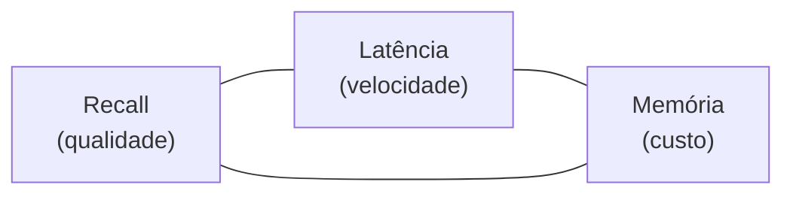
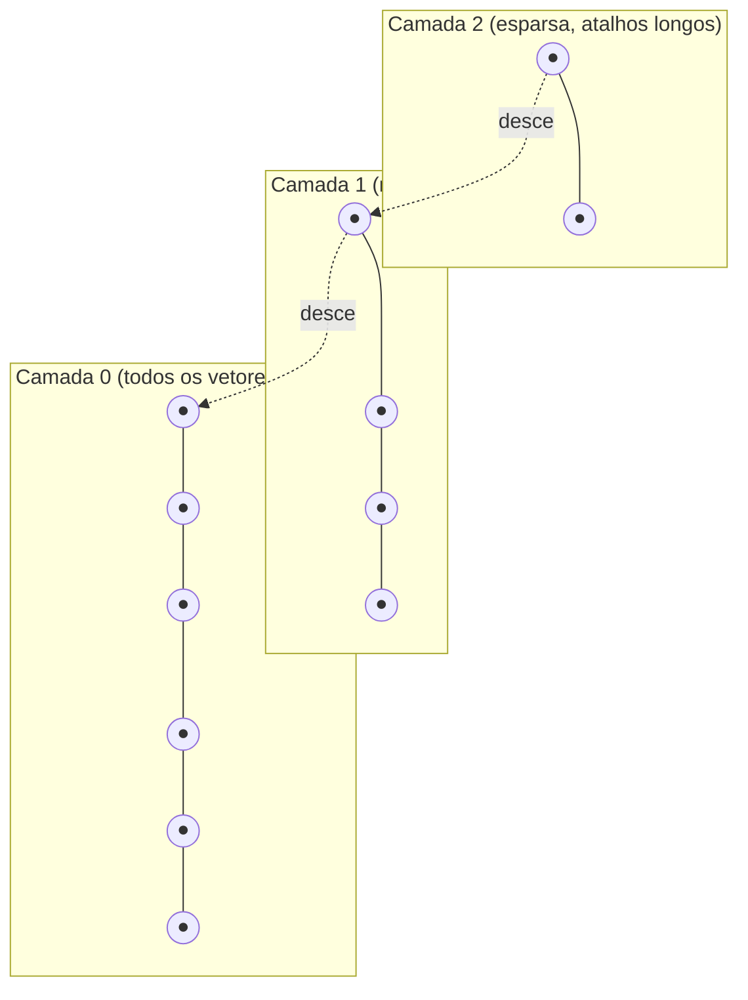
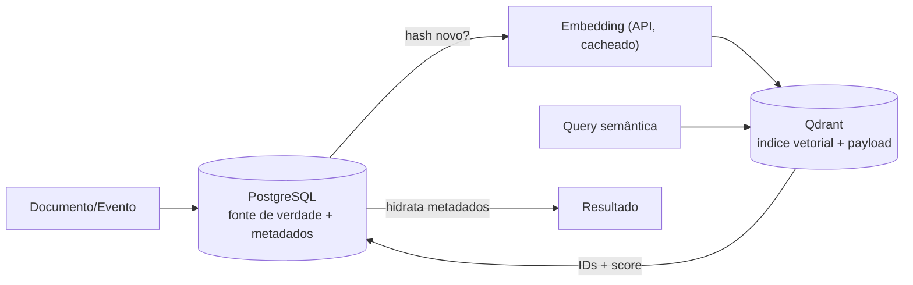
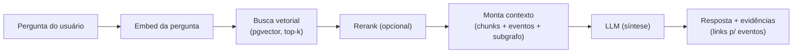
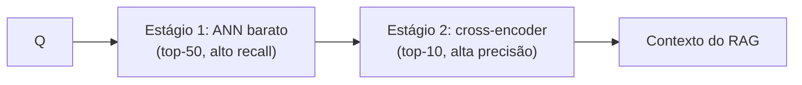

# 14 — Vector Search (Embeddings & Busca Semântica)

> **Fase geral do documento:** transversal — busca vetorial nasce no MVP (🟢, **pgvector**) e evolui para vector DB dedicado (🟡, **Qdrant**) só quando pgvector limitar.
> **Status:** Vivo · **Versão:** 0.1 · **Última atualização:** 2026-07-20
> **Leia antes:** [`ATLAS_MASTER_CONTEXT.md`](ATLAS_MASTER_CONTEXT.md) · [`00_Project_Vision.md`](00_Project_Vision.md)
> **Documentos relacionados:** [`10_Database_Design.md`](10_Database_Design.md) · [`11_Event_Model.md`](11_Event_Model.md) · [`12_AI_Architecture.md`](12_AI_Architecture.md) · [`13_Knowledge_Graph.md`](13_Knowledge_Graph.md) · [`15_Privacy_Architecture.md`](15_Privacy_Architecture.md) · [`24_ADRs.md`](24_ADRs.md)
> **ADRs-âncora:** ADR-0004 (pgvector no MVP), **ADR-0008 (Qdrant adiado até pgvector limitar)**, ADR-0006 (LLM/embeddings via API com abstração).

---

## Resumo executivo

A **Busca Vetorial** (ou busca semântica) é o que permite ao Atlas encontrar informação por **significado**, não por palavra-chave exata. Ela é a base da **Memória Semântica** do CMHL e o **recuperador** do **RAG** (ver [`12_AI_Architecture.md`](12_AI_Architecture.md)): "o que eu anotei sobre ansiedade antes de provas?" deve encontrar uma nota que diz *"fico nervoso nos dias de exame"* — sem nenhuma palavra em comum.

O mecanismo: transformar texto (e depois outros dados) em **embeddings** — vetores densos em \(\mathbb{R}^n\) — de modo que **proximidade geométrica ≈ proximidade semântica**. Buscar vira encontrar os vetores **mais próximos** de um vetor de consulta.

Decisão fixada (ADR-0004/0008): **começamos com `pgvector`** (extensão do PostgreSQL) — zero infra extra, mesma transação ACID que o resto do CMHL. **Qdrant** (vector DB dedicado) só entra na **V2 (🟡)** quando pgvector doer (aprox. > 1–5M vetores, latência, filtragem complexa). Embeddings vêm de **API externa** (abstração `LLMProvider`, cache agressivo por hash de conteúdo — controle de custo, [`00`](00_Project_Vision.md) T2).

Este documento cobre, com a anatomia canônica: **o que são embeddings** e como capturam semântica; a **matemática** das métricas de similaridade (cosseno vs produto interno vs euclidiana); **kNN exato vs ANN** e os algoritmos (**HNSW a fundo**, IVF, PQ); **pgvector** (tipos, operadores, índices, tuning, limites); **Qdrant e alternativas**; **custo, cache, chunking, quantização**; e **RAG, busca híbrida e reranking**.

---

## Índice

1. [O que são embeddings](#1-o-que-são-embeddings)
2. [Como embeddings são treinados (contrastivo)](#2-como-embeddings-são-treinados-contrastivo)
3. [A matemática da similaridade](#3-a-matemática-da-similaridade)
4. [Busca vetorial: exata (kNN) vs aproximada (ANN)](#4-busca-vetorial-exata-knn-vs-aproximada-ann)
5. [Algoritmos ANN: HNSW, IVF, PQ](#5-algoritmos-ann-hnsw-ivf-pq)
6. [pgvector no MVP (🟢)](#6-pgvector-no-mvp-)
7. [Qdrant e alternativas (🟡)](#7-qdrant-e-alternativas-)
8. [Custo, cache, chunking, quantização](#8-custo-cache-chunking-quantização)
9. [RAG no Atlas](#9-rag-no-atlas)
10. [Busca híbrida e reranking](#10-busca-híbrida-e-reranking)
11. [Riscos: stale embeddings e drift de modelo](#11-riscos-stale-embeddings-e-drift-de-modelo)
12. [Resumo de fases](#12-resumo-de-fases)

---

## 1. O que são embeddings

### 1.1. O que é

Um **embedding** é a representação de um objeto (uma frase, uma nota, um evento, uma imagem) como um **vetor de números reais** de dimensão fixa:

\[
\text{embed}(\text{"fico nervoso nos dias de exame"}) = \mathbf{v} \in \mathbb{R}^n, \quad n = 384,\ 768,\ 1536,\ \dots
\]

"Denso" significa que **quase toda coordenada carrega informação** (ao contrário de vetores esparsos como *one-hot* ou TF-IDF, onde a maioria é zero). Cada dimensão é uma **feature latente** aprendida — não interpretável isoladamente, mas coletivamente codificando significado.

### 1.2. Por que existe / que problema resolve

Busca por **palavra-chave** (léxica) falha no **problema de vocabulário**: humanos descrevem a mesma coisa com palavras diferentes ("nervoso" vs "ansioso" vs "tenso"). Busca léxica exige *match* de token; ela não sabe que "cachorro" e "canino" são próximos, nem que "banco" (assento) ≠ "banco" (financeiro).

Embeddings resolvem isso mapeando o **significado** para geometria: a **hipótese distribucional** ("*you shall know a word by the company it keeps*", Firth 1957) diz que palavras/textos com contextos parecidos têm significados parecidos. Modelos de embedding aprendem isso e colocam significados parecidos **próximos no espaço vetorial**.

### 1.3. Como funciona (intuição geométrica)

A propriedade mágica: **relações semânticas viram relações geométricas**.

```mermaid
flowchart LR
    subgraph Espaço R^n
    A["'exame' ●"]
    B["'prova' ●"]
    C["'ansiedade' ●"]
    D["'futebol' ○"]
    end
    A -. próximos .- B
    A -. próximos .- C
    A === "distantes" === D
```

- Textos com significado próximo → vetores **próximos** (ângulo pequeno).
- O exemplo clássico (word2vec): \( \mathbf{v}_{rei} - \mathbf{v}_{homem} + \mathbf{v}_{mulher} \approx \mathbf{v}_{rainha} \) — analogias viram **aritmética vetorial**.
- No Atlas usamos **embeddings de sentença/documento** (não de palavra): o modelo lê a nota inteira e produz **um** vetor que resume seu significado.

### 1.4. Dimensionalidade

| \(n\) | Modelos típicos | Trade-off |
|---|---|---|
| 384 | `all-MiniLM-L6-v2` (local, leve) | Rápido, barato, memória baixa; menos "capacidade" semântica |
| 768 | BERT-base, muitos open-source | Equilíbrio |
| 1024–1536 | `text-embedding-3-small`, e5-large | Mais nuance; mais memória/latência |
| 3072+ | `text-embedding-3-large` | Máxima qualidade; caro em memória e busca |

- **Mais dimensões → mais capacidade de representar nuance, mas** mais memória (\(n \times 4\) bytes por vetor em float32), busca mais lenta, e maior exposição à **maldição da dimensionalidade** (§3.5).
- **Matryoshka embeddings** (🔵): modelos treinados para que os **primeiros k componentes** já sejam um bom embedding → dá para **truncar** (ex.: usar 512 de 1536) e economizar sem re-embed. Útil para o Atlas (custo).

---

## 2. Como embeddings são treinados (contrastivo)

> Resumo intuitivo — o suficiente para defender a decisão, sem virar um curso de deep learning.

### 2.1. A ideia central: aprendizado contrastivo

Um modelo de embedding é uma rede neural \( f_\theta \) (tipicamente um **Transformer encoder**) que mapeia texto → vetor. Ela é treinada com **aprendizado contrastivo**: o objetivo é **aproximar pares semelhantes e afastar pares diferentes** no espaço vetorial.

- **Par positivo** \((a, a^+)\): dois textos que significam o mesmo (pergunta e resposta correta; frase e sua paráfrase; duas frases do mesmo documento).
- **Negativos** \((a, a^-)\): textos não relacionados (frequentemente os **outros exemplos do mesmo batch** — *in-batch negatives*, barato e eficaz).

A função de perda **InfoNCE** (contrastiva) formaliza isso:

\[
\mathcal{L} = -\log \frac{\exp(\text{sim}(a, a^+)/\tau)}{\exp(\text{sim}(a, a^+)/\tau) + \sum_{j}\exp(\text{sim}(a, a^-_j)/\tau)}
\]

onde \(\text{sim}\) é a similaridade de cosseno e \(\tau\) é a **temperatura** (controla quão "afiada" é a distribuição). Minimizar \(\mathcal{L}\) = tornar o positivo muito mais similar que todos os negativos. Após o treino, \(f_\theta\) coloca significados parecidos perto — exatamente a propriedade que a busca explora.

### 2.2. Por que isso importa para o Atlas

1. **Modelos diferentes = espaços diferentes.** Um vetor do modelo A **não é comparável** com um do modelo B. Isso é a raiz do **drift de modelo** (§11): trocar de modelo exige **re-embed** de tudo.
2. **O domínio de treino importa.** Um modelo treinado em web geral pode ser subótimo para texto pessoal/íntimo. *Fine-tuning* (🔴) é possível, mas fora do MVP.
3. **Normalização** (§3.2) é muitas vezes assumida pelo modelo (treinado com cosseno) → devemos normalizar ao armazenar.

---

## 3. A matemática da similaridade

O coração da busca vetorial: **como medir "perto"**. Três métricas dominam.

### 3.1. As três métricas (fórmulas)

Sejam \(\mathbf{a}, \mathbf{b} \in \mathbb{R}^n\).

**1. Produto interno (dot product):**
\[
\mathbf{a} \cdot \mathbf{b} = \sum_{i=1}^{n} a_i b_i = \|\mathbf{a}\|\,\|\mathbf{b}\|\cos\theta
\]
Sensível tanto ao **ângulo** quanto às **magnitudes**. Maior = mais similar.

**2. Similaridade de cosseno:**
\[
\cos\theta = \frac{\mathbf{a} \cdot \mathbf{b}}{\|\mathbf{a}\|\,\|\mathbf{b}\|} \in [-1, 1]
\]
Mede **apenas o ângulo** (ignora magnitude). É a métrica padrão para texto: o *significado* está na **direção** do vetor, não no seu tamanho. 1 = idênticos em direção; 0 = ortogonais (sem relação); −1 = opostos.

**3. Distância euclidiana (L2):**
\[
\|\mathbf{a} - \mathbf{b}\|_2 = \sqrt{\sum_{i=1}^{n}(a_i - b_i)^2}
\]
Distância "em linha reta". Menor = mais similar. Sensível a magnitude.

### 3.2. A relação crucial (normalização unifica tudo)

Se os vetores são **normalizados** (norma unitária, \(\|\mathbf{a}\| = \|\mathbf{b}\| = 1\)), então as três métricas ficam **equivalentes em ranking**:

\[
\|\mathbf{a} - \mathbf{b}\|_2^2 = \|\mathbf{a}\|^2 + \|\mathbf{b}\|^2 - 2\,\mathbf{a}\cdot\mathbf{b} = 2 - 2\cos\theta
\]

Ou seja, para vetores unitários: **minimizar distância L2 = maximizar produto interno = maximizar cosseno**. Eles produzem a **mesma ordenação** dos vizinhos.

> **Decisão prática do Atlas:** **normalizar todos os embeddings** ao armazenar (norma 1). Assim podemos usar o operador mais barato (produto interno, `<#>` no pgvector) e ter o resultado do cosseno "de graça", com ranking consistente.

Normalização: \( \hat{\mathbf{a}} = \mathbf{a} / \|\mathbf{a}\|_2 \).

### 3.3. O que "distância" significa (semanticamente)

"Distância pequena" **não** é "sinônimo" — é **relação no espaço aprendido pelo modelo**. Dois textos podem estar próximos por tema, tom, entidade citada, ou estrutura. É por isso que a busca vetorial:
- **acerta** paráfrases e vocabulário diferente (força);
- **erra** em precisão fina (negação: "gosto de café" vs "não gosto de café" podem ficar perigosamente próximos, pois compartilham quase tudo) → motiva **busca híbrida** e **reranking** (§10).

### 3.4. Qual métrica usar

| Métrica | Quando | No Atlas |
|---|---|---|
| **Cosseno** | Texto, embeddings de significado (padrão) | ✅ padrão (normalizado) |
| **Produto interno** | Vetores já normalizados; ou quando magnitude codifica relevância (ex.: alguns modelos de recomendação) | ✅ usado como equivalente do cosseno após normalizar |
| **Euclidiana (L2)** | Quando magnitude importa e não há normalização; imagens em alguns casos | ⚠️ raramente para nosso texto |

### 3.5. A maldição da dimensionalidade

Em \(\mathbb{R}^n\) com \(n\) grande, um fenômeno contraintuitivo: **as distâncias entre pontos aleatórios convergem** — tudo fica "quase equidistante", e o contraste entre "vizinho mais próximo" e "mais distante" encolhe. Consequências:
- Índices baseados em partição de espaço (KD-tree, R-tree) **degradam para busca linear** em alta dimensão.
- Por isso a busca vetorial moderna usa **grafos de proximidade (HNSW)** e **quantização/particionamento aproximado (IVF/PQ)**, não árvores espaciais clássicas (§5).

---

## 4. Busca vetorial: exata (kNN) vs aproximada (ANN)

### 4.1. O problema formal

**kNN (k-Nearest Neighbors):** dado um vetor de consulta \(\mathbf{q}\) e um conjunto \(D\) de \(N\) vetores, retornar os \(k\) vetores de \(D\) mais próximos de \(\mathbf{q}\) segundo a métrica escolhida.

### 4.2. Exato (brute-force / flat)

Calcula a distância de \(\mathbf{q}\) a **todos** os \(N\) vetores e ordena.

- **Custo:** \(O(N \cdot n)\) por consulta (N vetores × n dimensões). Para \(N = 10\text{k}\), \(n=1536\): ~15M multiplicações → milissegundos, **ok**. Para \(N = 10\text{M}\): ~15 **bilhões** → lento demais para tempo real.
- **Recall:** **100%** (é a resposta correta, por definição).
- **Quando usar:** poucos vetores (MVP inicial, grafo de UM usuário), ou quando precisão perfeita é obrigatória.

### 4.3. Aproximado (ANN — Approximate Nearest Neighbors)

Aceita retornar vizinhos **quase** corretos em troca de **velocidade e memória** ordens de magnitude melhores. Usa estruturas de índice (HNSW, IVF, PQ — §5).

- **Custo:** sublinear (ex.: \(O(\log N)\) efetivo com HNSW).
- **Recall:** < 100% (ajustável via parâmetros).
- **Quando usar:** muitos vetores; latência importa; um recall de 95–99% é aceitável (quase sempre é, para busca semântica).

### 4.4. O trade-off fundamental: recall × latência × memória



Você **não pode maximizar os três**. Escolher parâmetros de ANN é navegar este triângulo:
- Quer **mais recall**? → índice maior/mais denso (mais memória) **ou** busca mais ampla (mais latência).
- Quer **menos latência**? → busca mais estreita (menos recall) **ou** mais memória/pré-computação.
- Quer **menos memória**? → quantização (PQ) → perde recall.

> **Definição de recall@k:** fração dos verdadeiros k-vizinhos que o ANN de fato retornou. Se o kNN exato traria \(\{d_1..d_{10}\}\) e o ANN traz 9 deles, recall@10 = 0.9.

---

## 5. Algoritmos ANN: HNSW, IVF, PQ

### 5.1. HNSW — Hierarchical Navigable Small World (explicado a fundo)

HNSW é o algoritmo dominante (usado por pgvector, Qdrant, Milvus, Weaviate, FAISS). É um **grafo de proximidade em camadas**.

**A intuição — "small world":** em redes de mundo pequeno (six degrees of separation), você alcança qualquer nó em poucos saltos porque há **atalhos de longo alcance** + **conexões locais densas**. HNSW constrói exatamente isso sobre os vetores.

**A estrutura — camadas (hierarquia):**



- **Camada 0** contém **todos** os vetores, com conexões locais densas.
- Camadas superiores contêm **subconjuntos cada vez menores** (cada vetor entra numa camada com probabilidade decrescente, distribuição geométrica) e funcionam como **"expressos"** — atalhos que cobrem grandes distâncias.

**A busca (greedy, top-down):**
1. Começa no ponto de entrada na **camada mais alta**.
2. Move-se **guloso** para o vizinho mais próximo de \(\mathbf{q}\) até não haver melhora naquela camada.
3. **Desce** uma camada e repete — refinando localmente.
4. Na camada 0, faz uma busca de melhor-primeiro mantendo uma lista dinâmica de candidatos de tamanho `ef` (*efSearch*), retornando os `k` melhores.

Efeito: as camadas altas "teleportam" para a região certa (poucos saltos longos); as baixas refinam. Complexidade de busca ~ **\(O(\log N)\)**.

**Parâmetros (e o que controlam):**

| Parâmetro | Fase | Efeito | Trade-off |
|---|---|---|---|
| `m` | construção | nº de conexões por nó | ↑ recall e ↑ memória e ↑ tempo de build |
| `ef_construction` | construção | tamanho da lista de candidatos ao inserir | ↑ qualidade do índice e ↑ tempo de build |
| `ef_search` (`hnsw.ef_search` no pgvector) | consulta | amplitude da busca | ↑ recall e ↑ latência (**ajustável em runtime!**) |

**Prós:** recall alto com baixa latência; `ef_search` ajustável por query (troca recall↔latência sem reindexar). **Contras:** **alto uso de memória** (guarda o grafo + vetores em RAM); build mais lento; inserção/deleção incremental é mais cara que IVF.

### 5.2. IVF — Inverted File Index

Baseado em **clustering** (particiona o espaço).

1. **Treino:** roda k-means sobre os vetores → \(n_{list}\) centróides (células de Voronoi).
2. **Indexação:** cada vetor é atribuído à célula do centróide mais próximo (arquivo invertido: centróide → lista de vetores).
3. **Busca:** encontra os `nprobe` centróides mais próximos de \(\mathbf{q}\) e busca **só** dentro dessas células.

| Parâmetro | Efeito |
|---|---|
| `nlist` (`lists` no pgvector) | nº de células; ↑ = células menores, busca mais fina |
| `nprobe` (`ivfflat.probes`) | nº de células visitadas; ↑ recall e ↑ latência |

**Prós:** build rápido, **menos memória** que HNSW, boa para inserção em lote. **Contras:** recall geralmente inferior ao HNSW para mesma latência; **precisa de dados representativos para treinar** (ruim se a coleção ainda é pequena/vazia — cria índice ruim); vetores nas bordas de células podem ser perdidos.

### 5.3. PQ — Product Quantization (compressão)

PQ ataca **memória**, não estrutura de busca — é combinável com IVF (`IVF-PQ`).

- **Ideia:** dividir o vetor de \(n\) dims em \(m\) sub-vetores; para cada sub-espaço, treinar um *codebook* (k-means com, ex., 256 centróides). Cada sub-vetor vira **1 byte** (o índice do centróide mais próximo).
- **Efeito:** um vetor de 1536 float32 (6144 bytes) pode virar ~96 bytes → **compressão ~64×**. As distâncias são estimadas via *lookup tables* (rápido).
- **Custo:** perda de precisão (é **lossy**) → menor recall; normalmente exige um passo de **re-ranking exato** sobre os candidatos.

### 5.4. Comparação dos algoritmos

| Algoritmo | Otimiza | Recall | Latência | Memória | Build | Melhor quando |
|---|---|---|---|---|---|---|
| **Flat (exato)** | correção | 100% | alta (grande N) | alta | nenhum | N pequeno; precisão total |
| **HNSW** | recall+latência | ⭐ alto | ⭐ baixa | alta (RAM) | lento | padrão; consultas rápidas |
| **IVFFlat** | memória+build | médio-alto | média | média | rápido | muitos inserts; RAM limitada |
| **IVF-PQ** | memória | médio | baixa | ⭐ mínima | médio | bilhões de vetores; RAM cara |

> **Decisão do Atlas:** **HNSW** como índice padrão no pgvector (recall/latência excelentes para nossa escala). IVFFlat como alternativa se memória apertar. PQ/quantização entra só em escala (🟠) ou para grafo on-device (memória do celular).

---

## 6. pgvector no MVP (🟢)

> **Fase:** 🟢 MVP. **Decisão:** ADR-0004 — pgvector para busca semântica **sem infra extra**; ADR-0008 — Qdrant só depois. Schema completo em [`10_Database_Design.md`](10_Database_Design.md).

### 6.1. Por que pgvector primeiro

1. **Zero operação extra:** é uma **extensão** do Postgres que já usamos — nada novo para *deploy*/backup/monitorar (fundador solo, [`ATLAS_MASTER_CONTEXT.md`](ATLAS_MASTER_CONTEXT.md) §3).
2. **Mesma transação ACID:** o embedding é salvo **junto** com o evento/documento/entidade que o originou → sem sincronização entre dois bancos, sem inconsistência.
3. **Filtragem relacional trivial:** combinar busca vetorial com `WHERE user_id = ... AND event_type = ...` é um simples SQL (isolamento por usuário é obrigatório — privacidade).
4. **Suficiente para a escala:** o corpus de UM usuário (notas + eventos + insights de anos) fica na casa de **milhares a poucos milhões** de vetores — bem dentro do conforto do pgvector.

### 6.2. Tipo e operadores

```sql
CREATE EXTENSION IF NOT EXISTS vector;

-- Coluna de embedding (dimensão = a do modelo escolhido; ex.: 1536)
ALTER TABLE documents ADD COLUMN embedding vector(1536);
```

Operadores de distância do pgvector:

| Operador | Métrica | Uso | Classe de índice |
|---|---|---|---|
| `<->` | Distância **euclidiana** (L2) | `ORDER BY embedding <-> $1` | `vector_l2_ops` |
| `<#>` | **Produto interno negativo** | mais rápido; use com vetores normalizados | `vector_ip_ops` |
| `<=>` | Distância de **cosseno** (1 − cos) | padrão para texto | `vector_cosine_ops` |

> pgvector retorna `<#>` como produto interno **negativo** (para que "menor = mais próximo" seja consistente com os outros operadores). Com vetores **normalizados**, `<#>` e `<=>` dão o mesmo ranking, mas `<#>` é mais barato (não recalcula normas). **Decisão do Atlas:** normalizar e usar `<#>` (ou `<=>` por clareza).

### 6.3. Consulta kNN

```sql
-- Top-5 documentos semanticamente mais próximos da consulta, do usuário
SELECT id, title, 1 - (embedding <=> :query_vec) AS cosine_sim
FROM documents
WHERE user_id = :uid                      -- filtro relacional (isolamento)
ORDER BY embedding <=> :query_vec          -- menor distância = mais similar
LIMIT 5;
```

### 6.4. Índices ANN no pgvector

**HNSW (recomendado):**

```sql
CREATE INDEX idx_doc_embedding_hnsw
ON documents
USING hnsw (embedding vector_cosine_ops)
WITH (m = 16, ef_construction = 64);

-- Tuning de consulta (por sessão): mais recall ao custo de latência
SET hnsw.ef_search = 100;
```

**IVFFlat (alternativa, menos memória):**

```sql
CREATE INDEX idx_doc_embedding_ivf
ON documents
USING ivfflat (embedding vector_cosine_ops)
WITH (lists = 100);          -- regra de bolso: lists ≈ sqrt(N) a N/1000

SET ivfflat.probes = 10;     -- mais probes = mais recall, mais lento
```

> ⚠️ **Pegadinha do IVFFlat:** ele precisa de dados **antes** de construir o índice (o k-means treina nos vetores existentes). Criar o índice numa tabela vazia gera um índice ruim. HNSW não tem esse problema → **outra razão para preferir HNSW no MVP**, onde o corpus cresce do zero.

### 6.5. Filtragem + vetor (o ponto forte do pgvector)

```sql
-- Busca semântica restrita a notas dos últimos 90 dias sobre um tópico
SELECT d.title, d.created_at, 1 - (d.embedding <=> :query_vec) AS sim
FROM documents d
JOIN relationships r ON r.source_id = d.id AND r.rel_type = 'RELATED_TO'
WHERE d.user_id = :uid
  AND d.created_at > now() - interval '90 days'
  AND r.target_id = :topic_id
ORDER BY d.embedding <=> :query_vec
LIMIT 10;
```

Aqui combinamos **grafo** ([`13`](13_Knowledge_Graph.md)) + **tempo** ([`11`](11_Event_Model.md)) + **semântica** numa só query ACID — algo que exigiria orquestrar dois bancos com um vector DB separado.

### 6.6. Tuning e boas práticas

| Prática | Porquê |
|---|---|
| **Normalizar vetores** | Permite `<#>` barato; ranking consistente |
| **Ajustar `ef_search` por query** | Troca recall↔latência sem reindexar |
| **`EXPLAIN ANALYZE`** | Confirmar que o índice HNSW está sendo usado (não *seq scan*) |
| **Filtrar por `user_id` sempre** | Isolamento + reduz espaço de busca |
| **`maintenance_work_mem` alto no build** | Build de HNSW é intensivo em memória |
| **Reindexar após grandes ingestões** | Mantém qualidade do grafo HNSW |

### 6.7. Limites do pgvector (quando dói) — os gatilhos do §7

| Sinal de dor | Detalhe |
|---|---|
| **Volume** | Além de ~1–5M vetores por índice, build e busca HNSW pressionam RAM do Postgres (compete com o resto do banco) |
| **Filtragem complexa (pré vs pós)** | pgvector faz o índice ANN e filtra; filtros muito seletivos + ANN podem reduzir recall (o "problema do *filtered ANN*") |
| **Escrita pesada** | Muitas inserções concorrentes com HNSW encarecem manutenção do índice |
| **Isolamento de recursos** | Busca vetorial pesada disputa CPU/RAM com queries transacionais no **mesmo** Postgres |
| **Features avançadas** | Sem quantização nativa robusta, multi-tenancy vetorial, sharding vetorial — presentes em DBs dedicados |

Quando ≥2 desses forem reais e medidos → considerar Qdrant (§7).

---

## 7. Qdrant e alternativas (🟡)

> **Fase:** 🟡 V2. **Decisão:** ADR-0008 — Qdrant só quando pgvector limitar. **Nunca no MVP "porque é moderno".**

### 7.1. O que Qdrant traz

Qdrant é um **vector database dedicado** (escrito em Rust). Vantagens sobre pgvector quando a escala chega:

- **HNSW otimizado + quantização nativa** (scalar/product/binary) → mais vetores por GB de RAM.
- **Payload filtering de primeira classe:** filtros ricos (JSON) **integrados ao ANN** (*filtered search* com estratégias que preservam recall melhor que "filtrar depois").
- **Isolamento de recursos:** roda separado do Postgres → busca vetorial pesada **não** compete com o banco transacional.
- **Escala horizontal:** *sharding*, replicação, *collections* por tenant.
- **Recursos de recomendação:** busca por múltiplos vetores, *discovery*, *scroll*.

**Custo:** +1 serviço para operar (deploy, backup, monitorar, proteger) e o **problema de sincronização** — o Postgres continua a fonte de verdade; um *worker* (BullMQ) projeta embeddings para o Qdrant → *eventual consistency* (mesmo padrão do Neo4j em [`13`](13_Knowledge_Graph.md) §8.3).



### 7.2. Comparação: pgvector vs Qdrant vs alternativas

| Critério | **pgvector** 🟢 | **Qdrant** 🟡 | Milvus | Weaviate | Pinecone | FAISS (local/device) |
|---|---|---|---|---|---|---|
| Tipo | Extensão do Postgres | Vector DB (Rust) | Vector DB (escala massiva) | Vector DB + módulos | **Gerenciado (SaaS)** | Biblioteca (in-process) |
| Operação | ✅ zero extra | +1 serviço | +infra pesada | +1 serviço | ✅ zero ops (mas SaaS) | ✅ nenhuma (embarcado) |
| ACID c/ metadados | ✅ (mesmo banco) | ❌ (sync) | ❌ | ❌ | ❌ | ❌ |
| Payload filtering | ✅ SQL | ⭐ nativo rico | bom | ✅ (GraphQL) | bom | manual |
| Quantização | limitada | ⭐ scalar/PQ/binary | ✅ | ✅ | gerenciada | ✅ |
| Escala | ~1–5M/índice | dezenas de M+ | ⭐ bilhões | milhões | gerenciada | limitada à RAM local |
| Custo | ✅ já pago | infra | infra alta | infra | $$$ + lock-in | ✅ grátis |
| Privacidade | ✅ self-host | ✅ self-host | ✅ self-host | ✅ self-host | ⚠️ dados na nuvem de 3º | ⭐ **on-device** |
| Melhor p/ Atlas quando | MVP → V1 | pgvector doeu (escala/filtros/isolamento) | escala extrema (🟠) | se quiser módulos prontos | ❌ (privacidade + lock-in) | **busca on-device** (🟡) privacidade máxima |

**Leitura para o Atlas:**
- **Pinecone:** descartado por padrão — SaaS gerenciado significa **dados na nuvem de terceiros**, conflito direto com o princípio local-first/privacidade ([`ATLAS_MASTER_CONTEXT.md`](ATLAS_MASTER_CONTEXT.md) §6). Só como conveniência, jamais para dados sensíveis.
- **FAISS on-device (🟡):** muito interessante para o futuro local-first — busca vetorial **no próprio celular**, sem servidor. Casável com on-device AI ([`ATLAS_MASTER_CONTEXT.md`](ATLAS_MASTER_CONTEXT.md) §5.4). Biblioteca, não banco — sem persistência/filtros ricos prontos.
- **Milvus/Weaviate:** poderosos, mas mais peso operacional; entram só se Qdrant não bastar (🟠).
- **Qdrant** é o sucessor natural do pgvector (self-host, privacidade preservada, filtros ricos).

---

## 8. Custo, cache, chunking, quantização

Controle de custo de IA é objetivo técnico explícito (T2, [`00`](00_Project_Vision.md) §6.2). Embeddings têm custo real.

### 8.1. Custo: API vs local

| Opção | Custo | Privacidade | Qualidade | Fase |
|---|---|---|---|---|
| **API de embeddings** (ex.: OpenAI) | $ por token (barato, mas ∝ volume) | ⚠️ dado sai (opt-in) | ✅ alta | 🟢 MVP |
| **Modelo local** (MiniLM, e5, bge via ONNX/servidor) | CPU/GPU próprio (custo fixo) | ✅ dado não sai | boa | 🔵/🟡 |
| **On-device** (celular, ONNX/CoreML) | grátis (device do usuário) | ⭐ máxima | menor (modelo pequeno) | 🟡/🟠 |

> **Decisão do Atlas:** API no MVP (abstração `LLMProvider`/`EmbeddingProvider` — troca fácil, ADR-0006), com **caminho claro para local/on-device** por privacidade e custo. A abstração garante **reversibilidade**.

### 8.2. Cache por hash de conteúdo (a economia mais importante)

Embeddings são **determinísticos por (modelo, texto)**: o mesmo texto sempre gera o mesmo vetor. Logo, **nunca re-embedar o mesmo conteúdo**.

```sql
CREATE TABLE embedding_cache (
    content_hash  TEXT NOT NULL,        -- sha256(texto normalizado)
    model         TEXT NOT NULL,        -- inclui o modelo! (vetor depende dele)
    embedding     vector(1536) NOT NULL,
    created_at    TIMESTAMPTZ NOT NULL DEFAULT now(),
    PRIMARY KEY (content_hash, model)
);
```

Fluxo: normalizar texto → `sha256` → **cache hit?** usa; **miss?** chama a API, salva no cache. Editar uma nota só re-embeda se o **conteúdo mudou** (hash diferente). Isso corta drasticamente chamadas repetidas (reprocessamento, replay de eventos, textos idênticos).

> A chave inclui **`model`**: como vetores de modelos diferentes não são comparáveis (§2.2), o cache é por modelo. Ao trocar de modelo (§11), o cache antigo fica obsoleto naturalmente.

### 8.3. Chunking (particionar texto)

Modelos têm **limite de tokens** de entrada, e um vetor único para um documento longo **dilui** o significado ("um vetor médio de tudo"). Solução: **chunking** — quebrar o texto em pedaços e embedar cada um.

| Estratégia | Descrição | Trade-off |
|---|---|---|
| **Tamanho fixo** | N tokens por chunk | simples; corta frases no meio |
| **Com overlap** | chunks se sobrepõem (ex.: 15%) | preserva contexto de fronteira; +custo/armazenamento |
| **Semântico/estrutural** | quebra em parágrafos/seções/sentenças | melhor coerência; mais complexo |

- **Granularidade:** chunks menores → recuperação mais **precisa** (retorna exatamente o trecho), porém mais vetores (custo/latência) e menos contexto por chunk. Trade-off precisão × contexto.
- **No Atlas:** notas costumam ser curtas → chunking por **parágrafo/sentença** com pequeno overlap é um bom padrão (🟢); ligamos cada chunk ao `document_id` e ao `event_id` de origem (proveniência).

### 8.4. Dimensionamento e quantização (economia de memória)

- **Truncamento (Matryoshka, 🔵):** usar só os primeiros k componentes → menos memória/latência sem re-embed (se o modelo suportar).
- **Quantização scalar** (float32 → int8): ~4× menos memória, perda pequena de recall. pgvector suporta `halfvec` (float16, 2×) e escala tem opções; Qdrant tem scalar/binary nativas.
- **Quantização binária** (1 bit/dim + rerank): compressão extrema (~32×) para *first-stage* + rerank exato; ótimo para on-device (🟡).

---

## 9. RAG no Atlas

**RAG** (*Retrieval-Augmented Generation*) é o padrão que dá ao LLM **contexto factual recuperado** em vez de depender só do que ele "memorizou". É o núcleo da **explicabilidade** do Atlas ([`ATLAS_MASTER_CONTEXT.md`](ATLAS_MASTER_CONTEXT.md) §5.4) e a razão de não "jogar tudo no contexto" ([`00`](00_Project_Vision.md) §4.1). Arquitetura detalhada em [`12_AI_Architecture.md`](12_AI_Architecture.md).

### 9.1. Pipeline RAG



1. **Embedar a pergunta** (mesmo modelo do corpus — obrigatório).
2. **Recuperar** os top-k chunks/eventos/insights mais similares via pgvector (filtrando por `user_id`).
3. **(Opcional) Rerank** os candidatos (§10.2).
4. **Montar o contexto**: chunks recuperados + eventos relevantes da timeline + subgrafo relevante (GraphRAG, [`13`](13_Knowledge_Graph.md) §12.4).
5. **Gerar** a resposta com o LLM, **citando as evidências** (cada afirmação aponta para o `event_id`/documento de origem) → explicabilidade rastreável.

### 9.2. Por que RAG casa com a tese do Atlas

- **Custo baixo:** recupera **só o relevante** (não paga tokens por toda a vida do usuário). Tabela de [`00`](00_Project_Vision.md) §4.1.
- **Explicável:** toda resposta tem evidência → alinhado a "explicabilidade > mágica".
- **Durável:** os dados (CMHL) sobrevivem a qualquer troca de LLM; só o "interpretador" muda.
- **Privado:** com recuperação local + (futuro) LLM on-device, o dado pode nunca sair do dispositivo.

---

## 10. Busca híbrida e reranking

### 10.1. Busca híbrida (BM25 + vetorial)

Busca vetorial (semântica) e busca léxica (palavra-chave) têm **forças complementares**:

| | Vetorial (embeddings) | Léxica (BM25) |
|---|---|---|
| Sinônimos/paráfrase | ✅ forte | ❌ fraca |
| Termos exatos, nomes, códigos, siglas | ⚠️ pode errar | ✅ forte |
| Negação/precisão fina | ⚠️ | ✅ (match exato) |
| Termos raros / fora do vocabulário | ⚠️ | ✅ |

**BM25** é a função de ranking léxico clássica (evolução do TF-IDF): pontua um documento pela frequência dos termos da query nele (**TF**), penalizada pela frequência do termo no corpus (**IDF**) e normalizada pelo tamanho do documento. No Postgres, a busca *full-text* (`tsvector`/`ts_rank`) cobre o papel léxico no MVP.

**Fusão dos rankings — Reciprocal Rank Fusion (RRF):** combina duas listas ordenadas sem precisar calibrar escalas diferentes:

\[
\text{RRF}(d) = \sum_{r \in \{\text{vetorial}, \text{léxico}\}} \frac{1}{k + \text{rank}_r(d)}, \quad k \approx 60
\]

Cada documento soma pontos pelo seu **posto** em cada lista → documentos bem colocados em ambas sobem. Simples, robusto, sem tuning de pesos.

```sql
-- Híbrido no Postgres: full-text (BM25-like) + vetorial, fundidos por RRF
WITH lexical AS (
  SELECT id, row_number() OVER (ORDER BY ts_rank(search_vec, query) DESC) AS rnk
  FROM documents, plainto_tsquery('portuguese', :q) query
  WHERE user_id = :uid AND search_vec @@ query
  LIMIT 50
),
semantic AS (
  SELECT id, row_number() OVER (ORDER BY embedding <=> :query_vec) AS rnk
  FROM documents
  WHERE user_id = :uid
  ORDER BY embedding <=> :query_vec
  LIMIT 50
)
SELECT COALESCE(l.id, s.id) AS id,
       COALESCE(1.0/(60 + l.rnk), 0) + COALESCE(1.0/(60 + s.rnk), 0) AS rrf_score
FROM lexical l
FULL OUTER JOIN semantic s ON l.id = s.id
ORDER BY rrf_score DESC
LIMIT 10;
```

> **Fase:** híbrido é **🔵 V1** (o MVP pode começar só vetorial ou só full-text; hibridizar quando a qualidade pedir).

### 10.2. Reranking

Depois de recuperar **muitos** candidatos (ex.: top-50) com um método barato, um **reranker** reordena os finais (ex.: top-10) com um modelo **mais caro e mais preciso**:

- **Cross-encoder:** lê **query + candidato juntos** (não vetores separados) e pontua a relevância diretamente. Muito mais preciso que a similaridade de embeddings (bi-encoder), porém caro → só sobre poucos candidatos.
- **Arquitetura de dois estágios:** *retrieve* barato e amplo (recall) → *rerank* caro e estreito (precisão). Padrão de ouro para qualidade.



> **Fase:** reranking é **🟡 V2** (agrega qualidade quando o RAG amadurece; custo extra por query justifica adiar).

---

## 11. Riscos: stale embeddings e drift de modelo

| Risco | Descrição | Mitigação |
|---|---|---|
| **Stale embeddings** | Conteúdo mudou mas o vetor não foi recalculado → busca retorna a versão antiga | Re-embed no update (hash muda → cache miss → novo vetor); invalidar cache por `content_hash` |
| **Drift de modelo** | Trocar o modelo de embedding torna vetores antigos **incompatíveis** com os novos (espaços diferentes, §2.2) | Guardar `model` junto do vetor; **re-embed em lote** (BullMQ) ao migrar; nunca misturar modelos numa mesma busca |
| **Dimensão inconsistente** | Modelos diferentes têm `n` diferente → nem cabem na mesma coluna | Coluna por dimensão/modelo, ou migração planejada |
| **Negação / precisão fina** | Embeddings confundem "gosto" e "não gosto" | Busca híbrida + reranking (§10) |
| **Viés do modelo** | Modelo pode sub-representar linguagem pessoal/íntima/PT-BR | Avaliar modelos em dados reais; considerar modelo multilíngue/local |
| **Custo descontrolado** | Re-embedar tudo é caro | Cache por hash; embedar só o que mudou; batch |
| **Privacidade** | Enviar texto para API de embedding vaza conteúdo | Opt-in; caminho para embeddings **locais/on-device** ([`15`](15_Privacy_Architecture.md)) |
| **Qualidade de recuperação silenciosa** | RAG "parece funcionar" mas recupera lixo | Medir **recall@k**/precisão com um golden set; monitorar |

> **Regra operacional (migração de modelo):** trocar de modelo de embedding é uma **operação de migração de dados**, não uma config. Planejar: novo modelo → re-embedar corpus inteiro (batch, cache novo) → validar recall → *cutover*. Coerente com reversibilidade ([`ATLAS_MASTER_CONTEXT.md`](ATLAS_MASTER_CONTEXT.md) §7).

---

## 12. Resumo de fases

| Capacidade | 🟢 MVP | 🔵 V1 | 🟡 V2 | 🟠 Escala |
|---|---|---|---|---|
| Store vetorial | **pgvector** (HNSW) | + tuning/half-precision | **Qdrant** (projetado do Postgres) | Milvus / sharding |
| Embeddings | **API** (abstraída) + cache por hash | modelo local (servidor) | on-device (celular) | on-device + quantização |
| Busca | vetorial (kNN/ANN) | **híbrida** (BM25 + vetorial, RRF) | + **reranking** (cross-encoder) | multi-estágio otimizado |
| Chunking | por parágrafo/sentença + overlap | semântico | adaptativo | — |
| Quantização | — (float32/half) | — | scalar (int8) | PQ/binária (on-device) |
| RAG | RAG básico sobre CMHL | + evidências ricas | **GraphRAG** (grafo + vetor) | agentes com memória |

---

### Referências cruzadas

- [`10_Database_Design.md`](10_Database_Design.md) — schema de embeddings, `embedding_cache`, índices pgvector.
- [`11_Event_Model.md`](11_Event_Model.md) — eventos/notas como fonte de conteúdo a embedar.
- [`12_AI_Architecture.md`](12_AI_Architecture.md) — `LLMProvider`/`EmbeddingProvider`, RAG, Inference Pipeline, custo.
- [`13_Knowledge_Graph.md`](13_Knowledge_Graph.md) — ER semântico via embeddings; GraphRAG.
- [`15_Privacy_Architecture.md`](15_Privacy_Architecture.md) — opt-in de IA externa, caminho on-device.
- [`24_ADRs.md`](24_ADRs.md) — ADR-0004, ADR-0006, **ADR-0008**.

---

### Resumo executivo (fechamento)

A Busca Vetorial do Atlas transforma conteúdo em **embeddings** (vetores densos em \(\mathbb{R}^n\)) para recuperar por **significado**, sustentada pela matemática da **similaridade de cosseno** (com normalização unificando cosseno/produto interno/L2) e por **ANN** (HNSW como padrão; IVF/PQ como alternativas de memória/escala). **pgvector é o MVP** (zero infra extra, ACID com o CMHL, filtragem relacional trivial); **Qdrant entra só na V2 (🟡)** quando o volume/filtros/isolamento doerem — Pinecone é evitado por conflitar com o local-first. Custo é controlado por **cache de embeddings por hash de conteúdo**, chunking e (na escala) quantização. Tudo isso alimenta o **RAG** — recuperação barata, explicável e privada — reforçado por **busca híbrida (BM25 + vetorial via RRF)** e **reranking**, com atenção contínua a **stale embeddings** e **drift de modelo**.
