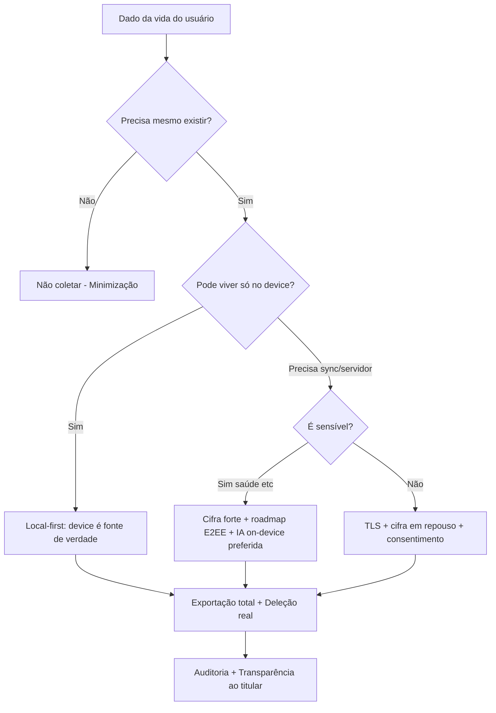
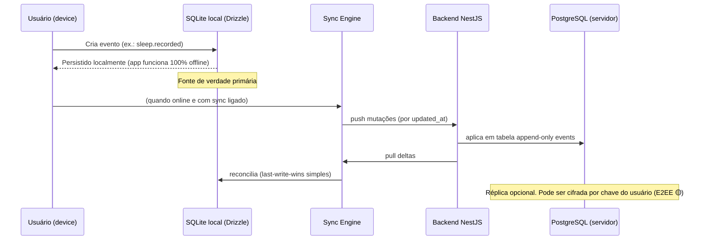
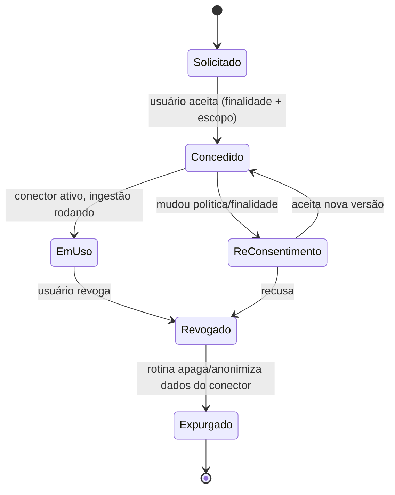
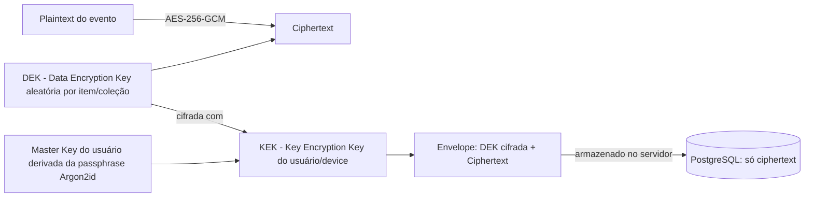
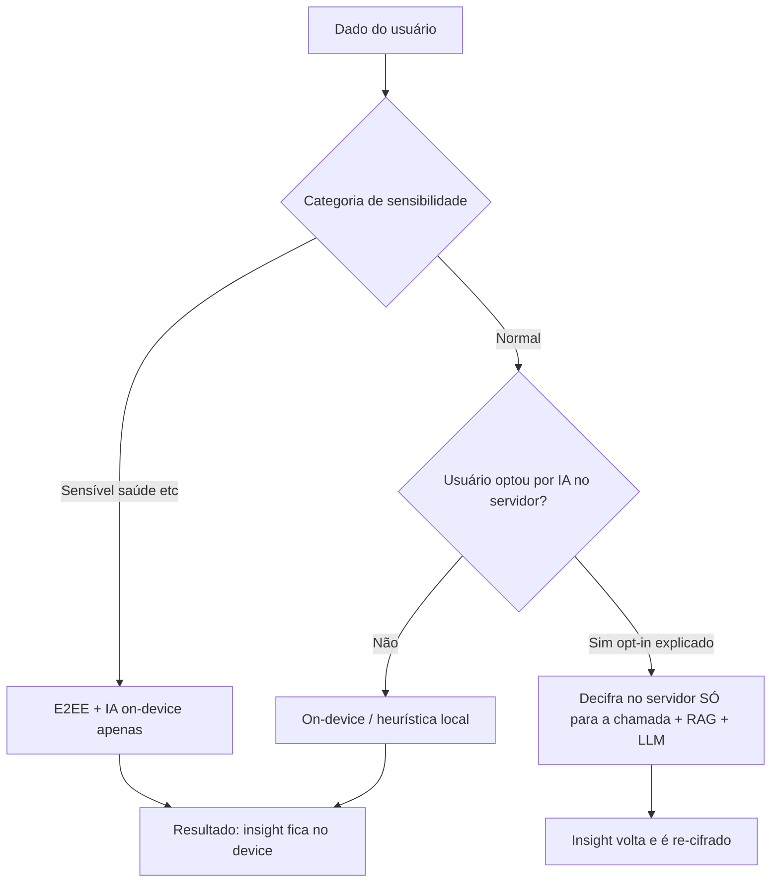
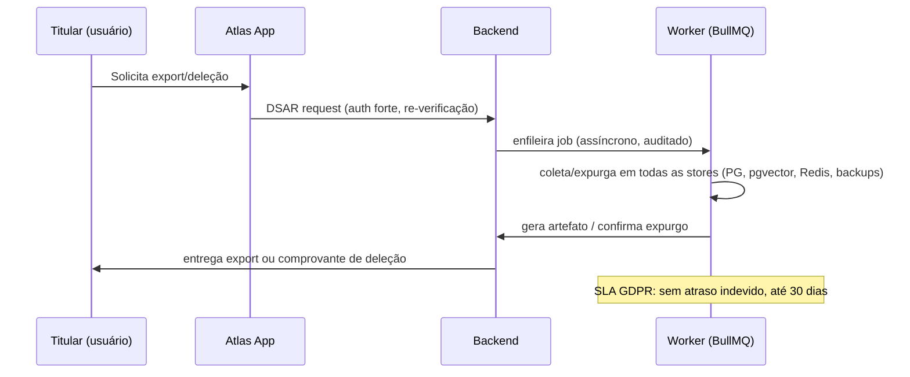
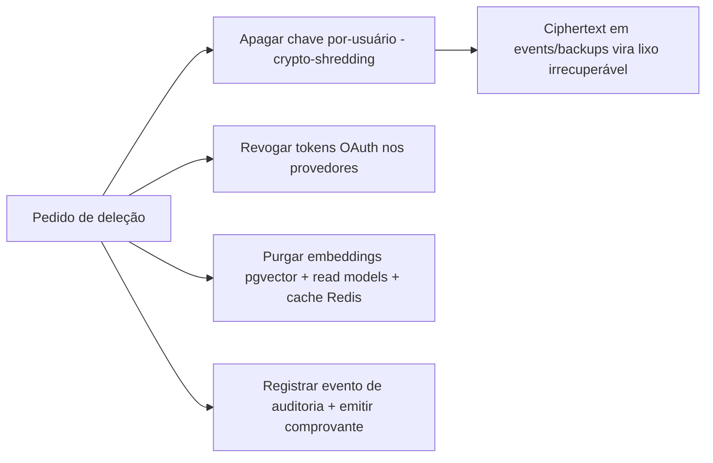
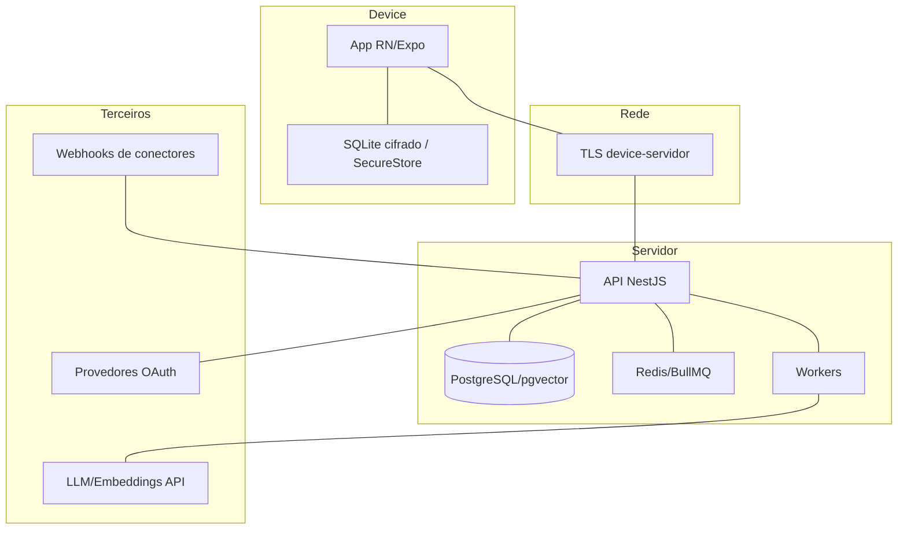
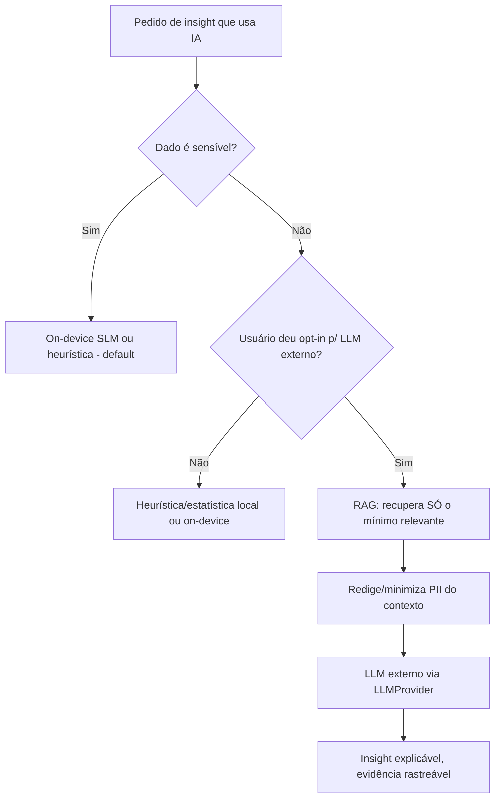

# 15 — Privacy Architecture (Arquitetura de Privacidade)

> **Fase geral:** Fundacional + evolutiva (🟢→🟡→🔴) · **Leia antes:** [`ATLAS_MASTER_CONTEXT.md`](ATLAS_MASTER_CONTEXT.md), [`00_Project_Vision.md`](00_Project_Vision.md)
> **Documentos relacionados:** [`07_System_Architecture`](07_System_Architecture.md), [`08_Mobile_Architecture`](08_Mobile_Architecture.md), [`10_Database_Design`](10_Database_Design.md), [`12_AI_Architecture`](12_AI_Architecture.md), [`16_Security`](16_Security.md), [`17_API_Design`](17_API_Design.md), [`24_ADRs`](24_ADRs.md), [`25_Risks`](25_Risks.md), [`27_DevOps`](27_DevOps.md)
> **Status:** Vivo · **Versão:** 0.1 · **Última atualização:** 2026-07-20
> **Âncora canônica:** [`ATLAS_MASTER_CONTEXT.md` §6 (Postura de Privacidade)](ATLAS_MASTER_CONTEXT.md) e ADR-0010 (privacidade local-first como restrição arquitetural inegociável).

---

## Resumo executivo

O Atlas coleta o tipo de dado mais íntimo que existe: **a vida inteira de uma pessoa** — onde
ela esteve, com quem, quanto dormiu, quanto gastou, o que sente, sua saúde. Isso torna a
privacidade não uma *feature de marketing*, mas a **pré-condição de existência do produto**
(Tese de Confiança, [`00` §4](00_Project_Vision.md)). Um único vazamento destrói o Atlas para
sempre ([`25_Risks`](25_Risks.md)).

Este documento define a **privacidade como propriedade arquitetural**, não como uma checkbox de
conformidade acoplada no fim. Ele cobre, a fundo:

1. **Os sete princípios** que traduzem "privacidade é arquitetura" em decisões concretas
   (local-first, data ownership, minimização, consentimento granular, cifragem, conformidade
   *by design*, IA opt-in).
2. **LGPD e GDPR** aplicadas ao Atlas: bases legais, direitos do titular (DSAR: acesso,
   portabilidade, deleção), *privacy by design & by default*, DPIA/RIPD, papéis de
   controlador/operador, transferência internacional, e o cuidado extra com **dados sensíveis
   (saúde)**.
3. **Criptografia aplicada**: em trânsito (TLS 1.3), em repouso (disco, coluna, campo) e o
   **roadmap de E2EE (🟡)** com *envelope encryption* e gerenciamento de chaves — incluindo o
   trade-off central "servidor não lê" × "IA no servidor" e a **abordagem híbrida** do Atlas.
4. **Técnicas de proteção de dados**: anonimização, pseudonimização, *k*-anonimato,
   *l*-diversidade, e *differential privacy* (🔴 pesquisa).
5. Um **threat model completo (STRIDE)**: ativos, atores, superfícies, vetores e mitigação,
   incluindo **exportação/deleção reais** e o **caminho de IA privada** (LLM externo é opt-in;
   on-device é o destino para dados sensíveis).

> **Regra dura deste documento:** nenhuma feature entra no Atlas sem responder à pergunta
> *"que dado isso coleta, por que, onde vive, quem consegue ler, e como o usuário exporta/apaga
> isso?"*. Se a resposta for insatisfatória, a feature é redesenhada — não a privacidade.

---

## Como este documento explica cada conceito

Seguindo a anatomia canônica do [`ATLAS_MASTER_CONTEXT.md` §0](ATLAS_MASTER_CONTEXT.md), todo
conceito é dissecado em: **o que é → por que existe → como funciona → como se implementa no
Atlas → alternativas/trade-offs → custo/limitações/riscos → fase de entrada**.

---

## 1. Privacidade como arquitetura, não como feature

### 1.1. O que é (a distinção)

- **Privacidade como *feature*** é aquela que você "adiciona depois": um toggle de "modo
  privado", uma política na tela de configurações, um botão de deletar conta que só marca uma
  flag. É *bolt-on*. Ela pode ser removida, contornada ou esquecida porque não está no tecido
  do sistema.
- **Privacidade como *arquitetura*** é uma **propriedade estrutural** do sistema: o design
  torna certas violações **difíceis ou impossíveis por construção**, não por promessa. Se o
  servidor *não tem a chave*, ele *não pode* ler — independentemente de intenção, bug ou
  intimação.

> **Analogia:** privacidade como feature é uma fechadura na porta. Privacidade como arquitetura
> é construir a casa de forma que os cômodos sensíveis simplesmente **não têm janelas para a
> rua**. Você não depende de lembrar de fechar a cortina.

### 1.2. Por que o Atlas escolhe "arquitetura"

Três razões, em ordem de força:

1. **Modelo de ameaça do produto:** o dado do Atlas é cross-domain (saúde + finanças +
   localização + relações). A correlação desses domínios é exatamente o *moat*
   ([`00` §1.3](00_Project_Vision.md)) — e também exatamente o que torna um vazamento
   catastrófico. O valor e o risco vêm da mesma fonte.
2. **Incentivo estrutural:** o Atlas não vende dados nem usa ads
   ([`00` §6.4](00_Project_Vision.md)). Diferente das Big Techs, não há conflito de interesse.
   Mas "não ter conflito" não basta: é preciso *não conseguir* trair mesmo que quisesse
   (garantia técnica > garantia contratual).
3. **Confiança composta:** confiança é o ativo que permite o usuário conectar *mais* domínios
   ao longo dos anos, o que aumenta o valor do CMHL. Privacidade forte é, portanto, um motor de
   *retenção e expansão*, não um custo.

### 1.3. As sete diretrizes operacionais (derivadas do §6 do Master Context)



| # | Diretriz | Tradução arquitetural | Fase |
|---|---|---|---|
| 1 | **Local-first** | O device é fonte primária de verdade; nuvem é réplica/serviço opcional. App 100% usável offline (T1, [`00` §6.2](00_Project_Vision.md)). | 🟢 |
| 2 | **Data ownership** | Exportação total (JSON + SQLite) e deleção real a qualquer momento, sem fricção. | 🟢 |
| 3 | **Minimização** | Só coletar o que gera valor comprovado; cada conector é opt-in granular. | 🟢 |
| 4 | **Consentimento granular** | Consentimento por conector, por escopo e por finalidade — revogável, versionado, auditável. | 🟢 |
| 5 | **Criptografia** | TLS em trânsito (🟢) + cifra em repouso (🟢) + roadmap E2EE onde o servidor não lê (🟡). | 🟢/🟡 |
| 6 | **Conformidade by design** | LGPD + GDPR embutidos no modelo de dados e nas APIs (base legal, DSAR, DPIA). | 🟢 |
| 7 | **IA com consentimento** | Enviar dados a LLM externo é opt-in explicado; caminho on-device para sensíveis. | 🟢 (opt-in) / 🟡 (on-device) |

### 1.4. Trade-offs de assumir privacidade como restrição inegociável

| Ganho | Custo/limitação |
|---|---|
| Confiança como *moat*; permissão para dados íntimos | Algumas features de nuvem (busca server-side em texto claro sensível) ficam mais caras ou impossíveis sob E2EE |
| Menor superfície de vazamento (menos dado no servidor) | Sync e recuperação de conta ficam mais complexos (cifra por chave do usuário) |
| Diferenciação competitiva real vs. Big Techs | Custo de engenharia maior; algumas otimizações de IA ficam no device (menos potentes que servidor) |
| Conformidade LGPD/GDPR quase "de graça" (deriva da arquitetura) | Disciplina permanente: cada PR precisa passar pelo crivo de privacidade |

---

## 2. Local-first como fundamento de privacidade

### 2.1. O que é

**Local-first** ([glossário do Master Context](ATLAS_MASTER_CONTEXT.md)): o dispositivo do
usuário é a **fonte primária de verdade**; a nuvem é uma **réplica e um serviço opcional**, não
o dono do dado. Contrasta com *cloud-first* (a nuvem é a verdade; o device é um cache/terminal
burro).

### 2.2. Por que isso é privacidade (e não só arquitetura de dados)

Cada byte que **nunca sai do device** é um byte que:

- não pode ser vazado por um breach no servidor;
- não pode ser intimado por um pedido judicial ao provedor de nuvem;
- não pode ser lido por um funcionário desonesto ou um bug de autorização (IDOR,
  [`16` §OWASP](16_Security.md));
- não incorre em transferência internacional (§7 deste doc).

> **Princípio de redução de superfície:** *o dado mais seguro é o que não existe no servidor.*
> Minimização (§3) e local-first (§2) são as duas faces de reduzir a superfície de exposição.

### 2.3. Como funciona no Atlas



- **DB local:** Expo SQLite + Drizzle ORM, offline-first
  ([`ATLAS_MASTER_CONTEXT.md` §5.1](ATLAS_MASTER_CONTEXT.md), detalhes em [`08`](08_Mobile_Architecture.md)).
- **Sync engine próprio simples:** push/pull incremental por `updated_at` + fila de mutações
  (ADR-0003). CRDTs são 🔴 pesquisa, só se colaboração multi-device virar dor real.
- **Servidor opcional:** PostgreSQL como réplica/serviço (RAG, insights pesados, backup). O
  usuário pode rodar em **modo 100% local** (sem conta na nuvem) — nesse modo, nenhum dado
  pessoal deixa o device.

### 2.4. Modos de operação (decisão de produto = decisão de privacidade)

| Modo | Onde vive o dado | IA | Público-alvo | Fase |
|---|---|---|---|---|
| **Local puro** | Só no device | On-device (limitada) ou nenhuma | Máximo de privacidade | 🟢 (base) / on-device 🟡 |
| **Local + nuvem cifrada** | Device + réplica cifrada (E2EE) | On-device + server só em *cleartext opt-in* | Padrão desejado | 🟡 |
| **Local + nuvem (padrão MVP)** | Device + servidor (cifra em repouso, não E2EE) | Server-side com consentimento | MVP com o autor + poucos usuários | 🟢 |

> No **MVP (🟢)**, o modo default é *Local + nuvem com cifra em repouso* (não E2EE ainda),
> porque o autor é o próprio usuário-cobaia e o E2EE (🟡) tem custo de engenharia alto. A
> **arquitetura já é desenhada para receber E2EE** sem reescrever o modelo de dados (ver §5.4).

### 2.5. Trade-offs do local-first

| Ganho | Custo |
|---|---|
| Privacidade máxima; app offline; menos custo de nuvem | Sync é problema difícil (conflitos, ordenação, relógios) |
| Resiliência (funciona sem internet) | Backup/recuperação vira responsabilidade compartilhada |
| Menos superfície de ataque no servidor | IA pesada (LLM grande) ainda precisa do servidor ou fica limitada no device |
| Alinhamento com "your data, your device" | Multi-device exige estratégia de merge (LWW simples no MVP; CRDT 🔴) |

---

## 3. Minimização de dados

### 3.1. O que é

**Minimização** (LGPD Art. 6º III "necessidade"; GDPR Art. 5(1)(c) *data minimisation*):
coletar **apenas** os dados **adequados, pertinentes e limitados ao necessário** para a
finalidade declarada. Não é "colete tudo, pode ser útil um dia".

### 3.2. Por que é central no Atlas

O Atlas é *tentado* a coletar tudo (quanto mais dado, mais rico o CMHL). A minimização é o
**contrapeso disciplinado**: cada campo coletado é passivo de vazamento e de obrigação legal.
Minimizar reduz risco *e* custo de conformidade simultaneamente.

### 3.3. Como se implementa

- **Conectores opt-in granulares:** cada conector declara *quais eventos* gera e *qual
  escopo* pede. O usuário liga/desliga por conector (§4).
- **Escopos mínimos por conector:** pedir do provedor OAuth o **menor escopo** que atende a
  finalidade (ex.: só `calendar.events.readonly`, nunca `calendar` completo). Ver
  [`16` §OAuth](16_Security.md).
- **Derivação em vez de retenção:** quando possível, computar o *insight* e **descartar o dado
  bruto** (ex.: guardar "dormiu 6h30" em vez do stream de acelerômetro noite inteira).
- **Retenção com TTL:** dados brutos de sensores podem ter *time-to-live*; o CMHL guarda a
  agregação (read model), não o firehose.
- **Payload enxuto no evento:** o schema de `Event`
  ([`11_Event_Model`](11_Event_Model.md)) evita campos "por precaução".

```typescript
// Exemplo: conector declara escopo mínimo e finalidade explícita
// (contrato usado no registro de conectores — ver 17_API_Design e 16_Security)
export const googleCalendarConnector: ConnectorManifest = {
  id: "google_calendar",
  displayName: "Google Calendar",
  // finalidade declarada ao usuário (base para consentimento e DPIA)
  purpose: "Registrar compromissos como eventos na sua timeline para insights de rotina.",
  // menor escopo possível (minimização + least privilege)
  oauthScopes: ["https://www.googleapis.com/auth/calendar.events.readonly"],
  // quais Events este conector pode gerar (transparência)
  producesEventTypes: ["calendar.event.created", "calendar.event.updated"],
  // categoria de sensibilidade p/ decidir cifra e caminho de IA
  dataSensitivity: "normal", // "normal" | "sensitive" (saúde, etc.)
  retention: { rawTtlDays: 30, keepDerived: true },
};
```

### 3.4. Trade-offs

| Ganho | Custo |
|---|---|
| Menos risco, menos custo legal, mais confiança | Pode perder dado que *seria* útil para insight futuro |
| Payloads menores, sync mais barato | Exige disciplina de produto (dizer "não" a coletar) |

> **Mitigação do trade-off:** quando há dúvida se um dado será útil, prefira **coletar a
> agregação derivada** (não o bruto) e deixe o usuário **optar por coleta detalhada** se quiser
> insights mais finos. O default é sempre o mínimo.

---

## 4. Consentimento granular por conector

### 4.1. O que é consentimento (juridicamente)

**Consentimento** (LGPD Art. 5º XII; GDPR Art. 4(11) e Art. 7): manifestação **livre,
informada, inequívoca e específica** pela qual o titular concorda com o tratamento de seus
dados para finalidade **determinada**. Sob GDPR, precisa ser tão fácil **revogar** quanto dar.

### 4.2. Por que "granular por conector"

Consentimento "tudo ou nada" (ligar o app = aceitar tudo) é **inválido** sob GDPR (não é
específico) e **hostil** ao usuário. O Atlas fatia consentimento em três dimensões:

1. **Por conector** (Google Calendar sim, banco não).
2. **Por finalidade** (usar para timeline sim; enviar para LLM externo não).
3. **Por escopo/domínio** (importar eventos do calendário sim; contatos não).

### 4.3. Como se implementa (modelo de dados de consentimento)

O consentimento é um **registro de primeira classe**, versionado e auditável — não uma flag
booleana perdida.

```sql
-- Tabela de consentimentos (servidor; replicada/local também)
CREATE TABLE consents (
  id            UUID PRIMARY KEY DEFAULT gen_random_uuid(),
  user_id       UUID NOT NULL REFERENCES users(id),
  connector_id  TEXT NOT NULL,              -- ex.: 'google_calendar'
  purpose       TEXT NOT NULL,              -- finalidade específica
  scopes        TEXT[] NOT NULL,            -- escopos concedidos
  legal_basis   TEXT NOT NULL,             -- 'consent' | 'contract' | ...
  policy_version TEXT NOT NULL,             -- versão da política aceita
  granted_at    TIMESTAMPTZ NOT NULL DEFAULT now(),
  revoked_at    TIMESTAMPTZ,               -- NULL = ativo
  ip_hash       TEXT,                       -- prova de consentimento (pseudonimizada)
  UNIQUE (user_id, connector_id, purpose)
);
```

- **Versionamento de política:** ao mudar a finalidade/política, o consentimento antigo não é
  válido para o novo uso — pede-se **re-consentimento**.
- **Revogação = efeito real:** revogar desliga o conector, **para** a ingestão e dispara a
  rotina de expurgo/anonimização dos dados daquele conector (conforme escolha do usuário).
- **Auditoria:** cada concessão/revogação vira um evento de auditoria
  ([`16` §Auditoria](16_Security.md)).



### 4.4. Trade-offs

| Ganho | Custo |
|---|---|
| Conformidade real; confiança; controle do usuário | UX mais complexa (evitar "fadiga de consentimento") |
| Revogação limpa e auditável | Engenharia: cada conector precisa respeitar escopos |

> **UX anti-fadiga:** agrupar consentimentos por *momento de valor* (pedir acesso ao calendário
> **quando** o usuário quer ver rotina, não tudo no onboarding). Consentimento *just-in-time* é
> mais válido juridicamente e menos hostil.

---

## 5. Criptografia aplicada

Criptografia é o mecanismo que sustenta várias diretrizes (§1.3). Dividimos em três camadas:
**em trânsito**, **em repouso** e o **roadmap E2EE**.

### 5.1. Fundamentos rápidos (o que você precisa saber)

| Conceito | O que é | Uso no Atlas |
|---|---|---|
| **Simétrica** (AES-256-GCM) | Mesma chave cifra e decifra; rápida; boa p/ grandes volumes | Cifra de dados em repouso e de conteúdo E2EE (DEK) |
| **Assimétrica** (RSA/ECC, X25519) | Par pública/privada; lenta; boa p/ trocar chaves | Envelope: cifrar a DEK com a chave pública do usuário/device |
| **Hash** (SHA-256) | Função unidirecional; impossível reverter | Deduplicação por hash de conteúdo, integridade |
| **KDF** (Argon2id, HKDF) | Deriva chave forte de senha/segredo | Derivar chave-mestra do usuário a partir da passphrase |
| **AEAD** (GCM, ChaCha20-Poly1305) | Cifra **+** autentica (detecta adulteração) | Padrão obrigatório: nunca cifra sem autenticação |
| **Assinatura** (Ed25519, HMAC) | Prova de origem/integridade | JWT ([`16`](16_Security.md)), webhooks ([`16`](16_Security.md)) |

> **Regra:** **nunca** inventar cripto. Usar bibliotecas auditadas (`libsodium`/`tweetnacl`,
> `WebCrypto`, `node:crypto`), algoritmos padrão (AES-256-GCM, X25519, Argon2id) e AEAD sempre.

### 5.2. Criptografia em trânsito (🟢 MVP)

- **O que é:** proteger o dado enquanto trafega na rede (device ↔ servidor, servidor ↔
  provedores OAuth/LLM).
- **Como:** **TLS 1.3** obrigatório em todos os endpoints. HTTP puro é rejeitado (redirect/deny).
- **Detalhes de implementação:**
  - **HSTS** (`Strict-Transport-Security`) para forçar HTTPS no futuro.
  - **Certificados** via ACM/Let's Encrypt; rotação automática ([`27_DevOps`](27_DevOps.md)).
  - **Certificate pinning** no app mobile (🔵): o app só confia no cert/CA esperado, mitigando
    MITM mesmo com CA comprometida. Trade-off: dor de rotação de cert (mitigar com backup pin).
  - **mTLS** (🟠) para comunicação interna serviço-a-serviço quando houver múltiplos serviços.
- **Trade-off:** TLS não protege o dado **no servidor** (lá ele está decifrado) — por isso
  precisamos de cifra em repouso (§5.3) e, idealmente, E2EE (§5.4).

### 5.3. Criptografia em repouso (🟢 MVP)

Três granularidades, do mais grosso ao mais fino:

| Nível | O que cifra | Protege contra | Limitação |
|---|---|---|---|
| **Disco/volume** (RDS/EBS encryption, SQLCipher no device) | Todo o storage | Roubo físico do disco/backup | Não protege contra app/DB comprometido em runtime (dado é decifrado ao ler) |
| **Coluna/campo** (pgcrypto, cifra na app) | Campos sensíveis específicos | DBA curioso, dump de tabela | Chave vive no servidor → não é E2EE |
| **App-level (envelope)** | Payload do evento sensível | Servidor comprometido *se* chave não estiver lá (E2EE) | Complexidade, features server-side limitadas |

No MVP (🟢):
- **Servidor:** RDS com *encryption at rest* ligado + cifra de **campo** para os payloads
  sensíveis (categoria `sensitive`, ex.: saúde) via chave gerenciada (KMS).
- **Device:** SQLite cifrado (SQLCipher/Expo) + segredos (tokens) no **SecureStore/Keychain**
  ([`08`](08_Mobile_Architecture.md), [`16` §armazenamento seguro](16_Security.md)).

```typescript
// Cifra de campo em repouso no servidor (MVP) — envelope simples com KMS DEK
// (evolui para E2EE onde a chave é do usuário, ver §5.4)
import { createCipheriv, createDecipheriv, randomBytes } from "node:crypto";

export function encryptField(plaintext: Buffer, dek: Buffer) {
  const iv = randomBytes(12); // 96-bit nonce para GCM
  const cipher = createCipheriv("aes-256-gcm", dek, iv);
  const ciphertext = Buffer.concat([cipher.update(plaintext), cipher.final()]);
  const tag = cipher.getAuthTag(); // AEAD: detecta adulteração
  return { iv, ciphertext, tag };
}

export function decryptField(iv: Buffer, ciphertext: Buffer, tag: Buffer, dek: Buffer) {
  const decipher = createDecipheriv("aes-256-gcm", dek, iv);
  decipher.setAuthTag(tag);
  return Buffer.concat([decipher.update(ciphertext), decipher.final()]);
}
```

### 5.4. Roadmap E2EE — End-to-End Encryption (🟡 V2)

#### 5.4.1. O que é

**E2EE:** o dado é cifrado **no device do usuário** com uma chave que **só o usuário possui**;
o servidor armazena apenas *ciphertext* e **não tem a chave** — logo, **não consegue ler**,
mesmo que queira, seja invadido ou intimado.

#### 5.4.2. Por que (e por que só na 🟡)

- **Por que:** é a forma mais forte de honrar "servidor não lê" e o §6.4 de
  [`00`](00_Project_Vision.md). Reduz o vazamento a "ciphertext inútil".
- **Por que 🟡 e não 🟢:** E2EE torna difícil recuperação de conta, sync multi-device, busca
  server-side e **IA no servidor**. É complexidade que só se paga com **usuários reais** e dor
  real (regra dura do Master Context: nunca 🟡 dentro do 🟢).

#### 5.4.3. Como funciona — Envelope Encryption

**Envelope encryption** separa a chave que cifra o dado da chave que cifra a chave:



- **DEK (Data Encryption Key):** chave simétrica aleatória que cifra o dado (rápido, AES-GCM).
- **KEK (Key Encryption Key):** cifra a DEK. Derivada da **chave-mestra do usuário**.
- **Master Key:** derivada da **passphrase** do usuário via **Argon2id** (KDF resistente a
  brute force), ou guardada em enclave seguro do device (Secure Enclave / StrongBox).
- **Multi-device:** a DEK é reembrulhada (*rewrapped*) com a chave pública de cada device
  autorizado (modelo estilo Signal/keybackup). Adicionar device = aprovar e reembrulhar chaves.

#### 5.4.4. Gerenciamento de chaves (a parte difícil)

| Problema | Abordagem no Atlas |
|---|---|
| **Onde nasce a chave** | No device (WebCrypto/libsodium); nunca transita em claro |
| **Onde vive** | Secure Enclave/StrongBox (device); nunca no servidor em claro |
| **Recuperação (esqueci a senha)** | *Recovery kit*: código de recuperação de 24 palavras + backup opcional cifrado (o usuário escolhe o trade-off "recuperável" vs. "irrecuperável mas mais seguro") |
| **Rotação** | Rotacionar KEK sem re-cifrar tudo: só re-embrulhar as DEKs |
| **Revogação de device** | Reembrulhar DEKs excluindo a chave do device revogado |
| **Custódia** | **Zero-knowledge:** Atlas nunca tem a chave (opção "sem backup na nuvem") |

> **Aviso honesto (risco de UX):** E2EE zero-knowledge significa que **se o usuário perder a
> chave e o recovery kit, os dados são irrecuperáveis** — nem o Atlas pode ajudar. Isso é uma
> *feature* de privacidade, mas um *risco* de suporte. Por isso o recovery kit é obrigatório no
> onboarding do modo E2EE, e o usuário decide o nível de custódia.

#### 5.4.5. O trade-off central: "servidor não lê" × IA no servidor

Este é **o** dilema arquitetural do Atlas. Se o servidor não lê, o servidor **não pode** rodar
RAG/LLM sobre o conteúdo (o LLM externo precisa de plaintext; ver [`12`](12_AI_Architecture.md)).

**Abordagem híbrida do Atlas** (a decisão canônica):



Camadas da abordagem híbrida:

1. **Classificação por sensibilidade:** todo evento carrega `dataSensitivity` (`normal` |
   `sensitive`). Saúde, sexualidade, religião, biometria → sempre `sensitive`.
2. **Dados `sensitive`:** default **E2EE + IA on-device** ([`12`](12_AI_Architecture.md), SLMs
   locais 🟡/🟠). O servidor nunca vê o plaintext.
3. **Dados `normal`:** o usuário pode **optar** (opt-in explícito, §8) por processamento no
   servidor (RAG/LLM externo). Nesse caso, o dado é decifrado **só na borda de processamento**,
   usado, e o resultado é re-cifrado. Isso é *split trust*, não zero-knowledge total.
4. **Ephemeral processing:** quando o servidor precisa decifrar, faz em memória, sem persistir
   plaintext, com logs sem conteúdo (só metadados).

> **Resumo do trade-off:** o Atlas não promete "IA server-side E2EE mágica" (não existe sem
> *confidential computing*, ver abaixo). Ele promete: **sensível = on-device**; **normal =
> opt-in transparente**. Honestidade > marketing.

**Fronteira de pesquisa (🔴):** *confidential computing* (enclaves TEE — SGX/SEV), *homomorphic
encryption* (computar sobre ciphertext) e *secure multiparty computation* permitiriam "IA sobre
cifrado". Hoje são caros/imaturos para um fundador solo → 🔴, registrados em
[`29_Future_Research`](29_Future_Research.md).

#### 5.4.6. Custo/limitações do E2EE

| Custo/limitação | Impacto |
|---|---|
| Busca server-side em conteúdo vira inviável | Busca cifrada precisa ser client-side ou usar *searchable encryption* (🔴) |
| RAG/LLM server-side limitado a dados `normal` opt-in | Insights sobre sensíveis dependem de on-device (menos potente) |
| Recuperação de conta complexa | Recovery kit obrigatório; risco de perda irreversível |
| Overhead de CPU/bateria no device | Cifra/decifra local; mitigar com AES-NI/ChaCha e caching |
| Complexidade de multi-device | Rewrap de chaves por device |

---

## 6. Anonimização, pseudonimização e privacidade estatística

### 6.1. Pseudonimização

- **O que é** (GDPR Art. 4(5); LGPD Art. 13): substituir identificadores diretos por
  *pseudônimos* (tokens/IDs), mantendo uma **tabela de reidentificação** separada e protegida.
  O dado **ainda é pessoal** (reidentificável) → **continua sob LGPD/GDPR**.
- **Por que:** reduz risco sem perder utilidade; permite processar sem expor identidade direta.
- **No Atlas:** logs de auditoria e telemetria usam `user_id` opaco (UUID), nunca nome/email;
  `ip_hash` em vez de IP; métricas agregadas sem PII.
- **Limitação:** reversível por quem tem a tabela; não é "anonimização".

### 6.2. Anonimização

- **O que é:** tornar o dado **irreversivelmente não-atribuível** a uma pessoa. Dado
  verdadeiramente anônimo **sai** do escopo de LGPD/GDPR (GDPR Recital 26).
- **Por que é difícil:** correlação/*linkage attacks* reidentificam "dados anônimos"
  (ex.: código postal + data de nascimento + gênero identifica ~87% dos americanos — Sweeney).
  No Atlas, o dado é cross-domain e riquíssimo → anonimização real é **muito** difícil.
- **No Atlas:** usado só para **telemetria de produto agregada** e datasets de pesquisa (🔴), com
  técnicas abaixo. Nunca assumimos que "removi o nome, logo é anônimo".

### 6.3. *k*-anonimato e *l*-diversidade

- ***k*-anonimato:** cada registro é indistinguível de pelo menos **k−1** outros nos
  *quasi-identificadores* (idade, região...). Protege contra reidentificação por linkage.
- **Limitação:** vulnerável a *homogeneity attack* (se todos os k têm o mesmo valor sensível) →
  ***l*-diversidade** exige ≥ *l* valores sensíveis distintos por grupo; ***t*-closeness**
  refina ainda mais.
- **No Atlas:** relevante só se houver **dataset compartilhado/pesquisa** (🔴). Não se aplica ao
  dado individual do usuário (que é, por definição, de um único titular).

### 6.4. *Differential Privacy* (DP) — 🔴 Pesquisa

- **O que é:** garantia **matemática** de que a presença/ausência de **um indivíduo** num
  dataset quase não muda o resultado de uma consulta — adicionando ruído calibrado
  (Laplace/Gauss). Parametrizada por **ε (epsilon)**: menor ε = mais privacidade, mais ruído.
- **Por que é forte:** protege mesmo contra atacante com conhecimento auxiliar (diferente de
  *k*-anonimato). É o padrão-ouro para **estatísticas agregadas** (Apple, Google, US Census).
- **Como funciona (intuição):** `resultado_publicado = f(dados) + ruído(sensibilidade/ε)`.
- **No Atlas:** só faria sentido para **telemetria agregada opt-in** ou datasets de pesquisa
  compartilhados — **não** para insights individuais (ruído destruiria a utilidade para o
  próprio dono). Classificado 🔴, ver [`29_Future_Research`](29_Future_Research.md).
- **Custo/limitação:** trade-off privacidade × utilidade (ε); *privacy budget* que se esgota;
  complexo de acertar. Não é para o MVP.

| Técnica | Reversível? | Ainda é dado pessoal? | Uso no Atlas | Fase |
|---|---|---|---|---|
| Pseudonimização | Sim (com tabela) | Sim | Logs, telemetria, `ip_hash` | 🟢 |
| Anonimização | Não (idealmente) | Não (se real) | Telemetria agregada / pesquisa | 🔵/🔴 |
| *k*-anonimato / *l*-div. | — (dataset) | Depende | Datasets de pesquisa | 🔴 |
| Differential Privacy | — | Não (garantia formal) | Estatística agregada opt-in | 🔴 |

---

## 7. Conformidade: LGPD e GDPR a fundo

> Objetivo: conformidade **derivada da arquitetura** (privacy by design), não colada depois.
> O Atlas mira o **mais estrito dos dois** (geralmente GDPR) e satisfaz ambos.

### 7.1. Papéis: controlador × operador (controller × processor)

| Papel | LGPD | GDPR | No Atlas |
|---|---|---|---|
| **Controlador** | Quem decide finalidades e meios do tratamento | *Controller* | **O Atlas** é controlador dos dados de conta/uso. **Debate:** no modo local-first, o *usuário* é quem controla o próprio dado; o Atlas tende a **operador/processador** de seus próprios dados. |
| **Operador** | Trata dados em nome do controlador | *Processor* | Sub-operadores: AWS (infra), provedor de LLM/embeddings, Sentry. Exigem **DPA** (Data Processing Agreement). |
| **Encarregado/DPO** | Canal com titular/ANPD | *DPO* | Definir DPO/encarregado e canal de contato (mesmo sendo solo). |

> **Nuance local-first (importante para a tese):** quanto mais o dado vive no device sob
> controle do usuário e cifrado E2EE, mais o Atlas se aproxima de **mero fornecedor de
> ferramenta** (o usuário é o controlador de fato), reduzindo a exposição regulatória do Atlas.
> Isso reforça a estratégia local-first também como estratégia **jurídica**.

### 7.2. Bases legais (legal basis) para tratamento

Todo tratamento precisa de **uma** base legal. Não existe tratamento "sem base".

| Base (GDPR Art. 6 / LGPD Art. 7 e 11) | Quando o Atlas usa | Observação |
|---|---|---|
| **Consentimento** | Conectores, envio a LLM externo, telemetria | Livre, informado, específico, revogável (§4) |
| **Execução de contrato** | Prestar o serviço que o usuário contratou (sync, conta) | Não precisa de consentimento separado |
| **Legítimo interesse** (só GDPR; LGPD tem hipótese análoga) | Segurança, prevenção a fraude, logs | Exige *balancing test* (LIA) documentado |
| **Obrigação legal** | Reter dado fiscal, responder autoridade | Raro no Atlas |
| **Proteção da vida / interesse vital** | — | Não aplicável |

**Dados sensíveis** exigem base **mais estrita** (§7.5).

### 7.3. Direitos do titular e o DSAR

**DSAR** (*Data Subject Access Request*): pedido do titular para exercer seus direitos. O Atlas
implementa cada direito como um **fluxo real** (não um email manual), muitos deles já cobertos
pela arquitetura local-first.

| Direito (LGPD Art. 18 / GDPR Art. 15–22) | O que é | Como o Atlas atende | Fase |
|---|---|---|---|
| **Acesso** | Saber quais dados existem e como são tratados | Tela "Meus Dados" + export legível | 🟢 |
| **Portabilidade** | Receber os dados em formato estruturado e interoperável | **Export total JSON + SQLite** (§7.4) | 🟢 |
| **Correção** | Corrigir dado incompleto/inexato | Editar/anular eventos (event sourcing: evento de correção) | 🟢 |
| **Eliminação/Deleção** | Apagar os dados | **Deleção real** com expurgo (§7.4, §8 threat model) | 🟢 |
| **Oposição** | Opor-se a certo tratamento | Revogar consentimento por conector/finalidade (§4) | 🟢 |
| **Revogação de consentimento** | Retirar consentimento | Tão fácil quanto dar (§4) | 🟢 |
| **Informação sobre compartilhamento** | Com quem foi compartilhado | Lista de sub-operadores + o que cada conector envia | 🟢 |
| **Revisão de decisões automatizadas** | Contestar decisão só automatizada | Insights são **explicáveis** (evidência rastreável, [`12`](12_AI_Architecture.md)); não há decisão jurídica automatizada | 🟢 |



### 7.4. Exportação e deleção **reais** (a prova de fogo do data ownership)

Este é o ponto onde muitas empresas falham (deleção "soft" que só esconde). No Atlas é
requisito de MVP (O3, [`00` §6.1](00_Project_Vision.md)).

**Exportação:**
- Formato **estruturado e aberto**: JSON (eventos, entidades, relações, insights) + dump SQLite
  (o próprio banco local do usuário) — máxima portabilidade e interoperabilidade.
- Inclui **metadados**: consentimentos, origem de cada evento, timestamps.
- Gerado no device (local-first) ou via job assíncrono no servidor; entregue cifrado.

**Deleção real (hard delete):**
- Apaga em **todas** as stores: PostgreSQL (`events` append-only inclusive), pgvector
  (embeddings), Redis (cache/filas), read models, e **backups** (via TTL/expurgo agendado).
- **Tensão event sourcing × deleção:** a tabela `events` é *append-only* (imutável). Deleção
  usa **crypto-shredding**: o payload é cifrado por uma chave por-usuário; apagar a chave torna
  o ciphertext **irrecuperável** — satisfazendo a deleção sem violar a imutabilidade estrutural.
- **Tokens de conectores** revogados nos provedores OAuth (não basta apagar localmente).
- Comprovante de deleção auditável entregue ao titular.



### 7.5. Dados sensíveis (special categories) — atenção máxima

- **O que são** (LGPD Art. 11; GDPR Art. 9): origem racial/étnica, convicção religiosa, opinião
  política, saúde, vida sexual, dado genético/biométrico, filiação sindical.
- **Por que críticos no Atlas:** o Atlas **coleta saúde** (sono, batimentos, atividade via
  Health Connect/HealthKit, [`08`](08_Mobile_Architecture.md)) e pode inferir religião/rotina
  por padrões de localização. É o **coração do risco**.
- **Regras aplicadas:**
  - Base legal mais estrita: **consentimento específico e destacado** (não pode ser tácito).
  - **Categoria `sensitive`** no schema → **E2EE + IA on-device** por default (§5.4.5).
  - Nunca enviar a LLM externo sem opt-in *explícito e separado* por finalidade (§8).
  - DPIA/RIPD **obrigatória** (§7.6).
  - Minimização reforçada: guardar agregações, não streams brutos, quando possível (§3).

### 7.6. DPIA / RIPD (Data Protection Impact Assessment / Relatório de Impacto)

- **O que é** (GDPR Art. 35; LGPD Art. 38): avaliação sistemática dos riscos de um tratamento
  de alto risco à privacidade, com medidas de mitigação. **Obrigatória** para tratamento em
  larga escala de dados sensíveis — exatamente o caso do Atlas.
- **Como o Atlas faz:** manter uma **DPIA viva** que mapeia, por tratamento: finalidade, base
  legal, dados envolvidos, riscos (usando o **threat model STRIDE**, §8), probabilidade,
  impacto, e mitigações. É a ponte formal entre este documento e a conformidade.
- **Gatilho de atualização:** todo novo conector ou uso de IA que toque dado sensível exige
  revisão da DPIA (parte do "crivo de privacidade" de cada PR).

### 7.7. Transferência internacional

- **O que é:** enviar dados pessoais para fora do país/bloco (ex.: Brasil→EUA). LGPD Cap. V;
  GDPR Cap. V (exige *adequacy decision*, SCCs, ou salvaguardas).
- **Onde acontece no Atlas:** provedor de LLM/embeddings (possivelmente EUA), AWS (região),
  Sentry. **Cada** um é uma transferência internacional.
- **Mitigações:**
  - Preferir **região local** (AWS `sa-east-1`) para o PostgreSQL
    ([`27_DevOps`](27_DevOps.md)).
  - **SCCs / DPA** com todos os sub-operadores; verificar *adequacy*.
  - Para dado **sensível**, **não** transferir a LLM externo (on-device ou provedor com
    garantias). Transferência só de dado `normal` com opt-in.
  - Minimizar o que trafega: enviar ao LLM só o **contexto recuperado pelo RAG**, não a base
    inteira ([`12`](12_AI_Architecture.md)).

### 7.8. Privacy by Design & by Default

- **By Design** (7 princípios de Cavoukian): proativo (não reativo), privacidade como default,
  embutida no design, funcionalidade total (não soma-zero), segurança fim-a-fim,
  visibilidade/transparência, respeito ao usuário. → **É a tese deste documento inteiro.**
- **By Default:** a configuração **mais privada** é o padrão. No Atlas:
  - IA externa **desligada** por default (opt-in).
  - Conectores **desligados** por default.
  - Sync na nuvem **opcional** (modo local puro disponível).
  - Sensibilidade `sensitive` → cifra/on-device por default.

---

## 8. Threat Model completo (STRIDE)

> **O que é STRIDE:** framework da Microsoft para categorizar ameaças —
> **S**poofing, **T**ampering, **R**epudiation, **I**nformation disclosure,
> **D**enial of service, **E**levation of privilege. Usado aqui para estruturar o modelo de
> ameaças e alimentar a DPIA (§7.6). Mitigações técnicas detalhadas em
> [`16_Security`](16_Security.md).

### 8.1. Ativos a proteger (o que vale ouro)

| Ativo | Sensibilidade | Onde vive |
|---|---|---|
| **CMHL do usuário** (eventos, grafo, insights) | Crítica | Device (primário) + PG (réplica) |
| **Dados sensíveis (saúde, localização)** | Crítica máxima | Device (E2EE 🟡) + PG cifrado |
| **Chaves de cripto (KEK/DEK, master key)** | Crítica | Secure Enclave / KMS |
| **Tokens OAuth de conectores** | Alta | SecureStore (device) / cifrado (servidor) |
| **Credenciais/JWT** (access+refresh) | Alta | SecureStore / memória |
| **Segredos de infra** (DB creds, API keys LLM) | Alta | Secrets Manager |
| **Logs de auditoria** | Média-Alta | PG (pseudonimizados) |

### 8.2. Atores de ameaça (adversários)

| Ator | Motivação | Capacidade |
|---|---|---|
| **Atacante externo (oportunista)** | Dados p/ revenda, ransomware | Média (scans, exploits conhecidos) |
| **Atacante direcionado** | Alvo específico (pessoa de interesse) | Alta (0-days, phishing dirigido) |
| **Insider malicioso** (futuro, com equipe) | Curiosidade, chantagem | Alta (acesso legítimo) |
| **Provedor de nuvem/LLM comprometido** | Efeito colateral de breach de terceiro | Depende |
| **Autoridade/intimação** | Acesso legal a dados | Legal (mitigado por E2EE = nada a entregar) |
| **Ladrão físico** do device | Roubo comum | Física (mitigado por cifra + lock) |
| **Usuário malicioso** (multi-tenant) | Ver dado de outro usuário (IDOR) | Média |

### 8.3. Superfícies de ataque



Superfícies: app mobile, rede, API, banco, filas/workers, conectores/OAuth, webhooks
inbound, dependências (supply chain), IA externa, backups, painel de admin (futuro).

### 8.4. Matriz STRIDE — ameaças × mitigações

| STRIDE | Ameaça no Atlas | Mitigação (ver [`16`](16_Security.md)) | Fase |
|---|---|---|---|
| **S — Spoofing** | Roubo de sessão/token; passar-se por outro usuário | JWT assinado + refresh rotation + SecureStore; Passkeys/WebAuthn (🔵); MFA | 🟢/🔵 |
| **T — Tampering** | Adulterar payload de evento/webhook em trânsito ou em repouso | TLS 1.3; AEAD (GCM) em repouso; assinatura HMAC de webhooks; append-only + hash chain | 🟢 |
| **R — Repudiation** | Usuário/admin nega ter feito ação | Logs de auditoria imutáveis, pseudonimizados, com timestamp e ator | 🟢 |
| **I — Information Disclosure** | **Vazamento de dados** (o risco supremo) | Local-first + minimização + cifra em repouso + E2EE (🟡) + least privilege + IDOR guards | 🟢/🟡 |
| **D — Denial of Service** | Derrubar API; esgotar quota de LLM (custo) | Rate limiting; quotas por usuário; circuit breaker no LLM; BullMQ backpressure | 🟢 |
| **E — Elevation of Privilege** | Usuário vira admin; escapar do tenant | RBAC/ABAC; isolamento multi-tenant por `user_id` em toda query; testes de autorização | 🟢 |

### 8.5. Vetores específicos de maior risco (aprofundados em [`16`](16_Security.md))

- **IDOR / quebra de isolamento multi-tenant:** acessar `event/:id` de outro usuário. Mitigação:
  toda query filtra por `user_id` do token; testes automatizados de tentativa cross-tenant.
- **SSRF nos conectores/webhooks:** conector faz o servidor requisitar URL interna. Mitigação:
  allowlist de destinos, bloquear IPs privados/metadata (169.254.169.254), timeouts.
- **Vazamento via IA:** enviar dado sensível a LLM externo sem consentimento. Mitigação:
  **gate de sensibilidade** (§5.4.5) + opt-in por finalidade + on-device p/ sensível.
- **Supply chain:** dependência maliciosa (npm). Mitigação: lockfiles, SCA/Dependabot, SBOM,
  `npm audit` em CI ([`16`](16_Security.md), [`27`](27_DevOps.md)).
- **Roubo físico:** device roubado. Mitigação: SQLite cifrado + biometria/lock + SecureStore.

### 8.6. IA e privacidade — o caminho seguro



Princípios (consistentes com [`12_AI_Architecture`](12_AI_Architecture.md) e §6 do Master
Context):
1. **Heurística antes de neurônio** — a maioria dos insights nem precisa de LLM.
2. **Enviar dado a LLM externo é opt-in**, explicado, por finalidade, e nunca para `sensitive`.
3. **RAG minimiza** o que trafega: só o contexto recuperado, com PII redigida quando possível.
4. **On-device é o destino** para dados sensíveis (SLMs locais, 🟡/🟠) — privacidade sem abrir
   mão de inteligência.
5. **Explicabilidade** dupla função: produto (confiança) e conformidade (revisão de decisão
   automatizada, §7.3).

---

## 9. Como isto se conecta ao resto da documentação

| Tema deste doc | Documento(s) ligado(s) |
|---|---|
| Auth, JWT, OAuth, OWASP, mitigações STRIDE | [`16_Security`](16_Security.md) |
| Endpoints de export/deleção, erros, contratos de sync | [`17_API_Design`](17_API_Design.md) |
| Cifra no device, SecureStore, sync engine | [`08_Mobile_Architecture`](08_Mobile_Architecture.md) |
| Cifra em repouso, crypto-shredding, pgvector | [`10_Database_Design`](10_Database_Design.md) |
| IA opt-in, RAG, on-device, custo | [`12_AI_Architecture`](12_AI_Architecture.md) |
| Event sourcing lite, imutabilidade × deleção | [`09`](09_Backend_Architecture.md), [`11`](11_Event_Model.md) |
| TLS, secrets, região, backups | [`27_DevOps`](27_DevOps.md) |
| Riscos de negócio (vazamento = fim) | [`25_Risks`](25_Risks.md) |
| Decisões formais | [`24_ADRs`](24_ADRs.md) (ADR-0010) |

---

## 10. Checklist de privacidade (o "crivo" de cada PR/feature)

- [ ] Que **dado** isso coleta? É **mínimo** (§3)?
- [ ] Qual a **base legal** (§7.2) e a **finalidade** declarada?
- [ ] É **sensível** (§7.5)? Se sim → E2EE/on-device por default.
- [ ] Há **consentimento** granular e revogável (§4)?
- [ ] Onde o dado **vive** (device? servidor? backup?) e por quanto tempo (retenção)?
- [ ] Está **cifrado** em trânsito e em repouso (§5)?
- [ ] O usuário consegue **exportar e apagar** isso de verdade (§7.4)?
- [ ] Novas **transferências internacionais** (§7.7)? Há DPA/SCC?
- [ ] Atualiza a **DPIA** (§7.6) e o **threat model** (§8)?
- [ ] Há **log de auditoria** do acesso/ação ([`16`](16_Security.md))?

---

### Resumo executivo (fecho)

No Atlas, **privacidade é a arquitetura, não uma camada**. As sete diretrizes (local-first,
ownership, minimização, consentimento granular, cifragem, conformidade *by design*, IA opt-in)
transformam princípio em decisões de engenharia verificáveis. LGPD/GDPR são atendidas **por
construção**: DSAR (acesso, portabilidade, deleção real via *crypto-shredding*), papéis,
bases legais, DPIA e cuidado extra com **saúde**. A criptografia vai de TLS 1.3 + cifra em
repouso (🟢) ao **E2EE com envelope encryption** (🟡), resolvendo o dilema "servidor não lê × IA
no servidor" com uma **abordagem híbrida**: sensível = on-device, normal = opt-in transparente.
O **threat model STRIDE** cataloga ativos, atores e vetores, com mitigações detalhadas em
[`16`](16_Security.md). A regra permanente: nenhuma feature entra sem passar pelo crivo de
privacidade — porque no Atlas, um vazamento não é um bug, é o **fim**.
