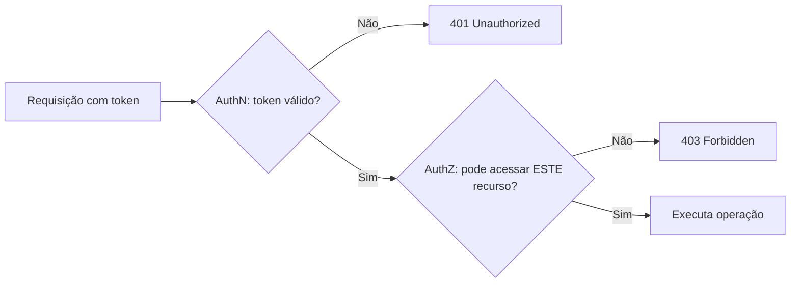
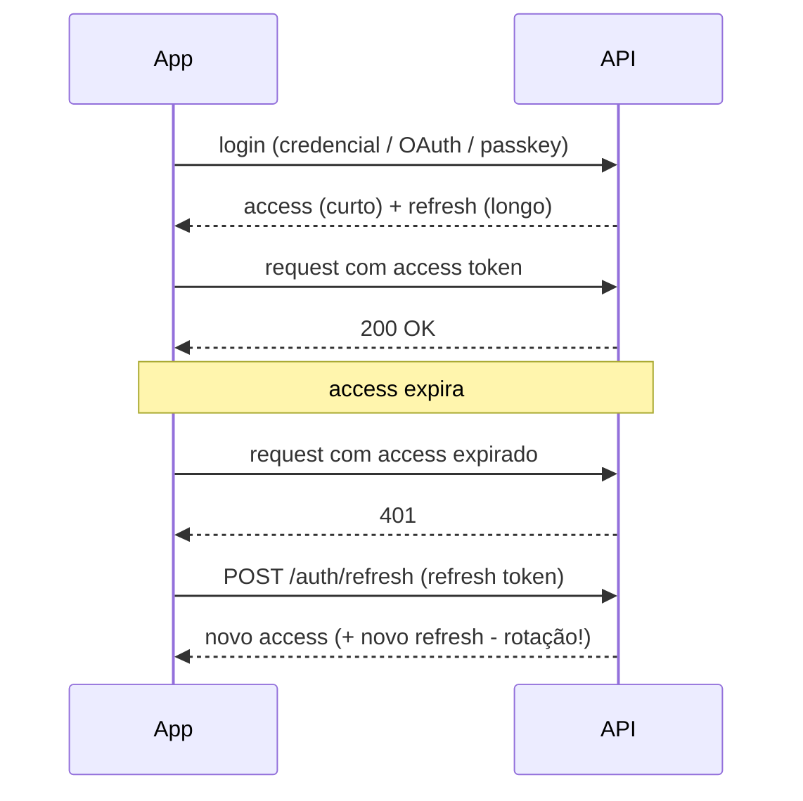
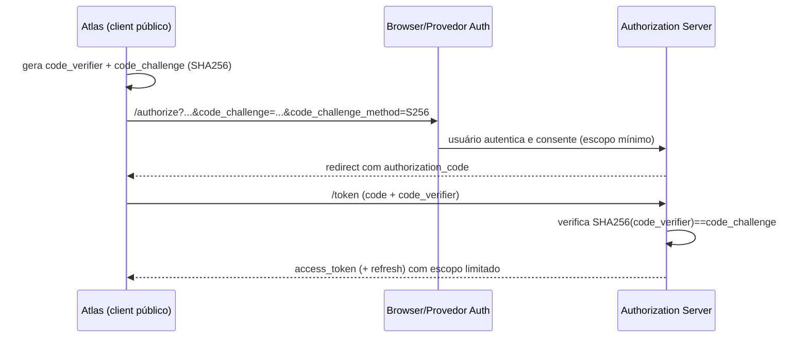

# 16 — Security (Segurança)

> **Fase geral:** Fundacional + evolutiva (🟢→🔵→🟡→🟠) · **Leia antes:** [`ATLAS_MASTER_CONTEXT.md`](ATLAS_MASTER_CONTEXT.md), [`15_Privacy_Architecture.md`](15_Privacy_Architecture.md)
> **Documentos relacionados:** [`07_System_Architecture`](07_System_Architecture.md), [`08_Mobile_Architecture`](08_Mobile_Architecture.md), [`09_Backend_Architecture`](09_Backend_Architecture.md), [`10_Database_Design`](10_Database_Design.md), [`12_AI_Architecture`](12_AI_Architecture.md), [`15_Privacy_Architecture`](15_Privacy_Architecture.md), [`17_API_Design`](17_API_Design.md), [`24_ADRs`](24_ADRs.md), [`27_DevOps`](27_DevOps.md)
> **Status:** Vivo · **Versão:** 0.1 · **Última atualização:** 2026-07-20
> **Âncora canônica:** [`ATLAS_MASTER_CONTEXT.md` §5.2](ATLAS_MASTER_CONTEXT.md) — Auth = **JWT (access+refresh) + OAuth p/ conectores** no 🟢 MVP; **Passkeys/WebAuthn (🔵)**; **E2EE (🟡)**. ADR-0010 (privacidade inegociável).

---

## Resumo executivo

Se [`15_Privacy_Architecture`](15_Privacy_Architecture.md) responde *"que garantias o usuário
tem sobre seus dados"*, este documento responde *"como impedimos, na prática, que alguém quebre
essas garantias"*. Privacidade é a **política**; segurança é a **execução técnica** que a torna
verdadeira.

Este documento cobre, a fundo:

1. **Autenticação vs. autorização** — as duas perguntas distintas ("quem é você?" × "o que você
   pode fazer?") e por que confundi-las causa vulnerabilidades.
2. **JWT a fundo** — estrutura (header/payload/signature), assinatura (HS256 × RS256/EdDSA),
   o par **access + refresh**, **rotação** e **revogação** (o ponto fraco do JWT), e
   **armazenamento seguro no mobile** (SecureStore/Keychain, riscos de XSS/roubo). Sessões ×
   tokens.
3. **OAuth 2.0 / OIDC a fundo** — os fluxos, com foco em **Authorization Code + PKCE** para
   conectores, e **por que PKCE** é obrigatório em apps públicos. **Passkeys/WebAuthn (🔵)** e
   FIDO2 como o futuro pós-senha.
4. **Autorização** — **RBAC × ABAC**, e **isolamento multi-tenant** (a especialidade do autor),
   com o padrão "toda query filtra por `user_id`".
5. **OWASP Top 10 aplicado ao Atlas** — injection, SSRF (crítico nos conectores), IDOR/BOLA,
   rate limiting, brute force, secrets management, dependências (supply chain), e a segurança de
   **webhooks e conectores**.
6. **Auditoria e logs de segurança** — o registro imutável que sustenta *non-repudiation* e
   alimenta a **DPIA** ([`15` §7.6](15_Privacy_Architecture.md)).

> **Princípios-mestres:** *defense in depth* (várias camadas), *least privilege* (mínimo
> acesso), *fail secure* (falhar negando), *secure by default* ([`15` §7.8](15_Privacy_Architecture.md)),
> e *não invente cripto*. Cada mitigação aqui mapeia para o **threat model STRIDE** de
> [`15` §8](15_Privacy_Architecture.md).

---

## 1. Autenticação vs. Autorização

### 1.1. O que são (a distinção que tudo depende)

| | **Autenticação (AuthN)** | **Autorização (AuthZ)** |
|---|---|---|
| Pergunta | *"Quem é você?"* | *"O que você pode fazer?"* |
| Prova | Credencial (senha, passkey, token) | Política (papel, atributo, dono do recurso) |
| Quando | No login e a cada requisição (via token) | A cada operação sobre um recurso |
| Falha comum | Roubo de credencial/sessão (Spoofing) | IDOR, escalação de privilégio (Elevation) |
| No Atlas | JWT + OAuth (§2, §3); Passkeys 🔵 | RBAC/ABAC + isolamento multi-tenant (§4) |

### 1.2. Por que a distinção importa

A falha clássica é **autenticar mas não autorizar**: o sistema confirma que você está logado e
assume que você pode acessar `/events/123` — sem checar se o evento 123 é **seu**. Isso é
**IDOR/BOLA** (§5), a vulnerabilidade nº 1 de APIs. Autenticação forte **não** protege contra
autorização fraca.



> **Regra dura:** todo endpoint que toca dado do usuário passa por **ambos** os portões. No
> Atlas, o segundo portão inclui **sempre** o filtro `user_id` (§4.3).

---

## 2. Autenticação com JWT (🟢 MVP)

### 2.1. O que é um JWT

**JWT (JSON Web Token)** é um token **autocontido** e **assinado** que carrega *claims*
(afirmações sobre o usuário) de forma que o servidor pode **verificar sem consultar o banco** —
graças à assinatura. Formato: três partes Base64URL separadas por ponto.

```
header.payload.signature
eyJhbGciOiJFZERTQSIsInR5cCI6IkpXVCJ9.eyJzdWIiOiJ1c2VyXzEyMyIsImV4cCI6MTcwMH0.<assinatura>
```

| Parte | Conteúdo | Exemplo |
|---|---|---|
| **Header** | Algoritmo e tipo | `{"alg":"EdDSA","typ":"JWT"}` |
| **Payload** | *Claims* (sub, exp, iat, roles...) | `{"sub":"user_123","exp":1700,"scope":"user"}` |
| **Signature** | Assinatura das duas partes acima | `EdDSA(base64(header)+"."+base64(payload), chave)` |

*Claims* padrão (RFC 7519): `sub` (subject/user), `iat` (emitido em), `exp` (expira em), `iss`
(emissor), `aud` (audiência), `jti` (ID único do token — chave para revogação, §2.5).

### 2.2. Por que JWT (e por que no MVP)

- **Stateless:** o servidor **não** precisa guardar sessão para validar cada request — só
  verifica a assinatura. Escala horizontalmente sem *sticky sessions* nem store compartilhado.
- **Domínio do autor** ([`ATLAS_MASTER_CONTEXT.md` §3](ATLAS_MASTER_CONTEXT.md)) e **boring
  tech** — atende o MVP sem infra extra.
- **Bom para mobile:** o app guarda o token e o envia no header `Authorization: Bearer`.

### 2.3. Assinatura: como funciona e qual algoritmo

A assinatura é o que impede **tampering** (STRIDE-T): mudar um byte do payload invalida a
assinatura.

| Algoritmo | Tipo | Chave | Quando usar |
|---|---|---|---|
| **HS256** | Simétrico (HMAC-SHA256) | Um segredo compartilhado | Simples, um só serviço confia. Risco: quem valida também pode **forjar** |
| **RS256** | Assimétrico (RSA) | Privada assina, pública valida | Vários serviços validam sem poder forjar |
| **EdDSA (Ed25519)** | Assimétrico (curva) | Idem RS256, menor/mais rápido | **Preferência do Atlas** |

**Decisão Atlas:** começar com **assimétrico (EdDSA/RS256)** mesmo no monólito, porque o
roadmap prevê extração de serviços (🟠) e webhooks/SDK ([`17`](17_API_Design.md),
[`28`](28_Open_Source_Strategy.md)) — a chave pública pode validar tokens sem expor a
capacidade de forjá-los.

> **Armadilha `alg:none`:** JWTs com `alg: none` (sem assinatura) já causaram breaches enormes.
> **Mitigação:** a biblioteca deve ter uma **allowlist de algoritmos**; nunca confiar no `alg`
> declarado no header do token para escolher a verificação.

### 2.4. Access token + Refresh token (o par)

Um único token de longa duração é um problema: se longo, roubo é catastrófico; se curto, o
usuário faz login toda hora. A solução é **dois tokens**:

| Token | Vida | Onde é usado | Onde guardar |
|---|---|---|---|
| **Access token** | Curta (5–15 min) | Enviado a cada request | Memória / SecureStore |
| **Refresh token** | Longa (dias–semanas) | Só para obter novo access token | **SecureStore/Keychain** (nunca acessível a JS web) |



### 2.5. Rotação e revogação (o ponto fraco do JWT — resolvido)

**Problema:** JWT é *stateless* → não dá para "invalidar" um access token antes de expirar (não
há sessão para apagar). Duas técnicas resolvem:

**Refresh token rotation:**
- A cada refresh, emite-se um **novo refresh token** e **invalida-se o anterior**.
- **Detecção de reuso:** se um refresh **já usado** aparece de novo → sinal de roubo → revoga
  **toda a família** de tokens daquele usuário e força re-login. (Padrão *reuse detection*.)

**Revogação:**
- **Access token curto** (5–15 min) limita a janela de dano sem precisar revogar.
- **Refresh token** é *stateful*: guardado no servidor (tabela/Redis) com `jti`; revogar =
  apagar/marcar. Logout, "sair de todos os dispositivos" e deleção de conta usam isso.
- **Denylist opcional** de `jti` de access tokens (em Redis com TTL = `exp`) para revogação
  imediata em incidentes.

```sql
CREATE TABLE refresh_tokens (
  jti          UUID PRIMARY KEY,
  user_id      UUID NOT NULL REFERENCES users(id),
  family_id    UUID NOT NULL,          -- família p/ reuse detection
  device_id    TEXT,
  hashed_token TEXT NOT NULL,           -- guardar HASH, nunca o token cru
  expires_at   TIMESTAMPTZ NOT NULL,
  revoked_at   TIMESTAMPTZ,
  used_at      TIMESTAMPTZ             -- se usado 2x => roubo => revoga família
);
```

> **Guardar hash, não o token:** refresh tokens no servidor são armazenados **hasheados**
> (como senhas). Um dump do banco não vaza tokens usáveis.

### 2.6. Armazenamento seguro no mobile (crítico)

O token é uma credencial: se roubado, é *game over* (STRIDE-S). Onde guardar:

| Local | Segurança | Uso no Atlas |
|---|---|---|
| **SecureStore (Expo) / Keychain (iOS) / Keystore (Android)** | Alta — cifrado por hardware, isolado por app | **Refresh token e chaves** ✅ |
| **AsyncStorage / SQLite comum** | Baixa — texto claro, acessível se device comprometido | ❌ nunca para credenciais |
| **Memória (variável)** | Volátil, some ao fechar | Access token (curto) ok |

```typescript
import * as SecureStore from "expo-secure-store";

// Refresh token e chaves E2EE vão para armazenamento cifrado por hardware
await SecureStore.setItemAsync("atlas.refresh_token", refreshToken, {
  keychainAccessible: SecureStore.WHEN_UNLOCKED_THIS_DEVICE_ONLY, // não vaza em backup
  requireAuthentication: true, // exige biometria/PIN p/ ler (opcional)
});

const refresh = await SecureStore.getItemAsync("atlas.refresh_token");
```

**Riscos de XSS e roubo:**
- **Web (se houver painel):** XSS que lê `localStorage` rouba o token. **Mitigação:** refresh
  em cookie **HttpOnly + Secure + SameSite**, CSP restritiva, e **nunca** guardar token em
  `localStorage`. Access token em memória.
- **Mobile:** o principal vetor é **device comprometido/rooteado** ou malware. Mitigações:
  SecureStore, detecção de root/jailbreak (🔵), `requireAuthentication` (biometria), certificate
  pinning ([`15` §5.2](15_Privacy_Architecture.md)).
- **Roubo físico:** SecureStore `THIS_DEVICE_ONLY` + lock de app + refresh curto.

### 2.7. Sessões (stateful) × Tokens (stateless)

| | **Sessão (cookie + server store)** | **Token (JWT)** |
|---|---|---|
| Estado | No servidor (Redis/DB) | No cliente (autocontido) |
| Revogação | Trivial (apaga a sessão) | Difícil (precisa denylist/refresh) |
| Escala | Precisa store compartilhado | Stateless, escala fácil |
| Mobile/cross-domain | Menos natural | Natural (`Bearer`) |
| Vazamento | Session ID (opaco) | Claims legíveis (não guardar segredo no payload!) |

**Decisão Atlas:** **tokens (JWT)** para o app mobile (stateless, natural), com refresh
**stateful** (o melhor dos dois: escala + revogável). Um eventual painel web usaria cookies
HttpOnly para o refresh.

---

## 3. OAuth 2.0, OIDC e o futuro sem senha

### 3.1. OAuth 2.0 — o que é e por que existe

**OAuth 2.0** é um framework de **autorização delegada**: permite que o Atlas acesse dados do
usuário em um **terceiro** (Google Calendar, banco, Health) **sem** o usuário dar sua senha ao
Atlas. O usuário autoriza no próprio provedor; o Atlas recebe um **access token** com escopo
limitado.

> **AuthN × AuthZ de novo:** OAuth 2.0 é **autorização** (acesso a recursos). Para
> **autenticação** ("provar quem é"), usa-se **OIDC** (camada por cima do OAuth). Confundir os
> dois é erro clássico ("login com OAuth" mal feito).

Atores: **Resource Owner** (usuário), **Client** (Atlas), **Authorization Server** (Google),
**Resource Server** (API do Calendar).

### 3.2. OIDC (OpenID Connect)

**OIDC** adiciona ao OAuth um **ID Token** (um JWT) que prova a identidade do usuário — é o que
torna "Login com Google" uma autenticação de verdade, não só autorização. Claims: `sub`, `email`,
`name`, etc. O Atlas pode oferecer login social via OIDC (🔵), mas o **conector** de dados usa
OAuth puro com escopo mínimo ([`15` §3](15_Privacy_Architecture.md)).

### 3.3. Os fluxos (grant types) e por que só um importa no Atlas

| Fluxo | Uso | Status no Atlas |
|---|---|---|
| **Authorization Code + PKCE** | Apps mobile/SPA (clientes **públicos**) | ✅ **Padrão para conectores** |
| Authorization Code (sem PKCE) | Web server clássico (client **confidencial**) | Só se houver backend guardando o secret |
| Client Credentials | Máquina-a-máquina (sem usuário) | 🟠 integrações internas |
| Implicit | (legado, inseguro) | ❌ nunca |
| Resource Owner Password | (usuário dá senha ao client) | ❌ nunca (anti-padrão) |
| Device Code | TVs/CLIs sem browser | Talvez CLI/SDK futuro |

### 3.4. Authorization Code + PKCE a fundo (o fluxo dos conectores)

**PKCE (Proof Key for Code Exchange, "pixy")** protege o fluxo em **clientes públicos** (apps
mobile não conseguem guardar um `client_secret` — ele estaria no binário, extraível).

**Como funciona:**
1. O app gera um `code_verifier` aleatório e o `code_challenge = SHA256(code_verifier)`.
2. Envia o usuário ao provedor com o `code_challenge`.
3. Usuário autoriza → provedor devolve um **authorization code** (curto, uso único).
4. O app troca o code pelo token, **enviando o `code_verifier` original**.
5. O provedor confere `SHA256(code_verifier) == code_challenge` guardado no passo 2.



**Por que PKCE:** sem ele, um app malicioso que intercepte o `authorization_code` (via
redirect/URL scheme sequestrado) poderia trocá-lo por token. Com PKCE, o code é **inútil** sem o
`code_verifier`, que nunca saiu do device legítimo. **PKCE é obrigatório** para todo cliente
público (RFC recomenda para todos).

**Segurança adicional dos conectores:**
- Validar o parâmetro **`state`** (anti-CSRF no callback OAuth).
- **Escopos mínimos** ([`15` §3](15_Privacy_Architecture.md)).
- Tokens dos provedores guardados **cifrados** no servidor / SecureStore (§2.6).
- Refresh dos tokens de conector com tratamento de expiração/revogação.

### 3.5. Passkeys / WebAuthn — o pós-senha (🔵 V1)

- **O que são:** credenciais baseadas em **criptografia de chave pública** (padrão **FIDO2 =
  WebAuthn + CTAP**). No cadastro, o device gera um par de chaves; a **privada** nunca sai do
  device (fica no Secure Enclave/TPM); o servidor guarda só a **pública**. No login, o servidor
  manda um *challenge*; o device o **assina** com a privada (destravada por biometria/PIN).
- **Por que são superiores à senha:**

| Ataque | Senha | Passkey |
|---|---|---|
| Phishing | Vulnerável (usuário digita em site falso) | **Imune** (credencial atada à origem/domínio) |
| Vazamento de banco | Hash pode ser quebrado | Só chave **pública** vaza (inútil) |
| Reuso entre sites | Comum e perigoso | Não existe (par por site) |
| Brute force | Possível | Inviável (chave pública) |
| Servidor "não sabe o segredo" | Sabe o hash | **Nunca vê a privada** |

- **No Atlas (🔵):** substituir/complementar senha por passkeys, alinhado ao princípio "servidor
  não guarda segredo do usuário" ([`15`](15_Privacy_Architecture.md)). Sincronização de passkeys
  via iCloud Keychain/Google Password Manager melhora UX multi-device.
- **Trade-offs:** recuperação de conta (device perdido) exige backup/fallback; suporte varia por
  device antigo. Por isso é 🔵, não 🟢.

---

## 4. Autorização

### 4.1. RBAC (Role-Based Access Control)

- **O que é:** permissões atreladas a **papéis** (roles); usuários recebem papéis. Ex.: `user`,
  `admin`, `support`.
- **Prós:** simples, fácil de auditar. **Contras:** rígido — "role explosion" quando regras
  dependem de contexto (ex.: "só o dono", "só no horário X").
- **No Atlas:** RBAC básico no MVP — a maioria dos usuários é `user`; papéis administrativos
  (futuro, com equipe) mínimos e com *least privilege*.

### 4.2. ABAC (Attribute-Based Access Control)

- **O que é:** decisões baseadas em **atributos** do sujeito, do recurso, da ação e do ambiente
  (ex.: "permitir se `resource.owner_id == subject.user_id` **e** ação=read"). Mais expressivo.
- **Prós:** granular, contextual. **Contras:** mais complexo de raciocinar/testar.
- **No Atlas:** a regra dominante é **ABAC implícito de propriedade**: *"você só acessa o que é
  seu"* (`resource.user_id == token.sub`). Isso é a espinha dorsal do isolamento multi-tenant.

### 4.3. Isolamento multi-tenant (a especialidade do autor)

O Atlas é multi-tenant (cada usuário é um tenant lógico). **A falha nº 1 de multi-tenant é
vazar dado entre tenants** (IDOR/BOLA, STRIDE-E/I). Camadas de defesa:

1. **Filtro obrigatório por `user_id`:** **toda** query carrega `WHERE user_id = :currentUser`.
   Nunca confiar só no ID vindo da URL.
2. **Guard central no NestJS:** o `user_id` vem do **token verificado**, não do request body.
3. **Row-Level Security (RLS) no PostgreSQL** (defense in depth): o próprio banco recusa linhas
   de outro tenant, mesmo se a aplicação errar.
4. **Testes automatizados cross-tenant:** suíte que tenta acessar recurso de outro usuário e
   **espera 403/404** ([`26_Testing`](26_Testing.md)).

```typescript
// Guard/pattern no NestJS: o dono vem do token, o acesso é sempre escopado
@Injectable()
export class OwnershipGuard implements CanActivate {
  canActivate(ctx: ExecutionContext): boolean {
    const req = ctx.switchToHttp().getRequest();
    // user_id NUNCA vem do body/param; vem do JWT verificado
    req.tenantUserId = req.user.sub;
    return true;
  }
}

// Repositório: filtro por tenant é inescapável
async findEvent(id: string, tenantUserId: string) {
  return this.db.query.events.findFirst({
    where: (e, { and, eq }) => and(eq(e.id, id), eq(e.userId, tenantUserId)),
  }); // recurso de outro usuário => retorna null => 404 (não vaza existência)
}
```

```sql
-- Defense in depth: RLS no Postgres (o banco também protege)
ALTER TABLE events ENABLE ROW LEVEL SECURITY;
CREATE POLICY tenant_isolation ON events
  USING (user_id = current_setting('app.current_user_id')::uuid);
```

> **Detalhe de segurança:** retornar **404** (e não 403) para recurso de outro tenant evita
> vazar a **existência** do recurso (*enumeration*). Escolha consistente por endpoint.

---

## 5. OWASP Top 10 aplicado ao Atlas

> **O que é OWASP Top 10:** lista consensual das categorias de risco mais críticas em apps web.
> Abaixo, cada uma **aplicada ao Atlas**, com o ataque, o risco concreto e a proteção. Mapeia
> para o STRIDE de [`15` §8](15_Privacy_Architecture.md).

### 5.1. A01 — Broken Access Control (inclui IDOR/BOLA)

- **Ataque:** `GET /events/{id}` de outro usuário; escalar para admin. **É o risco nº 1 do
  Atlas** (multi-tenant, dado íntimo).
- **Proteção:** §4.3 (filtro `user_id` + RLS + testes cross-tenant); *deny by default*; 404 em
  vez de 403 para não enumerar.

### 5.2. A02 — Cryptographic Failures

- **Ataque:** dado sensível em texto claro, cripto fraca, chave hardcoded.
- **Proteção:** TLS 1.3, AES-256-GCM (AEAD), Argon2id p/ senhas, E2EE 🟡, chaves no KMS/Secure
  Enclave — tudo em [`15` §5](15_Privacy_Architecture.md). Nunca inventar cripto.

### 5.3. A03 — Injection (SQL, NoSQL, command, **prompt**)

- **Ataque:** `'; DROP TABLE events;--`; injeção de comando; **prompt injection** no LLM.
- **Proteção:**
  - **SQL:** ORM (Prisma/Drizzle) com **queries parametrizadas** — nunca concatenar string.
  - **Validação de input:** DTOs com `class-validator`/Zod em toda borda ([`17`](17_API_Design.md)).
  - **Prompt injection** (novo vetor de IA): tratar dado do usuário/conteúdo externo como
    **não confiável** no prompt; separar instruções de dados; limitar ações do LLM; validar
    saída. Ver [`12_AI_Architecture`](12_AI_Architecture.md).

```typescript
// ERRADO (injection): string concatenada
db.execute(`SELECT * FROM events WHERE type = '${userInput}'`);
// CERTO: parametrizado
db.select().from(events).where(eq(events.type, userInput));
```

### 5.4. A04 — Insecure Design

- **Ataque:** falhas na *concepção* (ex.: fluxo de reset de senha sem rate limit; deleção que
  não apaga de verdade).
- **Proteção:** *threat modeling* (STRIDE, [`15` §8](15_Privacy_Architecture.md)) e o **crivo
  de segurança/privacidade** por PR ([`15` §10](15_Privacy_Architecture.md)); *secure by
  default*.

### 5.5. A05 — Security Misconfiguration

- **Ataque:** CORS aberto, headers ausentes, debug em produção, S3 público, defaults inseguros.
- **Proteção:** **Helmet** (headers seguros), CORS restritivo (allowlist de origens), CSP,
  HSTS, desabilitar stack traces em prod, IaC revisado ([`27_DevOps`](27_DevOps.md)).

```typescript
import helmet from "helmet";
app.use(helmet()); // HSTS, X-Content-Type-Options, X-Frame-Options, CSP base...
app.enableCors({ origin: ALLOWED_ORIGINS, credentials: true }); // nunca "*" com credentials
```

### 5.6. A06 — Vulnerable & Outdated Components (Supply Chain)

- **Ataque:** dependência npm com CVE ou maliciosa (typosquatting, pacote comprometido).
- **Proteção:** **Dependabot/Renovate**, `npm audit` em CI, **lockfiles** commitados, **SBOM**,
  pin de versões, revisão de novas deps, SCA ([`27`](27_DevOps.md)).

### 5.7. A07 — Identification & Authentication Failures

- **Ataque:** brute force, credential stuffing, sessão mal gerida, MFA ausente.
- **Proteção:** Argon2id p/ senhas; **rate limiting + lockout progressivo** (§5.11); refresh
  rotation + reuse detection (§2.5); MFA/passkeys (🔵); mensagens de erro genéricas (não revelar
  "usuário existe").

### 5.8. A08 — Software & Data Integrity Failures

- **Ataque:** CI/CD comprometido, update não assinado, desserialização insegura.
- **Proteção:** builds reproduzíveis, artefatos assinados, OTA (Expo) com verificação de
  integridade, proteção do pipeline ([`27`](27_DevOps.md)), assinatura de webhooks (§6).

### 5.9. A09 — Security Logging & Monitoring Failures

- **Ataque:** ataque passa despercebido por falta de logs/alertas.
- **Proteção:** logs de auditoria estruturados + Sentry + alertas (§7).

### 5.10. A10 — SSRF (Server-Side Request Forgery) — **crítico nos conectores**

- **Ataque:** um conector/webhook faz o **servidor** requisitar uma URL controlada pelo atacante
  — incluindo **endpoints internos** (metadata da cloud `169.254.169.254`, serviços privados),
  vazando credenciais/segredos.
- **Por que crítico no Atlas:** conectores por natureza fazem requests a URLs externas; webhooks
  recebem/seguem URLs. É a superfície SSRF clássica.
- **Proteção:**
  - **Allowlist** de domínios/hosts permitidos por conector.
  - **Bloquear IPs privados/reservados** (RFC1918, loopback, link-local, metadata) na resolução
    DNS **e** após redirects.
  - Desabilitar/limitar **redirects**; validar esquema (`https` só); timeouts curtos.
  - Rodar egress de conectores com **rede/identidade de menor privilégio** ([`27`](27_DevOps.md)).

```typescript
// Guarda anti-SSRF (esboço) antes de qualquer fetch de conector
function assertSafeUrl(url: URL) {
  if (url.protocol !== "https:") throw new ForbiddenError("only https");
  if (!CONNECTOR_HOST_ALLOWLIST.has(url.hostname)) throw new ForbiddenError("host not allowed");
  // resolver DNS e rejeitar IPs privados/link-local/metadata (checar também após redirects)
  const ip = resolveHostToIp(url.hostname);
  if (isPrivateOrReserved(ip)) throw new ForbiddenError("blocked internal target");
}
```

### 5.11. Rate limiting, brute force e abuso (transversal)

- **Rate limiting:** limitar req/min por IP, por usuário e por rota sensível
  ([`17` §rate limiting](17_API_Design.md)). Protege contra brute force, DoS (STRIDE-D) e
  **estouro de custo de LLM** (quota por usuário, circuit breaker — [`12`](12_AI_Architecture.md)).
- **Brute force / credential stuffing:** backoff exponencial, lockout temporário, CAPTCHA (🔵),
  detecção de padrões anômalos.
- **Idempotency + rate limit** juntos protegem endpoints de escrita ([`17`](17_API_Design.md)).

```typescript
// Rate limit por rota (NestJS Throttler) — mais estrito em auth
@Throttle({ default: { limit: 5, ttl: 60_000 } }) // 5 tentativas/min
@Post("auth/login")
login() { /* ... */ }
```

### 5.12. Secrets management

- **Ataque:** segredo (DB creds, API key de LLM, chave de assinatura JWT) vazado no repo/log.
- **Proteção:** **AWS Secrets Manager / SSM** (nunca `.env` no repo), injeção via ambiente,
  **rotação** de segredos, *secret scanning* no CI (gitleaks/trufflehog), logs que **redigem**
  segredos. Chaves de assinatura JWT rotacionáveis (via `kid` no header). Ver
  [`27_DevOps`](27_DevOps.md) e [`15` §5](15_Privacy_Architecture.md).

---

## 6. Segurança de webhooks e conectores

Conectores e webhooks são a **maior superfície de ataque** do Atlas (dados externos, requests
de/para terceiros).

### 6.1. Webhooks **inbound** (provedor → Atlas)

Riscos: falsificação (STRIDE-S), replay, tampering (STRIDE-T), payload malicioso.

| Proteção | Como |
|---|---|
| **Verificar assinatura HMAC** | Provedor assina o payload com um segredo compartilhado; o Atlas recalcula `HMAC-SHA256(body, secret)` e compara em **tempo constante** |
| **Anti-replay** | Validar `timestamp` do header (rejeitar > N min) + `nonce`/idempotency-key ([`17`](17_API_Design.md)) |
| **Validar schema** | DTO/Zod estrito; rejeitar campos inesperados |
| **Idempotência** | Mesmo webhook 2x → um efeito só (idempotency-key, [`17`](17_API_Design.md)) |
| **Isolamento** | Processar em worker (BullMQ), não no request path; timeouts |

```typescript
import { createHmac, timingSafeEqual } from "node:crypto";

function verifyWebhook(rawBody: Buffer, signature: string, secret: string): boolean {
  const expected = createHmac("sha256", secret).update(rawBody).digest("hex");
  const a = Buffer.from(expected), b = Buffer.from(signature);
  // comparação em tempo constante evita timing attack
  return a.length === b.length && timingSafeEqual(a, b);
}
```

### 6.2. Requests **outbound** (Atlas → provedor)

- **Anti-SSRF** (§5.10): allowlist, bloqueio de IP interno, sem redirect livre.
- **Escopos mínimos** e tokens de conector cifrados ([`15` §3](15_Privacy_Architecture.md)).
- **Timeouts, retries com backoff, circuit breaker** — resiliência sem amplificar abuso.

---

## 7. Auditoria e logs de segurança

### 7.1. O que é e por que

Logs de auditoria sustentam **non-repudiation** (STRIDE-R): registro imutável de **quem fez o
quê, quando**. São exigência de conformidade (alimentam a DPIA, [`15` §7.6](15_Privacy_Architecture.md))
e a base para detecção/resposta a incidentes (A09).

### 7.2. O que registrar (e o que **não**)

**Registrar:** login/logout, falhas de auth, refresh/rotação, mudanças de consentimento
([`15` §4](15_Privacy_Architecture.md)), DSAR (export/deleção), conexão/revogação de conector,
acessos administrativos, mudanças de permissão, eventos de segurança (rate limit atingido,
SSRF bloqueado).

**Nunca registrar:** senhas, tokens, chaves, **conteúdo de dados sensíveis**. Logs usam
**pseudonimização** (`user_id` opaco, `ip_hash`) — [`15` §6](15_Privacy_Architecture.md).

```typescript
// Log de auditoria estruturado (pino) — metadados, nunca conteúdo sensível
auditLog.info({
  event: "connector.revoked",
  userId: user.sub,          // opaco
  connectorId: "google_calendar",
  ipHash: hashIp(req.ip),    // pseudonimizado
  ts: new Date().toISOString(),
  reqId: req.id,
}); // SEM payload de dados, SEM tokens
```

### 7.3. Integridade e retenção

- **Imutabilidade:** append-only; opção de *hash chain* (cada linha inclui hash da anterior)
  para detectar adulteração.
- **Retenção com propósito:** reter pelo prazo legal/segurança, depois expurgar (minimização).
- **Monitoramento:** Sentry para erros; alertas para anomalias (picos de 401/403, SSRF
  bloqueado, reuse de refresh detectado) — [`27_DevOps`](27_DevOps.md).

---

## 8. Ligação com outros documentos

| Tema | Documento |
|---|---|
| Base de privacidade, STRIDE, LGPD/GDPR, E2EE | [`15_Privacy_Architecture`](15_Privacy_Architecture.md) |
| Contratos de API, erros padronizados, rate limit, idempotency | [`17_API_Design`](17_API_Design.md) |
| SecureStore, cifra local, pinning, root detection | [`08_Mobile_Architecture`](08_Mobile_Architecture.md) |
| Guards, módulos, RLS, repositórios | [`09_Backend_Architecture`](09_Backend_Architecture.md) |
| RLS, cifra em repouso, crypto-shredding | [`10_Database_Design`](10_Database_Design.md) |
| Prompt injection, quota/custo de LLM | [`12_AI_Architecture`](12_AI_Architecture.md) |
| Secrets, CI/CD seguro, headers, egress | [`27_DevOps`](27_DevOps.md) |
| Testes de segurança/cross-tenant | [`26_Testing`](26_Testing.md) |
| Decisões formais (auth, privacidade) | [`24_ADRs`](24_ADRs.md) |

---

## 9. Checklist de segurança por feature/PR

- [ ] **AuthN** presente e **AuthZ** por recurso (filtro `user_id`, §4.3)?
- [ ] Tokens: access curto, refresh rotacionado, guardado em SecureStore (§2)?
- [ ] Input validado (DTO/Zod), queries parametrizadas (§5.3)?
- [ ] IDOR testado (cross-tenant retorna 404/403, §4.3)?
- [ ] SSRF: allowlist + bloqueio de IP interno em conectores/webhooks (§5.10, §6)?
- [ ] Webhooks: assinatura HMAC + anti-replay + idempotência (§6)?
- [ ] Rate limiting nas rotas sensíveis + quota de LLM (§5.11)?
- [ ] Segredos fora do repo, no Secrets Manager, sem log (§5.12)?
- [ ] Headers seguros (Helmet), CORS restrito, HSTS (§5.5)?
- [ ] Log de auditoria (sem conteúdo sensível) para a ação (§7)?
- [ ] Deps: audit/Dependabot/lockfile atualizados (§5.6)?

---

### Resumo executivo (fecho)

Segurança no Atlas é a **execução técnica** das promessas de [`15`](15_Privacy_Architecture.md).
**Autenticação** ("quem é você") usa **JWT assimétrico com access curto + refresh rotacionado
(com reuse detection)**, guardado em **SecureStore**, evoluindo para **Passkeys/WebAuthn (🔵)**
que eliminam senha e phishing. **Autorização** ("o que pode fazer") combina **RBAC** simples com
o **isolamento multi-tenant** inescapável (`user_id` do token + RLS + testes cross-tenant),
matando IDOR/BOLA — o risco nº 1. Conectores usam **OAuth Authorization Code + PKCE** com escopo
mínimo, e webhooks exigem **assinatura HMAC + anti-replay**. O **OWASP Top 10** é tratado ponto a
ponto, com destaque para **SSRF** (crítico nos conectores) e **injection** (incl. prompt
injection). Tudo é observado por **logs de auditoria pseudonimizados** que sustentam
non-repudiation e a DPIA. Em uma frase: **defense in depth + least privilege + secure by
default**, porque o dado do Atlas não admite um segundo erro.
