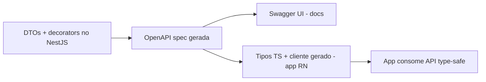
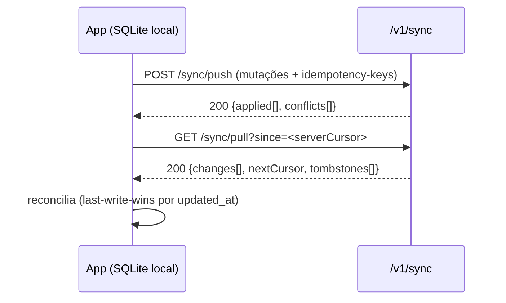
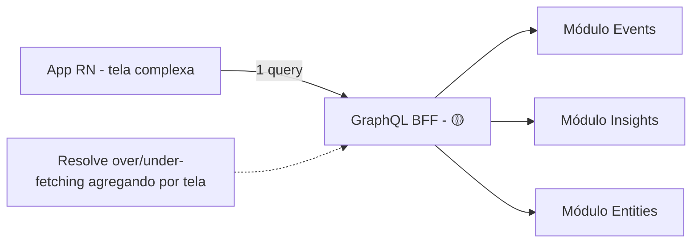
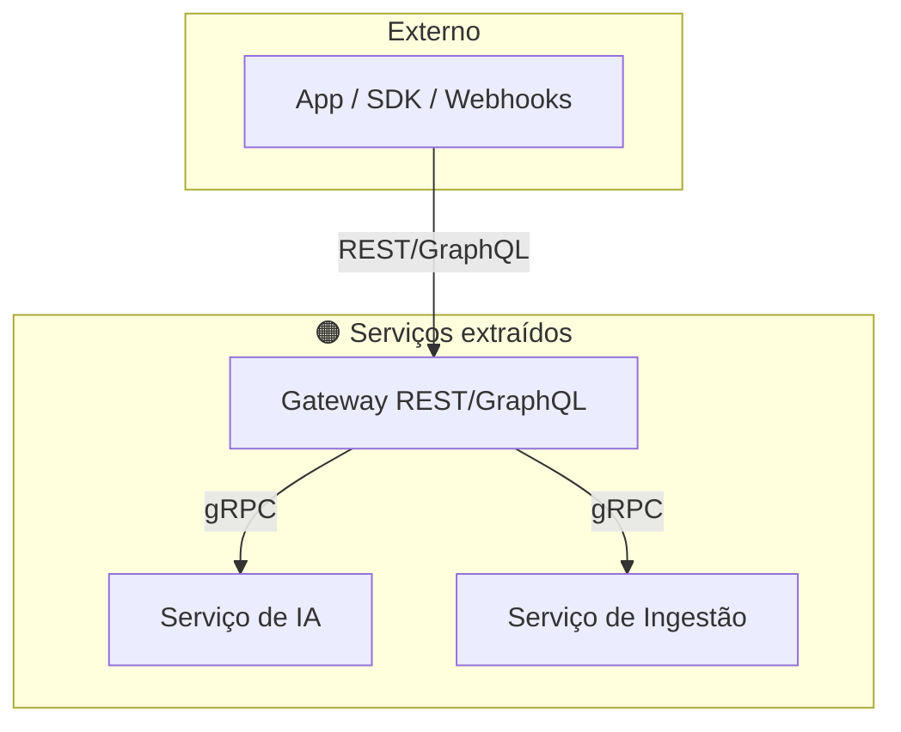

# 17 — API Design (Design de APIs)

> **Fase geral:** Fundacional + evolutiva (🟢→🟡→🟠) · **Leia antes:** [`ATLAS_MASTER_CONTEXT.md`](ATLAS_MASTER_CONTEXT.md), [`07_System_Architecture.md`](07_System_Architecture.md)
> **Documentos relacionados:** [`08_Mobile_Architecture`](08_Mobile_Architecture.md), [`09_Backend_Architecture`](09_Backend_Architecture.md), [`10_Database_Design`](10_Database_Design.md), [`11_Event_Model`](11_Event_Model.md), [`12_AI_Architecture`](12_AI_Architecture.md), [`15_Privacy_Architecture`](15_Privacy_Architecture.md), [`16_Security`](16_Security.md), [`22_Business_Model`](22_Business_Model.md), [`24_ADRs`](24_ADRs.md), [`28_Open_Source_Strategy`](28_Open_Source_Strategy.md)
> **Status:** Vivo · **Versão:** 0.1 · **Última atualização:** 2026-07-20
> **Âncora canônica:** [`ATLAS_MASTER_CONTEXT.md` §5.2](ATLAS_MASTER_CONTEXT.md) e ADR-0005 — **REST + OpenAPI no MVP**; **GraphQL BFF p/ mobile (🟡)**; **gRPC interno (🟠)**.

---

## Resumo executivo

A API é o **contrato** entre o app local-first ([`08`](08_Mobile_Architecture.md)) e o backend
NestJS ([`09`](09_Backend_Architecture.md)). Num sistema onde o dado nasce no device e a nuvem é
réplica opcional ([`15`](15_Privacy_Architecture.md)), a API não é só "CRUD sobre um banco" — é o
**protocolo de sincronização de uma vida inteira**, e precisa ser previsível, versionável,
seguro e barato de evoluir.

Este documento cobre, a fundo:

1. **Princípios de design de API** — consistência, previsibilidade, contrato explícito,
   evolutibilidade, *robustness principle*.
2. **REST a fundo** — recursos, verbos, status codes, HATEOAS (e por que quase-não usamos),
   **idempotência**, **paginação cursor × offset**, filtragem/ordenação, **versionamento** (URL
   × header).
3. **OpenAPI/Swagger** — contrato-primeiro, geração de tipos e de cliente, e como isso conecta
   com o TypeScript do app.
4. **Design dos endpoints do Atlas por domínio** — auth, events, entities, timeline, insights,
   search, connectors, export — e os **contratos de sync** (ligação com [`08`](08_Mobile_Architecture.md)
   e [`11`](11_Event_Model.md)).
5. **Erros padronizados (`application/problem+json`)**, **rate limiting** e
   **idempotency-keys**.
6. **REST × GraphQL × gRPC** — comparação profunda: por que **REST no MVP**, **GraphQL como BFF
   mobile na 🟡** (over/under-fetching), **gRPC interno na 🟠**; além de **webhooks** e a **API
   pública/SDK** futura (ligação com [`22`](22_Business_Model.md) e [`28`](28_Open_Source_Strategy.md)).

> **Lema aplicado ([`00` §5](00_Project_Vision.md)):** *Make it work → right → scalable.* REST
> resolve o MVP com o menor risco; GraphQL e gRPC entram **só** quando uma dor real justificar.

---

## 1. Princípios de design de API

| Princípio | O que significa | Como o Atlas aplica |
|---|---|---|
| **Consistência** | Mesmas convenções em todo lugar (nomes, erros, paginação) | Guia de estilo único; `problem+json` para todos os erros (§5) |
| **Previsibilidade** | O dev acerta o endpoint "no chute" | Substantivos no plural, verbos HTTP semânticos (§2) |
| **Contrato explícito** | O schema é a fonte de verdade | **OpenAPI-first** (§3); tipos gerados |
| **Evolutibilidade** | Mudar sem quebrar clientes | Versionamento + campos aditivos + *robustness principle* |
| **Menor privilégio / segurança** | API não expõe mais que o necessário | Escopos, `user_id` do token ([`16`](16_Security.md)) |
| **Barato de operar** | Payloads enxutos, cacheável | Paginação, `ETag`, minimização ([`15`](15_Privacy_Architecture.md)) |

> **Robustness principle (Postel):** *"seja conservador no que envia, liberal no que aceita"* —
> com uma ressalva de segurança: **validar estritamente** entradas ([`16` §A03](16_Security.md)).
> Aceitamos campos extras sem quebrar, mas validamos os que usamos.

---

## 2. REST a fundo (🟢 MVP)

### 2.1. O que é REST

**REST (Representational State Transfer)** é um estilo arquitetural: recursos identificados por
**URIs**, manipulados por uma **interface uniforme** (verbos HTTP), com mensagens
**autodescritivas** e **stateless** (cada request carrega tudo que precisa — casa com JWT,
[`16`](16_Security.md)).

### 2.2. Recursos e URIs

- **Substantivos, no plural, minúsculo, kebab-case:** `/events`, `/entities`, `/connectors`.
- **Hierarquia por posse:** `/entities/{id}/relationships`.
- **Sem verbos na URL:** `POST /events` (não `/createEvent`). O verbo é o método HTTP.
- **Ações que não são CRUD:** sub-recurso ou verbo controlado: `POST /export/jobs`,
  `POST /connectors/{id}/sync`.

### 2.3. Verbos HTTP e semântica

| Verbo | Uso | Idempotente? | Seguro (sem efeito)? |
|---|---|---|---|
| `GET` | Ler recurso/coleção | Sim | Sim |
| `POST` | Criar / ação | **Não** (por isso idempotency-key, §5.3) | Não |
| `PUT` | Substituir por completo | Sim | Não |
| `PATCH` | Atualizar parcial | Depende (idealmente sim) | Não |
| `DELETE` | Remover | Sim | Não |

### 2.4. Status codes (usar o certo, sempre)

| Código | Quando |
|---|---|
| `200 OK` | Sucesso com corpo |
| `201 Created` | Recurso criado (retornar `Location`) |
| `202 Accepted` | Aceito para processamento **assíncrono** (export, sync pesado) |
| `204 No Content` | Sucesso sem corpo (ex.: DELETE) |
| `400 Bad Request` | Input inválido (validação) |
| `401 Unauthorized` | Sem/So com auth inválida (AuthN, [`16`](16_Security.md)) |
| `403 Forbidden` | Autenticado mas sem permissão (AuthZ) |
| `404 Not Found` | Não existe **ou** não é seu (evita enumeration, [`16` §4.3](16_Security.md)) |
| `409 Conflict` | Conflito (ex.: versão de sync divergente) |
| `410 Gone` | Recurso deletado (útil no sync/tombstone) |
| `422 Unprocessable Entity` | Sintaxe ok, semântica inválida |
| `429 Too Many Requests` | Rate limit (§5.2) |
| `500 / 503` | Erro do servidor / indisponível |

### 2.5. HATEOAS — o que é e por que quase não usamos

- **O que é:** *Hypermedia As The Engine Of Application State* — as respostas incluem **links**
  que dizem ao cliente quais ações são possíveis a seguir (o cliente "navega" pela API sem URLs
  hardcoded). É o nível máximo do *Richardson Maturity Model* (nível 3).
- **Trade-off:** aumenta o *decoupling*, mas adiciona complexidade e payload que **um cliente
  único e controlado (o app do Atlas) não precisa** — nós controlamos os dois lados.
- **Decisão Atlas:** **REST nível 2** (recursos + verbos + status corretos), **sem HATEOAS
  pleno** no MVP. Usamos links **onde agregam** (paginação: `next`/`prev` cursors, §2.7).
  HATEOAS pode virar relevante na **API pública/SDK** (🟡/🟠, [`28`](28_Open_Source_Strategy.md)).

### 2.6. Idempotência

- **O que é:** uma operação é **idempotente** se executá-la N vezes tem o **mesmo efeito** que
  executá-la uma vez. `GET/PUT/DELETE` são idempotentes por natureza; `POST` **não é**.
- **Por que importa no Atlas:** o app é **offline-first** e reenvia mutações após reconexão
  (sync, [`08`](08_Mobile_Architecture.md)). Sem idempotência, uma retransmissão criaria eventos
  duplicados — corrompendo o CMHL.
- **Como:** **Idempotency-Key** (§5.3).

### 2.7. Paginação — cursor × offset

| | **Offset** (`?page=3&size=20`) | **Cursor** (`?after=<opaque>&limit=20`) |
|---|---|---|
| Como | `LIMIT 20 OFFSET 40` | `WHERE (created_at, id) < cursor ORDER BY ... LIMIT 20` |
| Prós | Simples; permite "pular para página N" | Estável sob inserções; performático em tabelas grandes |
| Contras | **Instável** (itens novos deslocam páginas → duplicatas/omissões); lento em offsets grandes | Sem "pular para página N"; cursor opaco |

**Decisão Atlas:** **cursor-based por padrão** — a **timeline** e os **eventos** são séries
temporais que crescem sempre (offset causaria itens repetidos/perdidos). O cursor é opaco
(codifica `(created_at, id)`).

```jsonc
// GET /events?limit=20&after=eyJjcmVhdGVkX2F0Ijoi...
{
  "data": [ /* ... 20 eventos ... */ ],
  "page": {
    "limit": 20,
    "nextCursor": "eyJjcmVhdGVkX2F0Ijoi...",  // null => fim
    "hasMore": true
  }
}
```

### 2.8. Filtragem, ordenação e *sparse fieldsets*

- **Filtragem:** query params tipados — `?type=sleep.recorded&from=2026-01-01&to=2026-01-31`.
- **Ordenação:** `?sort=-occurred_at` (`-` = desc). Allowlist de campos ordenáveis.
- **Sparse fieldsets:** `?fields=id,type,occurred_at` para reduzir payload (minimização,
  [`15` §3](15_Privacy_Architecture.md)) — mitiga *over-fetching* sem precisar de GraphQL cedo.

### 2.9. Versionamento — URL × header

| Estratégia | Ex. | Prós | Contras |
|---|---|---|---|
| **URL** | `/v1/events` | Explícito, cacheável, trivial de rotear | "Polui" a URL; muda a URI do recurso |
| **Header** | `Accept: application/vnd.atlas.v1+json` | URI estável; versão por conteúdo | Menos visível; harder de testar no browser |
| **Query** | `/events?version=1` | Simples | Fácil de esquecer; cache confuso |

**Decisão Atlas:** **versionamento na URL (`/v1`)** — explícito, simples, alinhado a "boring
tech". Dentro de uma versão, mudanças **aditivas** (novos campos opcionais) não quebram clientes
(robustness principle). Só sobe para `/v2` em *breaking change* real. Política de **deprecação**
com header `Deprecation`/`Sunset` e aviso no changelog.

---

## 3. OpenAPI / Swagger (🟢 MVP)

### 3.1. O que é

**OpenAPI** (antigo Swagger) é uma **especificação** legível por máquina que descreve a API:
endpoints, parâmetros, schemas, respostas, erros, auth. É o **contrato** — a fonte de verdade.

### 3.2. Por que "contract-first" no Atlas

- **Um cliente, um servidor, um autor:** o contrato mantém app e backend em sincronia.
- **Geração de tipos/cliente:** gerar **tipos TypeScript** e um **cliente** do app a partir do
  OpenAPI elimina *drift* e bugs de contrato — o compilador vira teste de integração.
- **Documentação viva** + Swagger UI para explorar.

### 3.3. Como se implementa (NestJS)

O NestJS gera OpenAPI a partir de **decorators + DTOs**, e daí geramos o cliente do app.

```typescript
// DTO vira schema OpenAPI + validação (class-validator) — contrato e runtime alinhados
export class CreateEventDto {
  @ApiProperty({ example: "sleep.recorded" })
  @IsString() @Matches(/^[a-z]+(\.[a-z_]+)+$/)
  type!: string;

  @ApiProperty({ format: "date-time" })
  @IsISO8601()
  occurredAt!: string;

  @ApiProperty({ type: "object", additionalProperties: true })
  @IsObject()
  payload!: Record<string, unknown>;
}
```



- **Fluxo:** DTO → OpenAPI → `openapi-typescript`/`orval` → cliente tipado no app (TanStack
  Query, [`08`](08_Mobile_Architecture.md)).
- **CI:** validar que o spec não teve *breaking change* não intencional (diff de contrato).

---

## 4. Endpoints do Atlas por domínio

> Convenções globais: prefixo `/v1`; `Authorization: Bearer <access>` ([`16`](16_Security.md));
> respostas de erro em `problem+json` (§5.1); coleções paginadas por cursor (§2.7); toda query
> escopada por `user_id` do token ([`16` §4.3](16_Security.md)).

### 4.1. Auth (`/v1/auth`)

| Método | Rota | Descrição |
|---|---|---|
| `POST` | `/auth/register` | Cria conta |
| `POST` | `/auth/login` | Login → access + refresh (rate-limited, [`16` §5.11](16_Security.md)) |
| `POST` | `/auth/refresh` | Rotaciona tokens (reuse detection, [`16` §2.5](16_Security.md)) |
| `POST` | `/auth/logout` | Revoga refresh (device atual) |
| `POST` | `/auth/logout-all` | Revoga todas as sessões |
| `GET`  | `/auth/me` | Perfil do usuário autenticado |

### 4.2. Events (`/v1/events`) — a unidade atômica

Eventos são **imutáveis** (event sourcing "lite", [`11`](11_Event_Model.md)); "editar" cria um
evento de correção. Por isso não há `PUT` de conteúdo — só criação, leitura e *tombstone*.

| Método | Rota | Descrição |
|---|---|---|
| `POST` | `/events` | Cria evento (idempotency-key obrigatória, §5.3) |
| `POST` | `/events:batch` | Cria lote (sync push, §4.9) |
| `GET`  | `/events` | Lista (filtros §2.8, cursor §2.7) |
| `GET`  | `/events/{id}` | Detalhe (404 se não for seu) |
| `POST` | `/events/{id}/corrections` | Correção (novo evento derivado) |
| `DELETE` | `/events/{id}` | Tombstone (marca deletado; crypto-shred no expurgo, [`15` §7.4](15_Privacy_Architecture.md)) |

### 4.3. Entities (`/v1/entities`) e Relationships

| Método | Rota | Descrição |
|---|---|---|
| `GET/POST` | `/entities` | Lista/cria entidades (`Person`, `Place`, ...) |
| `GET/PATCH/DELETE` | `/entities/{id}` | Detalhe/atualiza/remove |
| `GET/POST` | `/entities/{id}/relationships` | Arestas do grafo ([`13`](13_Knowledge_Graph.md)) |

### 4.4. Timeline (`/v1/timeline`)

Read model otimizado ([`11`](11_Event_Model.md)): série temporal unificada. Sempre cursor + filtros
por domínio/tipo/intervalo.

`GET /timeline?from=...&to=...&domains=health,finance&limit=50&after=<cursor>`

### 4.5. Insights (`/v1/insights`)

Conhecimento derivado e **explicável** ([`12`](12_AI_Architecture.md)). Cada insight expõe suas
**evidências** (eventos de origem) — requisito de explicabilidade e de "revisão de decisão
automatizada" ([`15` §7.3](15_Privacy_Architecture.md)).

| Método | Rota | Descrição |
|---|---|---|
| `GET` | `/insights` | Lista insights |
| `GET` | `/insights/{id}` | Detalhe + `evidence[]` (event ids) |
| `POST` | `/insights/{id}/feedback` | Útil/não útil (North Star, [`00` §11](00_Project_Vision.md)) |

### 4.6. Search (`/v1/search`)

Busca semântica (pgvector, [`14`](14_Vector_Search.md)) + filtros. Envio a LLM/embeddings
respeita opt-in e sensibilidade ([`15` §8.6](15_Privacy_Architecture.md)).

`GET /search?q=...&mode=semantic|keyword&limit=20`

### 4.7. Connectors (`/v1/connectors`)

Fluxo OAuth Authorization Code + PKCE ([`16` §3.4](16_Security.md)); escopos mínimos e
consentimento granular ([`15` §4](15_Privacy_Architecture.md)).

| Método | Rota | Descrição |
|---|---|---|
| `GET` | `/connectors` | Catálogo + status por usuário |
| `POST` | `/connectors/{id}/authorize` | Inicia OAuth (retorna URL + `state`) |
| `POST` | `/connectors/{id}/callback` | Troca code+verifier por token (PKCE) |
| `POST` | `/connectors/{id}/sync` | Dispara ingestão (assíncrona → 202) |
| `DELETE` | `/connectors/{id}` | Revoga (consentimento + tokens, [`15` §4.3](15_Privacy_Architecture.md)) |
| `POST` | `/connectors/{id}/webhook` | Recebe webhook (HMAC + anti-replay, [`16` §6](16_Security.md)) |

### 4.8. Export & Data Rights (`/v1/export`, `/v1/account`)

Materializa os direitos do titular ([`15` §7.3–7.4](15_Privacy_Architecture.md)).

| Método | Rota | Descrição |
|---|---|---|
| `POST` | `/export/jobs` | Cria job de exportação (JSON+SQLite) → 202 |
| `GET` | `/export/jobs/{id}` | Status/download (artefato cifrado) |
| `DELETE` | `/account` | Deleção real da conta (crypto-shred, revoga OAuth) → 202 + comprovante |

### 4.9. Contratos de sync (ligação com [`08`](08_Mobile_Architecture.md) e [`11`](11_Event_Model.md))

O sync engine é **push/pull incremental por `updated_at` + fila de mutações** (ADR-0003). A API
expõe dois endpoints centrais:



- **`POST /v1/sync/push`**: envia mutações locais; cada uma com **idempotency-key** (§5.3) para
  reenvio seguro. Retorna aplicadas e **conflitos** (`409` por item, com versão do servidor).
- **`GET /v1/sync/pull?since=<cursor>`**: retorna deltas desde o cursor, incluindo
  **tombstones** (deleções) para propagar remoções. Cursor = `(updated_at, id)`.
- **Resolução de conflito (MVP):** *last-write-wins* por `updated_at` (relógio do servidor como
  árbitro); CRDT é 🔴 ([`08`](08_Mobile_Architecture.md)).

---

## 5. Erros, rate limiting e idempotência

### 5.1. Erros padronizados — `application/problem+json` (RFC 9457)

- **O que é:** um formato **padrão** de corpo de erro, evitando que cada endpoint invente o seu.
- **Por que:** o cliente trata erros de forma uniforme; melhora DX do SDK futuro
  ([`28`](28_Open_Source_Strategy.md)).

```jsonc
// HTTP 422, Content-Type: application/problem+json
{
  "type": "https://atlas.app/errors/validation",  // URI estável do tipo de erro
  "title": "Validation failed",
  "status": 422,
  "detail": "O campo 'occurredAt' deve ser uma data ISO-8601.",
  "instance": "/v1/events",
  "traceId": "req_01H...",                          // correlação com logs ([`16` §7](16_Security.md))
  "errors": [ { "field": "occurredAt", "code": "invalid_datetime" } ]
}
```

> **Segurança:** mensagens de erro **não vazam** detalhes internos (stack, SQL) em produção
> ([`16` §5.5](16_Security.md)); `traceId` correlaciona com o log server-side sem expor conteúdo.

### 5.2. Rate limiting (contrato do cliente)

- Headers padrão em toda resposta: `RateLimit-Limit`, `RateLimit-Remaining`, `RateLimit-Reset`.
- `429 Too Many Requests` + `Retry-After` quando estourar.
- Limites diferenciados por rota (auth mais estrito, [`16` §5.11](16_Security.md)) e **quotas de
  IA** por usuário (custo, [`12`](12_AI_Architecture.md)). Tiers por plano ([`22`](22_Business_Model.md)).

### 5.3. Idempotency-Keys

- **Como funciona:** o cliente envia `Idempotency-Key: <uuid>` em requests `POST` de escrita. O
  servidor guarda o resultado por chave (Redis, TTL); um reenvio com a **mesma** chave retorna o
  **mesmo** resultado, sem reexecutar.
- **Por que é essencial:** o app offline-first reenvia mutações após reconexão (§2.6, §4.9) —
  sem isso, duplicaria eventos.

```http
POST /v1/events HTTP/1.1
Authorization: Bearer <access>
Idempotency-Key: 9f1c2d5e-...-a7
Content-Type: application/json

{ "type": "sleep.recorded", "occurredAt": "2026-07-20T02:00:00Z", "payload": { "hours": 6.5 } }
```

---

## 6. REST × GraphQL × gRPC

### 6.1. O que é cada um

- **REST:** recursos + verbos HTTP + JSON. Simples, cacheável por HTTP, universal.
- **GraphQL:** uma query language; o **cliente** especifica exatamente os campos que quer, num
  único endpoint. Resolve over/under-fetching. Custo: cache mais difícil, complexidade
  (N+1, rate limiting por custo de query).
- **gRPC:** RPC binário sobre HTTP/2 com **Protocol Buffers** (contrato forte, streaming
  bidirecional, baixíssima latência). Ótimo **serviço-a-serviço**; ruim para navegador/consumo
  público direto.

### 6.2. Comparação profunda

| Critério | REST | GraphQL | gRPC |
|---|---|---|---|
| Formato | JSON (texto) | JSON (texto) | Protobuf (binário) |
| Transporte | HTTP/1.1+ | HTTP | HTTP/2 |
| Contrato | OpenAPI | Schema SDL | `.proto` |
| Over/under-fetching | Mitigável (sparse fields) | **Resolve nativamente** | Definido no proto |
| Cache HTTP | **Nativo** (ETag, CDN) | Difícil (POST único) | Não (binário) |
| Streaming | Limitado (SSE) | Subscriptions | **Nativo (bidirecional)** |
| Curva/complexidade | Baixa | Média-alta | Média |
| Browser-friendly | Sim | Sim | Não (precisa gRPC-Web) |
| Melhor para | APIs públicas, CRUD, MVP | Clientes ricos, múltiplas telas | Comunicação interna de alta performance |
| Rate limiting | Por rota (simples) | Por **custo de query** (complexo) | Por método |
| Ferramentas p/ solo dev | Excelentes | Boas | Ok (mais infra) |

### 6.3. Por que **REST no MVP** (🟢)

1. **Menor risco / boring tech** ([`00` §5](00_Project_Vision.md), princípio 5 do Master
   Context) — o autor domina; menos coisas para dar errado.
2. **Cache HTTP nativo** e ferramentas maduras (OpenAPI, geração de cliente).
3. **Um cliente controlado** (o app do Atlas): over-fetching é mitigado com *sparse fieldsets*
   (§2.8) e endpoints de read model (timeline/insights) desenhados para as telas.
4. **API pública/SDK** futura ([`28`](28_Open_Source_Strategy.md)) é mais fácil de expor e
   documentar em REST/OpenAPI.

### 6.4. GraphQL como **BFF mobile** na 🟡

- **Gatilho:** quando as telas do app ficarem complexas e o **over/under-fetching** doer de
  verdade (muitas chamadas para montar uma tela; payloads grandes no mobile/rede fraca).
- **Padrão:** **BFF (Backend for Frontend)** — uma camada GraphQL **específica para o app**, na
  frente dos módulos REST/serviços. O app faz **uma** query que agrega timeline + insights +
  entidades de uma tela.
- **Cuidados:** N+1 (dataloader), **rate limiting por custo de query**, *persisted queries* (só
  queries pré-aprovadas — reduz superfície e melhora cache), e **autorização por campo**
  ([`16`](16_Security.md)).
- **Fase:** 🟡, alinhado ao [`ATLAS_MASTER_CONTEXT.md` §5.2](ATLAS_MASTER_CONTEXT.md) e ADR-0005.



### 6.5. gRPC **interno** na 🟠

- **Gatilho:** quando o monólito modular for **extraído em serviços** (*strangler*,
  ADR-0001/[`09`](09_Backend_Architecture.md)) e a comunicação **serviço-a-serviço** precisar de
  baixa latência e contrato forte.
- **Uso:** **interno** apenas (ex.: API ↔ serviço de IA/embeddings ↔ workers). O mundo externo
  continua consumindo **REST/GraphQL** (gRPC não é browser/SDK-friendly sem gRPC-Web).
- **Fase:** 🟠.



### 6.6. Webhooks e a API pública / SDK (ligação com [`22`](22_Business_Model.md), [`28`](28_Open_Source_Strategy.md))

- **Webhooks (Atlas → terceiros / entre componentes):** notificações assíncronas (ex.: "novo
  insight"). Assinados (HMAC), com retry/backoff e idempotência ([`16` §6](16_Security.md)).
  Inbound (provedor → Atlas) idem.
- **API pública / SDK (🟡/🟠):** parte da visão "plataforma" ([`00` §9](00_Project_Vision.md)):
  terceiros constroem sobre o CMHL **com consentimento granular** ([`15` §4](15_Privacy_Architecture.md)).
  Exposta em **REST + OpenAPI** (fácil de gerar SDKs multi-linguagem), com **OAuth** para apps
  de terceiros ([`16` §3](16_Security.md)), *scopes*, rate limits por app ([`22`](22_Business_Model.md))
  e versionamento estável (§2.9). Governança e estratégia em [`28`](28_Open_Source_Strategy.md).

---

## 7. Ligação com outros documentos

| Tema | Documento |
|---|---|
| Sync engine, offline-first, cliente gerado | [`08_Mobile_Architecture`](08_Mobile_Architecture.md) |
| Módulos NestJS, guards, DDD | [`09_Backend_Architecture`](09_Backend_Architecture.md) |
| Schema de events/entities, cursor no banco | [`10_Database_Design`](10_Database_Design.md), [`11_Event_Model`](11_Event_Model.md) |
| Insights explicáveis, busca semântica, custo/quota | [`12_AI_Architecture`](12_AI_Architecture.md), [`14_Vector_Search`](14_Vector_Search.md) |
| Consentimento, export/deleção, minimização | [`15_Privacy_Architecture`](15_Privacy_Architecture.md) |
| Auth (JWT/OAuth/PKCE), rate limit, SSRF, webhooks | [`16_Security`](16_Security.md) |
| Monetização por tier/quota, API pública | [`22_Business_Model`](22_Business_Model.md) |
| SDK, governança, comunidade | [`28_Open_Source_Strategy`](28_Open_Source_Strategy.md) |
| Decisões formais (ADR-0005) | [`24_ADRs`](24_ADRs.md) |

---

## 8. Checklist de design de endpoint

- [ ] Recurso no plural, sem verbo na URL, sob `/v1` (§2.2, §2.9)?
- [ ] Verbo HTTP e **status code** corretos (§2.3–2.4)?
- [ ] Coleção com **paginação por cursor** + filtros/ordenação allowlisted (§2.7–2.8)?
- [ ] Escrita com **Idempotency-Key** onde aplicável (§5.3)?
- [ ] Erros em **`problem+json`** com `traceId`, sem vazar interno (§5.1)?
- [ ] **Rate limit** e headers de quota (§5.2)?
- [ ] Escopado por `user_id` do token; IDOR testado ([`16` §4.3](16_Security.md))?
- [ ] Documentado no **OpenAPI**; tipos/cliente gerados (§3)?
- [ ] Mudança é **aditiva** (não quebra clientes) ou exige nova versão (§2.9)?
- [ ] Respeita **minimização** e consentimento ([`15`](15_Privacy_Architecture.md))?

---

### Resumo executivo (fecho)

A API do Atlas é o **contrato de sincronização de uma vida** e segue princípios de
consistência, previsibilidade e evolutibilidade. No MVP é **REST nível 2 + OpenAPI**
(contract-first, com tipos/cliente gerados), usando **cursores** (séries temporais estáveis),
**idempotency-keys** (offline-first reenvia mutações), **`problem+json`** para erros e
**versionamento na URL**. Os domínios (auth, events, entities, timeline, insights, search,
connectors, export) e os **contratos de sync push/pull** conectam diretamente com
[`08`](08_Mobile_Architecture.md) e [`11`](11_Event_Model.md), sob as garantias de
[`15`](15_Privacy_Architecture.md)/[`16`](16_Security.md). A evolução é disciplinada: **GraphQL
como BFF mobile na 🟡** (quando over/under-fetching doer), **gRPC interno na 🟠** (quando serviços
forem extraídos), e **webhooks + API pública/SDK REST** sustentando a visão de plataforma
([`22`](22_Business_Model.md), [`28`](28_Open_Source_Strategy.md)). REST primeiro porque, para um
fundador solo, é o caminho que **funciona, está certo e escala** — nessa ordem.
