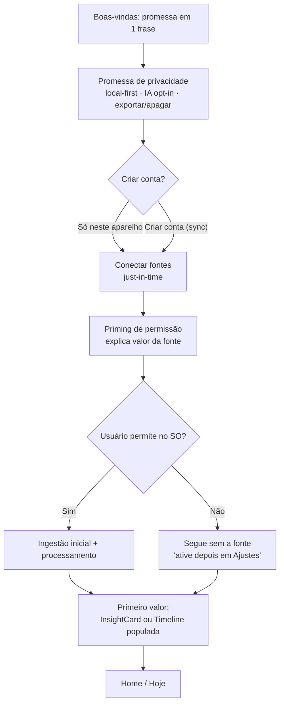
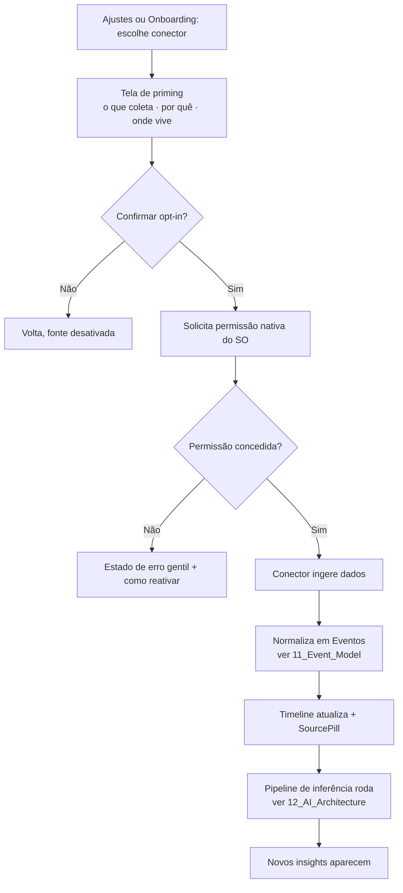
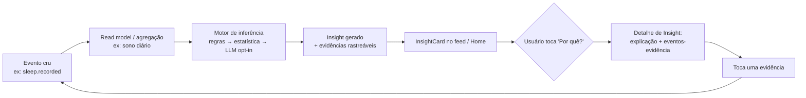
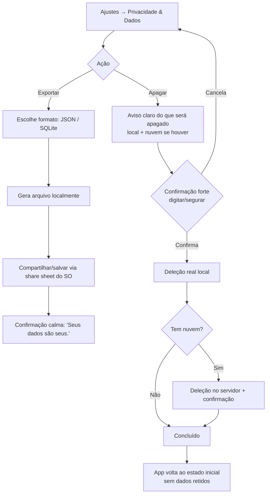

# 19 — UI Screens (Telas, Estados e Fluxos)

> **Fase geral:** Cada tela recebe rótulo próprio 🟢🔵🟡🟠🔴 · **Leia antes:** [`ATLAS_MASTER_CONTEXT.md`](ATLAS_MASTER_CONTEXT.md), [`00_Project_Vision.md`](00_Project_Vision.md), [`18_Design_System.md`](18_Design_System.md)
> **Documentos relacionados:** [`06_User_Journey.md`](06_User_Journey.md), [`08_Mobile_Architecture.md`](08_Mobile_Architecture.md), [`15_Privacy_Architecture.md`](15_Privacy_Architecture.md), [`04_Product_Requirements.md`](04_Product_Requirements.md), [`20_MVP.md`](20_MVP.md)
> **Status:** Vivo (living document) · **Versão:** 0.1 · **Última atualização:** 2026-07-20

---

## Resumo executivo

Este documento especifica **todas as telas do Atlas** — do MVP ao futuro — cada uma com:
objetivo, quando aparece, componentes (do [`18_Design_System.md`](18_Design_System.md)),
estados (vazio / carregando / erro / populado), navegação e **rótulo de fase**. Ele traduz a
filosofia de **calma e confiança** em superfícies concretas e define os **fluxos principais** em
diagramas: onboarding, conectar fonte, do dado ao insight e exportar/deletar dados.

O fio condutor é o **time-to-value** (`00` §O1: primeiro insight na primeira sessão) e a
**confiança visível** (`18` §P2): cada tela mostra de onde o dado vem, cada insight é rastreável
até sua evidência, e as ações de privacidade (exportar/deletar/opt-in de IA) são de primeira
classe. A navegação é deliberadamente simples — uma barra inferior com 5 destinos — porque foco
(`18` §P5) e calma vêm antes de completude.

> **Convenção deste doc:** cada tela segue o mesmo template — *Objetivo · Fase · Quando aparece ·
> Componentes · Estados · Navegação · Notas de calma/privacidade* — para leitura previsível.

---

## Índice

1. [Modelo de navegação](#1-modelo-de-navegação)
2. [Mapa de telas e fases](#2-mapa-de-telas-e-fases)
3. [Onboarding](#3-onboarding-)
4. [Home / Hoje](#4-home--hoje-)
5. [Timeline](#5-timeline-)
6. [Detalhe de Evento](#6-detalhe-de-evento-)
7. [Insights (feed)](#7-insights-feed-)
8. [Detalhe de Insight](#8-detalhe-de-insight-)
9. [Busca semântica](#9-busca-semântica-)
10. [Grafo / Conexões](#10-grafo--conexões-)
11. [Perfil de Entidade](#11-perfil-de-entidade-)
12. [Revisão Semanal](#12-revisão-semanal-)
13. [Ajustes](#13-ajustes-)
14. [Widgets](#14-widgets-)
15. [Fluxos principais (mermaid)](#15-fluxos-principais-mermaid)
16. [Matriz de estados por tela](#16-matriz-de-estados-por-tela)

---

## 1. Modelo de navegação

O Atlas usa uma **TabBar inferior** (`18` §10.3) com **5 destinos**, escolhida por ser o padrão
mais familiar e de menor carga cognitiva em mobile. Cinco é o teto (mais que isso vira ruído; P5
= foco).

```
┌──────────────────────────────────────────────┐
│                                                │
│                  [conteúdo]                    │
│                                                │
├────────┬────────┬────────┬────────┬───────────┤
│  Hoje  │Timeline│Insights│ Busca  │  Perfil   │
│   ⌂    │   ≡    │   ✦    │   ⌕    │    ◔      │
└────────┴────────┴────────┴────────┴───────────┘
```

| Aba | Pergunta que responde | Fase |
|---|---|---|
| **Hoje** | "O que importa agora?" | 🟢 |
| **Timeline** | "O que aconteceu?" | 🟢 |
| **Insights** | "O que o Atlas entendeu sobre mim?" | 🟢 |
| **Busca** | "Onde está aquilo?" | 🟢 |
| **Perfil** | "Quem sou eu no sistema + meus ajustes" | 🟢 |

- **Grafo/Conexões**, **Revisão Semanal** e **Perfil de Entidade** são telas **empilhadas** (push),
  acessadas a partir das abas — não ocupam slot na TabBar (mantém foco).
- **Ajustes** vive dentro de **Perfil**.
- Padrão de navegação: **stack por aba** (cada aba mantém seu histórico), com **bottom sheets**
  (`18` §10.3) para ações contextuais e detalhes leves.

Ver [`08_Mobile_Architecture.md`](08_Mobile_Architecture.md) para a implementação de navegação
(Expo Router / React Navigation) e gestão de estado.

---

## 2. Mapa de telas e fases

| # | Tela | Fase | Aba/host |
|---|---|---|---|
| 3 | Onboarding (fluxo) | 🟢 | Pré-app |
| 4 | Home / Hoje | 🟢 | Aba Hoje |
| 5 | Timeline | 🟢 | Aba Timeline |
| 6 | Detalhe de Evento | 🟢 | Push (Timeline/Busca) |
| 7 | Insights (feed) | 🟢 | Aba Insights |
| 8 | Detalhe de Insight | 🟢 | Push (Insights/Hoje) |
| 9 | Busca semântica | 🟢 | Aba Busca |
| 10 | Grafo / Conexões | 🟡 | Push (Perfil de Entidade) |
| 11 | Perfil de Entidade | 🔵 | Push (Timeline/Busca/Insight) |
| 12 | Revisão Semanal | 🔵 | Push (Hoje/notificação) |
| 13 | Ajustes | 🟢 | Push (Perfil) |
| 14 | Widgets | 🔵 | SO (fora do app) |

---

## 3. Onboarding 🟢

**Objetivo.** Ganhar **confiança antes de pedir dados** e entregar o primeiro valor rápido
(time-to-value). O onboarding do Atlas é uma *conversa de confiança*, não um tour de features.

**Quando aparece.** Primeiro lançamento; e parcialmente ao conectar novas fontes depois.

**Princípio-guia.** Inverter a ordem tradicional: primeiro **prometer privacidade**, depois pedir
permissão **just-in-time** (só quando o valor está claro), nunca tudo de uma vez. Ver `18` §P2 e
[`15_Privacy_Architecture.md`](15_Privacy_Architecture.md).

### 3.1. Telas do fluxo de onboarding

#### 3.1.1. Boas-vindas (promessa)
- **Objetivo:** comunicar a tese em 1 frase e a sensação (calma).
- **Componentes:** ilustração calma full-bleed, `text.display` ("Uma inteligência que é só sua."),
  subtítulo, `Button primary` ("Começar"), link `ghost` ("Como funciona").
- **Estados:** único (estático). Sem loading.
- **Navegação:** → Promessa de privacidade.

#### 3.1.2. Promessa de privacidade
- **Objetivo:** estabelecer confiança **antes** de qualquer permissão.
- **Conteúdo:** 3 `ListItem` com ícone: 📱 "Seus dados nascem e vivem no seu aparelho.",
  🔒 "Nada vai para IA sem você permitir, caso a caso.", ⤓ "Você pode exportar ou apagar tudo,
  quando quiser." Link para a Política (`15`).
- **Componentes:** `ListItem`, `SourcePill`, `Button primary` ("Entendi, continuar").
- **Estados:** único.
- **Navegação:** → Conta (leve) ou direto a Conectar fontes (modo 100% local).
- **Nota de confiança:** esta tela é a **fundação emocional** do produto. Nunca pular.

#### 3.1.3. Conta / modo local (leve)
- **Objetivo:** deixar claro que **conta é opcional** (local-first).
- **Componentes:** opção "Usar só neste aparelho" (default sugerido) vs. "Criar conta para
  sincronizar" (explica ☁️). `Switch`/`SegmentedControl`.
- **Estados:** default, loading (criando conta), error (rede — com conforto local-first).
- **Navegação:** → Conectar fontes.

#### 3.1.4. Conectar fontes (just-in-time)
- **Objetivo:** conectar 1–3 fontes de maior valor com **permissão contextual**.
- **Componentes:** lista de conectores (`PermissionRow`): Saúde (Health Connect/HealthKit),
  Calendário, Localização, Entrada manual. Cada linha explica **o que** coleta e **por quê**,
  com `Switch` opt-in.
- **Estados:**
  - *vazio/inicial:* nada conectado, CTA "Conectar Saúde" em destaque.
  - *loading:* solicitando permissão ao SO / primeira ingestão (skeleton).
  - *erro:* permissão negada → mensagem gentil + "Você pode ativar depois em Ajustes".
  - *sucesso:* fonte conectada, micro-confirmação calma.
- **Navegação:** → Primeiro valor.
- **Regra:** permissão do SO é pedida **no momento do toque** na fonte, com uma tela de
  pré-permissão (priming) explicando o valor — nunca despejar todos os prompts do SO de cara.

#### 3.1.5. Primeiro valor (o "aha")
- **Objetivo:** entregar o **primeiro insight ou primeira timeline populada** já na 1ª sessão
  (`00` §O1). Se ainda não há dados suficientes, mostrar um *insight de boas-vindas* ou uma
  prévia da timeline com o pouco que há.
- **Componentes:** `InsightCard` (se possível) **ou** `EmptyState` orientado a valor futuro +
  `TimelineItem`(s) iniciais.
- **Estados:** populado (ideal) / semi-vazio (promessa) / carregando (processando ingestão).
- **Navegação:** → Home. Fim do onboarding com micro-momento `deliberate` (`18` §8.2).

> **Diagrama do fluxo:** ver §15.1.

---

## 4. Home / Hoje 🟢

**Objetivo.** Responder "o que importa **agora**?" com o mínimo de ruído. É a tela mais visitada;
precisa ser a mais calma. Não é um dashboard — é um **resumo sereno**.

**Quando aparece.** Aba default ao abrir o app.

**Componentes.**
- `ScreenHeader` com saudação contextual e discreta (`text.title1`: "Boa tarde, Felipe").
- **1 destaque:** o `InsightCard` mais relevante do momento (ou nada, se não houver — calma > preencher).
- **"Hoje em resumo":** 2–4 `TimelineItem` condensados do dia (sono, deslocamentos-chave, eventos).
- **Atalho** discreto para Revisão Semanal quando disponível (🔵).
- Sem contadores, sem badges de alarme (`18` §1.2).

**Estados.**
- *vazio (novo usuário):* `EmptyState` — "Seu dia aparecerá aqui conforme os dados chegarem." + CTA conectar fonte.
- *carregando:* `Skeleton` do card de destaque + linhas.
- *erro:* banner calmo "Sincronização pausada — seus dados estão salvos no aparelho."
- *populado:* destaque + resumo do dia.

**Navegação.** Destaque → Detalhe de Insight; item de resumo → Detalhe de Evento; header → Perfil.

**Nota de calma.** A Home **pode estar quase vazia** e tudo bem. Silêncio informativo é uma
escolha (`18` §P1). Nada de encher com widgets para parecer "ativo".

---

## 5. Timeline 🟢

**Objetivo.** Responder "o que aconteceu?" — a espinha dorsal do CMHL (`ATLAS_MASTER_CONTEXT.md`
§1.2): eventos ordenados no tempo, a *unidade atômica* do Atlas visível.

**Quando aparece.** Aba Timeline.

**Componentes.**
- `ScreenHeader` colapsável (data/mês em foco ao rolar).
- Lista vertical de `TimelineItem`, **agrupados por dia** (cabeçalhos de dia "sticky").
- `SegmentedControl`/`Chip` para filtrar por tipo (Saúde, Lugares, Calendário, Manual...).
- Cada `TimelineItem`: horário (tabular figures), ícone de tipo, título, `SourcePill` (📱/☁️/🤖).
- FAB discreto (`+`) para **entrada manual** de evento.

**Estados.**
- *vazio:* `EmptyState` — "Conecte uma fonte para começar a ver sua vida em linha do tempo." + CTA.
- *carregando:* `Skeleton` de itens (mantém a forma da lista → menos ansiedade).
- *erro:* linha de erro por seção, com retry; dados locais permanecem visíveis.
- *populado:* eventos agrupados por dia; scroll infinito por paginação (`updated_at`, ver `08`).
- *filtro sem resultado:* mini empty ("Nenhum evento de Saúde neste período").

**Navegação.** Item → Detalhe de Evento; filtro → refina; FAB → sheet de entrada manual.

**Nota de calma.** Densidade controlada: agrupamento por dia + espaço generoso (`18` §6). Nunca
mostrar cru "347 eventos hoje" — agregamos (ex.: "23 registros de passos → 1 item de atividade").

---

## 6. Detalhe de Evento 🟢

**Objetivo.** Mostrar tudo sobre **um** evento — o fato imutável — e suas conexões, de forma
transparente (auditabilidade, `ATLAS_MASTER_CONTEXT.md` §7).

**Quando aparece.** Push a partir de Timeline, Busca, ou evidência de Insight.

**Componentes.**
- `ScreenHeader` (título do evento, voltar).
- `EventCard` expandido: tipo, timestamp (início/fim), payload legível, `SourcePill` (origem exata).
- **Entidades relacionadas:** chips/`ListItem` de Pessoas/Lugares/Documentos ligados (→ Perfil de Entidade 🔵).
- **Insights que citam este evento** (link reverso — reforça explicabilidade P4).
- Ações: editar (se manual), excluir (`destructive`), ver origem/conector.

**Estados.**
- *carregando:* skeleton do card.
- *erro:* "Não foi possível carregar este evento" + retry.
- *populado:* detalhes + relações.
- *evento manual sendo editado:* form inline (`FormField`).

**Navegação.** Entidade → Perfil de Entidade; insight citado → Detalhe de Insight.

**Nota de privacidade.** A `SourcePill` aqui é **explícita e clicável**: mostra de qual conector
veio, quando foi ingerido, e onde vive (local/nuvem). Confiança = rastreabilidade da fonte.

---

## 7. Insights (feed) 🟢

**Objetivo.** Responder "o que o Atlas **entendeu** sobre mim?" — o coração do produto (`00` §5.2,
"Compreensão > Registro"). Feed de **insights explicáveis**, cada um rastreável.

**Quando aparece.** Aba Insights.

**Componentes.**
- Lista de `InsightCard` (`18` §10.3.1), ordenada por relevância/novidade.
- Cada card: conclusão em linguagem natural, contexto ("baseado em N…"), **confiança qualitativa**,
  `EvidenceLink` ("Por quê?"), ação de dispensar.
- Filtro leve por domínio (Sono, Humor, Finanças, Cross-domain ✦).
- Marcação de insight como **útil** (alimenta a North Star, `00` §11) — gesto sutil, não gamificado.

**Estados.**
- *vazio (poucos dados):* `EmptyState` calmo — "Ainda estou observando seus padrões. Os primeiros
  insights aparecem com alguns dias de dados." + o que acelera (conectar fontes).
- *carregando:* skeleton de cards.
- *erro:* "Não foi possível atualizar os insights" + dados em cache permanecem.
- *populado:* feed de cards.
- *tudo dispensado:* empty state gentil ("Você está em dia.").

**Navegação.** Card → Detalhe de Insight; `EvidenceLink` → sheet/tela de evidências.

**Nota de calma & confiança.** **Nunca** um badge vermelho "5 novos!". Novidade = ponto âmbar
discreto (`18` §1.2). Insights de correlação usam linguagem calibrada ("costuma", nunca
"causa" — causalidade é 🔴, `ATLAS_MASTER_CONTEXT.md` §5.4).

---

## 8. Detalhe de Insight 🟢

**Objetivo.** **Explicabilidade total.** Esta é a tela que materializa a tese de confiança (`00`
§4.4): todo insight aponta para as **evidências rastreáveis** até os eventos que o originaram.

**Quando aparece.** Push ao tocar um `InsightCard` ou seu `EvidenceLink`.

**Componentes.**
- Conclusão em destaque (`text.title2`, ícone violeta ✦).
- **"Como cheguei aqui":** explicação em linguagem natural do raciocínio (regra/estatística/LLM,
  ver [`12_AI_Architecture.md`](12_AI_Architecture.md)).
- **Evidências:** lista de `TimelineItem`/`EventCard` que sustentam o insight — cada um clicável
  até o evento cru (rastreável à fonte).
- **Visualização calma:** sparkline/barra suave que *confirma* a frase (`18` §16), não a substitui.
- **Confiança & amostra:** "confiança média · baseado em 12 de 30 noites".
- Ações: marcar útil, dispensar/silenciar este tipo, "não faz sentido" (feedback que melhora o motor).

**Estados.**
- *carregando:* skeleton (conclusão + linhas de evidência).
- *erro:* "Não foi possível carregar as evidências" + retry.
- *populado:* explicação + evidências + viz.
- *evidência insuficiente / insight retirado:* mensagem honesta ("Com mais dados isso pode mudar").

**Navegação.** Evidência → Detalhe de Evento; entidade citada → Perfil de Entidade.

**Nota de confiança (crítica).** Se o insight usou um LLM externo, a tela **indica** isso (🤖) e,
se o opt-in de IA estiver desligado, o insight simplesmente não existe (só heurística/estatística
local). Explicabilidade **inclui** dizer *como* foi computado, não só *o quê*.

---

## 9. Busca semântica 🟢

**Objetivo.** Encontrar qualquer coisa do CMHL por **significado**, não só por palavra exata
(busca vetorial via pgvector, ver [`14_Vector_Search.md`](14_Vector_Search.md)).

**Quando aparece.** Aba Busca.

**Componentes.**
- `SearchBar` no topo (autofoco).
- Sugestões/perguntas-exemplo em linguagem natural ("quando fui à praia?", "dias que dormi mal").
- Resultados **mistos**: eventos, insights, entidades — cada tipo com seu componente e um rótulo.
- Filtros por tipo (`Chip`).

**Estados.**
- *inicial (vazio):* sugestões + histórico de buscas recentes.
- *digitando:* debounce; skeleton de resultados.
- *carregando:* skeleton.
- *sem resultado:* empty gentil ("Nada encontrado. Tente descrever de outro jeito.") + exemplos.
- *erro:* "Busca indisponível offline para consultas semânticas" (se embeddings dependerem de
  serviço) — com fallback de busca textual local (local-first).
- *populado:* lista de resultados agrupada por tipo.

**Navegação.** Resultado → Detalhe correspondente (Evento/Insight/Entidade).

**Nota técnica.** No MVP, busca semântica pode exigir embeddings (custo/serviço). Fallback
**textual local** garante que a busca **nunca quebra offline** (T1, `00` §6.2). Ver `08`/`14`.

---

## 10. Grafo / Conexões 🟡

**Objetivo.** Visualizar **relações entre entidades** (o grafo do CMHL) de forma **calma** — sem
virar teia ansiosa (`18` §16.4).

**Quando aparece.** Push a partir de um Perfil de Entidade ("ver conexões") ou de um insight
cross-domain. Fase 🟡 (grafo maduro chega com Neo4j, `ATLAS_MASTER_CONTEXT.md` §5.3).

**Componentes.**
- `ConnectionGraph` centrado em **uma** entidade (vizinhança de 1–2 saltos), nós dessaturados,
  foco no nó central.
- **Leitura textual paralela:** "As pessoas mais ligadas a *Academia* são A, B e C."
- Controles suaves: aproximar/afastar, tocar nó → foca nele.

**Estados.**
- *vazio:* "Ainda não há conexões suficientes para desenhar um mapa."
- *carregando:* skeleton/layout animando suavemente.
- *erro:* fallback para a lista textual de conexões.
- *populado:* grafo + leitura textual.

**Navegação.** Nó → Perfil de Entidade; aresta → contexto da relação.

**Nota de calma.** Regra dura: **sempre** acompanhar o grafo de uma explicação textual. O grafo
encanta, mas o entendimento vem da frase (P4).

---

## 11. Perfil de Entidade 🔵

**Objetivo.** Reunir tudo sobre **uma entidade** — Pessoa, Lugar, Organização, Tópico — como uma
"página" viva construída a partir dos eventos que a referenciam.

**Quando aparece.** Push a partir de Timeline, Busca, Detalhe de Evento/Insight, Grafo. Fase 🔵.

**Componentes.**
- `EntityHeader`: avatar/ícone, nome, tipo, resumo ("Você esteve aqui 14 vezes este mês").
- **Timeline filtrada** dessa entidade (só eventos que a citam).
- **Insights relacionados** a ela.
- **Conexões** → CTA para Grafo (🟡).
- Ações: editar/mesclar entidade (deduplicação), renomear, ocultar.

**Estados.** vazio (entidade nova/sem eventos) · carregando · erro · populado.

**Navegação.** Evento → Detalhe; conexões → Grafo; insight → Detalhe de Insight.

**Nota.** Mesclar/renomear entidades é importante (o motor pode criar duplicatas: "Ana" vs "Ana
Silva"). Dar esse controle ao usuário é confiança e qualidade do CMHL.

---

## 12. Revisão Semanal 🔵

**Objetivo.** Um **momento ritual e calmo** de reflexão — a "carta semanal" do Atlas sobre sua
vida. É o oposto do dashboard: **narrativa**, não placar. Reforça a North Star (`00` §11).

**Quando aparece.** Semanalmente (ex.: domingo à noite), via notificação **gentil** e atalho na
Home. Fase 🔵.

**Componentes.**
- Abertura editorial (`18` §5.2, voz serifada 🔵): "Sua semana em poucas palavras."
- 2–4 destaques narrativos com `InsightCard`/`WeeklyReviewCard`.
- 1 visualização calma de tendência da semana (sparkline/heatmap gentil, `18` §16).
- Uma **pergunta reflexiva** (não uma meta): "O que fez sua terça ser tão boa?".

**Estados.** *ainda gerando* (skeleton) · *poucos dados* (versão curta e honesta) · *erro* ·
*populado* · *semana silenciosa* ("Uma semana tranquila — e está tudo bem.").

**Navegação.** Cada destaque → Detalhe de Insight/Evento.

**Nota de calma.** Sem "você falhou em X". A Revisão celebra e questiona com gentileza; nunca
cobra. É desenhada para dar **serenidade e descoberta** (`18` §1.3).

---

## 13. Ajustes 🟢

**Objetivo.** Dar **controle total** — o pilar de confiança e ownership (`ATLAS_MASTER_CONTEXT.md`
§6). Aqui moram privacidade, conectores, dados e IA. Ações de primeira classe, não escondidas.

**Quando aparece.** A partir da aba Perfil.

**Seções e componentes.**
- **Privacidade & Dados** (`ListItem`s):
  - **Exportar meus dados** (JSON/SQLite) → fluxo §15.4.
  - **Apagar meus dados** (`destructive`, com confirmação forte) → fluxo §15.4.
  - Onde meus dados vivem (📱/☁️) + política (`15`).
- **Conectores** (`PermissionRow` por fonte): ativar/desativar, ver o que cada um coleta, revogar.
- **Inteligência (IA)** — **opt-in granular**:
  - `Switch` mestre "Permitir análise por IA externa" (**desligado por padrão**, `ATLAS_MASTER_CONTEXT.md` §6.6).
  - Explicação just-in-time do que sai do aparelho e para quê.
  - Opção "só heurística/estatística local" (funciona sem IA externa).
- **Aparência:** tema (claro/escuro/automático), tamanho de texto (dynamic type).
- **Conta & Sync:** login/logout, sincronização on/off (local-first permanece).
- **Sobre:** versão, licenças, política.

**Estados.** default · loading (export/delete/sync) · erro · sucesso (confirmações calmas).

**Navegação.** Cada item → sub-tela/sheet correspondente.

**Nota de confiança (crítica).** O `Switch` de IA **nunca** vem ligado. Exportar e Apagar são
visíveis no topo, não enterrados. Isso operacionaliza "IA com consentimento" e "data ownership".

---

## 14. Widgets 🔵

**Objetivo.** Levar **calma e valor** para fora do app (home screen do SO), sem ansiedade.

**Quando aparece.** Configurados pelo usuário no SO (iOS/Android). Fase 🔵.

**Tipos.**
- **Insight do dia:** 1 `InsightCard` compacto (conclusão + ✦). Sem números de alarme.
- **Hoje em resumo:** 1–2 fatos calmos do dia.
- **Revisão semanal (quando disponível):** teaser + toque abre a Revisão.

**Estados.** vazio ("Abra o Atlas para começar") · carregando · populado. Widgets **nunca**
mostram badges de contagem nem cores de alarme (extensão de `18` §P1).

**Navegação.** Toque → tela correspondente no app (deep link).

**Nota técnica.** Widgets exigem código nativo (WidgetKit/App Widgets) → fora do Expo puro; por
isso 🔵. Ver `08`.

---

## 15. Fluxos principais (mermaid)

### 15.1. Fluxo de onboarding (confiança → valor)



### 15.2. Fluxo: conectar uma fonte (conector)



### 15.3. Fluxo: do dado ao insight (explicável)



> O laço **G → A** é a assinatura do Atlas: do insight de volta ao dado cru. Explicabilidade
> circular e auditável (`00` §4.4, `ATLAS_MASTER_CONTEXT.md` §7.3).

### 15.4. Fluxo: exportar / apagar dados (ownership)



> **Nota de conformidade.** Export = portabilidade (LGPD/GDPR); Apagar = direito ao esquecimento,
> deleção **real** (não soft-delete). Ver [`15_Privacy_Architecture.md`](15_Privacy_Architecture.md).

---

## 16. Matriz de estados por tela

Toda tela do MVP especifica os 4 estados canônicos (`18` §11). Resumo de conformidade:

| Tela | Vazio | Carregando | Erro | Populado | Fase |
|---|---|---|---|---|---|
| Onboarding | n/a | ✅ | ✅ | ✅ | 🟢 |
| Home / Hoje | ✅ | ✅ | ✅ | ✅ | 🟢 |
| Timeline | ✅ | ✅ | ✅ | ✅ | 🟢 |
| Detalhe de Evento | n/a | ✅ | ✅ | ✅ | 🟢 |
| Insights (feed) | ✅ | ✅ | ✅ | ✅ | 🟢 |
| Detalhe de Insight | n/a | ✅ | ✅ | ✅ | 🟢 |
| Busca | ✅ | ✅ | ✅ | ✅ | 🟢 |
| Grafo / Conexões | ✅ | ✅ | ✅ | ✅ | 🟡 |
| Perfil de Entidade | ✅ | ✅ | ✅ | ✅ | 🔵 |
| Revisão Semanal | ✅ | ✅ | ✅ | ✅ | 🔵 |
| Ajustes | n/a | ✅ | ✅ | ✅ | 🟢 |
| Widgets | ✅ | ✅ | n/a | ✅ | 🔵 |

> **Definition of Done de tela:** os 4 estados implementados · componentes vêm do `18` · a11y AA
> (`18` §12) · revisada em light/dark · strings via i18n · nenhuma métrica "ansiosa" · toda
> conclusão de IA rastreável.

---

### Resumo executivo (fechamento)

Este documento mapeia **todas as telas do Atlas** sob uma navegação deliberadamente simples (5
abas + telas empilhadas), sempre a serviço de **calma, foco e confiança**. O MVP 🟢 entrega o
ciclo completo de valor: **Onboarding** (confiança antes de dados, permissões just-in-time) →
**Home/Hoje** e **Timeline** (o que aconteceu, sem ansiedade) → **Insights** e **Detalhe de
Insight** (o que o Atlas entendeu, sempre rastreável até a evidência) → **Busca** semântica →
**Ajustes** (exportar/apagar/opt-in de IA como cidadãos de primeira classe). Telas de maior
riqueza — **Perfil de Entidade** e **Revisão Semanal** (🔵) e **Grafo/Conexões** (🟡) — evoluem
por fase, sem inflar o MVP. Os quatro fluxos-mestre (onboarding, conectar fonte, dado→insight,
exportar/apagar) codificam o **time-to-value** e a **explicabilidade circular** que definem o
produto. Cada tela cumpre os quatro estados canônicos e o Definition of Done de acessibilidade e
privacidade — para que o Atlas se sinta, em toda superfície, como uma inteligência serena, digna
de ver a vida inteira de alguém.
