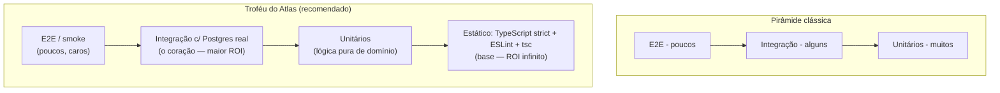
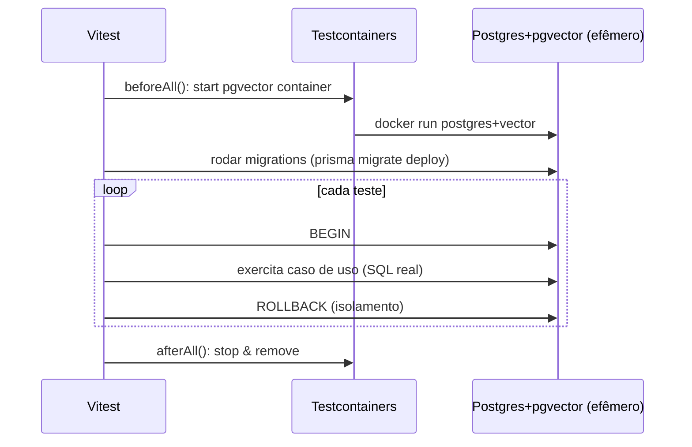
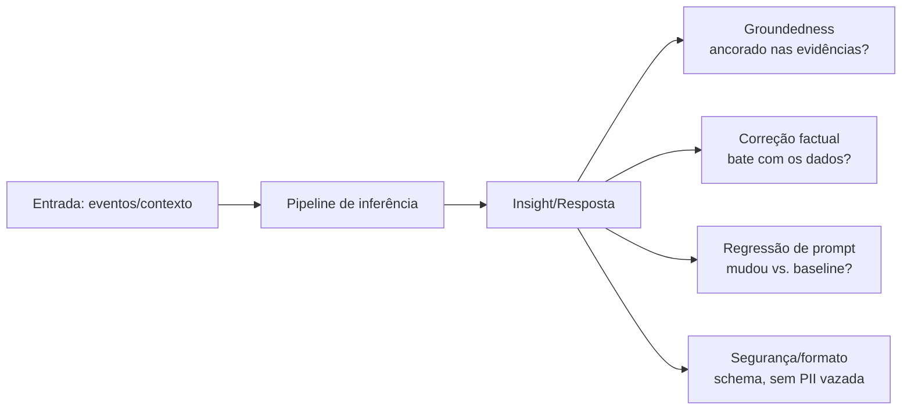
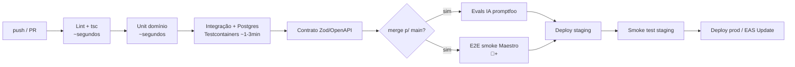

# 26 — Testing (Estratégia de Testes)

> **Fase geral:** Transversal · **Leia antes:** [`ATLAS_MASTER_CONTEXT.md`](ATLAS_MASTER_CONTEXT.md)
> **Documentos relacionados:** [`07_System_Architecture`](07_System_Architecture.md), [`09_Backend_Architecture`](09_Backend_Architecture.md), [`08_Mobile_Architecture`](08_Mobile_Architecture.md), [`11_Event_Model`](11_Event_Model.md), [`12_AI_Architecture`](12_AI_Architecture.md), [`17_API_Design`](17_API_Design.md), [`27_DevOps`](27_DevOps.md)
> **Status:** Vivo · **Versão:** 0.1 · **Última atualização:** 2026-07-20
> **Owner:** Fundador solo

---

## Resumo executivo

Testar, para um fundador solo, **não** é buscar cobertura de 100% nem reproduzir o aparato de QA de uma Big Tech. É comprar **confiança para refatorar e dormir tranquilo** com o mínimo de esforço de manutenção. Este documento define uma pirâmide de testes pragmática para o Atlas, priorizada por **ROI** (retorno sobre o esforço), e mapeia cada tipo de teste às camadas do stack canônico (NestJS modular monolith, PostgreSQL+pgvector, Redis+BullMQ, React Native + Expo).

As decisões-âncora deste documento são:

1. **Camada mais valiosa = testes de integração de backend com Postgres real** (via Testcontainers), não testes unitários com mocks. O Atlas é *event-centric* e *data-centric*: a maior parte dos bugs mora na fronteira SQL/ORM/transação, não em funções puras.
2. **IA é software não-determinístico** e precisa de uma disciplina própria: *evals*, testes de regressão de prompt, checagem de *groundedness* (anti-alucinação). Um Insight errado é pior que um bug — corrói a confiança, que é a pré-condição do produto (§6 do Master Context).
3. **Cobertura é pragmática, não dogmática:** metas altas no *core* de domínio e no motor de sync; metas baixas ou zero em UI descartável e código de andaime.
4. **Testes crescem por fase (🟢→🟠).** No MVP se testa o que quebra silenciosamente e destrói dados/confiança; carga (k6) e contrato formal só entram quando há usuários reais.

---

## 1. Filosofia de testes para um fundador solo

### 1.1. O que é (e por que existe)

Um teste automatizado é uma **especificação executável**: um pedaço de código que afirma "dado este estado, esta ação produz este resultado" e falha ruidosamente quando isso deixa de ser verdade. O problema que ele resolve para um solo dev não é principalmente "achar bugs hoje" — você acha os bugs de hoje usando o produto. O problema real é **regressão silenciosa**: você mexe no motor de sync em outubro e quebra a deduplicação de eventos que funcionava desde julho, e só descobre em janeiro quando seus próprios dados já corromperam.

Para um time de 1 pessoa sem QA, o teste é o **QA que trabalha 24/7 de graça**. Mas todo teste tem um custo de manutenção: ele precisa ser reescrito quando o código legítimo muda. Testes ruins (frágeis, acoplados a detalhes de implementação) são um **passivo** — atrasam refatoração e treinam você a ignorar o vermelho. Logo, a filosofia central é:

> **Escreva o menor número de testes que maximiza a confiança para refatorar o *core*. Teste comportamento, não implementação.**

### 1.2. Os três objetivos do autor, aplicados a testes

O Master Context (§0) define três objetivos: **construir**, **aprender**, **defender**. Testes servem aos três:

| Objetivo | Como os testes servem |
|---|---|
| **Construir** | Confiança para mudar código rápido sem medo; menos tempo depurando produção sozinho. |
| **Aprender** | Escrever um teste de integração com Postgres real *ensina* onde estão as arestas de transações, isolamento, índices, `ON CONFLICT`. |
| **Defender** | "Como você garante qualidade sozinho?" é pergunta de entrevista Big Tech e de banca. A resposta é esta estratégia por ROI + evals de IA. |

### 1.3. Princípios (alinhados aos princípios de arquitetura do Master Context §7)

1. **ROI acima de cobertura.** Cada teste precisa justificar seu custo de manutenção.
2. **Teste comportamento observável, não estrutura interna.** Testar via a fronteira do módulo (caso de uso / endpoint), não classes privadas.
3. **Determinismo é sagrado (exceto na IA).** Nada de `sleep`, relógio real, ou ordenação aleatória em testes de código normal. Relógio e UUID são injetados.
4. **Testes espelham a fronteira dos módulos.** Como cada módulo NestJS "poderia virar um serviço" (§7.4), cada módulo tem sua suíte de integração autocontida.
5. **Falha ruidosa, verde confiável.** Um teste que "às vezes falha" (flaky) é deletado ou consertado no mesmo dia; testes intermitentes destroem a disciplina.
6. **IA é testada como sistema estatístico**, com thresholds e amostras, não com igualdade exata.

---

## 2. A pirâmide de testes e o ROI de cada camada

### 2.1. A pirâmide clássica vs. a realidade do Atlas

A pirâmide clássica (Mike Cohn) diz: muitos unitários, alguns de integração, poucos E2E. Para uma aplicação *data-centric* e *event-centric* como o Atlas, a forma ótima é mais um **troféu de testes** (Testing Trophy, de Kent C. Dodds): o volume maior de *valor* está na **integração**, porque é lá que vivem os bugs que importam (SQL, transações, serialização de eventos, projeções/read models).



### 2.2. Tabela de ROI por tipo de teste (a decisão central deste doc)

| Tipo | O que valida | Custo de escrita | Custo de manutenção | Confiança/valor | ROI p/ solo | Fase |
|---|---|---|---|---|---|---|
| **Análise estática** (TS strict, ESLint, `tsc --noEmit`) | Tipos, nulos, imports, contratos internos | ~0 (uma vez) | ~0 | Alta em uma classe inteira de bugs | ⭐⭐⭐⭐⭐ | 🟢 |
| **Unitário de domínio** (lógica pura: regras de insight, cálculos, reducers de evento) | Regras de negócio isoladas | Baixo | Baixo | Alta *onde há lógica de verdade* | ⭐⭐⭐⭐ | 🟢 |
| **Integração backend + Postgres real** | Repos, transações, projeções, migrations, `ON CONFLICT`, pgvector | Médio | Baixo-médio | **Máxima** (é onde os bugs moram) | ⭐⭐⭐⭐⭐ | 🟢 |
| **Integração de fila (BullMQ + Redis)** | Jobs idempotentes, retry, dead-letter, ordering | Médio | Médio | Alta (pipeline de inferência) | ⭐⭐⭐⭐ | 🟢/🔵 |
| **Contrato API↔mobile** (OpenAPI / Zod / Pact) | Backend e app não divergem | Baixo-médio | Baixo | Alta (você é os dois lados) | ⭐⭐⭐⭐ | 🔵 |
| **Sync/offline** (cenários de conflito, replay, dedup) | O motor de sync não corrompe dados | Alto | Médio | **Crítica** (perda de dado = fim) | ⭐⭐⭐⭐⭐ | 🟢/🔵 |
| **Evals de IA** (groundedness, regressão de prompt) | Insights corretos e ancorados | Médio | Médio | Alta (confiança do produto) | ⭐⭐⭐⭐ | 🔵 |
| **E2E mobile** (Detox/Maestro) | Fluxos críticos ponta a ponta | Alto | **Alto** (flaky) | Média (poucos fluxos-chave) | ⭐⭐ | 🔵/🟡 |
| **Performance/carga** (k6) | Latência/throughput sob carga | Médio | Baixo | Baixa até haver carga | ⭐ (🟡+) | 🟡 |

> **Leitura da tabela:** no MVP 🟢, invista em **estático + unitário de domínio + integração com Postgres + testes de sync**. Adie E2E completo e carga. Isso é o oposto da pirâmide ingênua "escreva mil unitários com mock" — que gera falsa confiança e alto custo de manutenção para código *data-centric*.

### 2.3. Por que não muitos unitários com mock no backend?

No Atlas, um "serviço" de backend tipicamente: recebe um comando → valida → **grava um evento append-only** → dispara um job → atualiza um **read model**. Se você mockar o repositório, o Prisma, o Redis e o relógio, seu teste unitário valida basicamente que *os mocks foram chamados* — não que o SQL está correto, que a transação faz rollback, que o índice único evita duplicata, ou que a projeção reflete o evento. Esses são exatamente os bugs que dão prejuízo. Portanto: **mocke fronteiras externas caras/não-determinísticas (LLM, e-mail, APIs de terceiros), mas use Postgres real.**

---

## 3. Ferramentas por camada (stack canônico)

| Camada | Ferramenta escolhida | Alternativa | Justificativa |
|---|---|---|---|
| Runner backend | **Vitest** (ou Jest) | Jest | Vitest é rápido, ESM-native, API compatível com Jest. Jest é aceitável se preferir maturidade. |
| Runner mobile | **Jest** (padrão do Expo/RN) | — | É o que o `jest-expo` já configura. |
| Integração DB | **Testcontainers** (`@testcontainers/postgresql`) | docker-compose de teste | Sobe Postgres+pgvector efêmero por suíte; isolamento perfeito, roda igual local e no CI. |
| API HTTP | **Supertest** sobre a app Nest | Pactum | Testa a app real via HTTP sem subir porta externa. |
| Contrato | **Zod schemas compartilhados** + geração OpenAPI; **Pact** (🟡) | tRPC (não escolhido) | Fonte única de tipos entre API e app. |
| E2E mobile | **Maestro** (preferido) / **Detox** | Appium | Maestro tem YAML declarativo, muito menos flaky e menos setup — ideal p/ solo. |
| Carga | **k6** | Artillery | Scripts em JS, ótimo p/ CI, thresholds nativos. |
| Evals IA | **Promptfoo** + suíte própria de groundedness | Ragas, DeepEval | Promptfoo é leve, versionável em YAML, roda no CI. |
| Cobertura | **c8 / istanbul** via Vitest | — | Relatório por pasta com metas diferenciadas. |
| Factories/dados | **@faker-js/faker** + factories tipadas | Fishery | Gera eventos/entidades plausíveis. |

---

## 4. Testes unitários (lógica pura de domínio)

### 4.1. O que vale a pena testar unitariamente

Só **lógica pura e não-trivial**: funções determinísticas sem I/O. No Atlas isso é, sobretudo:

- **Regras de Insight heurísticas** ("dorme 40min a menos após treino tarde") — o §5.4 do Master Context manda "heurística antes de neurônio", então essas regras são código de negócio de primeira classe.
- **Reducers de evento → read model** (aplicar um evento a um estado agregado).
- **Cálculos estatísticos** (médias móveis, correlações, z-scores, detecção de outliers).
- **Normalizadores de conectores** (payload cru → Evento canônico).
- **Utilidades de tempo/timezone** (janelas "noite após treino", limites de dia local).

### 4.2. Regra de ouro: injete o não-determinismo

Nunca chame `new Date()`, `Math.random()` ou `crypto.randomUUID()` dentro da lógica. Injete-os. Isso torna o teste determinístico e é bom design (Ports & Adapters).

```ts
// domain/insights/sleep-after-late-workout.rule.ts
export interface Clock { now(): Date }

export function detectSleepDropAfterLateWorkout(
  sleepEvents: SleepEvent[],
  workoutEvents: WorkoutEvent[],
  opts: { lateWorkoutAfterHour: number; minNights: number },
): Insight | null {
  // lógica pura, sem I/O — 100% testável
}
```

```ts
// domain/insights/sleep-after-late-workout.rule.test.ts
import { describe, it, expect } from 'vitest';
import { detectSleepDropAfterLateWorkout } from './sleep-after-late-workout.rule';

describe('detectSleepDropAfterLateWorkout', () => {
  it('emite insight quando há queda consistente de sono após treino tarde', () => {
    const insight = detectSleepDropAfterLateWorkout(
      sleepFixture({ dropMinutes: 42, nights: 6 }),
      workoutFixture({ afterHour: 21, sessions: 6 }),
      { lateWorkoutAfterHour: 20, minNights: 4 },
    );
    expect(insight).not.toBeNull();
    expect(insight!.evidenceEventIds).toHaveLength(12); // rastreável (§7.3 princípios)
  });

  it('NÃO emite com amostra insuficiente (evita insight ruidoso)', () => {
    const insight = detectSleepDropAfterLateWorkout(
      sleepFixture({ dropMinutes: 42, nights: 2 }),
      workoutFixture({ afterHour: 21, sessions: 2 }),
      { lateWorkoutAfterHour: 20, minNights: 4 },
    );
    expect(insight).toBeNull();
  });
});
```

> **Nota de explicabilidade:** todo teste de regra de Insight deve assertar que o Insight **carrega as evidências** (IDs dos eventos que o originaram). "Explicabilidade > mágica" (§5 da Visão) é testável — e deve ser testada.

### 4.3. O que NÃO testar unitariamente

- Controllers/serviços que só orquestram I/O (teste via integração).
- Getters/setters, DTOs triviais, mapeamentos 1:1.
- Componentes de UI puramente visuais sem lógica.

---

## 5. Testes de integração de backend (o coração da estratégia)

### 5.1. Por que Postgres real (e não SQLite/mock)

O Atlas usa recursos específicos do Postgres que **não existem** em SQLite nem em mocks: `JSONB`, `pgvector`, CTEs recursivas (grafo em SQL, ADR-0007), `ON CONFLICT`, índices parciais, `SERIALIZABLE`/advisory locks. Testar contra outro banco valida uma ficção. **Testcontainers** sobe um Postgres real (com a extensão `vector`) em Docker, roda as **migrations reais**, executa a suíte e destrói o container. Roda idêntico na sua máquina e no GitHub Actions.



### 5.2. Setup com Testcontainers + pgvector

```ts
// test/db.setup.ts
import { PostgreSqlContainer, StartedPostgreSqlContainer } from '@testcontainers/postgresql';
import { execSync } from 'node:child_process';

let container: StartedPostgreSqlContainer;

export async function setupTestDb() {
  container = await new PostgreSqlContainer('pgvector/pgvector:pg16')
    .withDatabase('atlas_test')
    .start();

  const url = container.getConnectionUri();
  process.env.DATABASE_URL = url;

  // roda as MIGRATIONS REAIS (não um schema paralelo)
  execSync('npx prisma migrate deploy', { env: { ...process.env, DATABASE_URL: url } });
  return url;
}

export async function teardownTestDb() {
  await container?.stop();
}
```

### 5.3. Estratégia de isolamento entre testes

Três opções, em ordem de preferência para solo dev:

| Estratégia | Como | Prós | Contras |
|---|---|---|---|
| **Transação + rollback** | cada teste roda dentro de `BEGIN … ROLLBACK` | rápido, isolamento perfeito | não testa comportamento entre transações/commit |
| **Truncate entre testes** | `TRUNCATE ... CASCADE` no `afterEach` | testa commits reais, simples | um pouco mais lento |
| **Container por arquivo** | um Postgres por suíte | isolamento máximo, paralelismo | mais lento/pesado |

Padrão recomendado: **truncate entre testes** (testa commits, essencial para o motor de sync e jobs), com um único container por *run*.

### 5.4. Exemplo: testar o append-only de eventos + projeção

Este é o padrão arquitetural central (Event Sourcing "lite", ADR-0002). O teste valida a **invariante**: gravar um evento atualiza o read model derivado, e reprocessar é idempotente.

```ts
// modules/events/events.integration.test.ts
import { describe, it, expect, beforeEach } from 'vitest';
import { createTestApp } from '../../test/app.factory';
import { truncateAll } from '../../test/db.setup';

describe('Ingestão de eventos + projeção de sono', () => {
  let app: TestApp;
  beforeEach(async () => { app = await createTestApp(); await truncateAll(); });

  it('grava evento append-only e materializa a agregação diária', async () => {
    await app.events.ingest({
      type: 'sleep.recorded', userId: U, occurredAt: '2026-07-19T23:10:00-03:00',
      payload: { durationMin: 415 },
    });

    const events = await app.db.event.findMany({ where: { userId: U } });
    expect(events).toHaveLength(1);           // append-only: 1 fato imutável

    const daily = await app.readModels.sleepDaily(U, '2026-07-19');
    expect(daily.totalMin).toBe(415);          // projeção materializada
  });

  it('é idempotente: reprocessar o mesmo evento não duplica na projeção', async () => {
    const e = await app.events.ingest({ type: 'sleep.recorded', /* ... */ });
    await app.projections.rebuildFor(U);        // reprocessamento
    const daily = await app.readModels.sleepDaily(U, '2026-07-19');
    expect(daily.totalMin).toBe(415);           // não somou duas vezes
  });

  it('respeita a unicidade por chave de deduplicação (ON CONFLICT)', async () => {
    const dedupeKey = 'healthconnect:sleep:2026-07-19:abc';
    await app.events.ingest({ type: 'sleep.recorded', dedupeKey, /* ... */ });
    await app.events.ingest({ type: 'sleep.recorded', dedupeKey, /* ... */ });
    const events = await app.db.event.count({ where: { userId: U } });
    expect(events).toBe(1);                      // conector reenviou; não duplicou
  });
});
```

### 5.5. Testar transações e rollback

Bugs de transação são invisíveis até corromperem dados. Teste explicitamente que uma falha no meio de um comando **não deixa estado parcial**.

```ts
it('rollback: se a projeção falha, o evento NÃO é persistido', async () => {
  app.projections.forceFailOnce(); // injeta falha na 2ª etapa
  await expect(app.events.ingest({ type: 'sleep.recorded', /* ... */ }))
    .rejects.toThrow();
  expect(await app.db.event.count()).toBe(0); // atomicidade preservada
});
```

### 5.6. Testar busca vetorial (pgvector)

```ts
it('recupera memórias semanticamente próximas via pgvector', async () => {
  await app.memory.store({ text: 'reunião sobre orçamento anual', embedding: EMB_A });
  await app.memory.store({ text: 'almoço com a família', embedding: EMB_B });

  const hits = await app.memory.search({ embedding: EMB_A_NEAR, k: 1 });
  expect(hits[0].text).toContain('orçamento'); // ordenação por distância coseno
});
```

### 5.7. Testar migrations

Migrations quebradas são catastróficas (perda/corrupção de dados). Duas checagens no CI:

1. **Aplicar do zero** (já coberto: Testcontainers roda `migrate deploy`).
2. **Drift check:** o schema Prisma bate com as migrations (`prisma migrate diff` → deve ser vazio). Ver [`27_DevOps`](27_DevOps.md) §migrations.

---

## 6. Testes de fila e jobs (BullMQ + Redis)

O pipeline de inferência (`Inference Pipeline`, glossário) roda em jobs BullMQ. As invariantes críticas: **idempotência** (um job pode rodar 2x por retry), **retry/backoff** e **dead-letter**.

```ts
it('job de geração de insight é idempotente sob retry', async () => {
  await app.queue.add('generate-insights', { userId: U, day: '2026-07-19' });
  await app.queue.processOnce();
  await app.queue.simulateRetry();  // reprocessa
  const insights = await app.db.insight.count({ where: { userId: U, day: '2026-07-19' } });
  expect(insights).toBe(1);         // retry não duplicou insight
});

it('move para dead-letter após N falhas e não trava a fila', async () => {
  app.llm.forceError();             // LLM externo falhando
  await app.queue.add('synthesize', { userId: U }, { attempts: 3 });
  await app.queue.drain();
  expect(await app.queue.failedCount()).toBe(1);
  expect(await app.queue.activeCount()).toBe(0);
});
```

Redis pode ser real (Testcontainers) ou `ioredis-mock` para jobs simples. Para lógica de retry/DLQ, use **Redis real**.

---

## 7. Testes E2E

### 7.1. API E2E (Supertest)

Testa a app HTTP inteira (auth → controller → serviço → Postgres real) sem subir o mobile. Cobre os fluxos-chave: autenticar, ingerir evento, ler timeline, gerar insight, exportar dados (data ownership, §6.2).

```ts
it('fluxo completo: login → ingest → timeline mostra o evento', async () => {
  const { accessToken } = await http.post('/auth/login').send(creds).expect(201).then(r => r.body);
  await http.post('/events').auth(accessToken, { type: 'bearer' })
    .send({ type: 'location.visited', payload: { placeId: 'gym' } }).expect(201);
  const timeline = await http.get('/timeline?day=2026-07-19')
    .auth(accessToken, { type: 'bearer' }).expect(200);
  expect(timeline.body.items).toContainEqual(expect.objectContaining({ type: 'location.visited' }));
});

it('exportação retorna TODOS os dados do usuário (data ownership)', async () => {
  const dump = await http.get('/me/export').auth(token, { type: 'bearer' }).expect(200);
  expect(dump.body).toHaveProperty('events');
  expect(dump.body).toHaveProperty('entities');
});
```

### 7.2. Mobile E2E (Maestro — preferido)

E2E mobile é **caro e flaky**; por isso, poucos fluxos e só a partir de 🔵/🟡. Maestro usa YAML declarativo com esperas inteligentes (menos flakiness que Detox).

```yaml
# .maestro/onboarding_first_insight.yaml
appId: com.atlas.app
---
- launchApp:
    clearState: true
- tapOn: "Começar"
- tapOn: "Conectar Health Connect"
- tapOn: "Permitir"
- assertVisible: "Seu primeiro insight"   # valida O1 da Visão: insight na 1ª sessão
- assertVisible:
    text: ".*dorme.*"
    optional: false
```

Fluxos que valem E2E mobile (e só esses no início): **onboarding → primeiro insight** (O1), **modo offline → volta online → sync** (T1), **exportação/deleção de dados** (confiança).

### 7.3. Por que tão poucos E2E

E2E depende de emulador, timing, rede, estado — as três causas clássicas de flakiness. Um teste que falha 1 em 10 execuções sem razão treina você a ignorar o vermelho, destruindo o valor de toda a suíte. Regra: **cada E2E flaky é consertado ou deletado no mesmo dia.**

---

## 8. Testes de contrato (API ↔ mobile)

### 8.1. O problema

Você é os dois lados (backend e app), mas eles evoluem em ritmos diferentes e o app tem versões antigas em campo (OTA/EAS Update mitiga, mas não zera). Um contrato quebrado silenciosamente = telas em branco no dispositivo do usuário.

### 8.2. Abordagem pragmática: schema único (Zod) como fonte de verdade

Compartilhe os tipos de request/response num pacote comum e derive tanto a validação do backend quanto os tipos do cliente. Isso elimina *drift* na origem.

```ts
// packages/contracts/timeline.ts  (compartilhado backend + app)
import { z } from 'zod';
export const TimelineItem = z.object({
  id: z.string().uuid(),
  type: z.string(),
  occurredAt: z.string().datetime(),
  payload: z.record(z.unknown()),
});
export const TimelineResponse = z.object({ items: z.array(TimelineItem) });
export type TimelineResponse = z.infer<typeof TimelineResponse>;
```

O backend valida a saída com esse schema (teste); o app parseia a resposta com o mesmo schema (falha explícita se o backend divergir). **Bônus:** gere o OpenAPI a partir dos schemas Zod (`@asteasolutions/zod-to-openapi`) → doc sempre sincronizada (ver [`17_API_Design`](17_API_Design.md)).

### 8.3. Consumer-driven contracts (Pact) — quando (🟡)

Quando houver **múltiplos clientes** (ex.: SDK de terceiros na fase Plataforma, §9 da Visão) ou versões divergentes em campo, adote **Pact**: o consumidor (app) publica o contrato que espera; o provedor (API) verifica no CI que ainda o satisfaz. Overkill no MVP com um cliente só.

---

## 9. Testes de sync/offline (crítico e específico do Atlas)

### 9.1. Por que é a suíte mais importante depois da integração

O Atlas é **local-first** (ADR-0003, §6): o dado nasce no dispositivo (Expo SQLite + Drizzle) e sincroniza com o servidor por push/pull incremental (por `updated_at` + fila de mutações). Um bug de sync **corrompe ou perde dados do usuário** — o pior resultado possível para um produto cuja pré-condição é confiança. Esta suíte protege o motor de sync.

### 9.2. Cenários obrigatórios

| Cenário | Invariante testada |
|---|---|
| Criar offline → sincronizar | mutação enfileirada sobe e recebe ID canônico |
| Editar mesmo registro em 2 devices | resolução de conflito determinística (last-write-wins por `updated_at`, ou regra definida) |
| Push falha no meio (rede cai) | fila reprocessa; nada é perdido nem duplicado |
| Pull traz eventos já vistos | dedup por `dedupeKey` (idempotência) |
| Relógio do device errado | servidor usa `server_received_at` p/ ordenação, não confia cegamente no device |
| Deleção offline | tombstone propaga; registro não "ressuscita" no próximo pull |

```ts
// sync/conflict.test.ts
it('conflito de edição resolve por last-write-wins com updated_at do servidor', () => {
  const base = record({ v: 'A', updatedAt: t(0) });
  const local = edit(base, { v: 'B', updatedAt: t(10) });
  const remote = edit(base, { v: 'C', updatedAt: t(20) });
  const merged = resolveConflict(local, remote);
  expect(merged.v).toBe('C'); // remoto é mais novo
});

it('deleção offline gera tombstone e sobrevive ao próximo pull', () => {
  const s = new SyncEngine();
  s.deleteOffline('rec-1');
  s.applyPull([record({ id: 'rec-1', v: 'zombie' })]); // servidor ainda tinha o registro
  expect(s.get('rec-1')).toBeUndefined(); // não ressuscitou
});
```

> **Nota de fase:** os testes de conflito simples (LWW) são 🟢/🔵. Testes de **CRDT** (convergência forte) só entram se/quando CRDTs forem adotados — que é **🔴 pesquisa** (ver [`29_Future_Research`](29_Future_Research.md)). Não teste CRDT agora; não há CRDT agora.

---

## 10. Testes de qualidade de IA (evals, groundedness, anti-alucinação)

### 10.1. Por que a IA precisa de uma disciplina de teste própria

Código normal é determinístico: mesma entrada → mesma saída. Um LLM é **estatístico**: a mesma entrada pode produzir saídas diferentes, e uma atualização do provedor pode mudar o comportamento sem aviso. Além disso, no Atlas a IA gera **Insights** — e um Insight errado não é um bug cosmético: é uma **afirmação falsa sobre a vida do usuário**, que corrói a confiança (a pré-condição do produto, §6). Logo, testar IA = medir **qualidade estatística** com thresholds, não igualdade exata.

### 10.2. As quatro dimensões a testar



| Dimensão | Pergunta | Como medir |
|---|---|---|
| **Groundedness** (anti-alucinação) | Cada afirmação do Insight é sustentada pelos eventos citados? | Verificador (regra ou LLM-as-judge) confere claim ↔ evidência; % de claims ancoradas |
| **Correção** | Os números batem com o read model? | Recalcular deterministicamente e comparar (o LLM só *redige*, o número vem de SQL) |
| **Regressão de prompt** | A nova versão do prompt piorou casos que funcionavam? | Suíte fixa de casos-ouro no `promptfoo`, roda a cada mudança de prompt |
| **Segurança/formato** | Saída é JSON válido? Vaza PII indevida? Respeita consentimento? | Validação de schema + checagens de PII |

### 10.3. Princípio de design que torna a IA testável: números vêm do SQL, não do LLM

A arquitetura de IA (§5.4, [`12_AI_Architecture`](12_AI_Architecture.md)) manda "heurística antes de neurônio". Um corolário testável: **o LLM redige a linguagem do Insight, mas o número e as evidências vêm de cálculo determinístico.** Assim, a correção factual é testável com igualdade exata, e o LLM só é avaliado por *fluência* e *groundedness*.

### 10.4. Golden set + evals com Promptfoo

Mantenha um conjunto pequeno e versionado de casos-ouro: contexto de entrada → propriedades esperadas do Insight. Roda no CI a cada mudança de prompt/modelo.

```yaml
# ai-evals/insights.promptfoo.yaml
prompts: [file://prompts/insight_synthesis.txt]
providers: [openai:gpt-4o-mini]   # abstração LLMProvider (ADR-0006)
tests:
  - vars:
      context: file://fixtures/sleep_drop_after_workout.json
    assert:
      - type: is-json
      - type: contains        # deve citar o número calculado
        value: "42"
      - type: llm-rubric       # groundedness via juiz
        value: "Toda afirmação é sustentada pelos eventos do contexto; sem fatos inventados."
      - type: not-contains     # anti-alucinação de entidades
        value: "não mencionado no contexto"
```

### 10.5. Teste de groundedness programático (sem depender só de juiz LLM)

```ts
it('insight só cita entidades presentes nas evidências (anti-alucinação)', () => {
  const insight = synthesize(context);
  const citedEntities = extractEntities(insight.text);
  const allowedEntities = new Set(context.events.flatMap(e => entitiesOf(e)));
  for (const ent of citedEntities) {
    expect(allowedEntities.has(ent)).toBe(true); // nada inventado
  }
  expect(insight.evidenceEventIds.length).toBeGreaterThan(0); // sempre rastreável
});
```

### 10.6. Regressão de prompt e "não-determinismo controlado"

- Fixe `temperature: 0` nos evals para reduzir variância (não elimina, mas ajuda).
- Rode cada caso **N vezes** e exija que ≥ *k* passem (ex.: 3/3 ou 4/5), tratando a IA como sistema estatístico.
- Versione prompts como código; toda mudança de prompt dispara os evals no CI.
- Guarde um **baseline de métricas** (groundedness %, taxa de JSON válido); alerta se cair além de um delta.

### 10.7. Custo dos evals (consciência de custo, §7.6)

Evals chamam LLM = custam dinheiro. Mitigações: golden set pequeno (dezenas, não milhares), rodar evals completos só no merge para `main` (não em cada push), usar modelo barato como juiz, cachear por hash de (prompt+contexto). Ver [`12_AI_Architecture`](12_AI_Architecture.md) §custo.

---

## 11. Testes de performance e carga (k6)

### 11.1. Quando (não no MVP)

Carga só importa quando há **carga** — ou seja, usuários reais e volume. É explicitamente **🟡** (com usuários reais) / **🟠** (escala). No MVP 🟢, o único "teste de performance" que importa é: *o app abre rápido e a timeline de um dia carrega instantaneamente para o seu próprio volume de dados* — verificável na prática.

### 11.2. O que medir quando chegar a hora

| Métrica | Alvo inicial (🟡) | Por quê |
|---|---|---|
| p95 latência `/timeline` | < 300 ms | leitura mais frequente |
| p95 ingestão de evento | < 150 ms | escrita quente |
| Vazão de sync (mut/s) | definir por baseline | gargalo em bulk sync |
| Latência de busca pgvector | < 200 ms @ N vetores | define quando migrar p/ Qdrant (ADR-0008) |

### 11.3. Exemplo k6

```js
// load/timeline.k6.js
import http from 'k6/http';
import { check } from 'k6';
export const options = {
  stages: [{ duration: '30s', target: 50 }, { duration: '1m', target: 50 }],
  thresholds: { http_req_duration: ['p(95)<300'] }, // falha o CI se estourar
};
export default function () {
  const res = http.get(`${__ENV.BASE_URL}/timeline?day=2026-07-19`, {
    headers: { Authorization: `Bearer ${__ENV.TOKEN}` },
  });
  check(res, { 'status 200': (r) => r.status === 200 });
}
```

> **Uso estratégico:** o teste de carga da busca vetorial é o **gatilho quantitativo** da migração pgvector→Qdrant (ADR-0008): quando o p95 estourar com o volume real, é hora de migrar — não antes.

---

## 12. Cobertura pragmática

### 12.1. Cobertura é um piso de sanidade, não um alvo

Perseguir 100% de cobertura em um projeto solo é desperdício: você testa getters e código de andaime para agradar um número. Cobertura serve para responder "há área crítica sem *nenhum* teste?", não "todo o código foi executado?".

### 12.2. Metas diferenciadas por pasta (o que realmente importa)

```json
// vitest.config — thresholds por caminho
{
  "coverage": {
    "provider": "v8",
    "thresholds": {
      "src/domain/**":        { "lines": 90, "branches": 85 },
      "src/modules/sync/**":  { "lines": 90, "branches": 85 },
      "src/modules/events/**":{ "lines": 85, "branches": 80 },
      "src/**":               { "lines": 60 },
      "src/ui/**":            { "lines": 0 }
    }
  }
}
```

| Área | Meta | Razão |
|---|---|---|
| Domínio (regras de insight, cálculos) | 85–90% | lógica de negócio; barato e valioso testar |
| Motor de sync | 90% | corrupção de dado = catastrófico |
| Events/projeções | 85% | coração event-sourcing |
| Conectores (normalização) | 70% | muitas arestas, mas com custo |
| UI / telas | 0–baixo | volátil, baixo ROI, valida-se olhando |

> **Regra:** cobertura **nunca** é aceite de PR sozinha. Um PR pode subir cobertura e ainda estar errado. O aceite é: testes verdes + a suíte cobre a *invariante* mudada.

---

## 13. Integração com CI (ligação com [`27_DevOps`](27_DevOps.md))

### 13.1. Onde cada suíte roda no pipeline



### 13.2. Regras de gating (o que bloqueia o merge)

| Etapa | Bloqueia PR? | Frequência |
|---|---|---|
| Lint + `tsc --noEmit` | ✅ | todo push |
| Unit + Integração (Postgres) | ✅ | todo push |
| Contrato | ✅ | todo push |
| Evals de IA | ⚠️ warn no PR, ✅ block no merge p/ main | mudança de prompt / merge |
| E2E mobile smoke | ⚠️ não bloqueia (flaky) | merge / noturno |
| Carga (k6) | ❌ (manual/agendado) | 🟡, sob demanda |

### 13.3. Esboço do job de integração no GitHub Actions

O Testcontainers precisa de Docker disponível no runner (o `ubuntu-latest` do GitHub Actions já tem). Detalhes completos do CI em [`27_DevOps`](27_DevOps.md).

```yaml
# .github/workflows/ci.yml (trecho — testes)
jobs:
  test:
    runs-on: ubuntu-latest
    steps:
      - uses: actions/checkout@v4
      - uses: actions/setup-node@v4
        with: { node-version: 20, cache: npm }
      - run: npm ci
      - run: npm run lint && npx tsc --noEmit
      - run: npm run test:unit
      - run: npm run test:integration   # Testcontainers sobe pgvector via Docker do runner
        env: { TESTCONTAINERS_RYUK_DISABLED: "true" }
      - run: npm run test:contract
```

### 13.4. Velocidade do feedback (importa muito p/ solo)

Ordene as etapas do mais rápido/barato ao mais lento/caro (*fail fast*): lint (segundos) → unit (segundos) → integração (minutos) → evals/E2E (só no merge). Assim, 90% dos erros aparecem em segundos e você não espera 10 min por um typo.

---

## 14. Estratégia por fase (resumo operacional)

| Fase | Foco de teste | Adiciona | Explicitamente NÃO faz ainda |
|---|---|---|---|
| 🟢 **MVP** | Estático (TS strict) + unit de domínio + **integração c/ Postgres real** + **sync/offline** + jobs BullMQ idempotentes; API E2E dos fluxos críticos (login, ingest, timeline, export) | CI com Testcontainers; smoke test pós-deploy | E2E mobile completo, carga (k6), Pact, evals extensivos |
| 🔵 **V1** | + **Evals de IA** (groundedness, regressão de prompt) no merge; contrato Zod/OpenAPI formalizado; primeiros **E2E mobile** (onboarding, sync, export via Maestro) | baseline de métricas de IA | carga, Pact multi-cliente |
| 🟡 **V2** | + **carga/perf (k6)** como gatilho de decisões (pgvector→Qdrant); **Pact** se surgirem múltiplos clientes; testes de grafo (Neo4j) se adotado | dashboards de qualidade de IA; testes de contrato de conectores externos | — |
| 🟠 **Escala** | + testes de resiliência/caos (falha de AZ, DLQ sob carga), testes de migração de dados em volume, load testing contínuo | testes multi-região/failover | — |
| 🔴 **Pesquisa** | Frameworks de avaliação para inferência causal, "utilidade de insight", CRDT convergence — ver [`29_Future_Research`](29_Future_Research.md) | — | não implementar no produto ainda |

---

## 15. Anti-padrões a evitar (armadilhas do solo dev)

1. **Mockar o banco e achar que testou o repositório.** Você testou os mocks. Use Postgres real.
2. **Perseguir 100% de cobertura.** Vira teatro; testa getters, ignora invariantes.
3. **E2E para tudo.** Flaky, lento, caro de manter. Poucos e sagrados.
4. **Testar detalhes de implementação.** Renomear um método privado quebra 20 testes → você para de refatorar.
5. **Comparar saída de LLM com igualdade exata.** Trate IA como estatística (thresholds, N execuções).
6. **Ignorar testes flaky.** Um flaky tolerado contamina toda a suíte. Conserte ou delete.
7. **Deixar o número (correção do Insight) para o LLM.** Número vem do SQL; LLM só redige.
8. **Testar CRDT/causalidade agora.** É 🔴 pesquisa; não existe no produto. Não teste o que não construiu.

---

## 16. Checklist de "pronto para commit" (uso diário)

- [ ] `tsc --noEmit` e ESLint limpos.
- [ ] Toda **nova regra de Insight** tem unit test + assertiva de evidências.
- [ ] Toda **mudança em events/projeções/sync** tem teste de integração com Postgres real.
- [ ] Toda **mudança de prompt/modelo** roda os evals (groundedness + regressão).
- [ ] Nenhum teste flaky introduzido; suíte verde localmente.
- [ ] Migrations: aplicam do zero e sem drift.

---

### Cross-links

- Pipeline, ambientes e deploy dos testes: [`27_DevOps`](27_DevOps.md)
- Arquitetura de IA, custo e RAG (base dos evals): [`12_AI_Architecture`](12_AI_Architecture.md)
- Modelo de eventos e projeções (base dos testes de integração): [`11_Event_Model`](11_Event_Model.md)
- Contrato de API: [`17_API_Design`](17_API_Design.md)
- Decisões formais citadas (ES-lite, sync, pgvector): [`24_ADRs`](24_ADRs.md)
