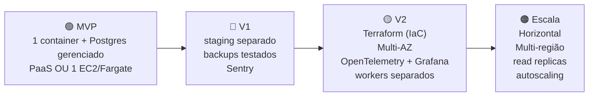
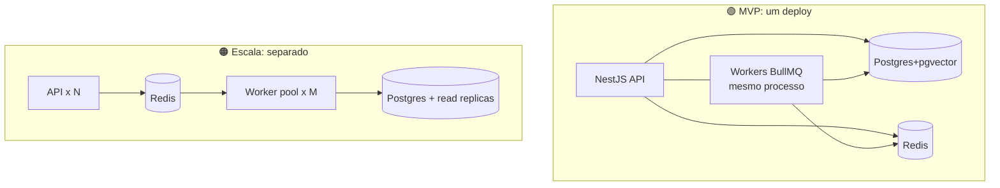
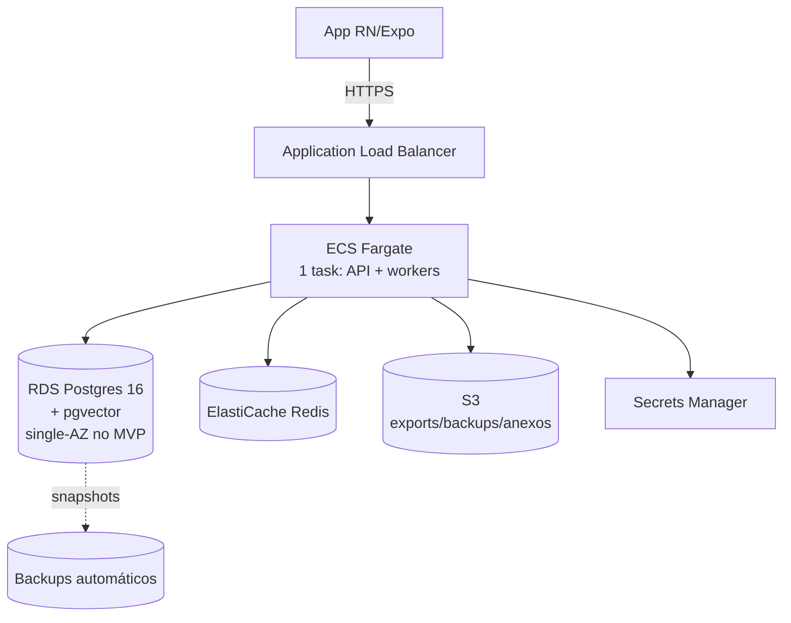
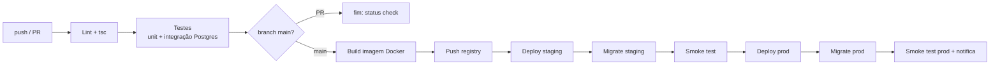
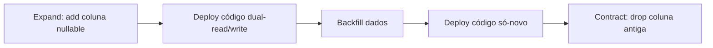
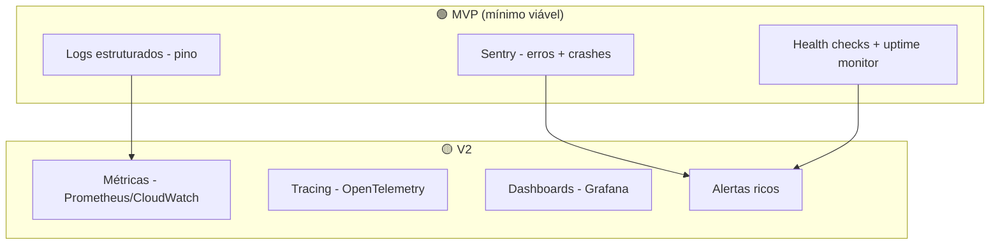
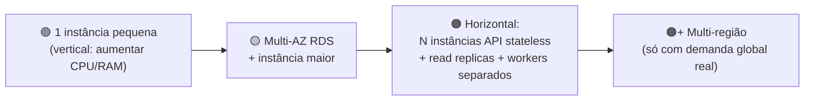

# 27 — DevOps (Infra, CI/CD, Observabilidade)

> **Fase geral:** Transversal · **Leia antes:** [`ATLAS_MASTER_CONTEXT.md`](ATLAS_MASTER_CONTEXT.md)
> **Documentos relacionados:** [`07_System_Architecture`](07_System_Architecture.md), [`09_Backend_Architecture`](09_Backend_Architecture.md), [`10_Database_Design`](10_Database_Design.md), [`26_Testing`](26_Testing.md), [`22_Business_Model`](22_Business_Model.md), [`15_Privacy_Architecture`](15_Privacy_Architecture.md), [`25_Risks`](25_Risks.md)
> **Status:** Vivo · **Versão:** 0.1 · **Última atualização:** 2026-07-20
> **Owner:** Fundador solo

---

## Resumo executivo

DevOps para um fundador solo tem uma métrica-mestre: **minutos de operação por semana**. Cada peça de infra que você adiciona é uma peça que você mantém, atualiza, monitora e conserta às 2h da manhã — sozinho. Portanto, o princípio inegociável deste documento é **simplicidade operacional acima de sofisticação**: "boring tech por padrão" (§7.5 do Master Context) e nada de Kubernetes, service mesh, ou multi-região no MVP.

Decisões-âncora deste documento:

1. **Dev local = Docker Compose** com Postgres+pgvector, Redis e a app NestJS — um comando (`docker compose up`) reproduz produção em miniatura.
2. **MVP em produção = a opção mais barata e simples que roda um container Node + Postgres gerenciado.** A recomendação pragmática para solo dev é **começar em uma PaaS (Fly.io ou Railway/Render)** com Postgres gerenciado, e migrar para **AWS ECS Fargate + RDS + ElastiCache** quando houver receita/usuários que justifiquem — não antes. Ambos os caminhos são documentados; a decisão é reversível (§7.7).
3. **IaC (Terraform) entra em 🟡**, não no MVP. Até lá, a infra cabe em um `fly.toml`/console + este doc versionado.
4. **CI/CD = GitHub Actions**: build → test → migrate → deploy; mobile via **EAS Build/Update**.
5. **Observabilidade mínima desde o dia 1**: logs estruturados (pino), Sentry, health checks. OpenTelemetry/tracing e Grafana são 🟡.
6. **Backups automáticos e testados** são MVP (o produto é a vida do usuário; perda de dados = fim).

---

## 1. Filosofia de DevOps para solo dev

### 1.1. A métrica que governa tudo: custo operacional em tempo humano

Uma Big Tech otimiza para escala e confiabilidade com times dedicados de SRE. Você otimiza para **não gastar seu escassíssimo tempo com infra em vez de produto**. Toda decisão de DevOps passa por três perguntas:

1. **Quanto tempo/semana isso me custa para manter?** (patches, upgrades, monitoramento)
2. **O que acontece quando quebra às 2h da manhã?** (você é o on-call)
3. **É reversível?** (posso trocar depois sem reescrever tudo?)

### 1.2. Princípios (derivados do Master Context §7)

| Princípio | Aplicação em DevOps |
|---|---|
| **Boring tech** | Postgres gerenciado, um container, uma PaaS. Nada de K8s. |
| **Evolutiva em camadas** | Cada peça de infra tem uma **fase de entrada** definida. |
| **Custo consciente** | Orçamento explícito por fase; medir antes de escalar. |
| **Reversibilidade** | Container Docker + Postgres padrão → portável entre PaaS/AWS. |
| **Privacidade é arquitetura** | 1 região, mínimo de dados no servidor, backups criptografados (§6). |

### 1.3. A regra dura de fases aplicada à infra



---

## 2. Ambientes

### 2.1. Os três ambientes e quando existem

| Ambiente | Propósito | Fase | Onde |
|---|---|---|---|
| **dev (local)** | desenvolvimento diário | 🟢 | Docker Compose na sua máquina |
| **staging** | validar deploy/migrations antes de prod; smoke tests | 🔵 (no MVP pode ser opcional/efêmero) | mesma PaaS/AWS, projeto separado |
| **prod** | usuários reais (inicialmente você) | 🟢 | PaaS ou AWS |

> **Nota solo:** no MVP você pode viver com **dev + prod** e usar *feature flags* + deploy cuidadoso. Staging permanente vira valioso em 🔵, quando quebrar prod tem custo real (outros usuários). Um meio-termo barato: **staging efêmero por PR** (a PaaS oferece "preview environments").

### 2.2. Paridade dev/prod

O maior gerador de bugs "funciona na minha máquina" é a divergência de ambientes. Mitigação: **o mesmo `Dockerfile` roda em dev, staging e prod**; as únicas diferenças são variáveis de ambiente e recursos (tamanho de instância). Postgres e Redis são as **mesmas versões** em todo lugar (fixadas por tag de imagem).

---

## 3. Docker & Compose para dev local

### 3.1. Objetivo

Um novo `git clone` deve chegar a "app rodando com banco populado" com **um comando**. Isso protege o *futuro você* (que esqueceu o setup) e é a base da paridade dev/prod.

### 3.2. `docker-compose.yml` (dev)

```yaml
# docker-compose.yml — ambiente de desenvolvimento local
services:
  db:
    image: pgvector/pgvector:pg16   # Postgres 16 + extensão vector (ADR-0004)
    environment:
      POSTGRES_USER: atlas
      POSTGRES_PASSWORD: atlas
      POSTGRES_DB: atlas_dev
    ports: ["5432:5432"]
    volumes: ["atlas_pgdata:/var/lib/postgresql/data"]
    healthcheck:
      test: ["CMD-SHELL", "pg_isready -U atlas -d atlas_dev"]
      interval: 5s
      timeout: 3s
      retries: 10

  redis:
    image: redis:7-alpine   # cache + filas BullMQ (ADR-0002/§5.2)
    ports: ["6379:6379"]
    command: ["redis-server", "--appendonly", "yes"]
    volumes: ["atlas_redisdata:/data"]
    healthcheck:
      test: ["CMD", "redis-cli", "ping"]
      interval: 5s
      timeout: 3s
      retries: 10

  api:
    build:
      context: .
      target: dev   # estágio de dev do Dockerfile (hot reload)
    command: npm run start:dev
    environment:
      DATABASE_URL: postgres://atlas:atlas@db:5432/atlas_dev
      REDIS_URL: redis://redis:6379
      NODE_ENV: development
    ports: ["3000:3000"]
    volumes:
      - .:/app          # hot reload
      - /app/node_modules
    depends_on:
      db: { condition: service_healthy }
      redis: { condition: service_healthy }

volumes:
  atlas_pgdata:
  atlas_redisdata:
```

### 3.3. `Dockerfile` multi-stage (dev + build + prod)

Um único Dockerfile com estágios: `dev` (hot reload), `build` (compila TS + gera Prisma client), `prod` (imagem enxuta só com o necessário). Isso garante paridade e imagem final pequena/segura.

```dockerfile
# Dockerfile
# ---- base ----
FROM node:20-slim AS base
WORKDIR /app
RUN apt-get update && apt-get install -y openssl && rm -rf /var/lib/apt/lists/*
COPY package*.json ./

# ---- deps (todas, p/ build e dev) ----
FROM base AS deps
RUN npm ci

# ---- dev (hot reload) ----
FROM deps AS dev
COPY . .
RUN npx prisma generate
EXPOSE 3000
CMD ["npm", "run", "start:dev"]

# ---- build ----
FROM deps AS build
COPY . .
RUN npx prisma generate && npm run build
RUN npm prune --omit=dev   # remove devDeps do node_modules

# ---- prod (enxuta) ----
FROM node:20-slim AS prod
WORKDIR /app
RUN apt-get update && apt-get install -y openssl && rm -rf /var/lib/apt/lists/*
ENV NODE_ENV=production
COPY --from=build /app/node_modules ./node_modules
COPY --from=build /app/dist ./dist
COPY --from=build /app/prisma ./prisma
COPY package*.json ./
EXPOSE 3000
# roda migrations no start e sobe a app (padrão simples p/ solo; ver §7.4 p/ alternativa)
CMD ["sh", "-c", "npx prisma migrate deploy && node dist/main.js"]
```

### 3.4. Workers BullMQ: mesmo deploy no MVP

No MVP (§5.2 do Master Context), os workers BullMQ rodam **no mesmo processo/deploy** da API — mais simples de operar. A separação em serviço de worker dedicado é **🟠** (escala), quando a carga de jobs competir com o tráfego HTTP.



---

## 4. Produção no MVP: escolhendo onde rodar

### 4.1. O que o Atlas precisa rodar

- 1 container Node (API + workers).
- Postgres 16 **com pgvector**.
- Redis.
- Armazenamento de objetos (S3-compatível) para exports/backups/anexos.
- HTTPS/TLS.

### 4.2. Comparação de opções (a decisão central)

| Opção | Custo inicial/mês | Esforço operacional | pgvector? | Escala | Melhor quando |
|---|---|---|---|---|---|
| **Fly.io** | ~US$ 5–25 | **Muito baixo** | ✅ (Fly Postgres ou Postgres gerenciado) | boa (regiões, scale simples) | **Recomendado p/ MVP** — deploy via Dockerfile, barato, simples |
| **Railway** | ~US$ 5–20 | **Muito baixo** | ✅ (plugin Postgres+pgvector) | média | MVP; DX excelente; ótimo p/ prototipar |
| **Render** | ~US$ 7–25 | Baixo | ✅ (Postgres gerenciado) | média | MVP; parecido com Railway |
| **AWS ECS Fargate + RDS + ElastiCache** | ~US$ 60–150 | **Médio-alto** | ✅ (RDS pgvector) | **excelente** | quando há receita/usuários; alinhado ao stack canônico e ao futuro |
| **AWS 1× EC2 (Docker Compose na VM) + RDS** | ~US$ 30–80 | Médio (você patcha a VM) | ✅ | boa (vertical) | quer AWS barato sem gerenciar Fargate |
| **VPS "burro" (Hetzner/DO) + Docker** | ~US$ 5–20 | Médio-alto (você é o SRE de tudo) | ✅ (Postgres em container) | vertical | máximo controle/mínimo custo, máximo trabalho |

### 4.3. Recomendação pragmática (e por quê)

> **🟢 MVP: comece em Fly.io** (ou Railway, se preferir DX ainda mais simples), com **Postgres gerenciado com pgvector** e Redis gerenciado.
> **🔵/🟡 quando houver tração e/ou você precisar de recursos AWS (compliance, contratos B2B2C, VPC): migre para AWS ECS Fargate + RDS + ElastiCache.**

Justificativa:

1. **Custo:** Fly/Railway custam ~10% de uma stack AWS equivalente no início. Para um projeto sem receita, isso é a diferença entre "sustentável indefinidamente" e "sangrando dinheiro".
2. **Tempo operacional:** você não gerencia VPC, security groups, IAM, task definitions — coisas que consomem horas e não geram produto.
3. **Reversibilidade (§7.7):** como você empacota em **Docker + Postgres padrão**, migrar de Fly para AWS depois é "aponte o `DATABASE_URL` e mude o alvo de deploy", não uma reescrita. É por isso que a decisão pode ser barata agora.
4. **Alinhamento futuro:** o Master Context fixa **AWS** como destino (§5.5). Isso continua verdadeiro — a recomendação é apenas *quando* pagar o imposto de complexidade da AWS: quando ela se pagar.

> **Nota de honestidade arquitetural:** o Master Context §5.5 lista "AWS (ECS Fargate ou 1 EC2 + RDS + ElastiCache)" como MVP. Este documento **não contradiz** isso — AWS continua sendo o alvo. A recomendação de começar em PaaS é uma *tática de custo/tempo* para o fundador solo, plenamente reversível, e deve ser registrada como um **ADR** (ex.: ADR-0011 "PaaS antes de AWS no MVP") em [`24_ADRs`](24_ADRs.md) se adotada. Se você preferir aderir estritamente ao stack canônico desde o dia 1, use o caminho **ECS Fargate + RDS + ElastiCache** de §5.

### 4.4. Arquitetura de produção (MVP em AWS, se escolhido)



| Componente AWS | Papel | Config MVP | Evolução |
|---|---|---|---|
| ECS Fargate | roda o container | 1 task, 0.5 vCPU/1GB | autoscaling (🟠) |
| ALB | TLS + roteamento + health check | 1 | WAF (🟡) |
| RDS Postgres+pgvector | banco primário | `db.t4g.micro`, single-AZ | Multi-AZ (🟡), read replica (🟠) |
| ElastiCache Redis | cache + filas | `cache.t4g.micro` | cluster mode (🟠) |
| S3 | exports, backups, anexos | 1 bucket, criptografado (SSE) | lifecycle/Glacier (🟡) |
| Secrets Manager | segredos (DB, JWT, LLM keys) | ✅ | rotação automática (🟡) |
| CloudWatch | logs + alarmes básicos | ✅ | + OTel/Grafana (🟡) |

---

## 5. Infraestrutura como Código (IaC) — Terraform em 🟡

### 5.1. Por que NÃO no MVP

No MVP você tem **um** ambiente e **poucos** recursos. Escrever Terraform para isso é um imposto de tempo que não se paga: você gastaria dias aprendendo/depurando HCL para provisionar o que o console/CLI faz em minutos. "Clicar no console" é aceitável quando há um ambiente e um operador.

### 5.2. Por que SIM em 🟡 (o gatilho)

Terraform entra quando **qualquer** destes for verdade:

- Você precisa de **staging idêntico a prod** (reproduzir infra vira dor manual).
- Você teme **mudanças manuais não rastreadas** ("o que eu cliquei mês passado?").
- Você quer **disaster recovery**: recriar tudo do zero em outra região/conta.
- Você adiciona recursos suficientes para que o *drift* manual seja um risco real.

### 5.3. Enquanto isso: "IaC pobre"

Até o Terraform valer a pena, mantenha a infra **documentada e versionada** de forma leve:

- `fly.toml` / `render.yaml` versionados no repo (isso *já* é IaC declarativa da PaaS).
- Um `INFRA.md` com os passos exatos de provisionamento.
- Scripts idempotentes (`aws cli`) para o que for repetitivo.

```toml
# fly.toml — IaC declarativa "de graça" da PaaS (versionado no repo)
app = "atlas-api"
primary_region = "gru"   # São Paulo (1 região no MVP)

[build]
  dockerfile = "Dockerfile"
  build-target = "prod"

[env]
  NODE_ENV = "production"

[http_service]
  internal_port = 3000
  force_https = true
  auto_stop_machines = true    # economiza $ quando ocioso
  min_machines_running = 1

[[http_service.checks]]
  path = "/health"
  interval = "15s"
  timeout = "2s"
```

---

## 6. CI/CD com GitHub Actions

### 6.1. Visão geral do pipeline



### 6.2. Workflow de CI (test) — ligação com [`26_Testing`](26_Testing.md)

Os testes de integração usam **Testcontainers** (Postgres+pgvector efêmero), que precisa do Docker do runner — disponível no `ubuntu-latest`.

```yaml
# .github/workflows/ci.yml
name: CI
on:
  push: { branches: [main] }
  pull_request:
jobs:
  test:
    runs-on: ubuntu-latest
    steps:
      - uses: actions/checkout@v4
      - uses: actions/setup-node@v4
        with: { node-version: 20, cache: npm }
      - run: npm ci
      - run: npm run lint
      - run: npx tsc --noEmit
      - run: npm run test:unit
      - run: npm run test:integration     # Testcontainers pgvector
      - run: npm run test:contract
```

### 6.3. Workflow de deploy (backend)

```yaml
# .github/workflows/deploy.yml
name: Deploy
on:
  push: { branches: [main] }
concurrency:
  group: deploy-prod
  cancel-in-progress: false   # nunca deploys concorrentes
jobs:
  deploy:
    needs: []                  # roda após CI verde (branch protection exige checks)
    runs-on: ubuntu-latest
    environment: production    # gate/approval opcional
    steps:
      - uses: actions/checkout@v4

      # --- opção A: Fly.io (recomendada p/ MVP) ---
      - uses: superfly/flyctl-actions/setup-flyctl@master
      - run: flyctl deploy --remote-only
        env: { FLY_API_TOKEN: ${{ secrets.FLY_API_TOKEN }} }
      # migrations rodam via release_command do fly (ver §7.4)

      # --- opção B: AWS ECS (quando migrar) ---
      # - uses: aws-actions/configure-aws-credentials@v4
      #   with: { role-to-assume: ${{ secrets.AWS_DEPLOY_ROLE }}, aws-region: sa-east-1 }
      # - run: |
      #     aws ecs run-task ... (migrate como task one-off)   # ver §7.4
      #     aws ecs update-service --force-new-deployment ...
```

### 6.4. Estratégia de deploy: rolling simples > blue-green no MVP

| Estratégia | Complexidade | Downtime | Fase |
|---|---|---|---|
| **Rolling (1 instância nova sobe, antiga desce)** | baixa | ~zero se health check ok | 🟢 |
| **Blue-green** | média | zero + rollback instantâneo | 🟡 |
| **Canário** | alta | zero + risco gradual | 🟠 |

No MVP, *rolling* com health check já dá deploy sem downtime perceptível para um app com pouca carga. Blue-green/canário são complexidade que só se paga com usuários e receita.

### 6.5. Secrets

- **Nunca** commitar segredos. `.env` local (gitignored); segredos de CI em **GitHub Actions Secrets**; segredos de runtime em **Fly Secrets** / **AWS Secrets Manager**.
- Chaves de LLM, JWT secret, `DATABASE_URL` de prod: só na plataforma, injetadas como env vars.
- Rotação: manual no MVP; automática (Secrets Manager) em 🟡.

---

## 7. Migrations de banco

### 7.1. Ferramenta: Prisma Migrate (canônico) — Drizzle no mobile

O Master Context fixa **Prisma** no backend (§3, stack do autor) e **Drizzle** no mobile (§5.1). Portanto:

- **Backend/Postgres:** Prisma Migrate.
- **Mobile/SQLite:** Drizzle migrations (empacotadas no app, aplicadas no device).

### 7.2. Regras de ouro (evitar corromper dados de produção)

1. **Migrations são forward-only e versionadas** no repo (`prisma/migrations/*`).
2. **Sempre expand → migrate → contract** para mudanças destrutivas (nunca dropar coluna que a versão anterior ainda usa):
   - **Expand:** adiciona nova coluna/tabela (compatível com código antigo e novo).
   - **Deploy do código** que escreve/lê o novo formato.
   - **Backfill** dos dados.
   - **Contract:** remove o antigo, num deploy posterior.
3. **Teste a migration no CI** (aplica do zero via Testcontainers) e cheque *drift* (`prisma migrate diff` = vazio). Ver [`26_Testing`](26_Testing.md) §5.7.
4. **Backup antes de migrations destrutivas** em prod (snapshot manual).



### 7.3. Migration como parte do deploy

```yaml
# prisma: comando aplicado em cada deploy (idempotente)
# fly.toml
[deploy]
  release_command = "npx prisma migrate deploy"   # roda ANTES de trocar as machines
```

### 7.4. Onde rodar a migration (importante)

- **PaaS (Fly):** `release_command` roda a migration **antes** do novo código assumir — ideal.
- **AWS ECS:** rode a migration como **task one-off** (`aws ecs run-task`) no pipeline, **antes** do `update-service`. Evite rodar migration no `CMD` de cada task em produção com múltiplas instâncias (corrida de migrations). O `CMD ... migrate deploy` do Dockerfile em §3.3 é aceitável só quando há **uma** instância (MVP single-task); com N instâncias, mude para task one-off.

---

## 8. Deploy do mobile (EAS)

### 8.1. Dois canais: Build (binário) e Update (OTA)

| Mecanismo | O que atualiza | Quando usar | Passa pela loja? |
|---|---|---|---|
| **EAS Build** | binário nativo (`.ipa`/`.aab`) | mudou código nativo, permissões, deps nativas | ✅ (App Store / Play) |
| **EAS Update** | bundle JS/assets (OTA) | mudou só JS/TS/React | ❌ (instantâneo) |

O EAS Update (OTA) é ouro para solo dev: corrige bugs de JS **sem esperar revisão da loja**. Mas respeite os limites (não pode mudar código nativo/permissões por OTA).

### 8.2. Workflow EAS no GitHub Actions

```yaml
# .github/workflows/mobile.yml
name: Mobile
on:
  push:
    branches: [main]
    paths: ["apps/mobile/**"]
jobs:
  update:
    runs-on: ubuntu-latest
    steps:
      - uses: actions/checkout@v4
      - uses: actions/setup-node@v4
        with: { node-version: 20, cache: npm }
      - run: npm ci
      - uses: expo/expo-github-action@v8
        with:
          eas-version: latest
          token: ${{ secrets.EXPO_TOKEN }}
      # OTA para mudanças de JS (rápido)
      - run: eas update --branch production --auto
      # Build de loja: manual/tag (custa créditos EAS + tempo)
      # - run: eas build --platform all --profile production --non-interactive
```

### 8.3. Canais e ambientes

- `development` (dev client), `preview` (staging/testers), `production`.
- Mapeie o canal EAS Update ao ambiente do backend (o app aponta para a API certa por env).
- Estratégia de versão: OTA para *patches* de JS; *bump* de versão + build de loja para releases com mudança nativa.

---

## 9. Observabilidade

### 9.1. Os três pilares e o que entra em cada fase



### 9.2. Logs estruturados (pino) — MVP

Logs em **JSON** (não texto solto) desde o dia 1: pesquisáveis, filtráveis, e prontos para qualquer agregador depois. Inclua sempre `requestId`/`traceId`, `userId` (ou hash — cuidado com PII, §privacidade), rota, latência.

```ts
// logger.ts
import pino from 'pino';
export const logger = pino({
  level: process.env.LOG_LEVEL ?? 'info',
  redact: ['req.headers.authorization', '*.password', '*.token', '*.embedding'], // não vaza PII/segredos
  formatters: { level: (label) => ({ level: label }) },
});
```

> **Privacidade nos logs (§6 do Master Context):** o Atlas processa a vida do usuário. **Nunca** logar payloads de eventos com conteúdo sensível, embeddings, ou PII. Logue *metadados* (tipo de evento, contagem, latência), não *conteúdo*. Use `redact`.

### 9.3. Sentry — erros e crashes (MVP)

- **Backend:** captura exceções não tratadas + contexto (rota, request id).
- **Mobile:** captura crashes JS/nativos + breadcrumbs; integra com EAS (source maps por release).
- Configure **scrubbing de PII** no Sentry (não enviar corpo de eventos).

### 9.4. Health checks

```ts
// health.controller.ts
@Get('/health')
async health() {
  // liveness: o processo está de pé?
  return { status: 'ok', ts: Date.now() };
}
@Get('/ready')
async ready() {
  // readiness: dependências ok? (usado pelo LB antes de rotear)
  await this.db.$queryRaw`SELECT 1`;
  await this.redis.ping();
  return { db: 'ok', redis: 'ok' };
}
```

Um **uptime monitor** externo gratuito (UptimeRobot/Better Stack) pinga `/health` e te avisa (e-mail/Telegram) se cair — o "on-call" mais barato do mundo.

### 9.5. Métricas e tracing — OpenTelemetry em 🟡

Tracing distribuído (OTel) só se justifica quando há **fluxos multi-etapa/multi-serviço** difíceis de depurar por log — o que só acontece quando a app cresce (workers separados, mais módulos, latências misteriosas). No MVP (um processo), logs estruturados + Sentry cobrem 95% dos casos. Quando entrar: OTel SDK no Nest → exporta para Grafana Tempo/Cloud, métricas para Prometheus/CloudWatch, dashboards no Grafana.

### 9.6. Alertas (o que realmente acordar você)

| Alerta | Fase | Canal |
|---|---|---|
| App down (health check falha) | 🟢 | e-mail/Telegram (uptime monitor) |
| Taxa de erro > X% (Sentry) | 🟢 | e-mail |
| Fila BullMQ com backlog crescente / DLQ | 🔵 | e-mail |
| Disco/CPU/conexões do DB > 80% | 🔵 | provedor/CloudWatch |
| Custo de LLM acima do orçado | 🔵 | métrica própria → alerta |
| Latência p95 acima do SLO | 🟡 | Grafana |

Regra anti-fadiga: **poucos alertas, todos acionáveis.** Um alerta que você aprende a ignorar é ruído.

---

## 10. Backups e Disaster Recovery

### 10.1. Por que é MVP (não adiável)

O produto **é** a vida do usuário (o CMHL). Perder dados = destruir o produto e a confiança (a pré-condição, §6). Backups não são opcionais nem "para depois".

### 10.2. Estratégia de backup

| Dado | Como | Frequência | Retenção |
|---|---|---|---|
| **Postgres** | snapshots automáticos gerenciados (RDS/Fly/Neon) + `pg_dump` lógico periódico p/ S3 | contínuo (PITR) + dump diário | 7–30 dias |
| **Redis** | efêmero (cache/filas) — **não** é fonte de verdade | AOF local | — |
| **S3 (exports/anexos)** | versionamento de bucket + replicação | contínuo | conforme política |

Dois níveis: **snapshot físico** (rápido de restaurar, preso ao provedor) + **dump lógico** (`pg_dump`, portável, sobrevive à troca de provedor). Ambos **criptografados**.

### 10.3. RPO e RTO (metas honestas para solo dev)

| Métrica | Definição | Alvo MVP |
|---|---|---|
| **RPO** (Recovery Point Objective) | quanto de dado posso perder | ≤ 24h (dump diário) / ≤ minutos (PITR) |
| **RTO** (Recovery Time Objective) | quanto tempo p/ voltar | ≤ algumas horas |

### 10.4. A regra que quase todo mundo esquece: **teste o restore**

Um backup nunca testado é uma esperança, não um backup. Agende (mensal em 🔵) um **restore de fumaça**: restaure o último dump em um Postgres efêmero e rode um smoke test. Automatizável no GitHub Actions.

```yaml
# .github/workflows/backup-restore-drill.yml (🔵 — mensal)
on:
  schedule: [{ cron: "0 6 1 * *" }]  # dia 1, 06:00 UTC
jobs:
  drill:
    runs-on: ubuntu-latest
    services:
      pg: { image: pgvector/pgvector:pg16, env: { POSTGRES_PASSWORD: t }, ports: ["5432:5432"] }
    steps:
      - run: aws s3 cp s3://atlas-backups/latest.dump ./latest.dump
      - run: pg_restore --dbname=postgres://postgres:t@localhost:5432/postgres ./latest.dump
      - run: psql ... -c "SELECT count(*) FROM events;"   # smoke: dados vieram?
```

### 10.5. Local-first como camada extra de DR

Um detalhe elegante da arquitetura (§6): como o Atlas é **local-first**, o dispositivo do usuário guarda uma cópia dos dados dele. Isso é uma rede de segurança adicional — mas **não** substitui backups do servidor (nem todo dado está em todo device; usuários podem trocar de aparelho).

---

## 11. Escalabilidade (quando e como)

### 11.1. Vertical primeiro, horizontal depois



### 11.2. Gatilhos quantitativos (não escale por estética)

| Sinal | Ação | Fase |
|---|---|---|
| CPU/RAM da instância > 70% sustentado | subir o tamanho (vertical) | 🟡 |
| DB é o gargalo em leitura | read replica | 🟠 |
| Downtime de manutenção do DB dói | Multi-AZ | 🟡 |
| Jobs competem com HTTP por recursos | separar worker pool | 🟠 |
| pgvector com p95 alto @ N vetores | migrar p/ Qdrant (ADR-0008) | 🟡 |
| Latência global alta p/ usuários distantes | multi-região | 🟠 |

### 11.3. O que já é "escalável por design" no MVP

- **API stateless** (JWT, nada de sessão em memória) → escalar horizontalmente é só subir réplicas atrás do LB, quando precisar.
- **Filas (BullMQ)** desacoplam trabalho pesado do request → absorver picos.
- **Event-centric + read models** → leituras rápidas sem recomputar; snapshots aceleram histórico.

Ou seja, o MVP **não precisa** ser distribuído, mas foi desenhado para não *impedir* a distribuição depois (T3 da Visão: arquitetura reversível).

---

## 12. Custos por fase (orçamento realista)

> Valores diretivos em USD/mês; variam por provedor e uso. Objetivo: mostrar a **ordem de grandeza** e o que dirige o custo.

| Item | 🟢 MVP (PaaS) | 🟢 MVP (AWS) | 🟡 V2 | 🟠 Escala |
|---|---|---|---|---|
| Compute (API+workers) | $5–15 (Fly) | $20–40 (Fargate) | $40–100 | $200+ (N instâncias) |
| Postgres | $0–20 (Fly/Neon free tier→) | $15–30 (RDS t4g.micro) | $50–150 (Multi-AZ) | $300+ (replicas) |
| Redis | $0–10 | $12–20 (ElastiCache) | $20–50 | $100+ |
| S3/storage | ~$1 | ~$1–5 | $10–30 | $50+ |
| Sentry | free tier | free tier | $26+ | $80+ |
| **LLM/embeddings** | **$5–30 (dirige o custo!)** | idem | $50–300 | $500+ (com usuários) |
| Domínio/TLS | ~$1 | ~$1 | ~$1 | ~$1 |
| **Total aprox.** | **~$15–70/mês** | **~$60–120/mês** | **~$200–600/mês** | **$1k+/mês** |

**Observações críticas de custo (§7.6 consciência de custo):**

1. **O maior custo variável é IA (LLM/embeddings), não infra.** Por isso o Master Context manda heurística antes de LLM e cache agressivo de embeddings ([`12_AI_Architecture`](12_AI_Architecture.md)). Meça o custo de IA por usuário e alerte.
2. **Free tiers cobrem o MVP com um usuário (você).** Neon/Fly/Sentry têm tiers gratuitos suficientes para provar a tese.
3. **AWS custa ~2–4x a PaaS** no início — pague isso quando ele se pagar (compliance, receita, contratos).
4. **`auto_stop_machines`** (Fly) e Fargate spot reduzem custo ocioso — relevante quando há um usuário.

---

## 13. Segurança operacional (resumo — ver [`16_Security`](16_Security.md))

- **TLS em tudo** (LB/PaaS gerenciam certs automaticamente).
- **Segredos** só em Secrets Manager/Fly Secrets; nunca no código.
- **Princípio do menor privilégio** no IAM (quando AWS): role de deploy só faz deploy.
- **Backups criptografados** (SSE no S3, encryption at rest no RDS).
- **Dependências:** Dependabot/Renovate + `npm audit` no CI.
- **Imagem enxuta** (multi-stage) reduz superfície de ataque; escanear com Trivy (🟡).
- **1 região + mínimo de dados no servidor** (§6): menos superfície, alinhado à privacidade.

---

## 14. Estratégia por fase (resumo operacional)

| Fase | Infra | CI/CD | Observabilidade | Backup/DR | IaC |
|---|---|---|---|---|---|
| 🟢 **MVP** | Docker Compose (dev); **PaaS (Fly/Railway)** ou 1 EC2/Fargate + Postgres gerenciado + Redis; 1 região | GH Actions: build→test→migrate→deploy; EAS Build/Update | pino + Sentry + health check + uptime monitor | snapshots + dump diário p/ S3, criptografado | `fly.toml`/console + `INFRA.md` |
| 🔵 **V1** | + staging (efêmero ou fixo); EAS canais | + smoke test pós-deploy; approvals | + alertas de fila/DB/custo LLM; **restore drill mensal** | restore testado | ainda leve |
| 🟡 **V2** | Migra p/ **AWS ECS Fargate + RDS Multi-AZ + ElastiCache**; workers começam a separar | blue-green; migrations como task one-off | **OpenTelemetry + Grafana + Prometheus**; SLOs | PITR + Multi-AZ | **Terraform** |
| 🟠 **Escala** | Horizontal (N tasks), read replicas, autoscaling, multi-região se necessário; Qdrant se pgvector limitar | canário; deploy contínuo | tracing completo, dashboards, on-call estruturado | multi-região, failover testado | Terraform + módulos |

---

## 15. Runbook mínimo (o que fazer quando quebra)

| Sintoma | Primeira ação | Depois |
|---|---|---|
| App down (uptime alert) | ver logs (Sentry/pino), `/ready` | rollback do último deploy se recente |
| Deploy quebrou prod | `flyctl deploy` da versão anterior / `ecs update-service` p/ task anterior | investigar migration (foi destrutiva?) |
| DB lento | ver conexões/slow queries; escalar vertical | adicionar índice; read replica (🟠) |
| Fila travada / DLQ crescendo | inspecionar jobs falhos; corrigir causa; reenfileirar | ver idempotência ([`26_Testing`](26_Testing.md) §6) |
| Custo de LLM disparou | checar loop/retry sem cache; desligar feature | otimizar prompt/cache ([`12`](12_AI_Architecture.md)) |
| Suspeita de perda de dado | **parar escritas**; restaurar do último backup em ambiente isolado; validar | post-mortem; melhorar backup |

---

### Cross-links

- Testes que rodam neste pipeline: [`26_Testing`](26_Testing.md)
- Custo e otimização de IA (maior custo variável): [`12_AI_Architecture`](12_AI_Architecture.md)
- Design do banco / pgvector / gatilho Qdrant: [`10_Database_Design`](10_Database_Design.md)
- Modelo de monetização (contexto de orçamento): [`22_Business_Model`](22_Business_Model.md)
- Privacidade (1 região, mínimo de dados, criptografia): [`15_Privacy_Architecture`](15_Privacy_Architecture.md)
- Segurança: [`16_Security`](16_Security.md)
- Decisões formais: [`24_ADRs`](24_ADRs.md)
