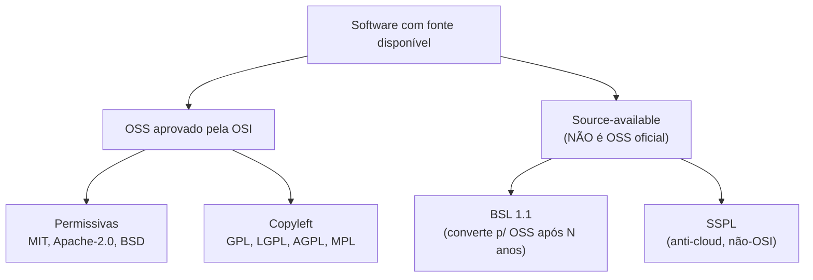
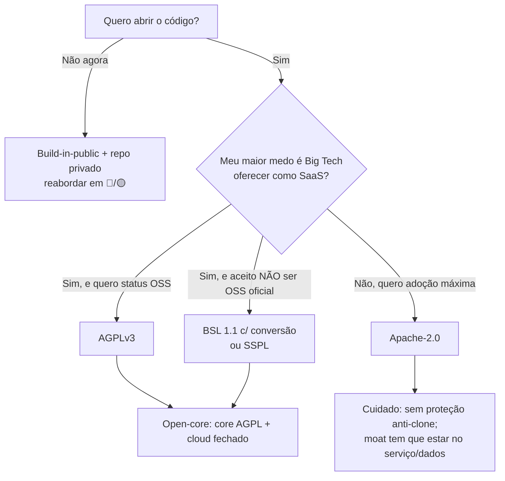
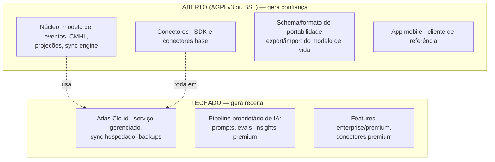
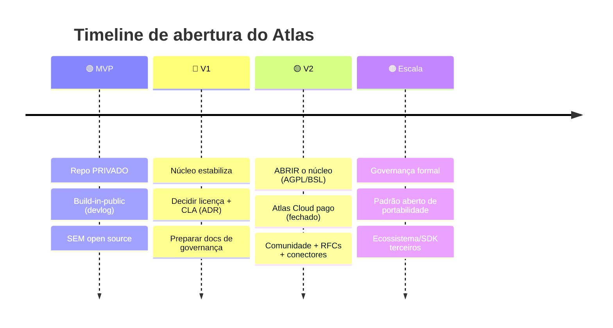

# 28 — Open Source Strategy

> **Fase geral:** Estratégica (entra em 🔵/🟡) · **Leia antes:** [`ATLAS_MASTER_CONTEXT.md`](ATLAS_MASTER_CONTEXT.md)
> **Documentos relacionados:** [`00_Project_Vision`](00_Project_Vision.md), [`22_Business_Model`](22_Business_Model.md), [`15_Privacy_Architecture`](15_Privacy_Architecture.md), [`25_Risks`](25_Risks.md), [`21_Roadmap`](21_Roadmap.md), [`24_ADRs`](24_ADRs.md)
> **Status:** Vivo · **Versão:** 0.1 · **Última atualização:** 2026-07-20
> **Owner:** Fundador solo

---

## Resumo executivo

Open source não é uma decisão binária ("abrir ou não"), mas um **espectro de licenças e modelos** com implicações comerciais profundas. Para o Atlas — um produto cuja tese depende de **confiança/privacidade** (§6 do Master Context) e cujo fosso é o **CMHL acumulado do usuário**, não o código —, abrir o código é *estrategicamente coerente*: transparência auditável é a prova viva de que "seus dados são seus".

Recomendação central deste documento:

> **Modelo open-core com licença copyleft forte no núcleo.** Abrir o **motor/núcleo** do Atlas (modelo de eventos, CMHL, sync engine, conectores) sob **AGPLv3** (ou **BSL** com conversão temporal, se a preocupação com clones comerciais for alta), e manter **fechado** o serviço gerenciado em nuvem (Atlas Cloud), features enterprise e o pipeline proprietário de insights de IA. Monetização via **cloud pago + features premium** — plenamente compatível com [`22_Business_Model`](22_Business_Model.md).

Timing:

> **NÃO abrir no MVP 🟢.** Abrir é uma decisão de mão única de alto custo operacional (comunidade, governança, segurança pública). Entra em **🔵/🟡**, quando o núcleo estiver estável, houver o que valha a pena abrir, e você tiver banda para sustentar comunidade. Até lá: **build-in-public** (compartilhar a jornada) ≠ **open source** (compartilhar o código).

---

## 1. Por que (ou por que não) open source

### 1.1. O que "open source" resolve — e o que não resolve

Open source é frequentemente romantizado. Sejamos precisos sobre o que ele **de fato** entrega e a que **custo**.

| Benefício | Real para o Atlas? | Nuance |
|---|---|---|
| **Confiança/auditabilidade** | ✅ **Muito alto** | Um produto que vê a vida inteira do usuário *precisa* provar que faz o que diz. Código aberto = auditável = confiança verificável, não prometida. |
| **Adoção/distribuição** | ✅ Alto | Devs e early adopters (persona provável) confiam mais e experimentam mais o que é aberto. |
| **Contribuições externas** | ⚠️ Médio/baixo (no início) | Contribuição relevante é rara e cara de coordenar; conectores são a área mais plausível de contribuição da comunidade. |
| **Recrutamento/marca** | ✅ Alto | Repo forte = portfólio + credibilidade Big Tech/banca (P1–P3 da Visão §6.3). |
| **Longevidade/"não some se eu parar"** | ✅ Alto | Alinha com a promessa de portabilidade e "seu modelo é seu" (§9 da Visão). |
| **Padrão aberto de portabilidade** | ✅ Estratégico | A visão de longo prazo (§9) fala em "padrão aberto de portabilidade de modelo de vida" — OSS é o veículo natural. |

| Custo/risco | Peso p/ solo dev |
|---|---|
| **Manutenção de comunidade** (issues, PRs, perguntas) | 🔴 Alto — consome o recurso mais escasso: seu tempo |
| **Superfície de segurança pública** | 🔴 Alto — bugs viram CVEs visíveis; você é o time de resposta |
| **Concorrentes/Big Tech forkarem** | 🟡 Médio — mitigável por licença + moat de dados (§8) |
| **Expectativa de suporte gratuito** | 🟡 Médio — precisa de fronteiras claras |
| **Decisão de mão única** | 🔴 Fechar depois queima confiança (ver "rug pull") |

### 1.2. O argumento decisivo para o Atlas: privacidade exige transparência

A tese de confiança (Visão §4, item 4) diz: *"privacidade não é obstáculo, é pré-condição."* Um usuário racional **não deveria** confiar sua vida inteira a uma caixa-preta proprietária. Código aberto transforma "confie em mim" em "verifique você mesmo". Para o Atlas, **abrir o núcleo é uma extensão lógica da postura de privacidade** — talvez o argumento mais forte de todo o produto.

### 1.3. O argumento decisivo contra abrir *tudo*: o moat não é o código

O Master Context (§1.3) é explícito: o fosso **não** é a IA nem o código, é o **CMHL acumulado**. Isso tem uma consequência libertadora: **abrir o código quase não enfraquece o moat**, porque o valor está nos dados do usuário (que são dele) e no serviço acumulado, não no software. Ao mesmo tempo, significa que abrir *tudo* (incluindo o serviço em nuvem e o pipeline proprietário de IA) entregaria de graça o que você poderia monetizar — sem ganho de moat correspondente. Daí **open-core**: abre o que gera confiança, fecha o que gera receita.

---

## 2. O espectro de licenças (comparação a fundo)

### 2.1. Taxonomia: três grandes famílias



### 2.2. Tabela comparativa (implicações comerciais)

| Licença | Família | Copyleft? | "Cláusula de rede"? | Big Tech pode oferecer como serviço fechado? | Implicação comercial p/ você |
|---|---|---|---|---|---|
| **MIT** | Permissiva | Não | Não | ✅ Sim, sem obrigações | Máxima adoção; **zero proteção** contra clones comerciais |
| **Apache-2.0** | Permissiva | Não | Não | ✅ Sim | Como MIT + concessão explícita de patentes (melhor que MIT p/ empresas) |
| **MPL-2.0** | Copyleft fraco | Por arquivo | Não | ✅ Sim (linkando) | Meio-termo; mudanças nos arquivos MPL voltam, resto pode fechar |
| **LGPL** | Copyleft fraco | Sim (na lib) | Não | ✅ (linkando dinamicamente) | Para bibliotecas; pouco relevante p/ um app/serviço |
| **GPLv3** | Copyleft forte | Sim | Não (só distribuição) | ✅ **como SaaS** (o "loophole SaaS") | Protege contra distribuição fechada, **mas não contra SaaS** |
| **AGPLv3** | Copyleft forte + rede | Sim | **Sim** (usar via rede = distribuir) | ❌ Não sem também abrir as modificações | **Fecha o loophole SaaS**; forte proteção anti-cloud mantendo status OSS |
| **BSL 1.1** | Source-available | — | Restringe uso comercial competitivo | ❌ Durante o período; ✅ após conversão | Você define a restrição (ex.: "não oferecer como serviço concorrente") por N anos, depois vira OSS (ex.: Apache/GPL) |
| **SSPL** | Source-available | Sim (agressivo) | **Sim, radical** | ❌ (exige abrir *toda a stack de serviço*) | Máxima proteção anti-cloud, mas **não é OSS** (rejeitada pela OSI); afasta parte da comunidade |

### 2.3. Explicando os conceitos que mais importam

**Copyleft vs. permissivo.** Licença *permissiva* (MIT/Apache) diz "faça o que quiser, só mantenha o aviso de copyright". Licença *copyleft* (GPL/AGPL) diz "faça o que quiser, **mas** se distribuir, distribua sob a mesma licença (com o código)". Copyleft é um mecanismo de reciprocidade: impede que alguém pegue seu código, melhore e feche.

**O "loophole SaaS" (por que GPL não basta para produtos de nuvem).** A GPL só é acionada na **distribuição** do software. Um provedor de nuvem que roda seu código GPL como serviço **não distribui** o binário — o usuário só acessa via rede. Logo, a GPL não obriga a Big Tech a abrir suas modificações de um SaaS. Foi exatamente esse buraco que motivou a **AGPL** (Affero GPL): ela define que **oferecer o software via rede conta como distribuição**, obrigando o provedor a disponibilizar o código-fonte (incluindo modificações) aos usuários do serviço.

**Source-available não é open source.** BSL e SSPL disponibilizam o código, mas com restrições que violam a definição da OSI (Open Source Initiative) — tipicamente restrições de uso comercial (BSL) ou exigências extremas de copyleft de serviço (SSPL). São ferramentas **anti-clone comercial**, não filosofia OSS. Empresas como HashiCorp (BSL), MongoDB/Elastic (SSPL) e outras migraram para elas justamente para se proteger de clouds que monetizavam o trabalho delas sem contribuir.

**BSL com conversão temporal (o mais engenhoso).** A Business Source License permite que você diga: "por 4 anos, ninguém pode oferecer o Atlas como serviço concorrente; passado esse prazo, cada versão vira automaticamente OSS (ex.: Apache-2.0)". Você fica protegido comercialmente no período em que a versão é relevante, e ainda entrega a promessa de abertura futura — o melhor dos dois mundos para muitos negócios (modelo do CockroachDB, Sentry, etc.).

### 2.4. Fluxograma de decisão de licença



---

## 3. Recomendação para o Atlas

### 3.1. Modelo: open-core com núcleo copyleft forte



### 3.2. O que abrir vs. fechar (tabela de decisão)

| Componente | Abrir? | Licença | Justificativa |
|---|---|---|---|
| Modelo de eventos / CMHL / projeções | ✅ | AGPL/BSL | É o coração da confiança e da portabilidade; moat não está aqui (está nos dados) |
| Sync engine (local-first) | ✅ | AGPL/BSL | Prova a promessa "seus dados no seu device" |
| Conectores base + SDK de conectores | ✅ | AGPL/BSL (SDK talvez Apache p/ adoção) | Área natural de contribuição da comunidade; efeito de rede de integrações |
| Formato de export/import (portabilidade) | ✅ | Aberto/spec pública | O "padrão aberto de portabilidade" da Visão §9 |
| App mobile (cliente de referência) | ✅ (provável) | AGPL/BSL | Demonstra o produto; reforça confiança |
| **Atlas Cloud** (serviço gerenciado) | ❌ | Proprietário | É o produto monetizado |
| **Pipeline proprietário de insights de IA** (prompts, evals, síntese premium) | ❌ | Proprietário | Diferencial de produto refinado; caro de construir |
| Features enterprise (SSO, admin, B2B2C) | ❌ | Proprietário | Monetização direta ([`22`](22_Business_Model.md)) |
| Conectores premium (fontes caras/licenciadas) | ❌ | Proprietário | Fonte de receita; alguns têm restrições de licença de terceiros |

### 3.3. AGPL vs. BSL — qual escolher para o núcleo?

| Critério | AGPLv3 | BSL 1.1 |
|---|---|---|
| Status OSS oficial (OSI) | ✅ Sim | ❌ Não (source-available) |
| Bloqueia SaaS concorrente | Parcial (força abrir modificações, mas concorrente pode cumprir) | ✅ Forte (proíbe uso comercial competitivo no período) |
| Aceitação da comunidade | Alta (é OSS de verdade) | Média (alguns evitam por não ser OSS) |
| Reversível/evolutivo | — | ✅ Converte p/ OSS após N anos |
| Complexidade jurídica | Baixa (licença padrão conhecida) | Média (você define o "Additional Use Grant") |

**Recomendação:** comece com **AGPLv3** para o núcleo. Ela é OSS legítima (maximiza confiança e comunidade), fecha o loophole SaaS (proteção razoável), e não carrega o estigma de "não é open source de verdade". Migre para **BSL** apenas se você constatar uma ameaça concreta de clones comerciais monetizando seu trabalho — decisão a registrar em ADR. Para SDKs voltados a adoção ampla (ex.: SDK de conectores), considere **Apache-2.0** para reduzir atrito.

### 3.4. Requisitos práticos para viabilizar open-core

- **CLA (Contributor License Agreement) ou DCO.** Para poder relicenciar (ex.: oferecer versão comercial ou migrar AGPL→BSL) e vender exceções, você precisa dos direitos sobre as contribuições. Um **CLA** concede isso; o **DCO** (Developer Certificate of Origin) é mais leve mas não permite relicenciamento unilateral. Para open-core com braço comercial, **CLA é o padrão** (ainda que gere algum atrito com puristas).
- **Fronteira técnica limpa** entre core aberto e cloud fechado (módulos com fronteiras claras, §7.4) — o open-core só funciona se a separação for arquitetural, não improvisada.
- **Dupla licença possível:** AGPL para a comunidade + licença comercial para quem não quer o copyleft (modelo clássico de venda de exceções).

---

## 4. Governança

### 4.1. Modelo de governança por fase

| Fase | Modelo | Descrição |
|---|---|---|
| 🔵 Abertura inicial | **BDFL** (Benevolent Dictator) | Você decide tudo. Honesto e eficiente para um projeto de um fundador. Não finja "comitê" quando é você. |
| 🟡 Comunidade crescendo | **Maintainers + BDFL** | Delega áreas (ex.: conectores) a mantenedores de confiança; você mantém veto arquitetural. |
| 🟠 Maduro | **Governança formal / possível fundação** | Steering committee, processo de eleição, talvez fundação (se virar padrão de fato). |

### 4.2. Documentos de governança (o "starter pack" de um repo sério)

| Arquivo | Propósito | Quando |
|---|---|---|
| `LICENSE` | licença escolhida (AGPL/BSL) | ao abrir |
| `README.md` | o que é, por que, como rodar | ao abrir |
| `CONTRIBUTING.md` | como contribuir, setup, padrões, DCO/CLA | ao abrir |
| `CODE_OF_CONDUCT.md` | comportamento esperado (ex.: Contributor Covenant) | ao abrir |
| `SECURITY.md` | como reportar vulnerabilidades (disclosure responsável) | **ao abrir (crítico p/ produto de privacidade)** |
| `GOVERNANCE.md` | quem decide o quê, como | 🟡 |
| `SUPPORT.md` | onde pedir ajuda (não nas issues) | ao abrir |
| `.github/ISSUE_TEMPLATE`, `PULL_REQUEST_TEMPLATE` | padronizar reports/PRs | ao abrir |
| `docs/rfcs/` | processo de RFC p/ mudanças grandes | 🟡 |
| `ROADMAP.md` / GitHub Projects | roadmap público | 🔵/🟡 |

### 4.3. Esboço de `CONTRIBUTING.md`

```markdown
# Contribuindo com o Atlas

Obrigado pelo interesse! O Atlas é uma Plataforma de Inteligência Pessoal
local-first. Antes de contribuir, leia nosso Código de Conduta e esta guia.

## Como contribuir
1. Abra uma *issue* descrevendo o problema/ideia ANTES de um PR grande.
2. Para mudanças arquiteturais, abra uma *RFC* (ver `docs/rfcs/`).
3. Fork → branch → PR pequeno e focado.

## Setup de desenvolvimento
- `docker compose up` (ver `27_DevOps.md`)
- `npm ci && npm run test`

## Padrões
- TypeScript strict; ESLint/Prettier passam no CI.
- Todo PR de lógica de domínio inclui testes (ver `26_Testing.md`).
- Conectores seguem o SDK de conectores e incluem testes de normalização.

## Licenciamento das contribuições (CLA)
Ao enviar um PR você concorda com o CLA (assinado via bot), que nos permite
distribuir sua contribuição sob a licença do projeto e uma licença comercial.

## Áreas onde mais precisamos de ajuda
- Novos conectores (Health Connect, bancos, calendários).
- Traduções (i18n).
- Documentação e exemplos.
```

### 4.4. Processo de RFC (🟡)

Para mudanças que afetam arquitetura, formato de dados ou o núcleo, um RFC leve: um markdown em `docs/rfcs/NNNN-titulo.md` com **contexto → proposta → alternativas → impacto → decisão**. Espelha os ADRs internos ([`24_ADRs`](24_ADRs.md)), mas aberto à discussão pública. Evita que decisões grandes aconteçam "por acidente" num PR.

---

## 5. Comunidade e build-in-public

### 5.1. Build-in-public ≠ open source

Distinção importante para o solo dev: você pode **build-in-public** (compartilhar a jornada, decisões, métricas, aprendizados — em blog, X/Twitter, devlog) **sem** abrir o código. Isso captura ~70% do benefício de marketing/comunidade com ~5% do custo operacional. **Recomendação: build-in-public começa cedo (🟢/🔵); abrir o código vem depois (🔵/🟡).**

### 5.2. Canais de comunidade (mínimos, sustentáveis)

| Canal | Uso | Fase |
|---|---|---|
| GitHub Issues/Discussions | bugs, features, Q&A | ao abrir |
| Devlog/blog | build-in-public, decisões técnicas (este doc é matéria-prima!) | 🟢 |
| Discord/Matrix | comunidade em tempo real | 🟡 (só quando houver massa crítica; senão vira deserto) |
| Newsletter | atualizações, engajar early adopters | 🔵 |

> **Regra anti-burnout:** não abra 5 canais que você não consegue moderar. Um canal ativo > cinco fantasmas. Escale canais conforme a comunidade cresce, não na esperança de que ela cresça.

### 5.3. Documentação e DX como estratégia de comunidade

Para um projeto OSS, **documentação é produto**. A barreira nº1 para contribuição/adoção é "não consigo rodar/entender". O Atlas já tem uma vantagem enorme: **esta base de documentação (`00`–`30`)**. Ao abrir, boa parte dela vira documentação pública de altíssima qualidade — um diferencial raro em projetos de um dev. DX concreta: `docker compose up` funciona de primeira ([`27`](27_DevOps.md)), exemplos de conectores, quickstart de 5 minutos.

---

## 6. Monetização compatível (ligação com [`22_Business_Model`](22_Business_Model.md))

### 6.1. Como open-core e monetização coexistem

O open-core resolve a tensão "aberto vs. pago" separando **o que constrói confiança** (núcleo aberto) de **o que cobra conveniência/escala** (serviço fechado). O usuário técnico pode *self-hostar* o núcleo grátis; a maioria pagará pela conveniência do Atlas Cloud (não gerenciar servidor, backups, sync, insights premium de IA).

| Fonte de receita | Depende de fechar? | Compatível com core aberto? |
|---|---|---|
| **Atlas Cloud** (serviço gerenciado, assinatura) | Serviço fechado | ✅ Sim — self-host existe, mas conveniência vende |
| **Insights premium de IA** (síntese avançada) | Pipeline fechado | ✅ Sim |
| **Conectores premium** | Fechados/licenciados | ✅ Sim |
| **Enterprise/B2B2C** (SDK sobre o CMHL, §9 da Visão) | Features fechadas + suporte | ✅ Sim |
| **Licença comercial** (quem não quer AGPL) | Venda de exceção | ✅ Sim (requer CLA) |

### 6.2. O papel do local-first na monetização

Um detalhe elegante: como o Atlas é **local-first** (§6), o núcleo aberto e self-hostável é genuinamente útil sozinho — o que *aumenta* a confiança e a adoção — enquanto a nuvem paga agrega sync multi-device, backup gerenciado e IA premium. O modelo de negócio **reforça** a arquitetura em vez de contradizê-la.

---

## 7. Riscos e mitigações

### 7.1. Risco: Big Tech (ou concorrente) forkar

| Aspecto | Análise |
|---|---|
| **Probabilidade** | Baixa-média. O código não é o valor difícil de replicar; o **moat é o CMHL do usuário + confiança + integrações** (§1.3). |
| **Impacto se ocorrer** | Médio. Um clone precisaria conquistar confiança do zero e não teria os dados dos seus usuários. |
| **Mitigação principal** | **Licença** (AGPL fecha loophole SaaS; BSL proíbe concorrência comercial) + **velocidade** (você conhece o código) + **marca/confiança** + **serviço/dados como moat real**. |

> **Insight estratégico:** a maior ameaça da Big Tech ao Atlas **não** é forkar seu código — é *embutir* algo similar no OS (Apple/Google), como já registra a Visão §12. Contra isso, abrir o código *ajuda* (neutralidade de plataforma, confiança, portabilidade são justamente o que a Big Tech não pode oferecer por conflito de interesse).

### 7.2. Outros riscos

| Risco | Mitigação |
|---|---|
| **Manutenção de comunidade consome seu tempo** | Fronteiras claras (SUPPORT.md); automação (CI, bots, templates); dizer "não" a scope creep |
| **Vulnerabilidade pública (CVE)** | SECURITY.md com disclosure responsável; dependências monitoradas ([`27`](27_DevOps.md) §13); janela de correção antes de divulgação |
| **Contribuições de baixa qualidade / drenantes** | CONTRIBUTING claro; "issue antes de PR"; padrões no CI barram o grosso |
| **"Rug pull" reputacional** (abrir e depois fechar) | **Não abrir cedo demais.** Fechar depois queima confiança (casos HashiCorp/Redis geraram forks e ressentimento). Escolha o modelo com cuidado *antes* de abrir. |
| **Licença errada trava monetização** | Decidir licença + CLA **antes** do primeiro commit público; difícil mudar depois (precisa consentimento de contribuidores sem CLA) |
| **Fragmentação (forks hostis)** | Copyleft (AGPL) obriga forks a permanecerem abertos; governança e roadmap claros reduzem incentivo a forkar |

### 7.3. A decisão mais irreversível: licença + CLA no dia da abertura

Trocar de licença depois exige o consentimento de **todos** os contribuidores (a menos que haja CLA). Por isso: **decida licença e CLA antes de tornar o repo público** e registre em ADR. É a decisão de open source com maior custo de reversão.

---

## 8. Quando abrir (estratégia por fase)



| Fase | Postura | Ações |
|---|---|---|
| 🟢 **MVP** | **Fechado.** Foco em provar a tese. | Build-in-public (compartilhar jornada), **não** o código. Manter fronteira core/cloud limpa desde já (para viabilizar open-core depois). |
| 🔵 **V1** | **Preparar.** | Estabilizar núcleo; **decidir licença (AGPL recomendada) + CLA** e registrar em ADR; escrever CONTRIBUTING/SECURITY/CoC; limpar segredos do histórico. |
| 🟡 **V2** | **Abrir o núcleo.** | Tornar público o core (AGPL/BSL); lançar Atlas Cloud pago; abrir comunidade (Discussions, RFCs); focar conectores como área de contribuição. |
| 🟠 **Escala** | **Ecossistema.** | Governança formal; padrão aberto de portabilidade (Visão §9); SDK para terceiros construírem sobre o CMHL. |

### 8.1. Por que não abrir no MVP

1. **Nada estável para abrir** — o núcleo ainda muda toda semana; open source de algo instável só gera confusão.
2. **Custo operacional que você não tem banda para pagar** — comunidade e segurança pública competem com construir o produto.
3. **Risco de queimar a bala** — abrir cedo, arrepender-se e fechar é pior que nunca ter aberto.
4. **A confiança do MVP é você** — no MVP o único usuário é o fundador; a auditabilidade pública ainda não paga dividendos.

### 8.2. Gatilhos concretos para abrir

Abra quando **todos** forem verdade: (1) o núcleo está estável (poucas breaking changes); (2) existe fronteira técnica limpa core/cloud; (3) a licença + CLA estão decididos e registrados em ADR; (4) os docs de governança existem; (5) você tem ~algumas horas/semana para sustentar comunidade; (6) há um sinal de demanda (early adopters pedindo, ou build-in-public gerando interesse).

---

## 9. Precedentes relevantes (aprender com o mercado, sem fabricar dados)

Casos públicos e amplamente conhecidos que informam esta estratégia (áreas conhecidas, sem números específicos):

- **Modelo open-core clássico:** GitLab, Sentry, PostHog — núcleo aberto + versão paga/cloud. Prova que open-core monetiza.
- **AGPL como escudo anti-SaaS + versão comercial:** Grafana, MongoDB (antes do SSPL), Nextcloud — AGPL com dupla licença.
- **BSL com conversão temporal:** CockroachDB, Sentry, HashiCorp (Terraform) — proteção comercial temporária, depois OSS.
- **SSPL (anti-cloud radical):** MongoDB, Elastic — reação a clouds monetizando sem contribuir; custo de sair da definição OSS.
- **Rug-pulls que geraram forks/ressentimento:** mudanças abruptas de licença (Terraform→OpenTofu, Redis→forks) mostram o custo reputacional de fechar depois de abrir — reforçando "decida a licença certa antes de abrir".

> **Lição transversal:** projetos que **começaram** com a licença certa (AGPL/BSL) tiveram menos trauma que os que abriram permissivo e depois tentaram fechar. Isso valida a recomendação: escolher AGPL/BSL desde a abertura, e nunca depois de estar permissivo.

---

## 10. Recomendação final (TL;DR acionável)

1. **MVP 🟢:** repo **privado** + **build-in-public**. Não abra código. Mantenha a fronteira arquitetural core/cloud limpa.
2. **V1 🔵:** decida **AGPLv3 para o núcleo** (+ **CLA**), registre em ADR, escreva governança/SECURITY/CoC.
3. **V2 🟡:** **abra o núcleo** (modelo de eventos, CMHL, sync, conectores) sob AGPL; mantenha **Atlas Cloud e o pipeline de IA fechados**; monetize via cloud + premium + enterprise.
4. **Considere BSL** (conversão temporal) apenas se surgir ameaça concreta de clone comercial.
5. **Escala 🟠:** governança formal + **padrão aberto de portabilidade** como legado estratégico da Visão.

> Abrir o Atlas não é sobre ideologia — é a **materialização técnica da tese de confiança**: um produto que vê sua vida inteira ganha o direito de fazê-lo ao provar, em código auditável, que ela continua sendo sua.

---

### Cross-links

- Monetização detalhada (cloud, premium, enterprise): [`22_Business_Model`](22_Business_Model.md)
- Visão de longo prazo e "padrão aberto de portabilidade": [`00_Project_Vision`](00_Project_Vision.md) §9
- Privacidade como pré-condição (base do argumento pró-abertura): [`15_Privacy_Architecture`](15_Privacy_Architecture.md)
- Riscos (Big Tech, confiança): [`25_Risks`](25_Risks.md)
- Fronteira técnica core/cloud (viabiliza open-core): [`27_DevOps`](27_DevOps.md), [`09_Backend_Architecture`](09_Backend_Architecture.md)
- Decisões formais (licença + CLA devem virar ADR): [`24_ADRs`](24_ADRs.md)
