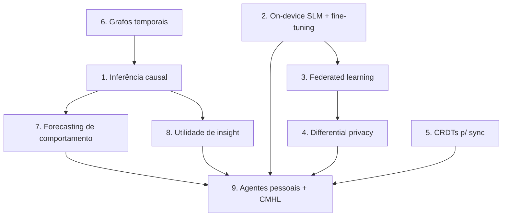

# 29 — Future Research (Direções de Pesquisa 🔴)

> **Fase geral:** 🔴 Pesquisa (não implementar no MVP) · **Leia antes:** [`ATLAS_MASTER_CONTEXT.md`](ATLAS_MASTER_CONTEXT.md)
> **Documentos relacionados:** [`00_Project_Vision`](00_Project_Vision.md), [`23_Research`](23_Research.md), [`12_AI_Architecture`](12_AI_Architecture.md), [`13_Knowledge_Graph`](13_Knowledge_Graph.md), [`15_Privacy_Architecture`](15_Privacy_Architecture.md), [`11_Event_Model`](11_Event_Model.md), [`21_Roadmap`](21_Roadmap.md)
> **Status:** Vivo · **Versão:** 0.1 · **Última atualização:** 2026-07-20
> **Owner:** Fundador solo (chapéu de pesquisador)

---

## Resumo executivo

Este documento é o **backlog de pesquisa** do Atlas: ideias de fronteira 🔴 que **não** devem ser implementadas agora, mas que definem o horizonte científico do projeto e servem a três propósitos do fundador (Visão §6.3): **portfólio de pesquisa** (potencial de paper/mestrado/doutorado), **defensabilidade intelectual** (banca, entrevista Big Tech) e **norte de longo prazo** (Visão §9 — agentes pessoais, inferência causal, padrão aberto).

O Atlas é um **veículo de pesquisa raro**: um sistema real, longitudinal, cross-domain e local-first sobre a vida de uma pessoa. Isso o coloca na interseção de HCI, ML aplicado, sistemas distribuídos e privacidade — áreas onde há problemas abertos genuínos. Cada direção abaixo segue a mesma anatomia: **problema → estado da arte (áreas conhecidas, sem citações fabricadas) → potencial acadêmico → dificuldade → pré-requisitos → conexão com o Atlas**.

> ⚠️ **Disciplina de fases (regra dura do Master Context §4):** nada aqui entra no 🟢 MVP. Este é um mapa de "para onde olhar", não um plano de execução. As referências a "estado da arte" apontam **áreas e famílias de métodos conhecidas**; nomes específicos de papers/autores devem ser verificados na literatura antes de citar em trabalho acadêmico — **não invente citações**.

---

## 1. Como ler este documento

Cada direção de pesquisa recebe:

- **Problema:** a pergunta científica/técnica, aterrada no Atlas.
- **Estado da arte:** áreas, subcampos e famílias de métodos conhecidos (sem citações específicas fabricadas).
- **Potencial acadêmico:** paper / dissertação (mestrado) / tese (doutorado).
- **Dificuldade:** 🟑 (workshop/paper aplicado) → 🔥🔥🔥🔥🔥 (agenda de doutorado / problema aberto duro).
- **Pré-requisitos:** o que você precisa dominar/ter antes.
- **Conexão Atlas:** onde encosta na arquitetura e em qual fase da Visão.

Mapa de dependências entre as direções:

---

## 2. Direção 1 — Inferência causal na vida pessoal

### 2.1. Problema

O Atlas hoje (MVP) produz insights **correlacionais**: "você dorme menos após treinar tarde". Mas a pergunta que o usuário realmente faz é **causal**: *"se eu parar de treinar tarde, vou dormir melhor?"*. Correlação não responde intervenção. A questão de pesquisa: **como inferir relações causais a partir dos dados observacionais e longitudinais de uma única pessoa (N=1), com confundidores desconhecidos, séries temporais irregulares e sem experimentos controlados?**

Este é *o* problema científico central do Atlas — a ponte de "correlação" para "sabedoria acionável" prometida na tese ("dados → informação → conhecimento → sabedoria acionável", Master Context §1.2).

### 2.2. Estado da arte (áreas conhecidas)

- **Modelos causais estruturais (SCM)** e **do-calculus** (framework de Pearl): grafos causais, intervenções `do(x)`, critérios de identificabilidade (back-door, front-door).
- **Inferência causal potencial-outcomes** (framework de Rubin): efeito de tratamento, propensity scores, confounding.
- **Descoberta causal (causal discovery)** a partir de dados observacionais: métodos baseados em restrição (PC, FCI) e em score; **descoberta causal em séries temporais** (Granger, e métodos causais temporais mais recentes).
- **Experimentos naturais / quasi-experimentos:** *regression discontinuity*, *difference-in-differences*, *instrumental variables* — como explorar "quebras" naturais na rotina do usuário (mudança de emprego, mudança de cidade) como pseudo-intervenções.
- **Causalidade N=1 / single-subject:** desenhos *n-of-1* (usados em medicina personalizada), séries temporais interrompidas.

### 2.3. Potencial acadêmico

- **Paper aplicado:** "Descoberta causal em dados de vida quantificada N=1" (workshop de HCI/ML for health).
- **Mestrado:** framework de inferência causal explicável sobre o CMHL, com validação em experimentos naturais.
- **Doutorado:** teoria + sistema de **descoberta causal longitudinal, cross-domain, N=1 com confundidores latentes** — problema genuinamente aberto e de alto impacto.

### 2.4. Dificuldade: 🔥🔥🔥🔥🔥

Causalidade observacional é notoriamente difícil mesmo com N grande; N=1 com confundidores desconhecidos e dados irregulares é fronteira dura.

### 2.5. Pré-requisitos

Probabilidade/estatística sólida, grafos causais (Pearl), séries temporais, econometria (para quasi-experimentos), e o **grafo temporal** do Atlas maduro (Direção 6).

### 2.6. Conexão Atlas

Núcleo da Visão §10 ("inferência causal" nos anos 6–10, 🔴). Depende de grafos temporais (Direção 6) e alimenta forecasting (Direção 7) e utilidade de insight (Direção 8). Ver §5.4 do Master Context (Causalidade = 🔴).

---

## 3. Direção 2 — On-device fine-tuning e SLMs (Small Language Models)

### 3.1. Problema

O MVP envia dados a LLMs externos (opt-in, §6.6). Mas a postura de privacidade ideal é **inferência local**: rodar modelos pequenos **no dispositivo**, para que dados sensíveis nunca saiam. Perguntas: **quão pequeno pode ser um modelo que ainda gera insights/síntese úteis sobre o CMHL? Como especializá-lo (fine-tune) na vida de *um* usuário sem overfitting nem custo proibitivo, dentro das restrições de memória/bateria/NPU de um smartphone?**

### 3.2. Estado da arte (áreas conhecidas)

- **SLMs** (modelos de linguagem pequenos): famílias de modelos compactos otimizados para edge; destilação de conhecimento (knowledge distillation).
- **Fine-tuning eficiente em parâmetros (PEFT):** LoRA/QLoRA, adapters — treinar poucos parâmetros, viável em hardware modesto.
- **Quantização** (int8/int4) e **inferência on-device** (runtimes como ONNX Runtime, GGUF/llama.cpp, Core ML, TF Lite, MLC).
- **Personalização on-device / continual learning** e o risco de *catastrophic forgetting*.
- **NPUs móveis** e aceleração de inferência em smartphones.

### 3.3. Potencial acadêmico

- **Paper aplicado:** "Personalização de um SLM na timeline de vida de um usuário via LoRA on-device — trade-offs de qualidade × custo × bateria".
- **Mestrado:** sistema de síntese de insights on-device com fallback para nuvem por sensibilidade do dado.
- **Doutorado:** aprendizado contínuo personalizado on-device sem esquecimento, sob restrições de recursos.

### 3.4. Dificuldade: 🔥🔥🔥🔥

Viável incrementalmente (rodar SLM inferindo é factível hoje), mas *fine-tuning* on-device de qualidade e personalização contínua são difíceis.

### 3.5. Pré-requisitos

ML/deep learning aplicado, quantização/PEFT, engenharia mobile de ML (Core ML/TF Lite), e a abstração `LLMProvider` do Atlas (ADR-0006) que já permite trocar o backend de inferência.

### 3.6. Conexão Atlas

§5.4 do Master Context ("On-device AI = 🟡/🟠") e Visão §8 ("On-device AI viável"). É o caminho técnico para "IA com consentimento" e privacidade máxima. Habilita agentes pessoais locais (Direção 9).

---

## 4. Direção 3 — Federated Learning

### 4.1. Problema

O moat do Atlas é o modelo de **um** usuário, mas há conhecimento coletivo útil ("padrões de sono que ajudam pessoas parecidas") que só emerge de **muitos** usuários. Como aprender modelos que se beneficiam do coletivo **sem centralizar dados pessoais** — respeitando o local-first (§6)? **Federated learning (FL):** treinar um modelo global agregando *atualizações* dos dispositivos, nunca os dados brutos.

### 4.2. Estado da arte (áreas conhecidas)

- **Federated averaging (FedAvg)** e variantes; FL cross-device (muitos clientes, dados heterogêneos, não-IID).
- **Desafios de FL:** dados não-IID, clientes intermitentes, comunicação eficiente, agregação segura (secure aggregation).
- **Ataques e defesas:** *model inversion*, *membership inference*, *poisoning*; robustez.
- **Interseção FL + differential privacy** (Direção 4) para garantias formais de privacidade nas atualizações.

### 4.3. Potencial acadêmico

- **Paper:** "FL para insights de bem-estar cross-domain preservando local-first" (aplicado).
- **Mestrado/Doutorado:** FL sob heterogeneidade extrema de domínios de vida + garantias de privacidade formais; agregação segura para dados de vida.

### 4.4. Dificuldade: 🔥🔥🔥🔥

FL é maduro em teoria mas operacionalmente complexo (infra de agregação, heterogeneidade, privacidade). Para solo dev, é pesquisa pura.

### 4.5. Pré-requisitos

ML distribuído, otimização, criptografia (secure aggregation), **massa crítica de usuários** (FL sem muitos clientes não faz sentido — logo, fase 🟠+), e differential privacy (Direção 4).

### 4.6. Conexão Atlas

Tensão produtiva com o moat (§1.3): FL permite *valor coletivo sem sacrificar privacidade individual*. Só faz sentido com escala (🟠) e depende de DP para ser defensável.

---

## 5. Direção 4 — Differential Privacy aplicada

### 5.1. Problema

Mesmo agregações e insights coletivos podem **vazar** informação sobre indivíduos (ataques de reidentificação/inferência de pertença). Como oferecer estatísticas/insights agregados (ou treinar modelos via FL) com **garantia matemática** de que a presença de qualquer indivíduo específico é indistinguível? **Differential privacy (DP)** dá exatamente essa garantia formal (parâmetro ε).

### 5.2. Estado da arte (áreas conhecidas)

- **DP clássica:** mecanismos de Laplace/Gaussiano, ε-DP e (ε,δ)-DP, *privacy budget*, composição.
- **DP-SGD:** treino de modelos com garantias DP (ruído nos gradientes + clipping).
- **Local DP vs. central DP:** onde o ruído é adicionado (no device vs. no agregador) — local DP casa com local-first.
- **DP + FL:** garantias de privacidade nas atualizações federadas.
- **Trade-off utilidade × privacidade:** o dilema central (mais privacidade = mais ruído = menos utilidade).

### 5.3. Potencial acadêmico

- **Paper aplicado:** "Orçamento de privacidade (ε) para insights de vida: quanto ruído antes do insight virar inútil?".
- **Mestrado:** sistema de analytics DP sobre dados de vida, com dashboard de *privacy budget*.
- **Doutorado:** DP local para dados longitudinais cross-domain com utilidade preservada.

### 5.4. Dificuldade: 🔥🔥🔥🔥

Teoria madura, mas calibrar utilidade × privacidade em dados de vida reais é sutil e específico.

### 5.5. Pré-requisitos

Probabilidade/estatística, fundamentos de DP, e um caso de uso de agregação (analytics coletivo ou FL) — logo, depende de escala.

### 5.6. Conexão Atlas

Materializa a "criptografia/minimização" da postura de privacidade (§6). Pré-requisito de defensabilidade para qualquer feature coletiva (FL, benchmarks anônimos). Fortemente ligado a [`15_Privacy_Architecture`](15_Privacy_Architecture.md).

---

## 6. Direção 5 — CRDTs para sync multi-device

### 6.1. Problema

O MVP usa um **sync engine próprio simples** (push/pull por `updated_at` + fila de mutações, ADR-0003) com resolução de conflito last-write-wins. Isso é suficiente para um usuário com poucos devices, mas **perde dados** em edições concorrentes e não converge de forma provada. **CRDTs (Conflict-free Replicated Data Types)** garantem que réplicas que recebem as mesmas operações (em qualquer ordem) **convergem para o mesmo estado**, sem coordenação central — o ideal teórico para local-first multi-device offline.

### 6.2. Estado da arte (áreas conhecidas)

- **CRDTs:** state-based (CvRDT) vs. operation-based (CmRDT); tipos (G-Counter, PN-Counter, OR-Set, LWW-Register, RGA/sequence CRDTs para texto).
- **Bibliotecas maduras:** Automerge, Yjs — CRDTs prontos para apps colaborativos/local-first.
- **Movimento "local-first software"** (princípios de sincronização sem servidor autoritativo).
- **Desafios:** *tombstones* e crescimento de metadados, compactação/garbage collection, CRDTs para dados estruturados/relacionais (mais difícil que texto), causalidade (version vectors).

### 6.3. Potencial acadêmico

- **Paper aplicado:** "CRDTs para uma timeline de eventos de vida: convergência × custo de metadados".
- **Mestrado:** motor de sync CRDT para o modelo de eventos append-only do Atlas com GC eficiente.
- **Doutorado:** menos provável como tese isolada (área madura), mais como componente de uma agenda maior de local-first.

### 6.4. Dificuldade: 🔥🔥🔥

Bibliotecas existem (factível de adotar), mas aplicá-las bem ao modelo relacional/event-sourced do Atlas com custo de metadados controlado é não-trivial.

### 6.5. Pré-requisitos

Sistemas distribuídos, teoria de consistência (eventual/forte), e o sync engine atual do Atlas como baseline de comparação.

### 6.6. Conexão Atlas

Evolução direta do §5.1 do Master Context (Sync: "CRDTs (🔴 pesquisa) se colaboração multi-device conflituosa"). Nota importante: o append-only de eventos (ES-lite, ADR-0002) **já reduz conflitos** (eventos são imutáveis; conflito real só em read models/edições), o que pode diminuir a necessidade de CRDTs completos — uma hipótese que vale investigar.

---

## 7. Direção 6 — Grafos temporais

### 7.1. Problema

O CMHL é um **grafo temporal**: entidades e relações que **mudam no tempo** ("morou em X até 2024", "trabalhou com Y de 2022 a 2025"). O MVP guarda isso em Postgres (tabelas `entities`/`relationships`, ADR-0007). Perguntas de pesquisa: **como modelar, indexar e consultar eficientemente um grafo cujas arestas têm validade temporal? Como fazer raciocínio temporal (o que era verdade em t?) e detectar padrões evolutivos (comunidades que se formam/dissolvem)?**

### 7.2. Estado da arte (áreas conhecidas)

- **Temporal/dynamic graphs:** grafos com timestamps em nós/arestas; *bitemporal* (tempo de validade × tempo de transação).
- **Temporal Graph Neural Networks (TGNN):** aprendizado de representações em grafos dinâmicos.
- **Bancos de grafo temporais** e extensões temporais de query languages.
- **Detecção de comunidades dinâmicas**, *link prediction* temporal, *graph embeddings* temporais.
- **Raciocínio temporal** (lógicas temporais, *point-in-time queries*).

### 7.3. Potencial acadêmico

- **Paper aplicado:** "Modelagem bitemporal do grafo de conhecimento de uma vida em SQL vs. grafo nativo".
- **Mestrado:** representação e query eficiente do CMHL temporal; embeddings temporais para busca/insight.
- **Doutorado:** TGNNs para previsão de evolução do grafo de vida (quem/onde/o quê a seguir).

### 7.4. Dificuldade: 🔥🔥🔥🔥

Modelagem e query são factíveis; TGNNs e raciocínio temporal escalável são difíceis.

### 7.5. Pré-requisitos

Teoria de grafos, modelagem de dados temporal, e (para TGNN) deep learning em grafos. É **fundacional**: habilita causalidade (Direção 1) e forecasting (Direção 7).

### 7.6. Conexão Atlas

É a evolução do [`13_Knowledge_Graph`](13_Knowledge_Graph.md). Gatilho de Neo4j (ADR-0007, 🟡) quando queries multi-hop temporais em SQL "doerem". Base de várias outras direções.

---

## 8. Direção 7 — Previsão/forecasting de comportamento

### 8.1. Problema

Do "entender o passado" ao "projetar o futuro" (Visão §1). **Prever** estados/comportamentos futuros do usuário a partir do CMHL: "risco de burnout crescendo", "provável estouro de orçamento", "janela ótima para uma tarefa difícil". Perguntas: **como fazer forecasting multivariado, cross-domain, N=1, calibrado (com incerteza honesta) e explicável — sem virar vigilância nem determinismo?**

### 8.2. Estado da arte (áreas conhecidas)

- **Séries temporais clássicas:** ARIMA, modelos de espaço de estados, Prophet; multivariadas (VAR).
- **Deep learning para séries:** LSTMs/Temporal CNNs, *Temporal Fusion Transformers*, modelos de forecasting probabilístico.
- **Forecasting probabilístico e calibração:** intervalos de predição, *conformal prediction* (garantias de cobertura sem suposições fortes).
- **Modelagem de comportamento humano:** *behavior modeling*, *habit formation* (ciência do hábito), *change-point detection*.

### 8.3. Potencial acadêmico

- **Paper aplicado:** "Forecasting calibrado de estados de bem-estar N=1 com conformal prediction".
- **Mestrado:** sistema de previsão explicável e antecipatória sobre o CMHL.
- **Doutorado:** forecasting causal (não só correlacional) de comportamento — junção das Direções 1 e 7.

### 8.4. Dificuldade: 🔥🔥🔥🔥

Forecasting N=1 com poucos dados e alta estocasticidade humana é difícil; calibração honesta é essencial (previsão errada e confiante é perigosa).

### 8.5. Pré-requisitos

Séries temporais, ML probabilístico, e os grafos temporais (Direção 6). Idealmente causalidade (Direção 1) para previsões acionáveis.

### 8.6. Conexão Atlas

Realiza o "projetar seu futuro" da Visão. Ligado a agentes pessoais (Direção 9), que agem sobre previsões. **Cuidado ético:** forecasting toca privacidade e autonomia — deve ser opt-in e explicável ([`15`](15_Privacy_Architecture.md)).

---

## 9. Direção 8 — Avaliação de "utilidade de insight"

### 9.1. Problema

A North Star Metric da Visão (§11) é *"insights acionados por semana"*. Mas **o que torna um insight útil?** Um insight pode ser correto, groundeado (anti-alucinação, ver [`26_Testing`](26_Testing.md) §10) e ainda assim **inútil** (óbvio, não-acionável, mal-cronometrado). Pergunta de pesquisa: **como definir, medir e otimizar formalmente a "utilidade de insight" — combinando novidade, acionabilidade, correção, oportunidade (timing) e alinhamento aos objetivos do usuário?**

Este é um problema de **HCI + ML + teoria da decisão** pouco formalizado, e é o *critério de sucesso* de todo o produto — logo, potencialmente o paper mais "próprio" do Atlas.

### 9.2. Estado da arte (áreas conhecidas)

- **Novelty/serendipity/diversity** em sistemas de recomendação (métricas além de acurácia).
- **Interestingness measures** em mineração de padrões/regras (surpresa, suporte, confiança, lift).
- **Teoria da decisão / value of information (VoI):** quanto uma informação vale para uma decisão.
- **HCI de sistemas de insight:** avaliação centrada no humano, *actionability*, *explainability* (XAI).
- **Human feedback / RLHF-like:** aprender utilidade a partir do feedback do usuário (o "marquei como útil" da North Star).

### 9.3. Potencial acadêmico

- **Paper:** "Uma métrica multidimensional de utilidade de insight para sistemas de inteligência pessoal" — muito publicável (HCI/RecSys).
- **Mestrado:** framework de avaliação + otimização de insights por utilidade aprendida do feedback.
- **Doutorado:** teoria de utilidade de informação personalizada + sistema que a otimiza online.

### 9.4. Dificuldade: 🔥🔥🔥

Conceitualmente rico e definível; o difícil é validação (requer usuários e feedback real).

### 9.5. Pré-requisitos

HCI/metodologia experimental, teoria da decisão, ML de feedback, e **usuários reais** gerando sinal de utilidade (logo 🟡+). O golden set de evals ([`26`](26_Testing.md) §10) é o ponto de partida.

### 9.6. Conexão Atlas

Fecha o loop com a North Star Metric (Visão §11) e com os evals de IA ([`26`](26_Testing.md)). Define *o que* forecasting (Direção 7) e agentes (Direção 9) devem otimizar. Provavelmente a **contribuição científica mais distintiva** do Atlas.

---

## 10. Direção 9 — Agentes pessoais com o CMHL como memória

### 10.1. Problema

A visão de longo prazo (§9) culmina em **agentes pessoais que agem em nome do usuário**, tendo o CMHL como **memória e contexto**. Diferente de um chatbot com histórico, um agente Atlas teria acesso ao modelo estruturado, explicável e cross-domain da vida do usuário. Perguntas: **como um agente usa o CMHL como memória de longo prazo confiável (sem alucinar), planeja e age com segurança/reversibilidade, e permanece alinhado aos objetivos e à privacidade do usuário?**

### 10.2. Estado da arte (áreas conhecidas)

- **LLM agents:** planejamento (ReAct, plan-and-execute), uso de ferramentas (*tool use*), agentes com memória.
- **Memória de longo prazo para agentes:** memória episódica/semântica, RAG estruturado, *memory consolidation* — onde o CMHL entra como memória *estruturada* (diferencial sobre memória vetorial pura).
- **Segurança/alinhamento de agentes:** *guardrails*, *human-in-the-loop*, reversibilidade de ações, *constitutional AI*.
- **Avaliação de agentes:** benchmarks de tarefa, confiabilidade, *hallucination in agents*.

### 10.3. Potencial acadêmico

- **Paper:** "CMHL como memória estruturada para agentes pessoais: groundedness vs. memória vetorial".
- **Mestrado:** agente pessoal seguro sobre o CMHL com human-in-the-loop e reversibilidade.
- **Doutorado:** arquitetura de memória estruturada + alinhamento personalizado para agentes de vida — agenda ampla.

### 10.4. Dificuldade: 🔥🔥🔥🔥🔥

Integra quase todas as outras direções (memória, causalidade, forecasting, utilidade, privacidade on-device) + os problemas abertos de segurança/alinhamento de agentes.

### 10.5. Pré-requisitos

**Praticamente todas as outras direções** como base: grafos temporais (6), utilidade de insight (8), on-device/privacidade (2,4) para segurança, e a arquitetura de IA/RAG madura ([`12`](12_AI_Architecture.md)).

### 10.6. Conexão Atlas

É o **telhado** da Visão §9 (anos 6–10, 🔴): "agentes pessoais que agem em nome do usuário, com o CMHL como memória". Depende de tudo abaixo dele no grafo de dependências (§1). Só faz sentido quando o CMHL é rico, confiável e privado.

---

## 11. Matriz-resumo (priorização de pesquisa)

| # | Direção | Dificuldade | Fundacional? | Melhor formato | Pré-req de escala? | Fase |
|---|---|---|---|---|---|---|
| 6 | Grafos temporais | 🔥🔥🔥🔥 | ✅ (base de 1,7) | Mestrado | Não | 🟡→🔴 |
| 8 | Utilidade de insight | 🔥🔥🔥 | ✅ (critério de sucesso) | Paper/Mestrado | Usuários reais | 🟡→🔴 |
| 5 | CRDTs sync | 🔥🔥🔥 | Parcial | Mestrado | Multi-device | 🔴 |
| 2 | On-device SLM/fine-tune | 🔥🔥🔥🔥 | Parcial (habilita 9) | Mestrado | Não | 🔴 |
| 1 | Inferência causal | 🔥🔥🔥🔥🔥 | ✅ (tese central) | Doutorado | Não (mas + dados) | 🔴 |
| 7 | Forecasting | 🔥🔥🔥🔥 | — | Mestrado/Dr | + dados | 🔴 |
| 4 | Differential privacy | 🔥🔥🔥🔥 | Habilita 3 | Mestrado | Coletivo | 🔴 |
| 3 | Federated learning | 🔥🔥🔥🔥 | — | Doutorado | ✅ muitos usuários | 🔴 (🟠+) |
| 9 | Agentes pessoais + CMHL | 🔥🔥🔥🔥🔥 | — (integra tudo) | Doutorado | ✅ | 🔴 (topo) |

### 11.1. Sequência sugerida de ataque (se/quando fazer pesquisa)

1. **Comece pelo fundacional e mais "próprio":** Grafos temporais (6) e Utilidade de insight (8) — ambos aterrados no que o Atlas já é, publicáveis, e habilitam o resto.
2. **Depois, o de maior ambição científica:** Inferência causal (1) — a joia da coroa, provável tese de doutorado, mas construa sobre (6).
3. **Privacidade/on-device (2,4)** quando a pressão por inferência local/coletiva aparecer.
4. **CRDTs (5)** só se o sync simples doer de verdade (pode nunca doer, graças ao append-only).
5. **FL (3) e Agentes (9)** por último — exigem escala e quase tudo o mais como base.

---

## 12. Ética e responsabilidade da pesquisa (transversal)

Toda direção acima toca a **vida real de pessoas**. Princípios inegociáveis (extensão do §6 do Master Context):

- **Consentimento e opt-in** para qualquer capacidade nova (forecasting, agentes, coletivo).
- **Explicabilidade obrigatória:** um insight causal/preditivo sem evidência rastreável é ruído perigoso (Visão §5.3).
- **Reversibilidade e autonomia:** o Atlas **aumenta**, não substitui, o julgamento humano (Visão §5.5). Agentes agem com human-in-the-loop.
- **Privacidade formal antes de coletivo:** nada de FL/analytics coletivo sem DP (Direção 4).
- **Honestidade estatística:** previsões com incerteza calibrada; nunca vender correlação como causa.

---

## 13. Conexão com [`23_Research`](23_Research.md)

- [`23_Research`](23_Research.md) cataloga **o que já existe** (papers e trabalhos relacionados que fundamentam decisões *atuais* do Atlas).
- Este documento (`29`) cataloga **o que ainda não existe / é fronteira** — as perguntas abertas que o Atlas *poderia responder*.
- Fluxo de trabalho: quando uma direção 🔴 daqui amadurecer para exploração, faça a **revisão de literatura formal** (verificando citações reais — **nunca fabricar**) e registre em [`23`](23_Research.md); se virar decisão de produto, registre um ADR em [`24`](24_ADRs.md) e promova a fase (🔴→🟡).

---

### Cross-links

- Visão de longo prazo (agentes, causal, padrão aberto): [`00_Project_Vision`](00_Project_Vision.md) §9–§10
- Literatura já mapeada (base atual): [`23_Research`](23_Research.md)
- Arquitetura de IA / RAG (base de agentes e SLM): [`12_AI_Architecture`](12_AI_Architecture.md)
- Grafo de conhecimento (base dos grafos temporais): [`13_Knowledge_Graph`](13_Knowledge_Graph.md)
- Privacidade (base de DP/FL/on-device): [`15_Privacy_Architecture`](15_Privacy_Architecture.md)
- Modelo de eventos (base de CRDTs/causalidade): [`11_Event_Model`](11_Event_Model.md)
- Avaliação de IA (base da utilidade de insight): [`26_Testing`](26_Testing.md) §10
