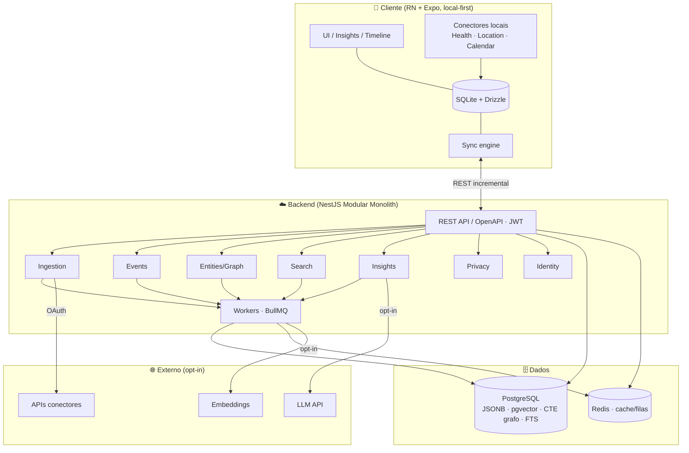
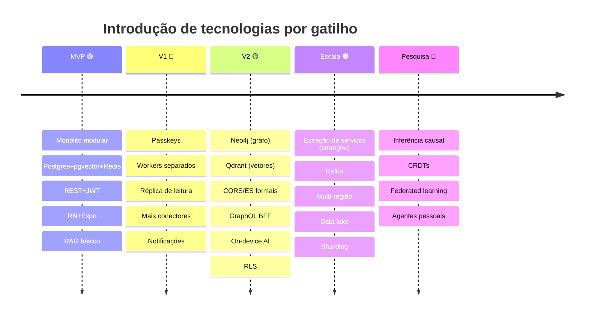

# 30 — Final Architecture (Consolidação)

> **Leia antes:** [`ATLAS_MASTER_CONTEXT.md`](ATLAS_MASTER_CONTEXT.md) · **Este documento consolida** `07`–`17` e o restante.
> **Propósito:** visão única e coerente de todo o sistema — o "mapa dos mapas". Use este doc
> como referência de bolso e como material de apresentação (entrevista/banca/investidor).

---

## 1. O sistema em uma página

O Atlas é uma **Plataforma de Inteligência Pessoal local-first** que transforma eventos
dispersos da vida em conhecimento explicável, construindo o **CMHL** (Computational Model of
Human Life). A arquitetura é **evolutiva**: nasce simples (viável para um fundador solo) e
cresce por gatilhos de dor medida.



## 2. Decisões-âncora (resumo dos ADRs — ver `24`)

| # | Decisão | Fase | Por quê (1 linha) |
|---|---|---|---|
| 1 | Monólito modular NestJS | 🟢 | Velocidade + simplicidade para solo dev |
| 2 | Event Sourcing "lite" | 🟢 | O domínio É eventos; auditável e reprocessável |
| 3 | Sync próprio (não CRDT) | 🟢 | Simples e suficiente p/ 1–2 devices |
| 4 | PostgreSQL + pgvector | 🟢 | Um banco faz tudo; menos operação |
| 5 | REST + OpenAPI | 🟢 | Um cliente, um backend; domínio do autor |
| 6 | LLM via API + abstração | 🟢 | IA é commodity trocável; custo controlado |
| 7 | Grafo em Postgres → Neo4j | 🟢→🟡 | Evitar +1 banco até doer |
| 8 | pgvector → Qdrant | 🟢→🟡 | Idem para vetores |
| 9 | React Native + Expo | 🟢 | Um codebase iOS+Android; domínio do autor |
| 10 | Privacidade local-first | 🟢 | Confiança é o moat; vazamento é fatal |

## 3. Os quatro pilares do CMHL

O CMHL (o ativo defensável) é a soma de quatro camadas, todas derivadas do fluxo de eventos:

```mermaid
flowchart TB
    E[1. Eventos imutáveis\n(fatos cross-domain)] --> A[2. Read models / Agregações\n(séries temporais por domínio)]
    E --> G[3. Grafo de conhecimento\n(pessoas·lugares·hábitos·objetivos)]
    A --> I[4. Insights explicáveis\n(padrões + evidências)]
    G --> I
```

1. **Eventos** (`11`) — a fonte da verdade, no mesmo formato para todos os domínios.
2. **Agregações** (`10`, `11`) — projeções para leitura rápida e análise temporal.
3. **Grafo** (`13`) — relações entre entidades (grafo-lite em Postgres → Neo4j).
4. **Insights** (`12`) — conhecimento com evidências rastreáveis.

## 4. O fluxo herói (do fato ao insight explicável)

`Sensor → Evento (device) → sync → append em events → worker (embedding + projeção + inferência)
→ Insight com evidências → sync → usuário` (detalhado em `07` §5 e `11`).

Três invariantes que atravessam todo o sistema:
- **Imutabilidade** dos eventos (auditoria/reprocessamento).
- **Explicabilidade** (todo insight cita `event_ids`).
- **Privacidade** (opt-in de IA, local-first, export/delete).

## 5. Stack consolidado

| Camada | Tecnologia (🟢 MVP) | Evolução |
|---|---|---|
| Mobile | React Native + Expo, TS, Drizzle/SQLite, Zustand, TanStack Query | Widgets, on-device AI (🟡) |
| Backend | NestJS, Clean Arch + DDD, ES-lite | CQRS/ES formais (🟡), serviços (🟠) |
| Dados | PostgreSQL (JSONB/pgvector/FTS/CTE), Redis | Neo4j, Qdrant (🟡), data lake (🟠) |
| Filas | BullMQ (Redis) | Workers separados (🔵), Kafka (🟠) |
| IA | Regras+estatística; embeddings+RAG; LLM p/ redigir | Reranking, GraphRAG, on-device (🟡) |
| API | REST + OpenAPI, JWT | Passkeys (🔵), GraphQL BFF (🟡), gRPC (🟠) |
| Infra | Docker, AWS 1 região, GitHub Actions | Multi-AZ (🟡), multi-região (🟠) |
| Observabilidade | pino, Sentry, health checks | OpenTelemetry, Grafana (🟡) |

## 6. Mapa de evolução (quando cada complexidade entra)



## 7. Atributos de qualidade (garantias do sistema)

| Atributo | Mecanismo | Doc |
|---|---|---|
| Privacidade | Local-first, minimização, opt-in IA, E2EE (🟡), export/delete | `15`, `16` |
| Explicabilidade | Insight→evidências (event_ids) | `11`, `12` |
| Evolutibilidade | Módulos + Clean Arch + ADRs + gatilhos | `07`, `09`, `24` |
| Custo | Heurística antes de LLM, cache, RAG enxuto, orçamento/MAU | `12`, `22` |
| Testabilidade | Domínio puro, ports mockáveis, Testcontainers, evals de IA | `26` |
| Escalabilidade | Vertical→réplicas→especialização→distribuição | `07`, `10` |
| Observabilidade | Logs estruturados, Sentry, métricas de fila, OTel (🟡) | `27` |

## 8. Riscos-chave e mitigações (resumo — ver `25`)

| Risco | Mitigação central |
|---|---|
| Escopo grande demais cedo | Disciplina de fases 🟢→🔴; regra "nada de 🟡/🟠 no MVP" |
| Vazamento de dados = morte | Local-first, minimização, E2EE (🟡), pouco dado no servidor |
| Correlação vendida como causa | Rigor estatístico + linguagem de hipótese; causalidade é 🔴 |
| Custo de IA descontrolado | Escada de inteligência + cache + orçamento + on-device (🟡) |
| Big Tech comoditizar | Cross-domain + privacidade real + neutralidade de plataforma |
| Fundador solo (burnout/bus factor) | Boring tech, automação (CI/CD), documentação viva |

## 9. Como esta arquitetura se defende (entrevista/banca)

Perguntas típicas e a resposta de uma linha (com o doc que aprofunda):
- *"Por que não microserviços?"* → sem escala, é custo puro; strangler quando doer (`07`, `24`).
- *"Por que não Neo4j/Qdrant desde já?"* → Postgres faz grafo-lite e vetores; +1 banco só com dor
  medida (`10`, `13`, `14`, `24`).
- *"Como controla custo de IA?"* → heurística antes de LLM, RAG enxuto, cache, orçamento/MAU,
  on-device no roadmap (`12`).
- *"IA não é o produto?"* → não; o produto é o CMHL; IA é camada de interpretação trocável (`00`,
  `12`).
- *"Como garante privacidade?"* → local-first, minimização, opt-in, export/delete, E2EE no
  roadmap (`15`, `16`).
- *"Insight ≠ alucinação?"* → estatística descobre, LLM redige, tudo com evidências rastreáveis
  (`11`, `12`).

## 10. O que construir primeiro (ponte para `20_MVP`)

O MVP prova a tese com o **próprio autor** (dogfooding): 3–5 conectores (manual + Health +
Location + Calendar), timeline, busca semântica (pgvector), **1–2 insights cross-domain**
(heurística/estatística), e **export/delete** — tudo local-first. Nada de Neo4j, Qdrant,
microserviços ou agentes. Detalhe em `20_MVP.md` e sequência em `21_Roadmap.md`.

---

### Resumo executivo
A arquitetura final do Atlas é um **monólito modular local-first** construído em torno de um
**modelo de eventos imutáveis** que alimenta um **CMHL** de quatro camadas (eventos →
agregações → grafo → insights). A **IA é uma camada trocável de interpretação** (RAG +
estatística), a **privacidade é restrição inegociável**, e toda complexidade cara tem um
**gatilho de fase**. É, deliberadamente, a **maior potência de engenharia sustentável por um
fundador solo** — simples hoje, mas com costuras para se tornar infraestrutura global de
Inteligência Pessoal.
